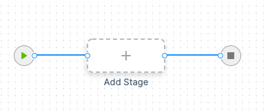
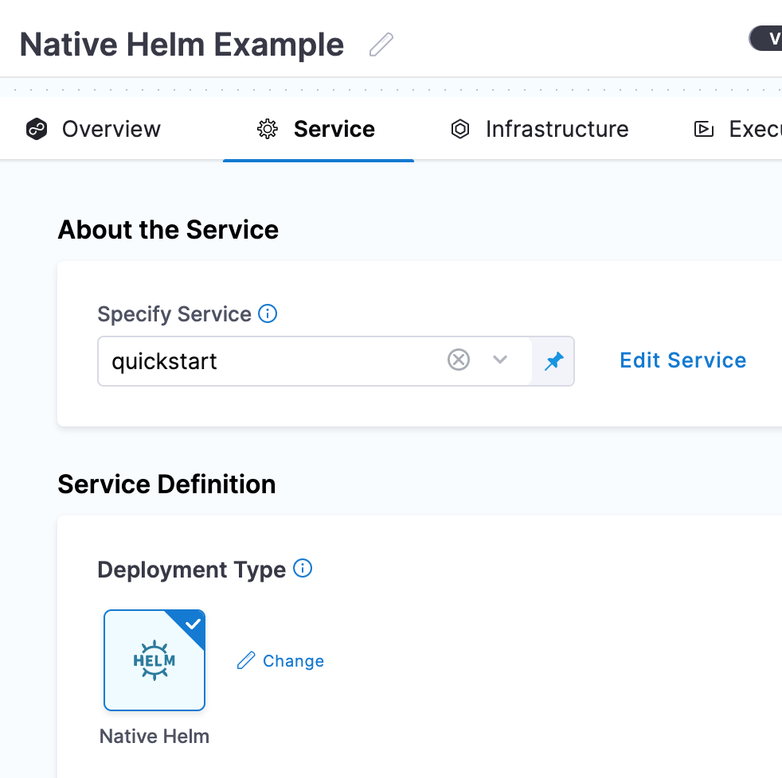
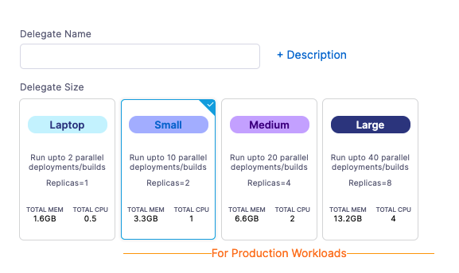
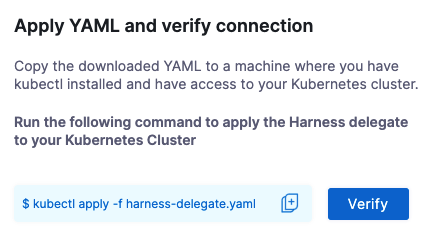
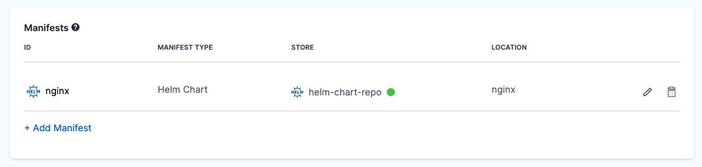
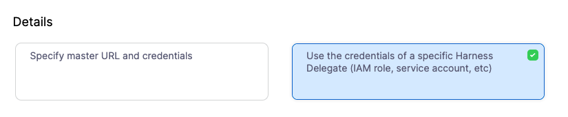
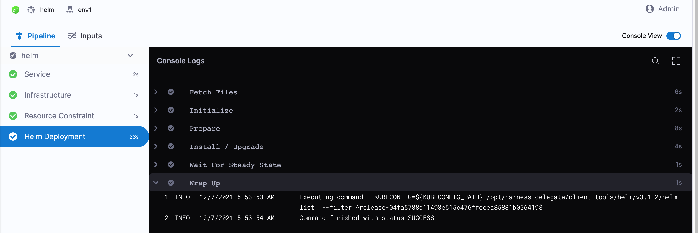

This quickstart shows you how to perform Native Helm deployments using Harness.

Harness includes both Kubernetes and Native Helm deployments, and you can use Helm charts in both. Here's the difference:

* **Kubernetes with Helm:** Harness Kubernetes deployments allow you to use your own Helm values.yaml or Helm chart (remote or local), and Harness executes the Kubernetes kubectl calls to build everything without Helm and Tiller needing to be installed in the target cluster. You can perform all deployment strategies (Rolling, Canary, Blue Green).  
See [Kubernetes deployment tutorial](kubernetes-cd-quickstart), [Helm Chart deployment tutorial](helm-cd-quickstart).
* **Native Helm:**
	+ For Harness Native Helm V2 deployments, you must always have Helm and Tiller running on one pod in your target cluster and Tiller makes the API calls to Kubernetes. You can perform a Rolling deployment strategy only (no Canary or Blue Green).If you are using Helm V2, you will need to install Helm v2 and Tiller on the Delegate pod. For steps on installing software on the Delegate, go to [Install Software on the Delegate with Initialization Scripts](../../../platform/2_Delegates/delegate-guide/run-scripts-on-delegates.md).
	+ For Harness Native Helm v3 deployments, you no longer need Tiller, but you are still limited to the Rolling deployment strategy.
		- **Versioning:** Harness Kubernetes deployments version all objects, such as ConfigMaps and Secrets. Native Helm does not.
		- **Rollback:** Harness Kubernetes deployments will roll back to the last successful version. Native Helm will not. If you did 2 bad Native Helm deployments, the 2nd one will just rollback to the 1st. Harness will roll back to the last successful version.

Harness supports Helm v2 and v3.

## Objectives

You'll learn how to:

* Install and launch a Harness Kubernetes Delegate in your target cluster.
* Set up a Native Helm Pipeline.
* Run the new Native Helm Pipeline and deploy a Docker image to your target cluster.

## Before You Begin

Review [Harness Key Concepts](../../../first-gen/starthere-firstgen/harness-key-concepts.md) to establish a general understanding of Harness.

You will need a target Kubernetes cluster where you will deploy NGINX:

* Set up your Kubernetes cluster: You'll need a target Kubernetes cluster for Harness. Ensure your cluster meets the following requirements:
  * **Number of nodes:** 3.
  * **Machine type:** 4vCPU
  * **Memory:** 4vCPUs, 16GB memory, 100GB disk. In GKE, the **e2-standard-4** machine type is enough for this quickstart.
  * **Networking:** outbound HTTPS for the Harness connection to **app.harness.io**, **github.com**, and **hub.docker.com**. Allow TCP port 22 for SSH.
  * A **Kubernetes service account** with permission to create entities in the target namespace is required. The set of permissions should include `list`, `get`, `create`, and `delete` permissions. In general, the cluster-admin permission or namespace admin permission is enough.  
  For more information, see [User-Facing Roles](https://kubernetes.io/docs/reference/access-authn-authz/rbac/#user-facing-roles) from Kubernetes.

## Step 1: Create the Deploy Stage

Pipelines are collections of stages. For this quickstart, we'll create a new Pipeline and add a single stage.

:::note

**Create a Project for your new CD Pipeline:** if you don't already have a Harness Project, create a Project for your new CD Pipeline. Ensure that you add the **Continuous Delivery** module to the Project. See [Create Organizations and Projects](../../../platform/1_Organizations-and-Projects/2-create-an-organization.md).

:::

1. In your Harness Project, click **Deployments**, and then click **Create a** **Pipeline**.
   
   

2. Enter the name **Native Helm Example** and click **Start**.
3. Your Pipeline appears.
   
   

4. Click **Add Stage** and select **Deploy**.
5. Enter the name **quickstart**, make sure **Service** is selected, and then click **Set Up Stage**.
6. The new stage settings appear.
7. In **About the** **Service**, click **New Service**.
   :::note

   Let's take a moment and review Harness Services and Service Definitions (which are explained below). Harness Services represent your microservices/apps logically. You can add the same Service to as many stages are you need. Service Definitions represent your artifacts, manifests, and variables physically. They are the actual files and variable values.

   By separating Services and Service Definitions, you can propagate the same Service across stages while changing the artifacts, manifests, and variables with each stage.

   :::
1. Give the Service the name **quickstart** and click **Save**.
2. Once you have created a Service, it is persistent and can be used throughout the stages of this or any other Pipeline in the Project.
3. In **Deployment Type**, click **Native Helm**. Now your Service looks like this:



Next, we'll add the NGINX Helm chart for the deployment.

## Step 2: Add the Helm Chart and Delegate

You can add a Harness Delegate inline when you configure the first setting that needs it. For example, when we add a Helm chart, we will add a Harness Connector to the HTTP server hosting the chart. This Connector uses a Delegate to verify credentials and pull charts, so we'll install the Delegate, too.

1. In **Manifests**, click **Add Manifest**. The manifest types appear.
   
   

   You can select a Helm Values YAML file or a Helm chart. For this quickstart, we'll use a publicly available Helm chart.
   The process isn't very different between these options. For Values YAML, you simply provide the Git branch and path to the Values YAML file.
   Click **Helm Chart** and then click **Continue**.
2. In **Specify Helm Chart Store**, click **HTTP Helm**.
   We're going to be pulling a Helm chart for NGINX from the Bitnami repo at `https://charts.bitnami.com/bitnami`. You don't need any credentials for pulling the public chart.
3. Click **New HTTP Helm Repo Connector**.
4. In the **HTTP Helm Repo Connector**, in **Name**, enter **helm-chart-repo**, and click **Continue**.
5. In **Helm Repository URL**, enter `https://charts.bitnami.com/bitnami`.
6.  In **Authentication**, select **Anonymous**.
7.  Click **Continue**.
    Now we'll install and register a new Harness Delegate in your target cluster.
8.  In **Set Up Delegates**, click **Install new Delegate**.
    The Delegate wizard appears.

   

9.  Click **Kubernetes**, and then click **Continue**.

    

10. Enter a name for the Delegate, like **quickstart**, click the **Small** size.
11. Click **Continue**.
12. Click **Download YAML file**. The YAML file for the Kubernetes Delegate will download to your computer as an archive.
13. Open a terminal and navigate to where the Delegate file is located.
    You will connect to your cluster using the terminal so you can simply run the YAML file on the cluster.
14. In the same terminal, log into your Kubernetes cluster. In most platforms, you select the cluster, click **Connect**, and copy the access command.
15. Next, install the Harness Delegate using the **harness-delegate.yaml** file you just downloaded. In the terminal connected to your cluster, run this command:

```
kubectl apply -f harness-delegate.yaml
```

You can find this command in the Delegate wizard:



The successful output is something like this:

```
% kubectl apply -f harness-delegate.yaml  
namespace/harness-delegate unchanged  
clusterrolebinding.rbac.authorization.k8s.io/harness-delegate-cluster-admin unchanged  
secret/k8s-quickstart-proxy unchanged  
statefulset.apps/k8s-quickstart-sngxpn created  
service/delegate-service unchanged
```

1. In Harness, click **Verify**. It will take a few minutes to verify the Delegate. Once it is verified, close the wizard.
2. Back in **Set Up Delegates**, you can select the new Delegate.
   In the list of Delegates, you can see your new Delegate and its tags.
3. Select the **Connect using Delegates with the following Tags** option.
4. Enter the tag of the new Delegate and click **Save and Continue**.
   When you are done, the Connector is tested. If it fails, your Delegate might not be able to connect to `https://charts.bitnami.com/bitnami`. Review its network connectivity and ensure it can connect.
   If you are using Helm V2, you will need to install Helm v2 and Tiller on the Delegate pod. For steps on installing software on the Delegate, go to [Install Software on the Delegate with Initialization Scripts](../../../platform/2_Delegates/delegate-guide/run-scripts-on-delegates.md).
5. Click **Continue**.
6. In **Manifest Details**, enter the following settings can click **Submit**.
   * **Manifest Identifier**: enter **nginx**.
   * **Helm Chart Name**: enter **nginx**.
   * **Helm Chart Version**: enter **8.8.1**.
   * **Helm Version**: select **Version 3**.

The Helm chart is added to the Service Definition.



Next, we can target your Kubernetes cluster for deployment.

## Step 3: Define Your Target Cluster

1. In **Infrastructure**, in **Environment**, click **New Environment**.
2. In **Name**, enter **quickstart**, select **Non-Production**, and click **Save**.
3. In **Infrastructure Definition**, select the **Kubernetes**.
4. In **Cluster Details**, click **Select Connector**. We'll create a new Kubernetes Connector to your target platform. We'll use the same Delegate you installed earlier.
5. Click **New Connector**.
6. Enter a name for the Connector and click **Continue**.
7. In **Details**, select **Use the credentials of a specific Harness Delegate**, and then click **Continue**.
   
8. In **Set Up Delegates**, select the Delegate you added earlier by entering one of its Tags.
9.  Click **Save and Continue**. The Connector is tested. Click **Finish**.
10. Select the new Connector and click **Apply Selector**.
11. In **Namespace**, enter **default** or the namespace you want to use in the target cluster.
12. In **Release Name**, enter **quickstart**.
13. Click **Next**. The deployment strategy options appear.

## Step 4: Add a Helm Deployment Step

1. We're going to use a Rolling [deployment strategy](../../cd-deployments-category/deployment-concepts.md), so click **Rolling**, and click **Apply**.
2. The **Helm Deployment** step is added to **Execution**.

That's it. Now you're ready to deploy.

## Step 5: Deploy and Review

1. Click **Save** to save your Pipeline.
2. Click **Run**.
3. Click **Run Pipeline**.
   Harness verifies the connections and then runs the Pipeline.
4. Toggle **Console View** to watch the deployment with more detailed logging.

   

5. Click the **Helm Deployment** step and expand **Wait for Steady State**.

You can see `Status : quickstart-quickstart deployment "quickstart-quickstart" successfully rolled out.`

Congratulations! The deployment was successful.

In your Project's Deployments, you can see the deployment listed.

## Review: Spec Requirements for Steady State Check and Versioning

Harness requires that the `release` label be used in **every** Kubernetes spec to ensure that Harness can identify a release, check its steady state, and perform verification and rollback on it.

Ensure that the `release` label is in every Kubernetes object's manifest. If you omit the `release` label from a manifest, Harness cannot track it.

The [Helm built-in Release object](https://helm.sh/docs/chart_template_guide/builtin_objects/) describes the release and allows Harness to identify each release. For this reason, the `release: {{ .Release.Name }}` label must be used in your Kubernetes spec.

See these Service and Deployment object examples:

```go
{{- if .Values.env.config}}  
apiVersion: apps/v1  
kind: Deployment  
metadata:  
  name: {{ template "todolist.fullname" . }}  
  labels:  
    app: {{ template "todolist.name" . }}  
    chart: {{ template "todolist.chart" . }}  
    release: "{{ .Release.Name }}"  
    harness.io/release: {{ .Release.Name }}  
    heritage: {{ .Release.Service }}  
spec:  
  replicas: {{ .Values.replicaCount }}  
  selector:  
    matchLabels:  
      app: {{ template "todolist.name" . }}  
      release: {{ .Release.Name }}  
  template:  
    metadata:  
      labels:  
        app: {{ template "todolist.name" . }}  
        release: {{ .Release.Name }}  
        harness.io/release: {{ .Release.Name }}  
    spec:  
      {{- if .Values.dockercfg}}  
      imagePullSecrets:  
      - name: {{.Values.name}}-dockercfg  
      {{- end}}  
      containers:  
        - name: {{ .Chart.Name }}  
          image: {{.Values.image}}  
          imagePullPolicy: {{ .Values.pullPolicy }}  
          {{- if or .Values.env.config .Values.env.secrets}}  
          envFrom:  
          {{- if .Values.env.config}}  
          - configMapRef:  
              name: {{.Values.name}}  
          {{- end}}  
          {{- if .Values.env.secrets}}  
          - secretRef:  
              name: {{.Values.name}}  
          {{- end}}  
          {{- end}}  
...  
apiVersion: v1  
kind: Service  
metadata:  
  name: {{ template "todolist.fullname" . }}  
  labels:  
    app: {{ template "todolist.name" . }}  
    chart: {{ template "todolist.chart" . }}  
    release: {{ .Release.Name }}  
    heritage: {{ .Release.Service }}  
spec:  
  type: {{ .Values.service.type }}  
  ports:  
    - port: {{ .Values.service.port }}  
      targetPort: http  
      protocol: TCP  
      name: http  
  selector:  
    app: {{ template "todolist.name" . }}  
    release: {{ .Release.Name }}
```
The **Release name** setting in the stage **Infrastructure** is used as the Helm Release Name to identify and track the deployment per namespace:


## Notes

Please review the following notes.

### Ignore Release History Failed Status

By default, if the latest Helm release failed, Harness does not proceed with the install/upgrade and throws an error.

For example, let's say you have a Pipeline that performs a Native Helm deployment and it fails during execution while running `helm upgrade` because of a timeout error from an etcd server.

You might have several retries configured in the Pipeline, but all of them will fail when Harness runs a `helm history` in the prepare stage with the message: `there is an issue with latest release <latest release failure reason>`.

Enable the **Ignore Release History Failed Status** option to have Harness ignore these errors and proceed with install/upgrade.

## Next Steps

See [Kubernetes How-tos](/docs/category/kubernetes) for other deployment features.

