:::note

Currently, this feature is behind the feature flags `SSH_NG`. Contact [Harness Support](mailto:support@harness.io) to enable the feature.

:::

You can use Secure Shell (SSH) to deploy your artifacts to hosts located in Microsoft Azure, AWS, or any platform-agnostic Physical Data Center (PDC).

This deployment is called Traditional because it uses Secure Shell scripts and a traditional runtime environment as opposed to containers and orchestration mechanisms, such as those in the Kubernetes Tutorial.

This tutorial shows you how to run a SSH deployment in Harness by setting up a Secure Shell Service and deploying artifacts from Artifactory to a target host in AWS. You will use a Canary deployment strategy.

For Secure Shell, you can access artifacts from **Jenkins**, **Artifactory**, or **Custom**. If you select **Custom**, you will need to provide a Bash script.

The **Execution Strategies** supported for Secure Shell include **Blank Canvas**, **Basic**, **Rolling**, and **Canary**.

The supported artifact package types include JAR, TAR, WAR, RPM and ZIP.

[Harness File Store](../../cd-services/cd-services-general/add-inline-manifests-using-file-store.md) should be enabled if you want to upload Config files from the file store.

## Objectives

You will learn how to:

* Create a Harness Secure Shell Service.
* Set up a Harness Artifactory Connector for access to a public repository.
* Add the credentials needed to connect to target hosts.
* Define the target infrastructure for deployment.
* Select the Canary deployment strategy.
* Run the Pipeline and review.

### Limitations and Requirements

* Secure Shell requires looping capability. See [Looping Strategies Overview: Matrix, Repeat, and Parallelism](../../../platform/8_Pipelines/looping-strategies-matrix-repeat-and-parallelism.md)

### Before You Begin

* Review [Harness Key Concepts](../../../first-gen/starthere-firstgen/harness-key-concepts.md) to establish a general understanding of Harness.
* Make sure that you have a Delegate available in your environment.
	+ You can install a Kubernetes or Docker Delegate. See Install Delegates.
	+ Ideally, you should install the Delegate in the same subnet as the target host(s).
* Target host: in this guide, we use an AWS EC2 instance as the target host with a minimum t2-medium.
* SSH Keys for the target host(s): you will need [SSH Keys](../../../platform/6_Security/4-add-use-ssh-secrets.md#add-ssh-credential) for the target hosts. For example, in this tutorial, we connect to an AWS EC2 instance by providing the username and an existing secret file for that AWS EC2 instance. When a EC2 instance is created, a Key Pair is generated in AWS. From the Key Pair for the AWS EC2 instance, you can download a .PEM file to your machine and upload that file to Harness as a secret file.

You can also simply deploy the artifact to your local computer instead of using an AWS EC2 instance. If you want to do this, install the Harness Delegate on your local computer (for example, using Docker Desktop), use a [Physical Data Center](../../../first-gen/firstgen-platform/account/manage-connectors/add-physical-data-center-cloud-provider.md) Connector instead of an AWS Connector, and when you set up the target infrastructure SSH key in Harness, use your local login information. You might also need to enable remote access on your computer.

## Create the Deploy Stage

Pipelines are collections of stages. In this tutorial, we will create a new Pipeline and add a stage for Secure Shell deployments of artifacts to a target host.

1. In your Harness project, click **Pipelines**, and then **Create a Pipeline**.
2. Enter a name for the pipeline: **ssh-tutorial-pipeline**. Keep the default **Inline (Pipeline is stored in Harness)** for **How do you want to set up your pipeline**.
3. Click **Start** and your pipeline appears.
4. Click **Add Stage**.
5. For **Select Stage Type**, select **Deploy**.
6. For **Stage Name**, enter: **ssh-tutorial-stage-one**.
7. Click Secure Shell and then click **Set Up Stage**.

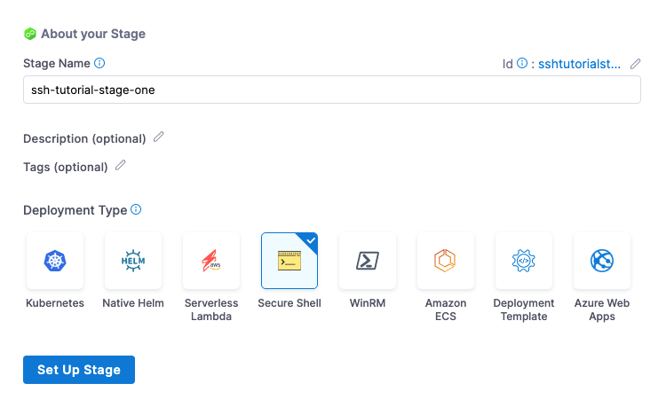

Next, you will create a Harness Service that represents your application. Once you have created a Service, it is persistent and can be used throughout the stages of this or any other Pipeline in the Project.

## Create a Harness Secure Shell Service

The Harness Secure Shell (SSH) Service contains the application package artifact (file or metadata) and the related config files to execute on the target host.

Let's create the Service for an application package artifact.

1. For **Select Service**, click **New Service,** enter a name for the service: **tutorial-service-ssh**.
2. For **Service Definition**, in **Deployment Type**, select **Secure Shell**.

## Add the Artifactory Connector

Harness includes Connectors for all the major artifact repositories. In this tutorial, we will use Artifactory.

1. In **Artifacts**, click **Add Primary Artifact**.
2. In **Specify Artifact Repository Type**, select **Artifactory** and click **Continue**. You can use another artifact repo if you like.
3. For the Artifactory Connector, select **New Artifactory Connector**.
4. In **Name**, enter a name for the connector: **artifactory-tutorial-connector** and click **Continue**.
5. In **Details**, enter the the following URL path for **Artifactory Repository URL**: **https://harness/frog.io/artifactory**. In this tutorial, we will use the artifacts stored in that repository.
6. For **Authentication**, click the down-drop arrow for **Username and Password**. Then, select **Anonymous (no credentials required)**. Click **Continue**.
   
   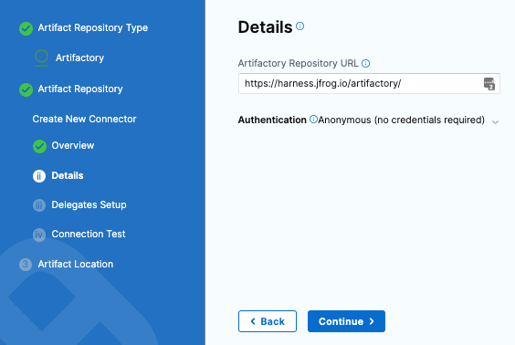

7. Click **Continue** to connect with Artifactory by using a Harness Delegate.
8. In **Delegates Setup**, select **Connect through the Harness Platform**.
9.  Click **Save and Continue**.
10. In **Connection Test**, Harness validates Artifactory Repository authentication and permissions for the repo. Click **Continue**.


## Set up Artifact Location and Details

For this tutorial, we'll use a **ToDo List** app artifact, **todolist.war**, available in a public Harness Artifactory repo.

1. In **Artifact Details**, enter the following:
	1. In **Artifact Source Name**, enter **Todolist**.
	2. In **Repository Format**, keep the default value **Generic**.
	3. For **Repository**, enter: **todolist-tutorial**. Note that if you select the down-drop menu for Repository, Harness loads any available repositories and displays them for selection.
	4. In **Artifact Directory**, enter a forward slash **/**.
	5. In **Artifact Details**, keep the default **Value**.
	6. In **Artifact Path**, leave the default Runtime Input value **<+input>** for that field. Click **Submit.**
   
   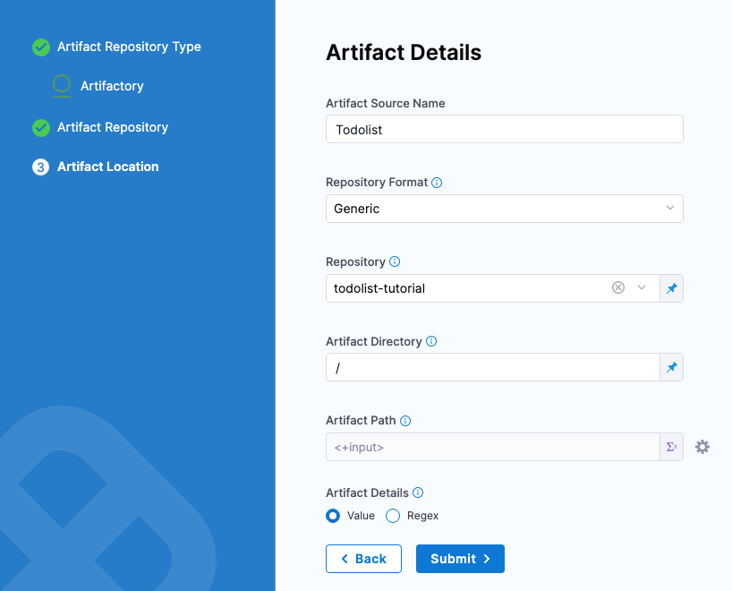
   
   The artifact is added to your Service.
   
   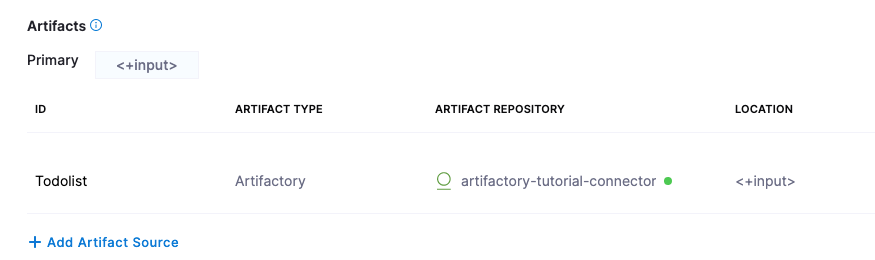

7. Click **Save**. The Service is added to your stage.
2. Click **Continue** to set up the target Environment.

## Add the Target Infrastructure for the Physical Data Center

Create the Infrastructure Definition for the target hosts.

1. In **Specify Environment**, click **New Environment** and enter **ssh-tutorial-env** for **Name.** This is the name that you will use when you select this Infrastructure Definition.
2. For **Environment Type**, select **Pre-****Production**, and click **Save**.
3. For **Specify Infrastructure**, click **New infrastructure**.
4. Enter the name **ssh-tutorial-infra** for the new infrastructure.
5. For **Select Infrastructure Type**, select **Physical Data Center**.
6. Keep the default selection: **Select preconfigured hosts from Physical Data Center**.
   
   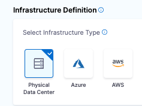

## Create the PDC Connector for the Host

1. In **Infrastructure Definition**, for **Connector**, click **Select Connector** to create the Connector for PDC.
   
   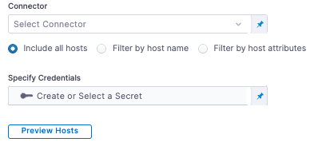

8. In **Create or Select an Existing Connector**, select **New Connector**.
9.  In **Physical Data Center**, enter a name for this connector: **PDC-Connector**.
10. Click **Continue**.
   
   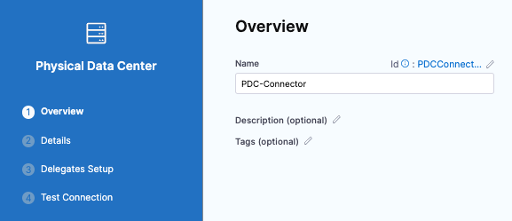

11. In **Details**, keep the default for **Manually enter host names** and enter the hostname for the EC2 instance.
12. Click **Continue**.

   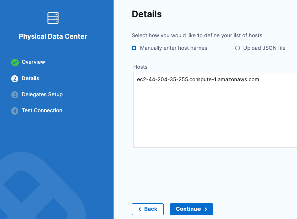

13. In **Delegates Setup**, keep the default for **Use any available Delegate**. 
14. Click **Save and Continue**. Harness validates connectivity for the PDC connector.
   
   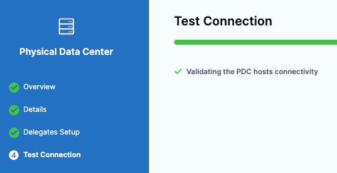
   
   If you do not have a Delegate installed, go to [Delegate how-to](../../../platform/2_Delegates/delegate-guide/delegate-how-tos.md) and follow one of the installation topics.
15. Click **Finish**. The Infrastructure Definition is updated with the PDC Connector.
  
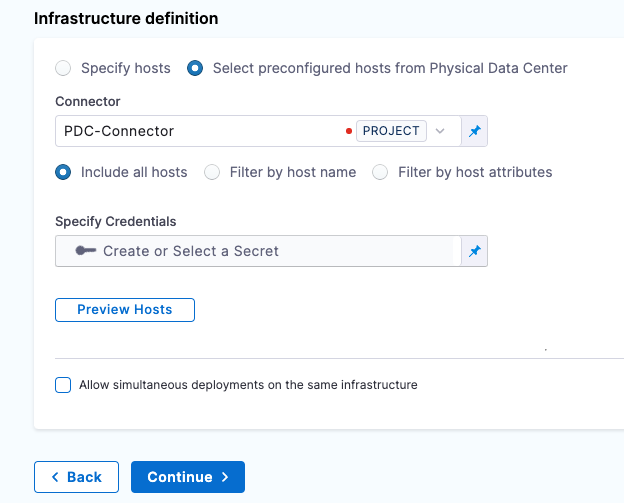

## Use SSH Credential for Authenticating to the Target Host

You can use an SSH Key or Kerberos for authenticating to the target host. In this tutorial, we will use an SSH Key.

1. In **Specify Credentials**, click **Create or Select a Secret**.
2. In **Create or Select an Existing Secret**, click **New SSH Credential**.
3. In **SSH Details**, for **Name**, enter **ssh-tutorial-key** for this SSH Credential and click **Continue**.
   
   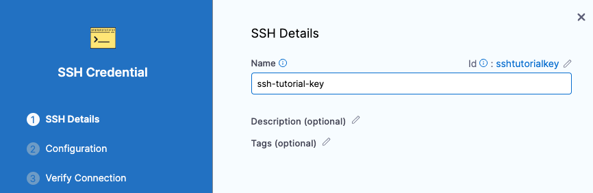

4. In **Configuration and Authentication**, you have three authentication options: In this tutorial, we will use **Username/SSH Key**. Click the down-drop menu and select **Username/SSH Key**.
   
   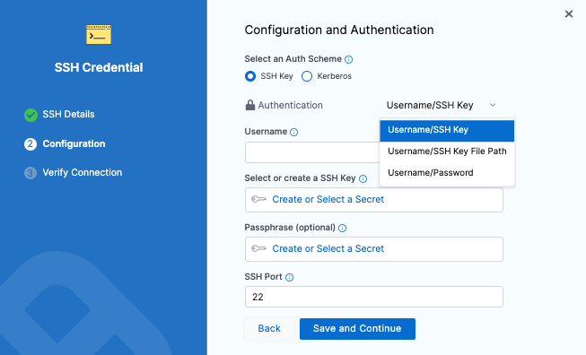

1. For username, enter **ec2-user**. This is the user for the EC2 instance.
5. For **Select or create a SSH Key**, click **Create or Select a Secret**.
6. in **Create or Select an Existing Secret**, select **New Secret File**.
   
   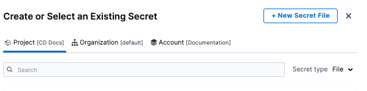

7. in **Add new Encrypted File**, enter a name for **Secret Name**: **ssh-key-name**. This is the name you will use to reference this file.
8. For **Select File**, click **Browse**. On your machine, browse for the .pem file that you downloaded from your EC2 instance. Select that file and Harness uploads it to the **Select File** field. Click **Save**.
   
   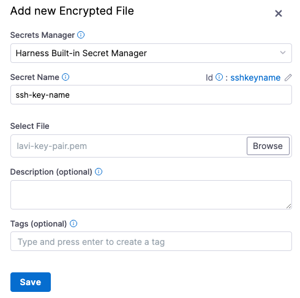

9.  In **Configuration and Authentication**, keep the default values for **Passphrase** and **SSH port**. Click **Save and Continue**.
    
    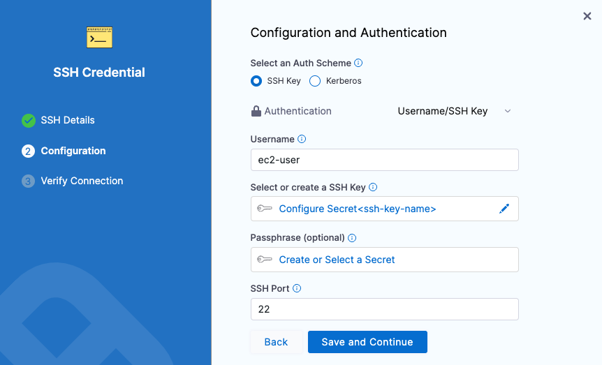
    
10. In **Verify Connection**, enter the hostname for the EC2 instance in the **Add a Host Name to start verification** field and click **Connection Test**.
    
    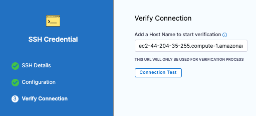
    
11. The Secure Shell connection to the EC2 instance is tested. Click **Finish**. Click **Continue**.
    
    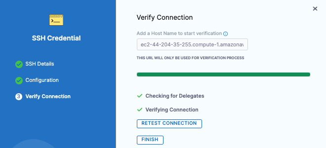
    
    You can use the **Preview Hosts** section to test the connection at any time.\
    
    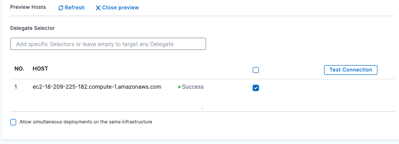

1. Click **Save**.
1. Back in **Environment**, click **Continue**.

Next, you'll select the deployment strategy for this stage, the package type, and the number of instances to deploy on.

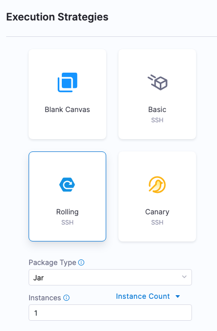

## Use a Basic strategy

You are now taken to **Execution Strategies** where you will use a deployment strategy and run your pipeline.

1. In **Execution Strategies**, select **Basic**. We'll use Basic because we're using one host. If we did Rolling or Canary, we would need multiple hosts.
2. For **Package type**, select **WAR**.
3. Click **Use Strategy**. Harness adds the **Deploy** step for execution.
4. Click the **Deploy** step. Here is where are add the scripts for your package. We'll use the defaults for this tutorial. So we'll simply be copying the artifact to the target host.
   
   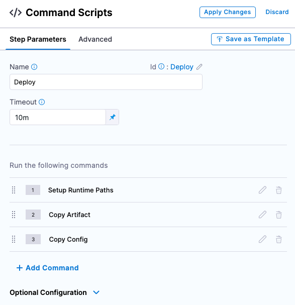

5. In **Command Scripts**, edit **Copy Config**.
6. In **Edit Command**, for **Select file type to copy**, click **Artifact**.
   
   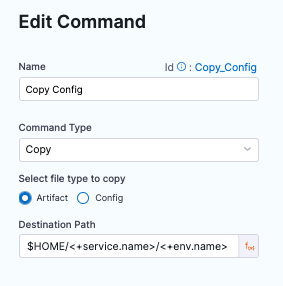

7. Click **Save**.
8. Review Looping Strategy: the Looping Strategy is how the deployment will repeat deployments for multiple hosts and for different deployment strategies (Basic, Rolling, Canary).
	1. Click **Advanced**.
	2. Click **Looping Strategy**. You can see that the step will be repeated for all hosts using the `<+stage.output.hosts>` expression.  
	In this tutorial, we're just using one host, but if you had two hosts the step would be repeated for each host.
  
  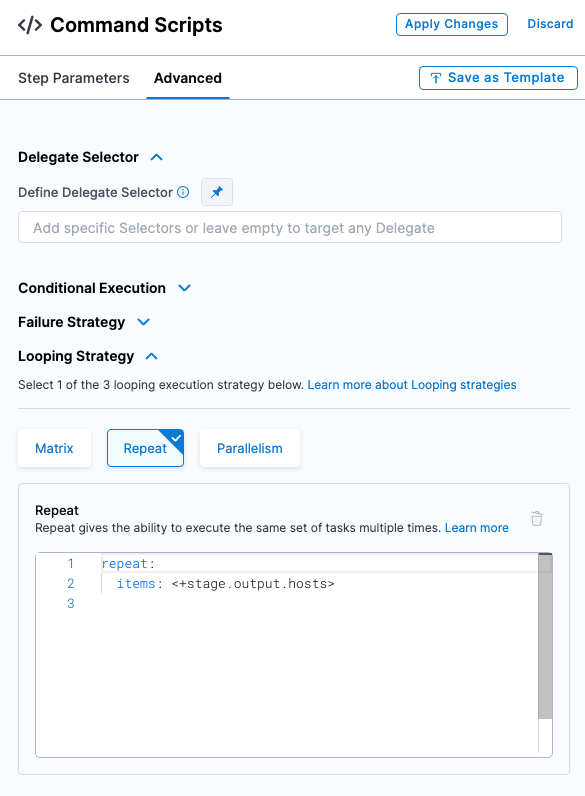

9.  Click **Apply Changes**.
10. When you're done, click **Save** to publish the Pipeline.

## Run the Pipeline to Deploy and Review

1. Click **Run** to run the pipeline.
2. In **Run Pipeline**, for **Primary Artifact**, select **Todolist**.
3. In **Artifact Path**, click the down-drop arrow and Harness displays a list of available artifact packages.
4. Select **todolist.war**.
   
   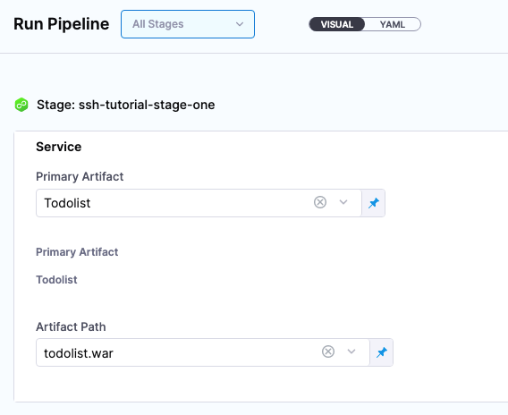

5. Click **Run Pipeline**. Harness runs the pipeline and the **Console View** displays the tasks executed for each step.

Let's review what is happening in the Deploy step. Most sections correspond to the commands you can see in the Deploy step.

1. **Initialize:** initialize the connection to the host(s) and create a temp directory for the deployment.
2. **Setup Runtime Paths:** create folders for runtime, backup, and staging.
3. **Copy Artifact:** copy the artifact to the host.
4. **Copy Config:** copy the config files (if any) to the host.
5. **Cleanup:** remove temp directories.

```
Initialize  
  
Initializing SSH connection to ec2-54-201-142-249.us-west-2.compute.amazonaws.com ....  
Connecting to ec2-54-201-142-249.us-west-2.compute.amazonaws.com ....  
Connection to ec2-54-201-142-249.us-west-2.compute.amazonaws.com established  
Executing command mkdir -p /tmp/aCy-RxnYQDSRmL8xqX4MZw ...  
Command finished with status SUCCESS  
Initializing SSH connection to ec2-54-201-142-249.us-west-2.compute.amazonaws.com ....  
Connecting to ec2-54-201-142-249.us-west-2.compute.amazonaws.com ....  
  
Setup Runtime Paths  
  
Initializing SSH connection to ec2-54-201-142-249.us-west-2.compute.amazonaws.com ....  
Connecting to ec2-54-201-142-249.us-west-2.compute.amazonaws.com ....  
Connection to ec2-54-201-142-249.us-west-2.compute.amazonaws.com established  
Executing command...  
Command finished with status SUCCESS  
  
Copy Artifact  
  
Filename contains slashes. Stripping off the portion before last slash.  
Got filename: todolist.war  
Connecting to ec2-54-201-142-249.us-west-2.compute.amazonaws.com ....  
Connection to ec2-54-201-142-249.us-west-2.compute.amazonaws.com established  
Begin file transfer todolist.war to ec2-54-201-142-249.us-west-2.compute.amazonaws.com:/home/ec2-user/tutorial-service-ssh2/ssh-tutorial-env  
File successfully transferred to ec2-54-201-142-249.us-west-2.compute.amazonaws.com:/home/ec2-user/tutorial-service-ssh2/ssh-tutorial-env  
Command finished with status SUCCESS  
  
Copy Config  
  
Filename contains slashes. Stripping off the portion before last slash.  
Got filename: todolist.war  
Connecting to ec2-54-201-142-249.us-west-2.compute.amazonaws.com ....  
Connection to ec2-54-201-142-249.us-west-2.compute.amazonaws.com established  
Begin file transfer todolist.war to ec2-54-201-142-249.us-west-2.compute.amazonaws.com:/home/ec2-user/tutorial-service-ssh2/ssh-tutorial-env  
File successfully transferred to ec2-54-201-142-249.us-west-2.compute.amazonaws.com:/home/ec2-user/tutorial-service-ssh2/ssh-tutorial-env  
Command finished with status SUCCESS  
  
Cleanup  
  
Initializing SSH connection to ec2-54-201-142-249.us-west-2.compute.amazonaws.com ....  
Connecting to ec2-54-201-142-249.us-west-2.compute.amazonaws.com ....  
Connection to ec2-54-201-142-249.us-west-2.compute.amazonaws.com established  
Executing command rm -rf /tmp/aCy-RxnYQDSRmL8xqX4MZw ...  
Command finished with status SUCCESS
```
Congratulations! You have now successfully created and completed the steps for running a pipeline by using Secure Shell.

In this tutorial you learned how to:

* Create a Harness Secure Shell Service.
* Set up a Harness Artifactory Connector for access to a public repository.
* Add the credentials needed to connect to target hosts.
* Define the target infrastructure for deployment.
* Select the Canary deployment strategy.
* Run the Pipeline and review.

## Notes

### Selecting multiple hosts

You can add multiple hosts in the Physical Data Center Connector:

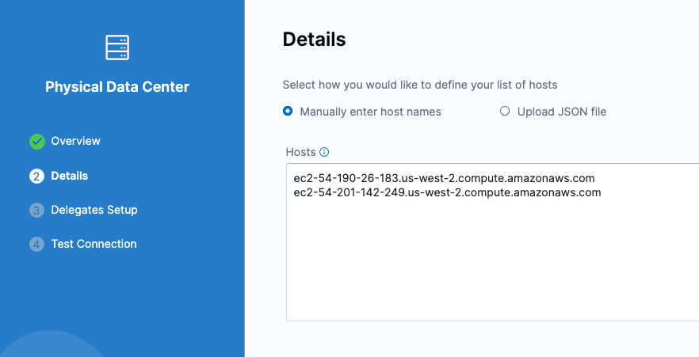

During deployment, you'll see each host listed in the loop:

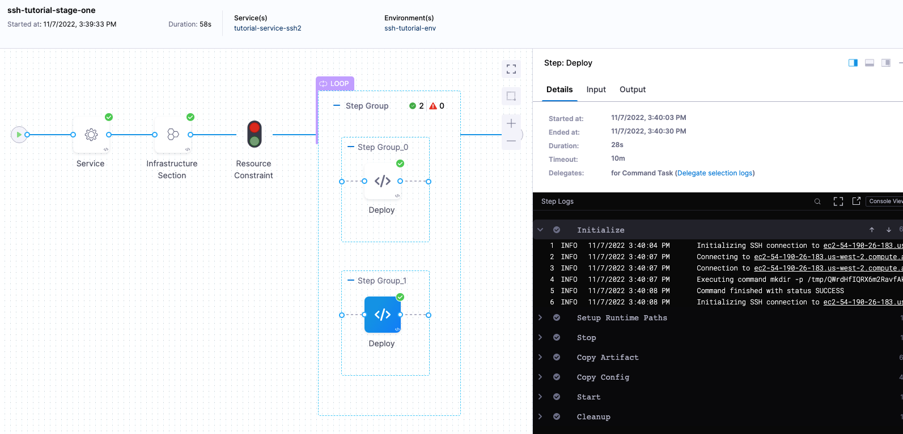

### Looping Strategies for each deployment strategy

The Repeat [Looping Strategy](../../../platform/8_Pipelines/looping-strategies-matrix-repeat-and-parallelism.md) is used differently for the Basic, Rolling, and Canary deployment types.

The Looping Strategy is automatically added to the **Deploy** step and configured for the deployment type you selected:

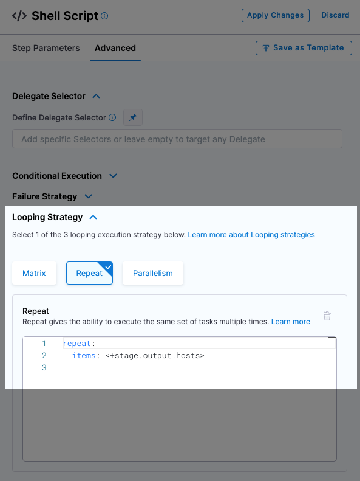

Let's look how it's used for different deployment types.

#### Basic

The Looping Strategy for the Basic deployment simply repeats the deployment on all the target hosts.

```yaml
repeat:  
  items: <+stage.output.hosts>
```

#### Rolling

For a Rolling strategy, you specify how many instances you want to deploy per phase.

Let’s say you have 10 target hosts in the stage Infrastructure Definition and you want to have 3 instances per phase. In **Instances**, you would enter 3. As a result, when execution starts there will be 4 phases: 3, 3, 3, 1. The number of instances per phase can be provided as a count or a percentage.

This is an example of the Rolling strategy using 2 hosts with 50% Instances.

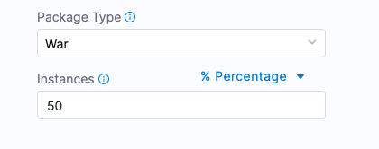

This means, that Harness will roll out to 50% of target hosts first, and then the remaining 50% if the first 50% were successful.

Harness creates 2 Phases.

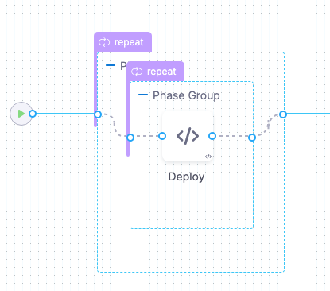

You can add any Approval steps inside the Phase Group. See [Adding ServiceNow Approval Steps and Stages](../../cd-advanced/approvals/using-harness-approval-steps-in-cd-stages.md), [Adding Jira Approval Stages and Steps](../../../platform/9_Approvals/adding-jira-approval-stages.md), and [Adding ServiceNow Approval Steps and Stages](../../../platform/9_Approvals/service-now-approvals.md).

The Looping Strategy for the first Phase deploys to 50% of the hosts (partitions):

```yaml
repeat:  
  items: <+stage.output.hosts>  
  maxConcurrency: 1  
  partitionSize: 50  
  unit: Percentage
```

The Looping Strategy for the second Phase repeats the partition count:

```yaml
repeat:  
  items: <+repeat.partition>
```

The `<+repeat.partition>` expression resolves how many instances (`items`) to iterate over per one partition (phase).

Let’s say we have 10 hosts and 4 partitions organized as 3, 3, 3, 1. The first partition includes 3 hosts, the second and third each have 3, and the last one has 1 host.

So, partition1 = host1, host2, host3, partition2 = host4, host5, host6, partition3 = host7, host8, host9, and partition4 = host10.

#### Canary

For Canary strategies, Harness calculates phase instances based on the number of hosts and the number of requested instances per phase.

Let’s say you have 10 hosts and you add 2 phases with 50% and 100%. This means Harness deploys on 5 instances in the first phase and on the rest of the instances in the second phase.

Here is an example of the Canary strategy using 2 hosts and 2 phases. The first phase deploys to 50% and the second phase deploys to 100%.

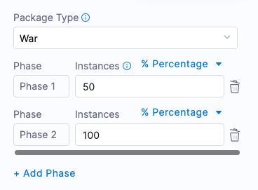

This means, that Harness will roll out to 50% of target hosts first, and then the remaining 50% if the first 50% were successful.

Harness creates 2 phases as step groups.

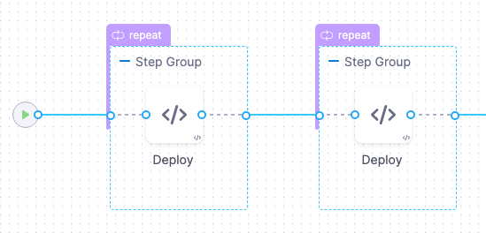

You can add any Approval steps between the Step Groups. See [Adding ServiceNow Approval Steps and Stages](../../cd-advanced/approvals/using-harness-approval-steps-in-cd-stages.md), [Adding Jira Approval Stages and Steps](../../../platform/9_Approvals/adding-jira-approval-stages.md), and [Adding ServiceNow Approval Steps and Stages](../../../platform/9_Approvals/service-now-approvals.md).

The Looping Strategy for the first Phase selects 50% of the target hosts:

```yaml
repeat:  
  items: <+stage.output.hosts>  
  start: 0  
  end: 50  
  unit: Percentage
```

The Looping Strategy for the second Phase starts at the 50% from the first phase and continues to 100%:

```
repeat:  
  items: <+stage.output.hosts>  
  start: 50  
  end: 100  
  unit: Percentage
```

### Reference hosts in steps using expressions

You can use all of the `<+instance...>` expressions to reference your hosts.

For Microsoft Azure, AWS, or any platform-agnostic Physical Data Center (PDC):

* [<+instance.hostName>](../../../platform/12_Variables-and-Expressions/harness-variables.md#instance-host-name)
* [<+instance.host.hostName>](../../../platform/12_Variables-and-Expressions/harness-variables.md#instance-host-host-name)
* [<+instance.name>](../../../platform/12_Variables-and-Expressions/harness-variables.md#instance-name)

For Microsoft Azure or AWS:

* [<+instance.host.privateIp>](../../../platform/12_Variables-and-Expressions/harness-variables.md#instance-host-private-ip)
* [<+instance.host.publicIp>](../../../platform/12_Variables-and-Expressions/harness-variables.md#instance-host-public-ip)

`instance.name` has the same value as `instance.hostName`. Both are available for backward compatibility.