This tutorial shows you how to deploy a publicly available application to your Tanzu Application Service (TAS, formerly PCF) space using any [deployment strategy](../../cd-execution/kubernetes-executions/create-a-kubernetes-rolling-deployment.md) in Harness.

:::note
Currently, this feature is behind feature flags `NG_SVC_ENV_REDESIGN`, `CDS_TAS_NG`. Contact [Harness Support](mailto:support@harness.io) to enable this feature. 
:::

## Objectives

You'll learn how to:

* Install and launch a Harness delegate in your target cluster.
* Connect Harness with your TAS account.
* Connect Harness with artifactory.
* Specify the manifest to use the application.
* Set up a TAS pipeline.
* Create and deploy a TAS workflow.

## Important notes

* Harness includes artifact sources for Artifactory, Nexus, Amazon S3, GCR, ECR, ACR, Google Artifact Registry, GitHub Package Registry, Custom registry, and any Docker Registry such as DockerHub. These registries require you to login to your account to access them.
* Create a TAS project for your new CD pipeline. Ensure that you add the **Continuous Delivery** module to the project. Go to [Create Organizations and Projects](../../../platform/organizations-and-projects/create-an-organization.md) for more information. 

## Connect to a TAS provider

You can connect Harness to a TAS cloud platform by adding a TAS connector.
1. Open a Harness project.
2. In **Project Setup**, select **Connectors**, then select **New Connector**.
3. In **Cloud Providers**, select **Tanzu Application Service**. The TAS connector settings appear. 
4. Enter a connector name and select **Continue**.
5. Enter the TAS **Endpoint URL**.
6. In **Authentication**, select:
    1. **Plaintext** and enter the username and password. For password, you can either create a new secret or use an existing one.
    2. **Encrypted** and enter the username and password. You can create a new secret for username and password or use exiting ones.
7. Select **Continue**.
8. In **Connect to the provider**, select **Connect through a Harness Delegate**, and then click **Continue**.
   We don't recommend using the **Connect through Harness Platform** option here simply because you'll need a delegate later for the connection to your TAS environment. Typically, the **Connect through Harness Platform** option is a very quick way to make connections without having to use delegates.
9. In **Delegates Setup**, click **Install new Delegate**. The Delegate wizard appears.

   [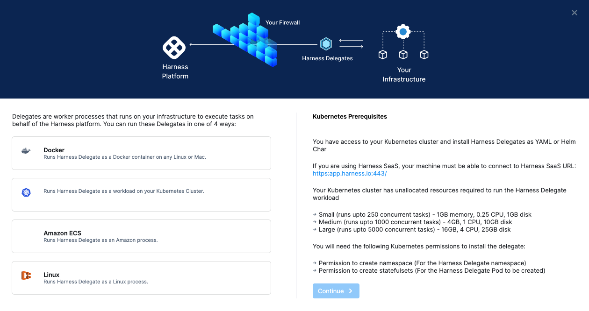](./static/kubernetes-cd-quickstart-83.png)

10. Select **Kubernetes**, then select **Continue**.

   

11. Enter a name for the delegate, like **quickstart**, click the **Small** size.
12. Click **Continue**.
13. Click **Download YAML file**. The YAML file for the Kubernetes delegate will download to your computer.
14. Open a terminal and navigate to where the delegate file is located.  
    You will connect to your cluster using the terminal so you can simply run the YAML file on the cluster.
15. In the same terminal, log into your Kubernetes cluster. In most platforms, you select the cluster, click **Connect**, and copy the access command.
    Next, install the Harness Delegate using the **harness-delegate.yaml** file you just downloaded.
16. In the terminal connected to your cluster, run this command:
   ```
   kubectl apply -f harness-delegate.yaml
   ```
   You can find this command in the Delegate wizard:

   

   The successful output is something like this:

   ```
   % kubectl apply -f harness-delegate.yaml  
   namespace/harness-delegate unchanged  
   clusterrolebinding.rbac.authorization.k8s.io/harness-delegate-cluster-admin unchanged  
   secret/k8s-quickstart-proxy unchanged  
   statefulset.apps/k8s-quickstart-sngxpn created  
   service/delegate-service unchanged
   ```
17. In Harness, click **Verify**. It will take a few minutes to verify the Delegate. Once it is verified, close the wizard.
18. Back in **Set Up Delegates**, you can select the new Delegate.
   In the list of Delegates, you can see your new Delegate and its tags.
19. Select the **Connect using Delegates with the following Tags** option.
20. Enter the tag of the new Delegate and click **Save and Continue**.
21. Once the test connection succeeds, select **Finish**. The connector now appears in the **Connectors** list.

## Create the deploy stage

Pipelines are collections of stages. For this tutorial, we'll create a new pipeline and add a single stage.


1. In your Harness project, select **Pipelines**, then select **Create a Pipeline**.
2. Enter the name **TAS Quickstart** and click **Start**.
   
   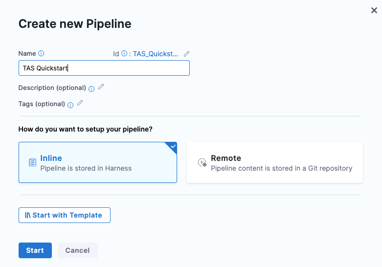

   Your pipeline appears.
3. Click **Add Stage** and select **Deploy**.
4. Enter the stage name **Deploy TAS Service**, select **Tanzu Application Services** deployment type and select **Set Up Stage**.
   
   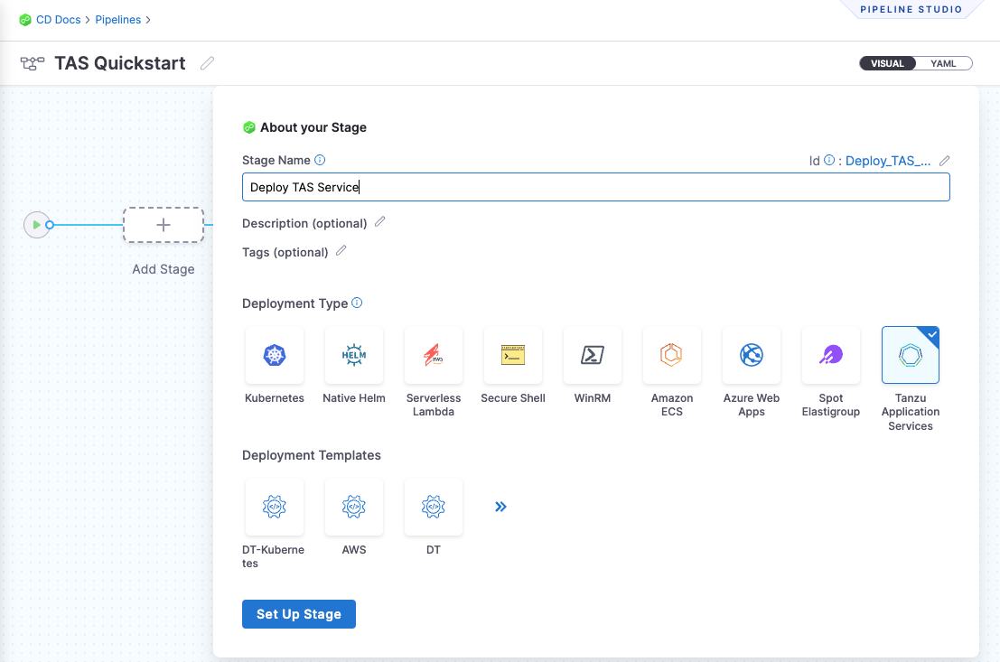

   The new stage settings appear. 

## Create a service and configure service definitions

**Services** and **Service Definitions** are explained below. Harness services represent your microservices or applications logically. You can add the same service to as many stages as you need. Service definitions represent your artifacts, manifests, config files, and variables physically. They are the actual files and variable values.  
   
By separating services and service definitions, you can propagate the same service across stages while changing the artifacts, manifests, and variables with each stage.

### Step 1: Create a new service

1. Select the **Service** tab, then select **Add Service**.  
2. Give the service the name **TAS**.  
Once you have created a service, it is persistent and can be used throughout the stages of this or any other pipeline in the project.

### Step 2: Verify deployment type

1. In **Service Definition**, in **Deployment Type**, verify if **Tanzu Application Services** is selected.

### Step 3: Add manifests

1. In **Manifests**, select **Add Manifest**.  
   Harness uses **TAS Manifest**, **Vars**, and **AutoScaler** manifest types for defining TAS application, instances, and routes.  
   You can use one TAS manifest and one autoscaler manifest only. You can use unlimited vars file manifests. 

   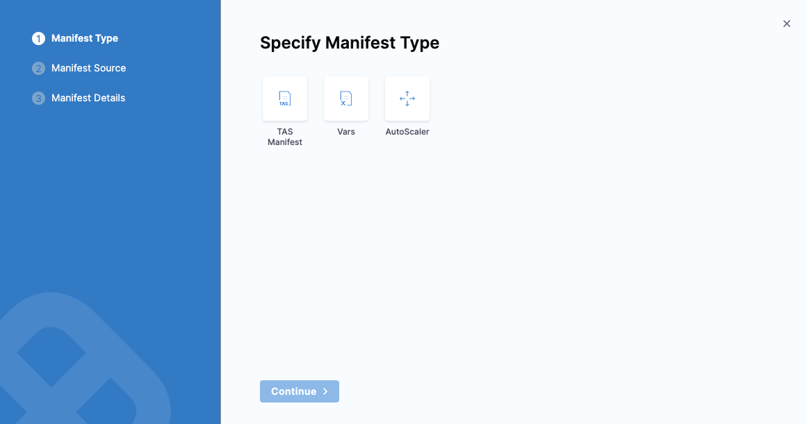
 
2. Select **TAS Manifest** and select **Continue**.
3. In **Specify TAS Manifest Store**, select **Harness** and select **Continue**.
4. In **Manifest Details**, enter manifest name.
5. Select **File/Folder Path**, then select **Project**, **Organization**, or **Account** to create or select an existing `manifest.yaml` file.
   
   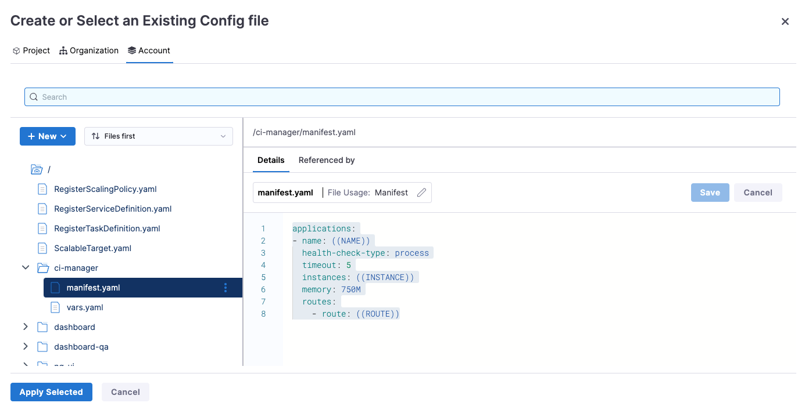

   You can add only one `manifest.yaml` file.  
5. Select **Apply Selected**.
6. Select **Vars.yaml path** and repeat step 6 to create or select an existing `vars.yaml` file, then select **Apply Selected**.  
   You can add any number of `vars.yaml` files.  
7.  Select **AutoScaler.yaml** and repeat step 6 to create or select an existing `autoscaler.yaml` file, then select **Apply Selected**.  
   You can add only one `autoscaler.yaml` file.  

8. Select **Submit**.

### Step 4: Add artifacts

1. In **Artifacts**, select **Add Artifact Source**.
2. In **Specify Artifact Repository Type**, select the artifact registry type.
3. Select or create a connector to this registry.

  For details on setting up each registry, go to [Connect to an Artifact Repo](../../../platform/7_Connectors/connect-to-an-artifact-repo.md).

  Once you have an artifact connector set up and selected, you can fill out the **Artifact Details** settings.

  Here are some common examples.

  | **ACR** | **Artifactory** | **Docker Registry** |
  | --- | --- | --- |
  | 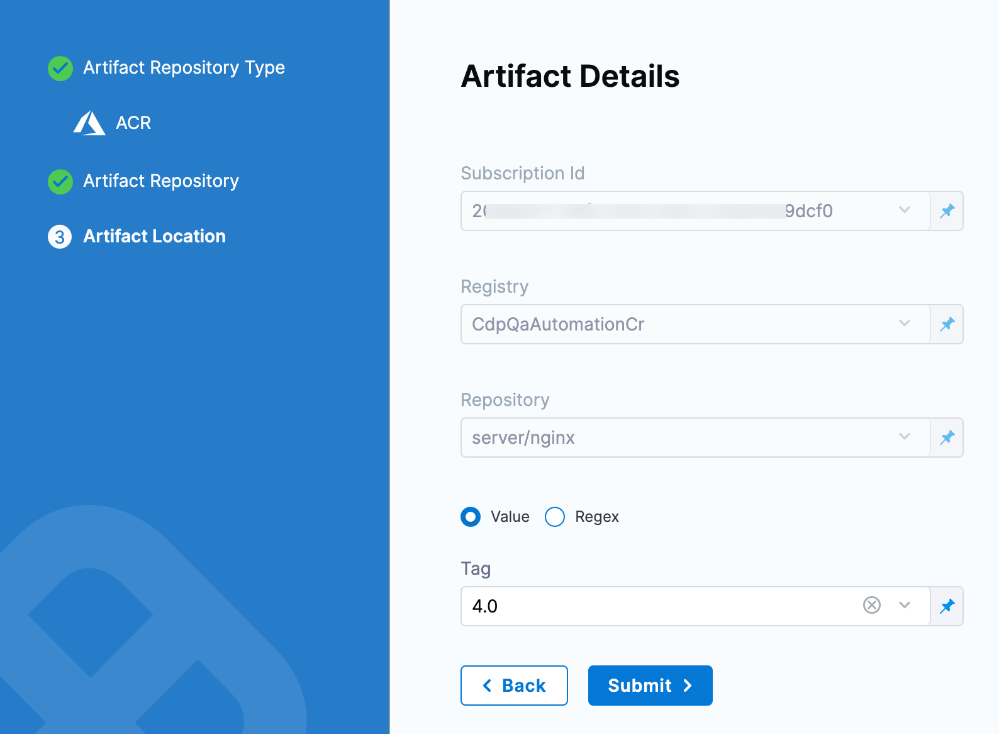 | 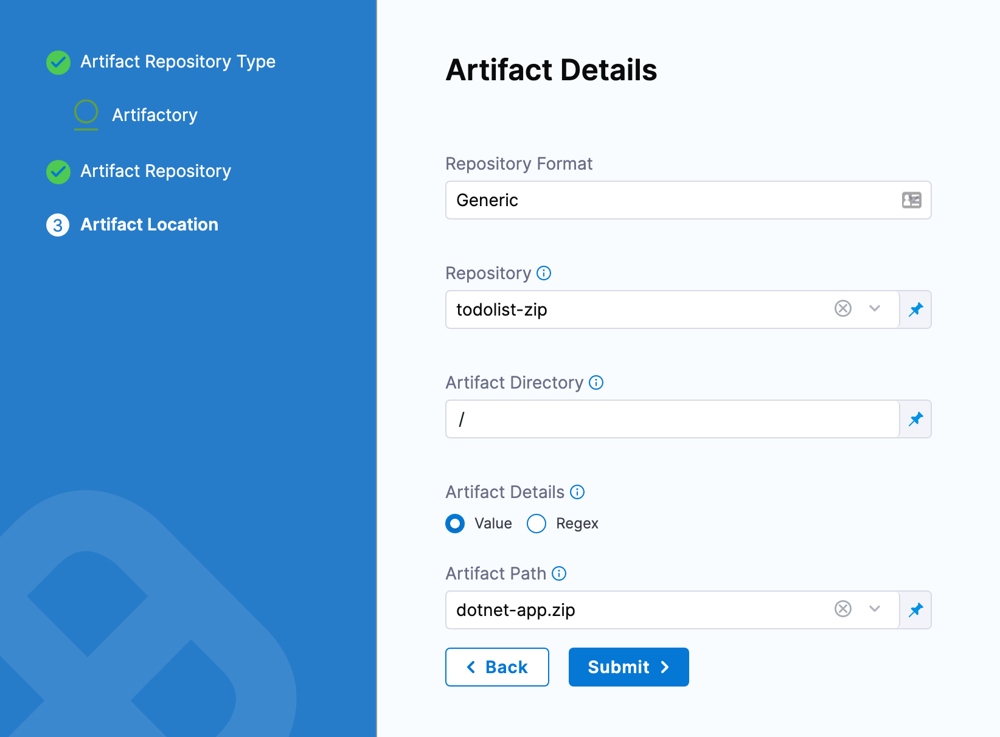 | 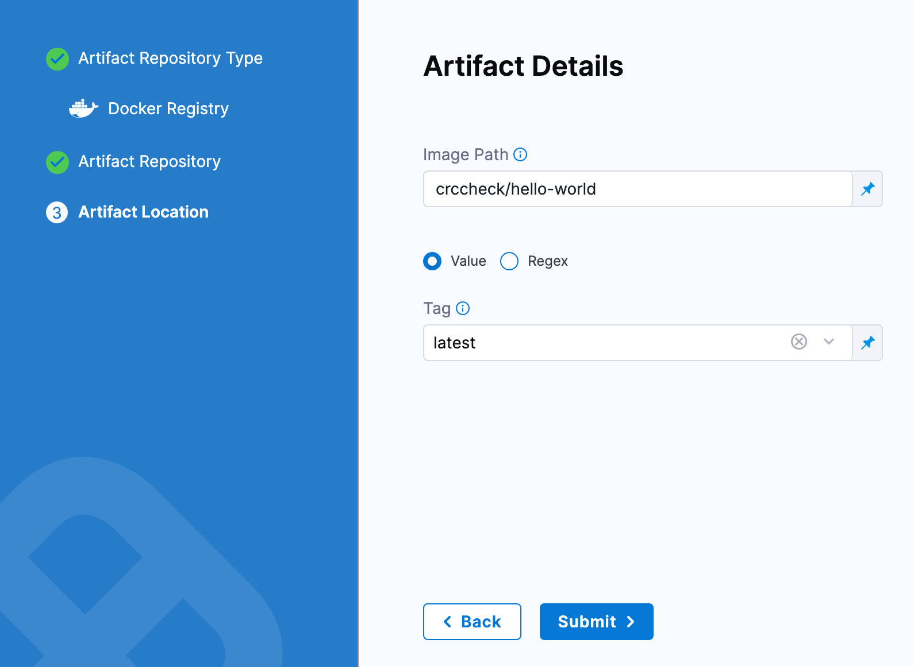 |

5. When done, select **Submit**.

### Step 5: Add config files

1. In **Config Files**, select **Add Config File**.
2. In **Config File Source**, select **Harness** and select **Continue**.
3. Enter a config file identifier.
4. Select **File/Folder Path** then select **Project**, **Organization**, or **Account** to create or select an existing config file.
   
   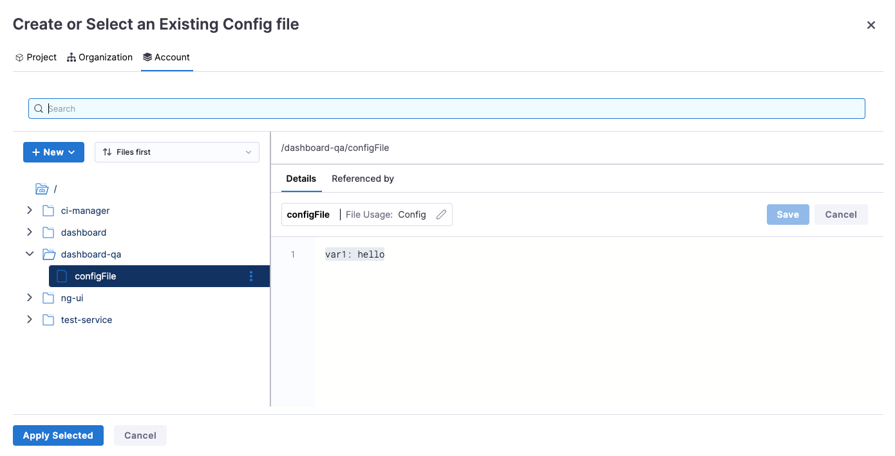

5. Select **Apply Selected**.
6. Select **Add** and repeat steps 4 and 5 to add more config files.
7. Click **Submit**.

## Define your target cluster

The target cluster is your TAS cluster. This is where you will deploy your application.

1. In **Specify Environment**, select **New Environment**.  
   Just like service configuration, you can create a new environment or select an existing one. We will create a new one in this tutorial.
2. Enter an environment name and select **Production** or **Pre-Production** environment type.
3. Override the service configuration in **Environment Overrides** if you want to override the defined service properties.
4. Select **Save**.
5. In **Specify Infrastructure**, select **New Infrastructure**.
6. Enter a name, and verify if **Tanzu Application Type** deployment type is selected.
7. Select the TAS connector you created [here](#connect-to-a-tas-provider).
8. Select **Organization**.
9. Select **Space**.
10. Select **Allow simultaneous deployment on the same infrastructre** if you want to deploy multiple deployments in this infrastructure.
    
    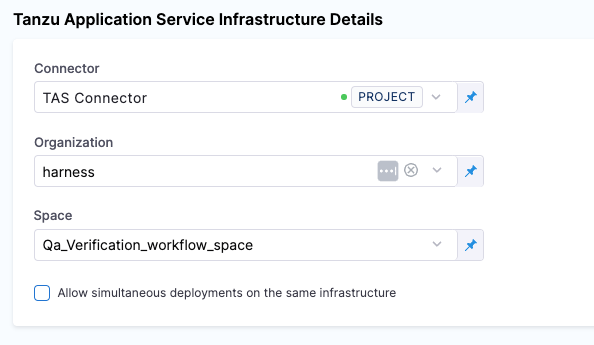

11. Select **Save**.

## Add a deployment step

Now you can select the [deployment strategy](../../cd-deployments-category/deployment-concepts.md) for this stage of the pipeline.

```mdx-code-block
import Tabs from '@theme/Tabs';
import TabItem from '@theme/TabItem';
```
```mdx-code-block
<Tabs>
  <TabItem value="Rolling" label="Rolling" default>

1. In Execution Strategies, select **Rolling**, and then click **Use Strategy**.
2. The **Rollout Deployment** step is added. 
   
   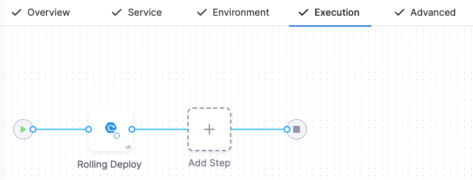

3. Add the step to define **Step Parameters**.
    1. **Name** - Edit the deployment step name.
    2. **Timeout** - Define the timeout interval.
    3. **Additional Routes** - Enter additional routes to add routes other than the ones defines in the manifests.
4. Select **Apply Changes**.
5. Add a **Rolling Rollback** step to your stage if you want to roll back the workloads deployed in this step.
6. Select **Save**.

Now the pipeline stage is complete and you can deploy.

```mdx-code-block
  </TabItem>
  <TabItem value="Blue Green" label="Blue Green">
```
1. In Execution Strategies, select **Blue Green**, and then click **Use Strategy**.
2. The blue green execution steps are added. 
   
   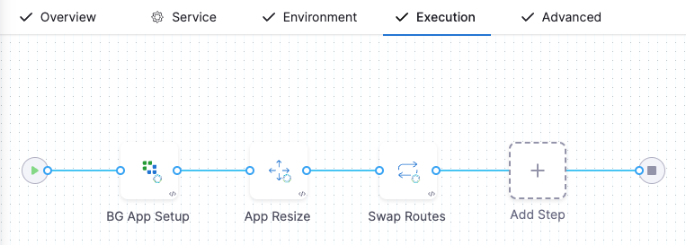

3. Select the **BG App Setup** step to define **Step Parameters**.
    1. **Name** - Edit the deployment step name.
    2. **Timeout** - Define the timeout interval.
    3. **Instance Count** - Select whether to **Read from Manifest** or **Match Running Instances**.
    4. **Existing Versions to Keep** - Enter the number of existing versions you want to keep. This is to roll back to a stable version if the deployment fails.
    5. **Additional Routes** - Enter additional routes if you want to add routes other than the ones defines in the manifests.
    6. **Temporarty Routes** - Add temporary routes in addition to additional routes.
    7. Select **Apply Changes**.

4. Select the **App Resize** step to define **Step Parameters**.
    1. **Name** - Edit the deployment step name.
    2. **Timeout** - Define the timeout interval.
    3. **Total Instances** - Enter the number or percentage of instances you want to keep.
    4. **Desired Instances - Old Version** - Enter the number or percentage of old instances you want to keep.
    5. Select **Apply Changes**.

5. Select the **Swap Routes** step to define **Step Parameters**.
    1. **Name** - Edit the deployment step name.
    2. **Timeout** - Define the timeout interval.
    3. **Downsize Old Application** - Select this option to down size older applications.
    4. Select **Apply Changes**.
   
6. Add a **App Rollback** step to your stage if you want to roll back the workloads deployed in this step.
7. Select **Save**.

Now the pipeline stage is complete and you can deploy.

```mdx-code-block
  </TabItem>
  <TabItem value="Canary" label="Canary">
```
1. In Execution Strategies, select **Canary**, and then click **Use Strategy**.
2. The canary execution steps are added. 
   
   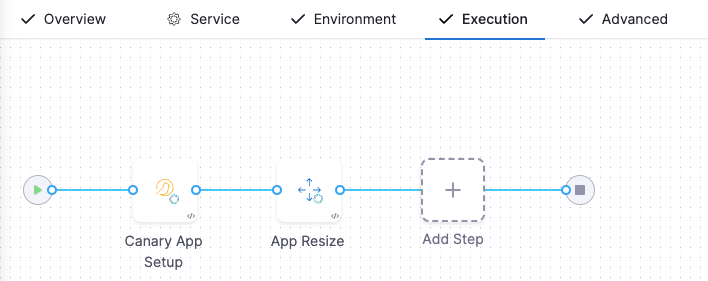

3. Select the **Canary App Setup** step to define **Step Parameters**.
    1. **Name** - Edit the deployment step name.
    2. **Timeout** - Define the timeout interval.
    3. **Instance Count** - Select whether to **Read from Manifest** or **Match Running Instances**.
    4. **Resize Strategy** - Select **Add new instances first, then downsize old instances** or **Downsize old instances first, then add new instances** strategy.
    5. **Existing Versions to Keep** - Enter the number of existing versions you want to keep. This is to roll back to a stable version if the deployment fails.
    6. **Additional Routes** - Enter additional routes if you want to add routes other than the ones defines in the manifests.
    7. Select **Apply Changes**.

4. Select the **App Resize** step to define **Step Parameters**.
    1. **Name** - Edit the deployment step name.
    2. **Timeout** - Define the timeout interval.
    3. **Total Instances** - Enter the number or percentage of instances you want to keep.
    4. **Desired Instances - Old Version** - Enter the number or percentage of old instances you want to keep.
    5. Select **Apply Changes**.
   
5. Add a **App Rollback** step to your stage if you want to roll back the workloads deployed in this step.
6. Select **Save**.

Now the pipeline stage is complete and you can deploy.

```mdx-code-block
  </TabItem>
  <TabItem value="Basic" label="Basic">
```
1. In Execution Strategies, select **Basic**, and then click **Use Strategy**.
2. The basic execution steps are added. 
   
   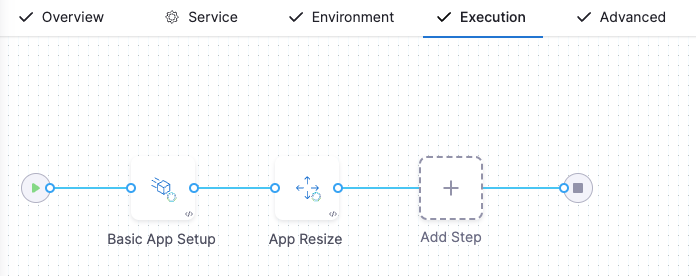

3. Select the **Basic App Setup** step to define **Step Parameters**.
    1. **Name** - Edit the deployment step name.
    2. **Timeout** - Define the timeout interval.
    3. **Instance Count** - Select whether to **Read from Manifest** or **Match Running Instances**.
    4. **Existing Versions to Keep** - Enter the number of existing versions you want to keep. This is to roll back to a stable version if the deployment fails.
    5. **Additional Routes** - Enter additional routes if you want to add routes other than the ones defines in the manifests.
    6. Select **Apply Changes**.

4. Select the **App Resize** step to define **Step Parameters**.
    1. **Name** - Edit the deployment step name.
    2. **Timeout** - Define the timeout interval.
    3. **Total Instances** - Enter the number or percentage of instances you want to keep.
    4. **Desired Instances - Old Version** - Enter the number or percentage of old instances you want to keep.
    5. Select **Apply Changes**.
   
5. Add a **App Rollback** step to your stage if you want to roll back the workloads deployed in this step.
6. Select **Save**.

Now the pipeline stage is complete and you can deploy.

```mdx-code-block
  </TabItem>
  <TabItem value="Black Canvas" label="Black Canvas">
```
1. In Execution Strategies, select **Black Canvas**, and then click **Use Strategy**.
2. Select **Add Step** to add steps from the **Steps Library**. 
3. Select each step and define **Step Parameters**.
4. Select **Apply Changes**.
5. Select **Save**.
   
```mdx-code-block
  </TabItem>    
</Tabs>
```

## Step 5: Deploy and review

1. Click **Save** **> Save Pipeline** and then **Run**.
   Now you can select the specific artifact to deploy.
2. Select a **Primary Artifact**.
3. Select a **Tag**.
4. Select the follwoing **Infrastructure** parameters.
    1. **Connector**
    2. **Organization**
    3. **Space**
5. Click **Run Pipeline**. Harness will verify the Pipeline and then run it.
   You can see the status of the deployment, and pause or abort it.

6. Toggle **Console View** to watch the deployment with more detailed logging.  

The deployment was successful.

In your project's **Deployment**s**, you can see the deployment listed:

If you run into any errors, it is typically because the cluster does meet the requirements from [Before You Begin](#before_you_begin) or the cluster's network setting does not allow the delegate to connect to your selected repository.

## Next Steps

See [CD tutorials](/docs/category/cd-tutorials) for other deployment features.


