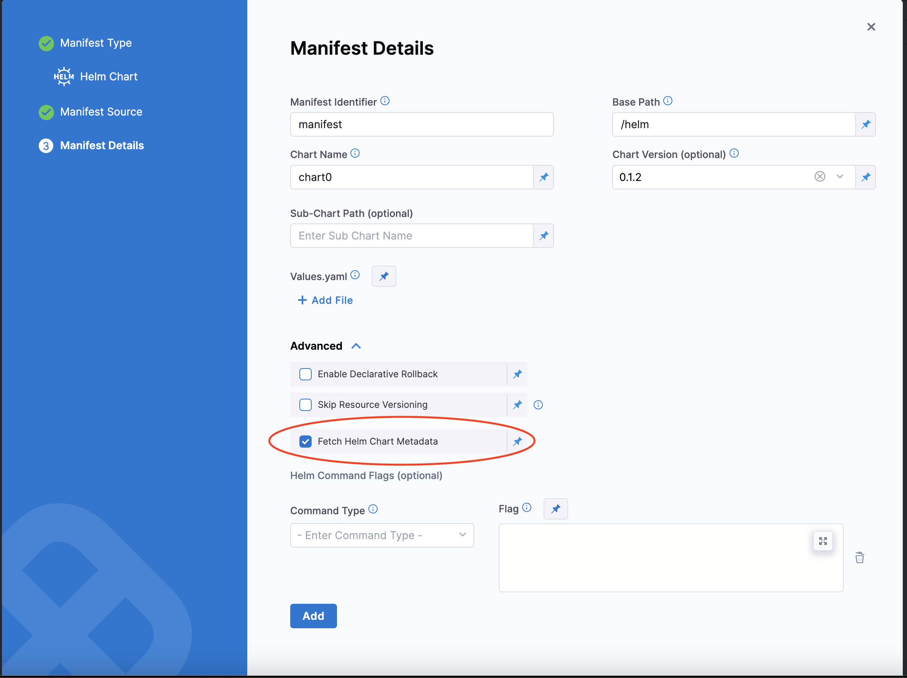

For [Kubernetes Helm](/docs/continuous-delivery/deploy-srv-diff-platforms/helm/deploy-helm-charts) and [Native Helm](/docs/continuous-delivery/deploy-srv-diff-platforms/helm/native-helm-quickstart) deployments, you can use the following built-in expressions in your pipeline stage steps to reference chart details.

|                     Expression                      |                                                      Description                                                      |
| --------------------------------------------------- | --------------------------------------------------------------------------------------------------------------------- |
| `<+manifests.MANIFEST_ID.helm.name>`                | Helm chart name.                                                                                                      |
| `<+manifests.MANIFEST_ID.helm.description>`         | Helm chart description.                                                                                               |
| `<+manifests.MANIFEST_ID.helm.version>`             | Helm Chart version.                                                                                                   |
| `<+manifests.MANIFEST_ID.helm.apiVersion>`          | Chart.yaml API version.                                                                                               |
| `<+manifests.MANIFEST_ID.helm.appVersion>`          | The app version.                                                                                                      |
| `<+manifests.MANIFEST_ID.helm.kubeVersion>`         | Kubernetes version constraint.                                                                                        |
| `<+manifests.MANIFEST_ID.helm.metadata.url>`        | Helm Chart repository URL.                                                                                            |
| `<+manifests.MANIFEST_ID.helm.metadata.basePath>`   | Helm Chart base path, available only for OCI, GCS, and S3.                                                            |
| `<+manifests.MANIFEST_ID.helm.metadata.bucketName>` | Helm Chart bucket name, available only for GCS and S3.                                                                |
| `<+manifests.MANIFEST_ID.helm.metadata.commitId>`   | Store commit Id, available only when manifest is stored in a Git repo and Harness is configured to use latest commit. |
| `<+manifests.MANIFEST_ID.helm.metadata.branch>`     | Store branch name, available only when manifest is stored in a Git repo and Harness is configured to use a branch.    |
| `<+manifests.MANIFEST_ID.spec.chartName>`           | The chart name specified in the manifest configuration.                                                               |
| `<+manifests.MANIFEST_ID.spec.chartVersion>`        | The chart version specified in the manifest configuration.                                                            |
| `<+manifests.MANIFEST_ID.spec.subChartPath>`        | The sub-chart path specified in the manifest configuration.                                                           |
| `<+manifests.MANIFEST_ID.spec.store>`               | The store configuration for the manifest (for example, HTTP, Git, OCI).                                               |
| `<+manifests.MANIFEST_ID.spec.valuesPaths>`         | The values file paths specified in the manifest configuration.                                                        |

Select **Fetch Helm Chart Metadata** in the **Manifest Details** page's **Advanced** section to enable this functionality.



The `MANIFEST_ID` is located in `service.serviceDefinition.spec.manifests.manifest.identifier` in the Harness service YAML. In the following example, it is `nginx`:

```yaml
service:
  name: Helm Chart
  identifier: Helm_Chart
  tags: {}
  serviceDefinition:
    spec:
      manifests:
        - manifest:
            identifier: nginx
            type: HelmChart
            spec:
              store:
                type: Http
                spec:
                  connectorRef: Bitnami
              chartName: nginx
              helmVersion: V3
              skipResourceVersioning: false
              fetchHelmChartMetadata: true
              commandFlags:
                - commandType: Template
                  flag: mychart -x templates/deployment.yaml
    type: Kubernetes

```

It can also be fetched using the expression `<+manifestConfig.primaryManifestId>`. This expression is supported in multiple Helm chart manifest configurations.

### Using primary manifest ID in expressions

When you have multiple manifests configured in a service, you can reference the primary manifest dynamically using `<+manifestConfig.primaryManifestId>`. This is useful when you need to construct expressions without hardcoding the manifest identifier.

For example, instead of using a hardcoded manifest ID:

```
<+manifests.myHelmChart.spec.chartName>
```

You can use the primary manifest ID dynamically:

```
<+manifests.<+manifestConfig.primaryManifestId>.spec.chartName>
```

This approach allows your expressions to work regardless of the specific manifest identifier used in the service configuration.