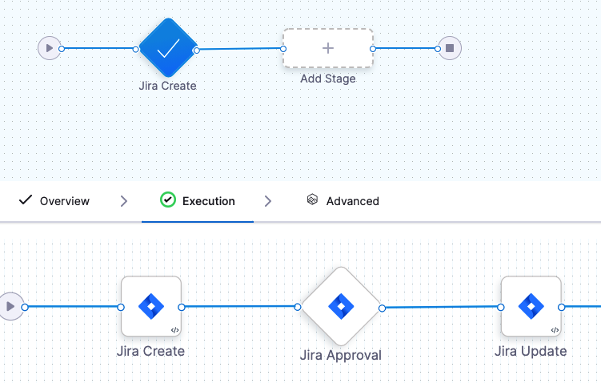
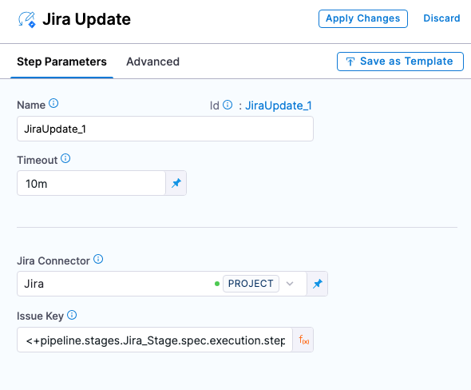
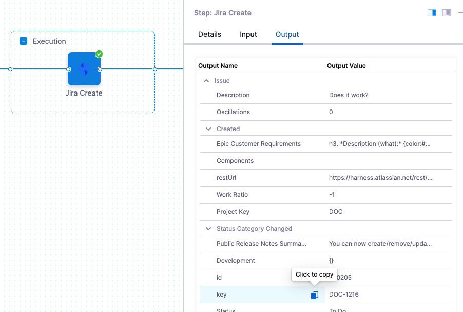
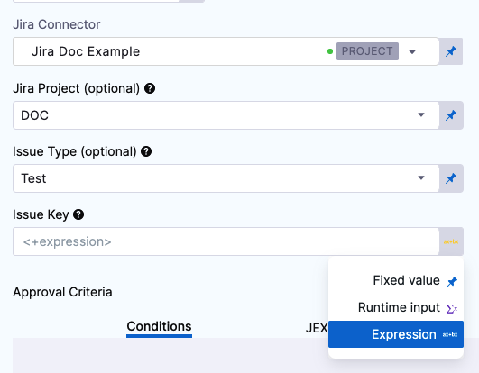
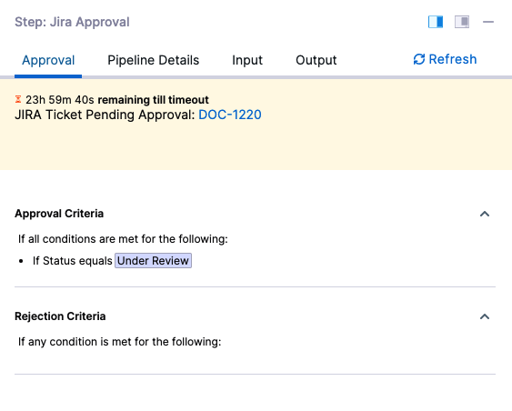
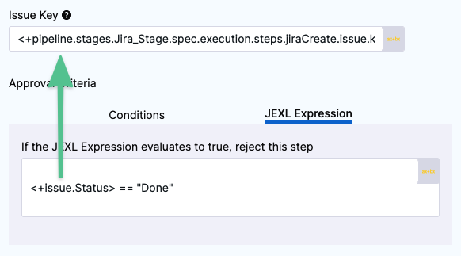
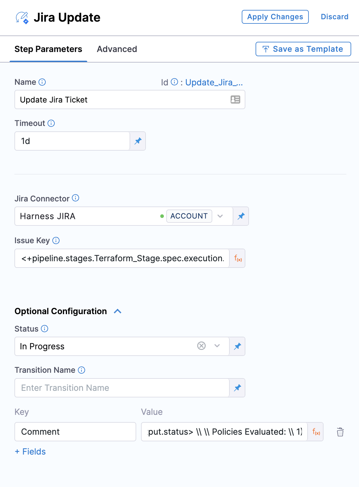

You can use Jira issues to approve or reject a Pipeline or stage at any point in its execution.

During deployment, a Jira issue's fields are evaluated according to criteria you define and its approval/rejection determines if the Pipeline or stage may proceed.

The **Jira Approval** step can be added in Jira Approval stages or in CD stages. The Jira Approval step prevents the stage execution from proceeding without an approval.

For example, in a [Kubernetes Blue Green Deployment](/docs/continuous-delivery/deploy-srv-diff-platforms/kubernetes/kubernetes-executions/create-a-kubernetes-blue-green-deployment), you might want to add an approval step between the Stage Deployment step, where the new app version is deployed to the staging environment, and the Swap Primary with Stage step, where production traffic is routed to the pods for the new version.

Looking to create or update Jira issues? See [Create Jira Issues in CD Stages](/docs/continuous-delivery/x-platform-cd-features/cd-steps/ticketing-systems/create-jira-issues-in-cd-stages), [Update Jira Issues in CD Stages](/docs/continuous-delivery/x-platform-cd-features/cd-steps/ticketing-systems/update-jira-issues-in-cd-stages).

### Before you begin

* [Connect to Jira](/docs/platform/7_Connectors/Ticketing-Systems/connect-to-jira.md)
* [Create Jira Issues in CD Stages](/docs/continuous-delivery/x-platform-cd-features/cd-steps/ticketing-systems/create-jira-issues-in-cd-stages)
* [Update Jira Issues in CD Stages](/docs/continuous-delivery/x-platform-cd-features/cd-steps/ticketing-systems/update-jira-issues-in-cd-stages)

### Visual Summary

The following video shows you how to use the Jira Create, Jira Update, and Jira Approval steps:

<!-- Video:
https://www.youtube.com/embed/xVeICozz4lU-->
<docvideo src="https://www.youtube.com/embed/xVeICozz4lU" />

### Limitations

* Harness supports only Jira fields of type `Option`, `Array`, `Any`, `Number`, `Date`, and `String`. Harness does not integrate with Jira fields that manage users, issue links, or attachments. This means that Jira fields like Assignee and Sprint are not accessible in Harness' Jira integration.

### Review: Jira Approval Stages vs Steps

You can use Jira Approvals in two ways:

* **Jira Approval step:** you can add a Jira Approval step to any CD or Approval stage.
* **Jira Approval stage:** the Jira Approval stage includes Jira Create, Jira Approval, and Jira Update steps:



You do not need to use the Jira Create and Jira Update steps with the Jira Approval step, but they are included in the Jira Approval stage because many users want to create a Jira issue, approve/reject based on its settings, and then update the Jira issue all in one stage.

You can also achieve this simply by using the Jira Create, Jira Approval, and Jira Update steps within a non-Approval stage.

The Jira Create and Jira Update steps are described in other topics. This topic describes the Jira Approval step only.

See:

* [Create Jira Issues in CD Stages](/docs/continuous-delivery/x-platform-cd-features/cd-steps/ticketing-systems/create-jira-issues-in-cd-stages)
* [Update Jira Issues in CD Stages](/docs/continuous-delivery/x-platform-cd-features/cd-steps/ticketing-systems/update-jira-issues-in-cd-stages)

### Step 1: Add a Jira Approval Step

In a CD or Approval stage, click **Add Step**, and then click **Jira Approval**.

When you add a Jira Approval stage, Harness automatically adds Jira Create, Jira Approval, and Jira Update steps. We'll only cover the Jira Approval step here.

In **Name**, enter a name that describes the step.

In **Timeout**, enter how long you want Harness to try to complete the step before failing (and initiating the stage or step [Failure Strategy](/docs/platform//8_Pipelines/define-a-failure-strategy-on-stages-and-steps.md)).

You can use `**w**` for week, `**d**` for day, `**h**` for hour, `**m**` for minutes, `**s**` for seconds and `**ms**` for milliseconds. For example, 1d for one day.

Jira communication can take a few minutes. Do not use a brief timeout.

The maximum is 3w 3d 20h 30m. In **Jira Connector**, create or select the [Jira Connector](/docs/platform//7_Connectors/Ticketing-Systems/connect-to-jira.md) to use.

In **Project**, select the Jira project that contains the issue you want to evaluate.

In **Issue Key**, enter the Jira issue key of the issue you want to evaluate.

In **Retry Interval**, set how long the step should wait to fetch details again for calculating Approval or Rejection criteria.

### Passing Jira issue keys using expressions

In **Issue Key**, you can use an expression to reference the issue key from another Jira Create or Jira Update step.

<details>
<summary>Example pipeline</summary>

Here's an example pipeline showing a Jira Create step (with the Id `Jira_Create`) and two subsequent Jira Update steps, JiraUpdate_1 and JiraUpdate_2. 

JiraUpdate_1 references the issue key from the Jira Create step using the expression `<+pipeline.stages.Jira_Stage.spec.execution.steps.Jira_Create.issue.key>`. 

JiraUpdate_2 references the issue key from JiraUpdate_1 using the expression `<+execution.steps.JiraUpdate_1.spec.issueKey>`, but it could also use the expression `<+pipeline.stages.Jira_Stage.spec.execution.steps.Jira_Create.issue.key>`.

```yaml
pipeline:
  name: Jira
  identifier: Jira
  projectIdentifier: CD_Docs
  orgIdentifier: default
  tags: {}
  stages:
    - stage:
        name: Jira Stage
        identifier: Jira_Stage
        description: ""
        type: Approval
        spec:
          execution:
            steps:
              - step:
                  name: Jira Create
                  identifier: Jira_Create
                  type: JiraCreate
                  timeout: 5m
                  spec:
                    connectorRef: Jira
                    projectKey: TJI
                    issueType: Bug
                    fields:
                      - name: Summary
                        value: test for doc
              - step:
                  type: JiraUpdate
                  name: JiraUpdate_1
                  identifier: JiraUpdate_1
                  spec:
                    connectorRef: Jira
                    issueKey: <+pipeline.stages.Jira_Stage.spec.execution.steps.Jira_Create.issue.key>
                    transitionTo:
                      transitionName: ""
                      status: In Progress
                    fields: []
                  timeout: 10m
              - step:
                  type: JiraUpdate
                  name: JiraUpdate_2
                  identifier: JiraUpdate_2
                  spec:
                    connectorRef: Jira
                    issueKey: <+execution.steps.JiraUpdate_1.spec.issueKey>
                    transitionTo:
                      transitionName: ""
                      status: Will Not Fix
                    fields: []
                  timeout: 10m
        tags: {}

```

</details>


The expression follows the format `<+pipeline.stages.STAGE_ID.spec.execution.steps.STEP_ID.issue.key>`.

:::important

The Jira Create or Jira Update step you want to reference must be **before** the Jira Update step that references it in the pipeline and stage.

:::

There are two ways to get the information for the expression:

- **Use the standard expression:** In the Jira Update step **Issue Key**, select **Expression**, and then paste the expression `<+pipeline.stages.STAGE_ID.spec.execution.steps.STEP_ID.issue.key>` with the correct `STAGE_ID` and `STEP_ID` values for the Jira Create step that creates the issue key.
  
    

  :::tip
  
  When you have the Jira **Create** step open in Pipeline Studio, you can copy the `STAGE_ID` and `STEP_ID` values from the browser URL: `stageId=STAGE_ID&sectionId=EXECUTION&stepId=steps.0.step.STEP_ID`.
  
    For example, `stageId=Jira_Stage&sectionId=EXECUTION&stepId=steps.0.step.Jira_Create`.
  
  :::
- **Copy the expression from an executed step:** Select a successful execution, and click the Jira Create step in the execution.
  - Click the **Output** tab, locate the **Key** setting, and click the copy button.
  
    
  
  Now you have the expression that references the issue key from this step.
  
  Go back to your Jira Update step. You can just select **Edit Pipeline**.
  
  In **Issue Key**, select **Expression**.

  

  In **Issue Key**, paste in the expression you copied from the previous Jira Create/Update step.

With either method, the Jira Update step will use the issue created by the Jira Create step.

Some users can forget that when you use a Jira Create step it creates a new, independent Jira issue every time it is run. If you are using the same issue ID in Jira Approval, you are approving using a new issue every run.

### Step 2: Set Approval Criteria

The **Approval Criteria** in the step determines if the Pipeline or stage is approved or rejected.


Whether the Pipeline/stage stops executing depends on the stage or step [Failure Strategy](/docs/platform/8_Pipelines/define-a-failure-strategy-on-stages-and-steps.md). You can specify criteria using **Conditions** and/or **JEXL Expression**. If you use them in combination they both must evaluate to `True` for the step to be successful.

In **Conditions**, you simply use the Jira Field, Operator, and Value to define approval criteria.

In **JEXL Expression**, you can use [JEXL expressions](https://commons.apache.org/proper/commons-jexl/reference/syntax.html). You can use a JEXL expression if the field is set to **Fixed value**, **Runtime input**, or **Expression**.

### Option: Set Rejection Criteria

In **Optional Configuration**, in **Rejection Criteria**, you can define criteria for rejecting the approval.

If you add rejection criteria it is used in addition to the settings in **Approval Criteria**.

### Option: Advanced Settings

In Advanced, you can use the following options:

* [Step Skip Condition Settings](/docs/platform/8_Pipelines/w_pipeline-steps-reference/step-skip-condition-settings.md)
* [Step Failure Strategy Settings](/docs/platform/8_Pipelines/w_pipeline-steps-reference/step-failure-strategy-settings.md)

### Step 3: Apply and Test

Click **Apply Changes**. The Jira Update step is added to the stage.

Run the Pipeline.

When the Jira Approval step is reached, you can see its approval and rejection criteria:



You can also click the **JIRA Ticket Pending Approval** link to open the ticket.

The step can take a few minutes to receive information from Jira.

### Review: Issue Expressions

You can use `<+issue>` to refer to the value in the **Issue Key** setting.

For example, `<+issue.Status> == "Done"` in the Approval Criteria **JEXL Expression** checks to see in the status of the issue in Issue Key is **Done**:



`Status` is an issue field. You can use any issue field.

### Notes

* To add comments in you can use **Comment** key. Use `\\` for line breaks.



### See also

* [Using Manual Harness Approval Stages](/docs/platform/9_Approvals/adding-harness-approval-stages.md)
* [Using Manual Harness Approval Steps in CD Stages](/docs/continuous-delivery/x-platform-cd-features/cd-steps/approvals/using-harness-approval-steps-in-cd-stages.md)
