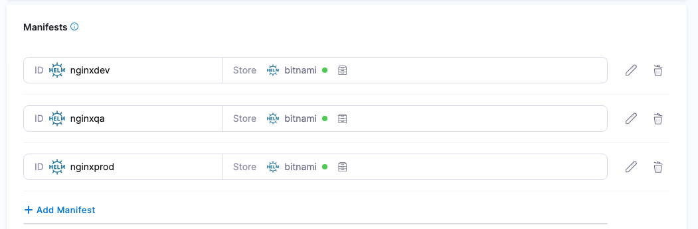
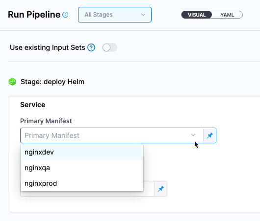

:::note

Currently, using multiple Helm Charts in a single Harness service is behind the feature flag `CDS_HELM_MULTIPLE_MANIFEST_SUPPORT_NG`. Contact [Harness Support](mailto:support@harness.io) to enable the feature.

:::

For [Kubernetes Helm](/docs/continuous-delivery/deploy-srv-diff-platforms/helm/helm-cd-quickstart) and [Native Helm](/docs/continuous-delivery/deploy-srv-diff-platforms/native-helm-quickstart) deployment types, you can add multiple Helm charts to a Harness service.

  

When you run a Harness pipeline that deploys the service, you can select one of the Helm charts to deploy.

  

By using multiple Helm charts, you can deploy the same artifact with different manifests at pipeline runtime.

### Video summary of using multiple manifests

<!-- Video:
https://www.loom.com/share/6647b697e3e7447a9626f38a64b98cb9?sid=e39261e6-a678-404a-af59-6d6b3fc5a7cb-->
<docvideo src="https://www.loom.com/share/6647b697e3e7447a9626f38a64b98cb9?sid=e39261e6-a678-404a-af59-6d6b3fc5a7cb" />

### Helm chart expressions

import HelmManifestExpressions from '/docs/continuous-delivery/shared/helm-manifest-expressions.md';

<HelmManifestExpressions name="helmexpressions" />