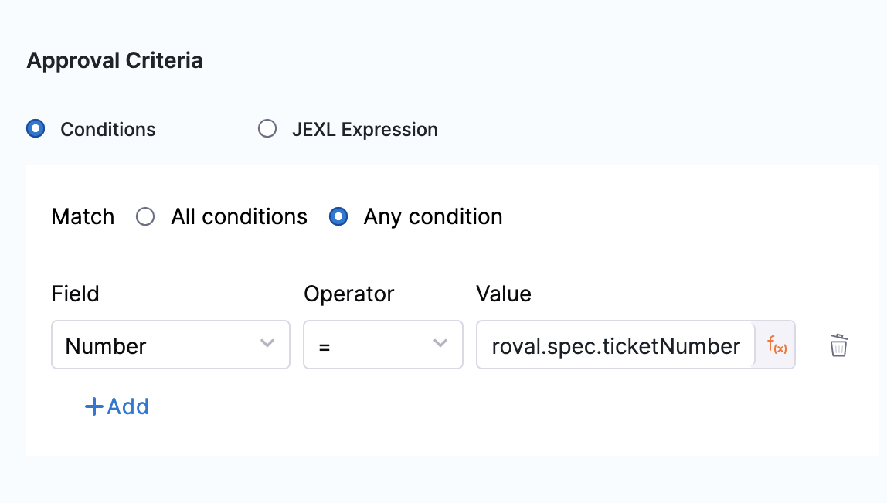

You can use ServiceNow tickets to approve or reject a Pipeline or stage at any point in its execution.

During deployment, a ServiceNow ticket's fields are evaluated according to the criteria you define, and its approval/rejection determines if the Pipeline or stage may proceed.

Approvals can be added as stages or in-between stage steps to prevent stage execution from proceeding without approval.

For example, in a [Kubernetes Blue Green Deployment](/docs/continuous-delivery/deploy-srv-diff-platforms/kubernetes/kubernetes-executions/create-a-kubernetes-blue-green-deployment/), you might want to add an approval step between the Stage Deployment step, where the new app version is deployed to the staging environment, and the Swap Primary with Stage step, where production traffic is routed to the pods for the new version.

### Before you begin

* [Connect to ServiceNow](/docs/platform/connectors/ticketing-systems/connect-to-service-now.md)

### Review: ServiceNow Approval Stages vs Steps

You can use ServiceNow Approvals in two ways:

* **ServiceNow Approval step:** you can add a ServiceNow Approval step to any Pipeline or Approval stage.
* **ServiceNow** **Approval stage:** the ServiceNow Approval stage.
  
  

### UTC Timezone Only

The ServiceNow API only allows date time and time values in the UTC timezone. Consequently, input for any datetime/time fields in Harness ServiceNow steps must be provided in UTC format irrespective of time zone settings in your ServiceNow account.

The timezone settings govern the display value of the settings not their actual value.

The display values in the Harness UI depend on ServiceNow timezone settings.

### Step: Add an Approval Step

In your Pipeline, click **Add Stage**.

Click **Approval**. The Stage settings appear.

In **Name**, enter a name for your Stage and select **ServiceNow** as approval type. Click **Setup Stage**. The pipeline appears.

In the pipeline, click **ServiceNow Approval.** The **ServiceNow Approval** settings appear.

In **Timeout**, enter how long you want Harness to try to complete the step before failing (and initiating the stage or step [Failure Strategy](/docs/platform/pipelines/failure-handling/define-a-failure-strategy-on-stages-and-steps.md)).

You can use `**w**` for week, `**d**` for day, `**h**` for hour, `**m**` for minutes, `**s**` for seconds and `**ms**` for milliseconds. For example, 1d for one day.

ServiceNow communication can take a few minutes. Do not use a brief timeout.

The maximum is 3w 3d 20h 30m. In **ServiceNow** **Connector,** create or select the [ServiceNow Connector](/docs/platform/connectors/ticketing-systems/connect-to-service-now.md) you want to use.

Select the ServiceNow **Ticket Type**. Use the same type as the ticket you created in the Workflow.

Enter the ServiceNow **Ticket Number**.

In **Retry Interval**, set how long the step should wait to fetch details again for calculating Approval or Rejection criteria.

### Step 2: Set Approval Criteria

The **Approval Criteria** in the step determines if the Pipeline or stage is approved or rejected. Define the approval criteria using the ServiceNow status items.

Whether the Pipeline/stage stops executing depends on the stage or step [Failure Strategy](/docs/platform/pipelines/failure-handling/define-a-failure-strategy-on-stages-and-steps.md).You can specify criteria using **Conditions** and/or **JEXL Expression**. If you use them in combination, they both must evaluate to `True` for the step to be successful.

In **Conditions**, you can use the ServiceNow ticket related fields to define approval criteria. Four supported operators are `=`, `!=`, `in`, and `not in`. 
For example, 
- The condition for the `State` field to be in `Resolved`, `Closed`, or `Cancelled` can be specified as:
   
- The condition for the `State` field to not be in either `New`, `In Progress`, or `On Hold` can be specified as:
   
- The condition for the `State` field to be in `Resolved`, `Closed`, or `Cancelled` without fixed `Ticket Type` can be specified as:
   

:::important

Multiple conditions with the same Jira field are not allowed. Such use cases can be solved using `in`, `not in` operators, or **JEXL Expression**.

:::   

In **JEXL Expression**, you can use [JEXL expressions](https://commons.apache.org/proper/commons-jexl/reference/syntax.html). You can use a JEXL expression if the field is set to **Fixed value** or **Expression**.

### Option: Set Rejection Criteria

In **Optional Configuration**, in **Rejection Criteria**, you can define criteria for rejecting the approval. Define the rejected criteria using the ServiceNow status items.

If you add rejection criteria, it is used in addition to the settings in **Approval Criteria**.

### Option: Approval Change Window

In **Approval Change Window**, use **Window Start** and **Window End** values to specify the window in which Harness will proceed with the deployment. Once this step is approved, Harness proceeds with deployment if the current time is within this window. The values that appear depend on the type selected in **Ticket Type**. 

The start and end times use the time zone set in the ServiceNow account selected in the ServiceNow Connector.

### Option: Advanced Settings

In **Advanced**, you can use the following options:

* [Delegate Selector](/docs/platform/delegates/manage-delegates/select-delegates-with-selectors.md)
* [Step Skip Condition Settings](/docs/platform/pipelines/step-skip-condition-settings.md)
* [Step Failure Strategy Settings](/docs/platform/pipelines/failure-handling/define-a-failure-strategy-on-stages-and-steps.md)

### Step 3: Apply and Test

Click **Apply Changes**. The ServiceNow approval step is added to the stage.

Run the Pipeline.

When the ServiceNow Approval step is reached, you can see its approval and rejection criteria:

### Review: Issue expressions

You can use `<+ticket>` to refer to the value in the **JEXL Expression** setting.

For example, `<+ticket.state.displayValue> == "New"` in the Approval Criteria, **JEXL Expression** checks to see if the status of the ticket is **New.**

`state` is a ticket field. You can use any ticket field.

### Manual Refresh During Execution

You can do a **manual status refresh** in the Pipeline Studio Execution view.

When the step is waiting for a response from ServiceNow, you can use the **Refresh** button to immediately fetch the **latest status of the approval ticket** instead of waiting for the polling interval.

:::note
Currently, this feature is behind the feature flag `CDS_REFRESH_IN_JIRA_SERVICENOW_APPROVALS`. Contact [Harness Support](mailto:support@harness.io) to enable the feature.
:::

Use the refresh option when:
- The approval condition in ServiceNow was updated after the step began execution.
- You need quicker response handling for fast-track approvals such as incident mitigations or emergency changes.

To use the refresh button:
- Execute a pipeline with a ServiceNow Approval step.
- In the Pipeline Studio Execution view, locate the approval step.
- If the step is in a waiting state, click the Refresh button.
- The step will re-evaluate the condition and proceed if the criteria are met.

### Output

Regardless of whether the step is approved or rejected, the **ServiceNow approval step** will provide outputs referencing the details of the step, such as:
- `ticketType`
- `ticketNumber`
- `Approval Criteria`
- `Rejection Criteria` 
- `Conditions`
- `hasApprovalCriteriaMet` 
- `hasRejectionCriteriaMet`

These outputs can be used as **output variables** and referenced in subsequent steps or stages.

Here are a few expression examples that can be used to fetch the output values:

- **ticketType**: `<+pipeline.stages.stage.spec.execution.steps.ServiceNowApproval_1.output.ticketType>`
- **ticketNumber**: `<+pipeline.stages.stage.spec.execution.steps.ServiceNowApproval_1.output.ticketNumber>`
- **approvalCriteria**: `<+pipeline.stages.stage.spec.execution.steps.ServiceNowApproval_1.output.approvalCriteria.type>`
- **rejectionCriteria**: `<+pipeline.stages.stage.spec.execution.steps.ServiceNowApproval_1.output.rejectionCriteria.type>`

<DocImage path={require('./static/snow-output-logs.png')} width="60%" height="60%" title="Click to view full size image" />

### Logs

You can also view detailed logs that describe why the validation **failed** or **succeeded** in the **ServiceNow approval step**.

:::note

Currently, viewing the detailed logs is behind the feature flag `CDS_SNOW_IMPROVE_CONSOLE_LOGS`. Contact [Harness Support](mailto:support@harness.io) to enable the feature.

:::
  
Here are examples of logs for different scenarios:

- **Log example for an approved step**:  
   The logs will show the approval criteria on which the step was approved and the evaluating condition.  
   

- **Log example for a rejected step**:  
   The logs will show the rejection criteria on which the step was rejected and the evaluating condition.  
   

- **Log example for using JEXL expression in approval criteria**:  
   The logs will show the JEXL expression on which the step will be approved or rejected and how the condition is evaluated.  
   

## Custom table support

For details, go to **Custom table support** in [Create ServiceNow tickets in CD stages](/docs/continuous-delivery/x-platform-cd-features/cd-steps/ticketing-systems/create-service-now-tickets-in-cd-stages#custom-table-support).

### Notes

- For more information about approval log limitations, go to [Deployment logs and limitations](/docs/continuous-delivery/manage-deployments/deployment-logs-and-limitations).

## See also

* [Using Manual Harness Approval Stages](/docs/platform/approvals/adding-harness-approval-stages.md)
* [Using Manual Harness Approval Steps in CD Stages](/docs/continuous-delivery/x-platform-cd-features/cd-steps/approvals/using-harness-approval-steps-in-cd-stages.md)

