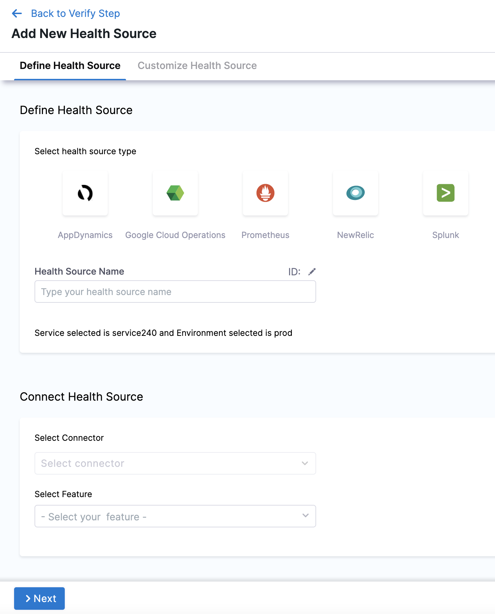
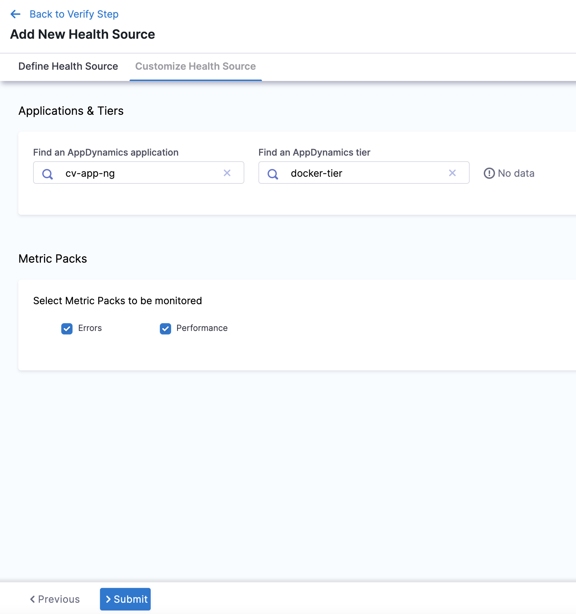

:::important
Harness supports AppDynamics metrics for applications. However, Harness doesn't support user experience metrics for browsers or mobile apps.
:::

import BeforeYouBegin from '/docs/continuous-delivery/verify/configure-cv/health-sources/static/before-you-begin.md';

<BeforeYouBegin />

## Add AppDynamics as a health source

This option is available only if you have configured the service and environment as fixed values.

A Health Source is basically a mapping of a Harness Service to the service in a deployment environment monitored by an APM or logging tool.

In **Health Sources**, click **Add**. The **Add New Health Source** settings appear.



1. In **Select health source type**, select AppDynamics.
2. In **Health Source Name**, enter a name for the Health Source.
3. Under **Connect Health Source**, click **Select Connector**.
4. In **Connector** settings, you can either choose an existing connector or click **New Connector.**
   
   

5. Click **Apply Selected**. The Connector is added to the Health Source.

   

6. In **Select Feature**, select the APM or logging tool component to use.
7. Click **Next** and **Customize Health Source** settings appear.

   The subsequent settings in **Customize Health Source** depend on the Health Source Type you selected. You can customize the metrics to map the Harness Service to the monitored environment. In **Applications & Tiers**, enter the following details:

8. In **Find an AppDynamics application** enter the name of the application and select an option from the list.
9.  In **Find an AppDynamics tier** enter a tier name from which you want usage metrics, code exceptions, error conditions, or exit calls.
10. In **Metric Packs** select the metrics you want Harness to monitor. **Errors** and **Performance** are selected by default.
11. In **Custom Metrics (optional)**, click **Add Metric** to add any other metric to be monitored.
12. In **Query Specifications and Mapping**, you can customize the query to get the desired output and map it to a Harness Service.
13. In **Map Metric(s) to Harness Services**, in **Metric Name** enter a name for the metric.
14. In **Group Name**, enter a group name of the metric.
15. In **AppDynamics Path**, you can either provide the complete metric path in **Specify a complete metric path**, or provide the base path of the AppDynamics metric in **Select the path from the AppD metric**.
16. In **Assign**, you can select the services for which you want to apply the metric. Available options are:
   * Continuous Verification
   * Health Score
   * SLI
17. In **Risk Category**, select a risk type from the list.
18. In **Deviation Compared to Baseline**, select one of the options based on the selected risk type.
19. Click **Submit**. The Health Source is displayed in the Verify step.


You can add one or more Health Sources for each APM or logging provider.

## Understanding OOTB metric paths

When you select a metric pack like **Errors** or **Performance**, Harness automatically monitors a set of out-of-the-box (OOTB) metrics from AppDynamics. Each OOTB metric is defined with specific metric paths that determine how Harness queries your AppDynamics controller.

### Metric path structure

Each OOTB metric includes two path configurations:

- **path**: The primary metric path used in Harness DSL queries to fetch data during continuous verification
- **validationPath**: An alternative path used for validation purposes, typically representing an aggregated view at the tier level

For example, the `calls_per_minute` metric is defined as follows:

```json
{
  "identifier": "calls_per_minute",
  "type": "THROUGHPUT",
  "path": "Business Transaction Performance|Business Transactions|__tier_name__|__metric_filter__|Calls per Minute",
  "validationPath": "Overall Application Performance|__tier_name__|Calls per Minute",
  "included": true,
  "name": "Calls per Minute"
}
```

The placeholders like `__tier_name__` and `__metric_filter__` are dynamically replaced with the actual values from your health source configuration during execution.

### Verifying metrics in AppDynamics

To verify the metric paths and validate the data being collected:

1. Navigate to the **Metric Browser** in your AppDynamics controller.
2. Browse through the metric hierarchy following either the `path` or `validationPath` structure.
3. For the `calls_per_minute` example above, you would navigate to:
   - `Business Transaction Performance` → `Business Transactions` → `[Your Tier Name]` → `[Transaction Name]` → `Calls per Minute`

Alternatively, you can verify which metrics Harness is querying by examining the execution logs:

1. Run a Verify step that uses your AppDynamics health source.
2. Check the execution logs for external API calls.
3. Review the API call details to see the exact metric paths being queried and the responses received from AppDynamics.

This approach helps you troubleshoot any data discrepancies and ensures that Harness is collecting the correct metrics from your AppDynamics environment.