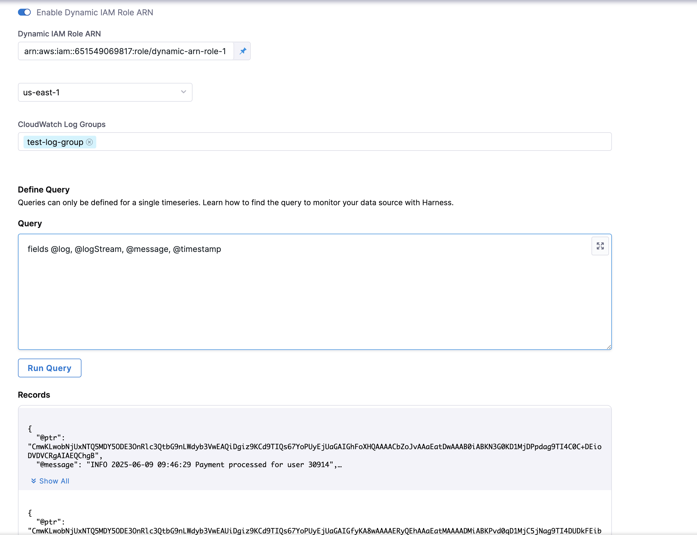

With this article, you'll learn how to leverage CloudWatch Logs as a health source. You'll gain a clear understanding of the necessary prerequisites, configuration steps, and the specific IAM permissions required for seamless integration, including advanced setups for cross-account access and IRSA.

:::note

- Feature Flag needs to be enabled - CDS_CV_CLOUDWATCH_LOGS_ENABLED
- Oldest supported delegate version - 858xx

:::

## General Instructions [for each CV config]

- Only one AWS region can be selected
- Multiple log groups can be selected
    - If you want to manually enter the log group name, don’t forget to press return/enter to register the input in the form

- Sample query to get started: `fields @log, @logStream, @message, @timestamp`

## IAM Permissions

### Describe Regions

The way AWS connector works is that it needs ec2:DescribeRegions permission mandatorily which could be added using the following permission policy:

```json
{
    "Version": "2012-10-17",
    "Statement": [
        {
            "Effect": "Allow",
            "Action": "ec2:DescribeRegions",
            "Resource": "*"
        }
    ]
}
```


### Logs

We are essentially using 3 CloudWatch Logs APIs in our implementation:

- Describe Log Groups
- Start Query
- Get Query Results

So, the credentials provided in the AWS Connector should have the permissions to execute the above 3 operations. Following are some sample policies for reference:

```json
{
    "Version": "2012-10-17",
    "Statement": [
        {
            "Effect": "Allow",
            "Action": [
                "logs:DescribeLogGroups"
            ],
            "Resource": "arn:aws:logs:*:<AWS_ACCOUNT>:*"
        }
    ]
}
```

:::note
Replace the first * with an AWS region to restrict the listing the log groups from that region only
:::

```json 
{
    "Version": "2012-10-17",
    "Statement": [
        {
            "Effect": "Allow",
            "Action": [
                "logs:StartQuery",
                "logs:GetQueryResults"
            ],
            "Resource": "arn:aws:logs:*:<AWS_ACCOUNT>:log-group:log-group-1:*"
        }
    ]
}
```

:::note
Replace the first * with an AWS region if you want to restrict it to that region only
:::


The permissions so far are enough if you want to setup a connector with AWS Access Keys credentials only.


## Advanced permissions [For Assume IAM role & IRSA]

If you are setting up the AWS connector with following:

- Assume IAM role on delegate
- IRSA (IAM Role on Service Account)

then, you would need some additional permissions along with the ones listed above.


### Assume IAM Role on Delegate with STS enabled

When used with:

- Enable cross-account access (STS Role)

The IAM Role ARN should have permissions to be assumed the delegate and the delegate should also have permission to assume this role ARN i.e a two way handshake is needed with permission policies and trust policies.

Suppose our IAM role ARN - IAM_Role_ARN_LOGS in Account A where CloudWatch logs are (do make sure this IAM role has the above cloudwatch logs and describe regions permissions), needs to be assumed by a delegate in Account B with  - IAM_Role_ARN_DELEGATE.

Now, the trust policy for IAM_Role_ARN_LOGS would look something like:

```json 
{
    "Version": "2012-10-17",
    "Statement": [
        {
            "Effect": "Allow",
            "Principal": {
                "AWS": [
                    "IAM_ROLE_ARN_DELEGATE"
                ]
            },
            "Action": "sts:AssumeRole"
        }
    ]
}
```


Also, the IAM_Role_ARN_DELEGATE should have a permission policy to actually be able to perform assume role operations and it could look like:

```json 
{
    "Version": "2012-10-17",
    "Statement": [
        {
            "Sid": "AssumeRole",
            "Effect": "Allow",
            "Action": "sts:AssumeRole",
            "Resource": "*"
        },
        {
            "Sid": "Statement1",
            "Effect": "Allow",
            "Action": [
                "sts:AssumeRoleWithWebIdentity"
            ],
            "Resource": "*"
        }
    ]
}
```


### IRSA

For IRSA, you should ensure that the correct service account is annotated and let’s say the role ARN for service account is - IAM_Role_ARN_SERVICE_ACCOUNT:

then the trust policy for the `IAM_Role_ARN_LOGS` would look like:

```json
{
    "Version": "2012-10-17",
    "Statement": [
        {
            "Effect": "Allow",
            "Principal": {
                "AWS": [
                    "IAM_ROLE_ARN_SERVICE_ACCOUNT"
                ]
            },
            "Action": "sts:AssumeRole"
        }
    ]
}


Also, the IAM_Role_ARN_SERVICE_ACCOUNT should also have the permission policy to be able to assume the  IAM_Role_ARN_LOGS (sample policy as follows):

{
    "Version": "2012-10-17",
    "Statement": [
        {
            "Effect": "Allow",
            "Action": "sts:AssumeRole",
            "Resource": "IAM_ROLE_ARN_LOGS"
        }
    ]
}
```


## Dynamic Role ARN

### Prerequisites

- Feature Flag needs to be enabled - `CDS_CV_CLOUDWATCH_DYNAMIC_ROLE_ARN_ENABLED`
- Oldest supported delegate version - `859xx`

### IAM Permissions

Its pretty much the same as the Assume IAM Role with STS as described above just for the new dynamic role ARN - Let’s call it `Dynamic_Role_ARN_1` i.e the dynamic role ARN should allow the delegate to assume it and delegate should be able to assume the dynamic role same as above.

#### Permission Policies

It should have the same CloudWatch Logs and Describe Regions permissions as above.

#### Trust Policies

Similar to Assume IAM role:

```json
{
    "Version": "2012-10-17",
    "Statement": [
        {
            "Effect": "Allow",
            "Principal": {
                "AWS": [
                    "IAM_ROLE_ARN_DELEGATE"
                ]
            },
            "Action": "sts:AssumeRole"
        }
    ]
}
```

### Setup

Just enable the Dynamic ARN toggle, enter the dynamic role arn in the new textbox that appears followed by the region and log-group.

