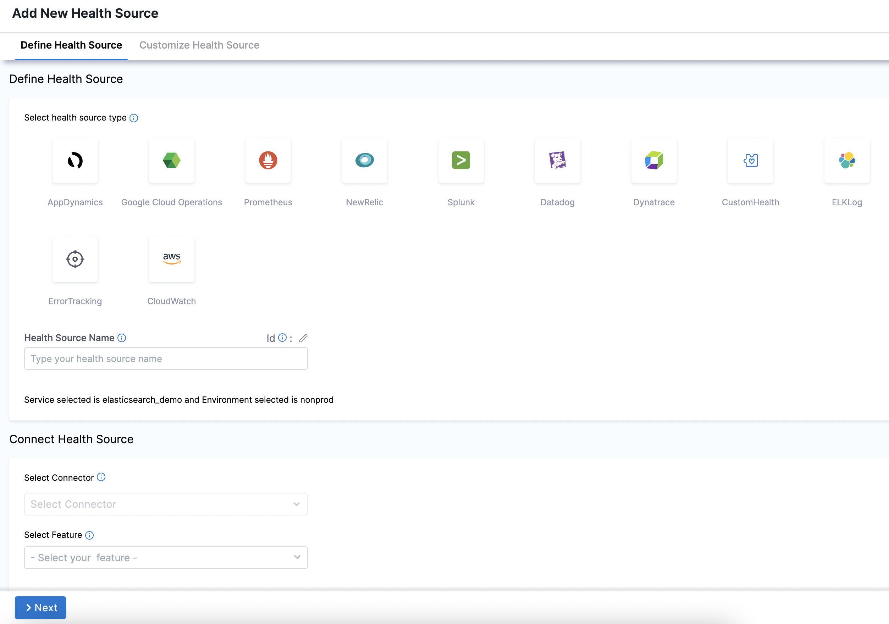
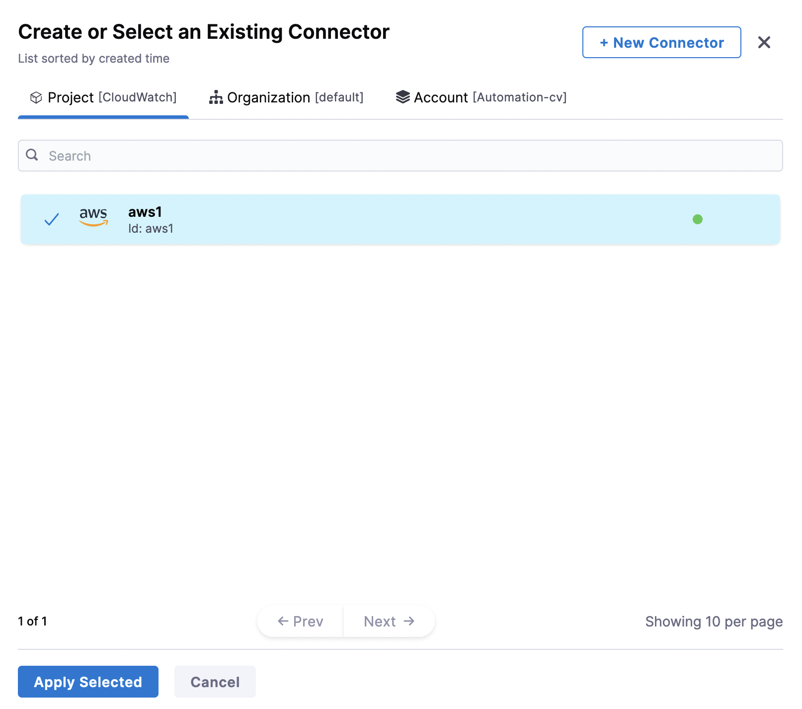
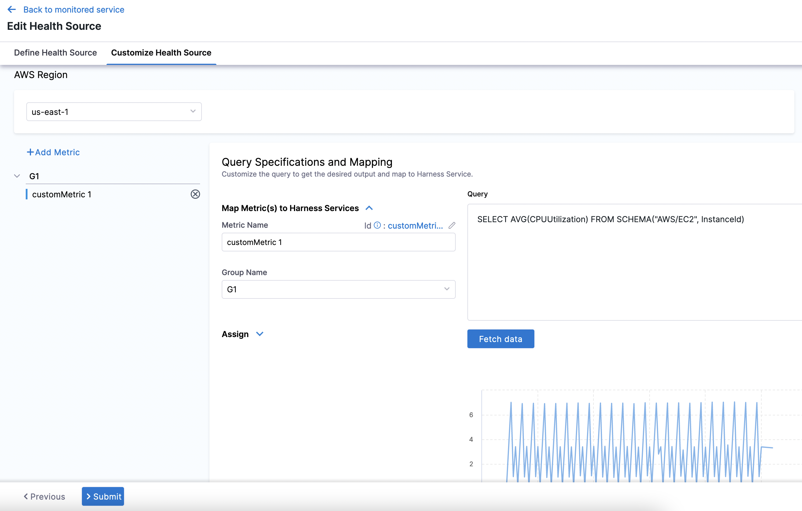
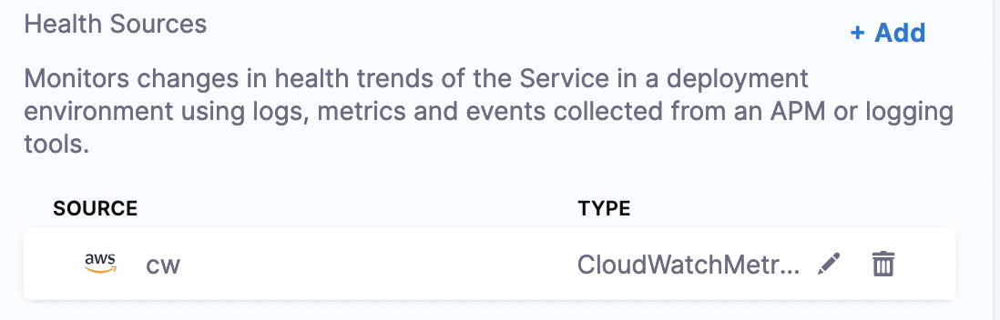

 
:::important
Harness supports only the Metrics Insight query language.
:::

import BeforeYouBegin from '/docs/continuous-delivery/verify/configure-cv/health-sources/static/before-you-begin.md';

<BeforeYouBegin />

## Add Cloudwatch as a health source

This option is available only if you have configured the service and environment as fixed values.

A Health Source is basically a mapping of a Harness Service to the service in a deployment environment monitored by an APM or logging tool.

1. In **Health Sources**, click **Add**. The **Add New Health Source** settings appear.
   
   

2. In **Select health source type**, select **CloudWatch**.
3. In **Health Source Name**, enter a name for the Health Source.
4. Under **Connect Health Source**, click **Select Connector**.
5. In **Connector** settings, you can either choose an existing connector or click **New Connector.**
   
   

6. Click **Apply Selected**. The Connector is added to the Health Source.
7. In **Select Feature**, select the CloudWatch feature to be used.
8. Click **Next**.  
The **Customize Health Source** settings appear.  
You can customize the metrics to map the Harness Service to the monitored environment in **Query Specifications and Mapping** settings.The subsequent settings in **Customize Health Source** depend on the Health Source Type you selected. Click **Map Queries to Harness Services** drop down.
1. Select the **AWS Region**.
2.  Click **Add Metric**.
3.  Enter a name for the query in **Name your Query**.
4.  Click **Select Query** to select a saved query. This is an optional step. You can also enter the query manually in the **Query** field.
5.  Click **Fetch Records** to retrieve the details. The results are displayed under **Records.**
   
   
   
6.  Once the records are fetched, click the plus icon in **Identify Service Instance** to select the path for service instance.
7.  Click **Submit**. The Health Source is displayed in the Verify step.
   
   

You can add one or more Health Sources for each APM or logging provider.
