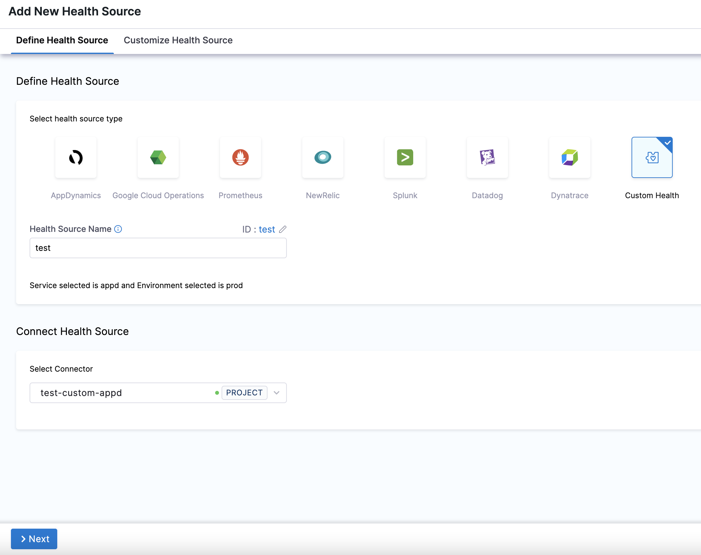
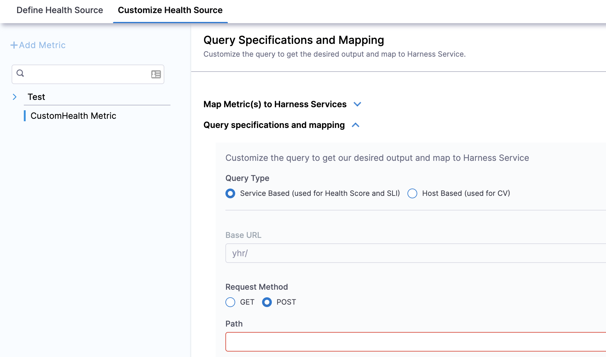
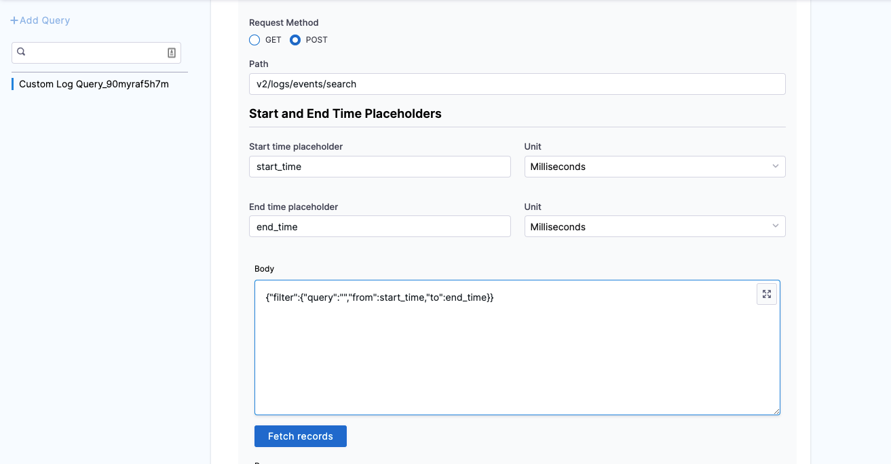
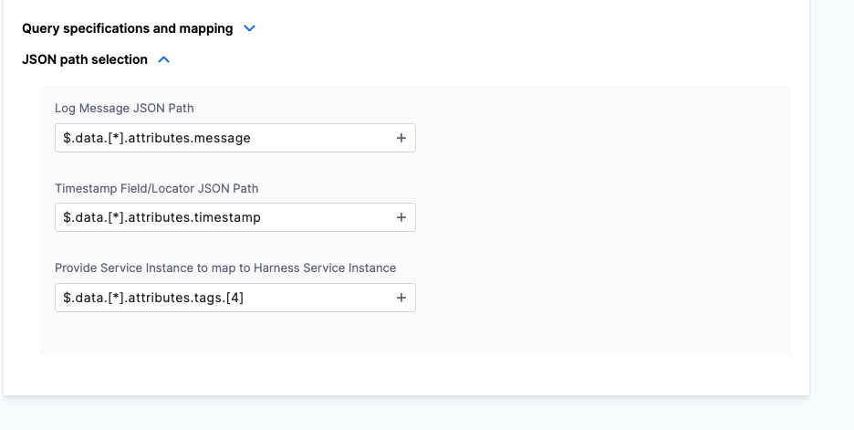

This topic covers how to add and configure Custom Health as a Health Source for the Verify step.

Harness offers support for all major APM vendors and log providers, but there are cases where a customized APM or log provider is needed. The Custom Health Source lets you customize APMs and log providers of your choice.

import BeforeYouBegin from '/docs/continuous-delivery/verify/configure-cv/health-sources/static/before-you-begin.md';

<BeforeYouBegin />

## Add a custom health source

This option is available only if you have configured the service and environment as fixed values.

A Health Source is basically a mapping of a Harness Service to the service in a deployment environment monitored by an APM or logging tool.

In **Health Sources**, click **Add**. The **Add New Health Source** settings appear.

1. In **Select health source type**, select **Custom Health**.
2. In **Health Source Name**, enter a name for the health source. For example, `Quickstart`.
3. In **Connect Health Source**, click **Select Connector**.
4. In **Connector** settings, you can either choose an existing connector or click **New Connector.**
5. Click **Apply Selected**. The Connector is added to the Health Source.
6. In **Select Feature**, select the feature to be monitored. You can either select **Custom Health Metrics** or **Custom Health Logs**.
7. Click **Next**.

### Option: Custom Health Metrics

1. If you select Custom Health Metrics, the **Customize Health Source** settings appear as:
   
   

2. Click **Map Metric(s) to Harness Services**.
3. In **Metric Name**, enter the name of the metric.
4. In **Group Name**, click **Add New** and enter a name for the metric group.
5. Click **Query specifications and mapping.**
6. In **Query Type** you can choose either **Service Based (used for Health Score and SLI)** or **Host Based (used for CV)**.
	If you select the query type as **Host Based** (Continuous Verification), the verification won't happen for SLI and Health Score (Service Based), and vice versa.
1. In **Request Method**, you can select **GET** or **POST**. If you select POST, you need to define the body format.
2. In **Path**, enter the complete path of the metric.
3. In **Start and End Time Placeholders**, enter the following:
	1. In **Start time placeholder**, enter the start time placeholder in the metric path.
	2. In **Unit**, select the preferred unit of measurement.
	3. In **End time placeholder**, enter the end time placeholder in the metric path.
	4. In **Unit**, select the preferred unit of measurement.
4. Click **Fetch Records** to retrieve records from the provided URL.
5. Click **Metric values and charts**.
6. In **Timestamp Format**, enter a static value in dd/mm/yy format.
7. Click **Assign**. Select the services for which you want to apply the metric. You can select **Health Score** or **SLI** or both options.
   The subsequent steps depend on the service you select in this step.1. In **Risk Category**, select a risk type. Available options for risk types are:
	* Errors
	* Infrastructure
	* Performance/Throughput
	* Performance/Other
	* Performance/Response Time
8. In **Deviation compared to Baseline**, select one of the options based on the selected risk type. Available options are:
	* **Higher value is higher risk** - Select this option if a high value of the selected risk type is a risk.
	* **Lower value is higher risk** - Select this option if lower value of the selected risk type is a risk.
9.  Click **Submit**.

### Option: Custom Health Logs

1. If you select Custom Health Logs, the **Customize Health Source** settings appear as:
   
   

2. Click **Query specifications and mapping**.
3. In **Query Name**, enter a name for the query. For example, `Custom Log Query`.
4. In **Request Method**, you can select **GET** or **POST**. If you select POST, you need to define the body format.
5. In **Path**, enter the complete path of the metric. For example,`v2/logs/events/search`.
6. In **Start and End Time Placeholders**, enter the following:
	1. In **Start time placeholder**, enter the start time placeholder in the metric path. For example, start\_time.
	2. In **Unit**, select the preferred unit of measurement. For example, Milliseconds.
	3. In **End time placeholder**, enter the end time placeholder in the metric path. For example, end\_time.
	4. In **Unit**, select the preferred unit of measurement. For example, Milliseconds.
7. In **Body**, enter the request body. For example,`{"filter":{"query":","from":start_time,"to":end_time}}`.
8. Click **Fetch Records** to retrieve records from the provided URL.
   
   

9.  Once the response is retrieved, click **JSON path selection**.
	5. In **Log Message JSON path**, click the plus icon to select the path to the log message from the data source. For example,`$.data.[*].attributes.message`.
	6. In **Timestamp Field/Locator JSON** Path, click the plus icon to select the path to the log message from the data source. For example,`$.data.[*].attributes.timestamp`.
	7. In **Provide Service Instance to map to Harness Service Instance**, click the plus icon to select the Service instance from the data source. For example,`$.data.[*].attributes.tags.[4]`.

	

10. Click **Submit**.