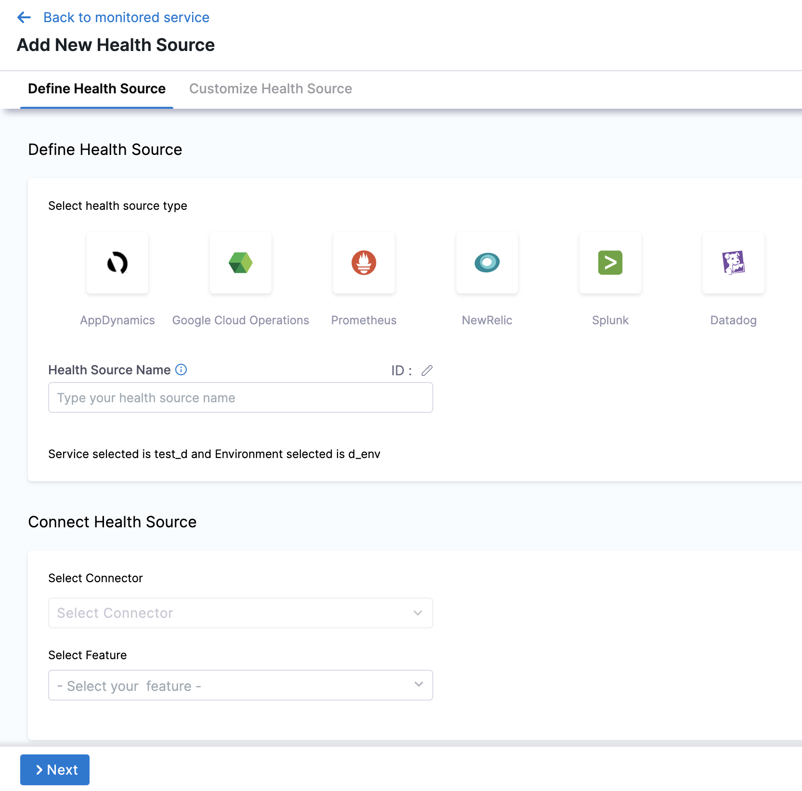
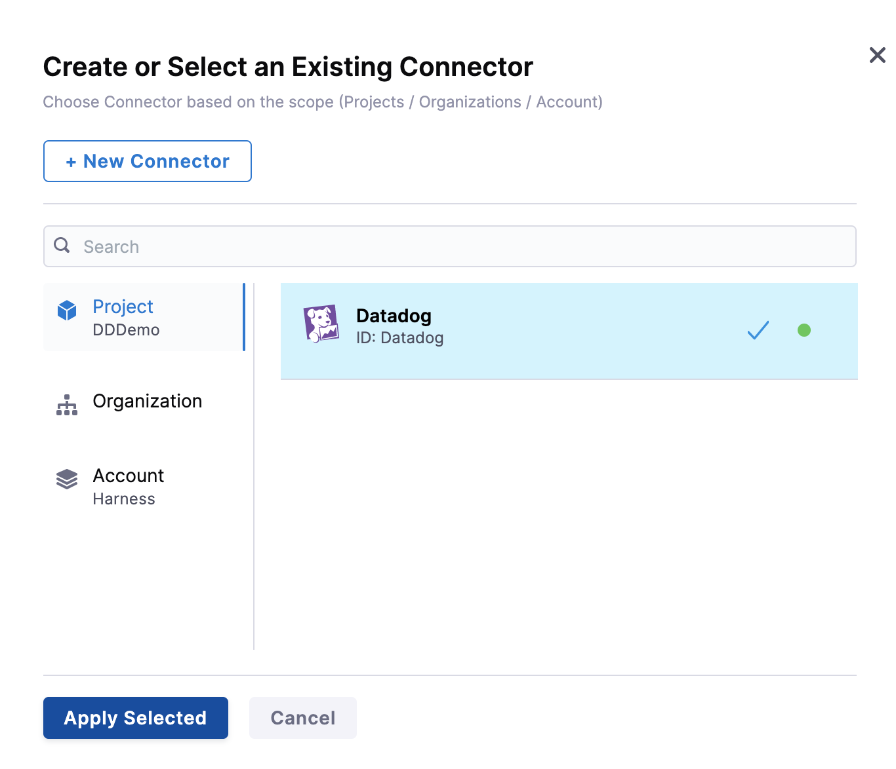
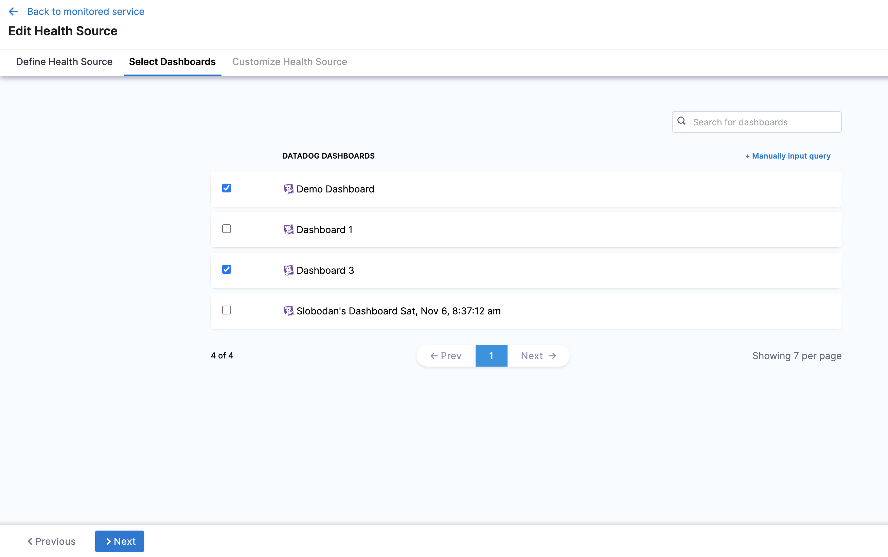
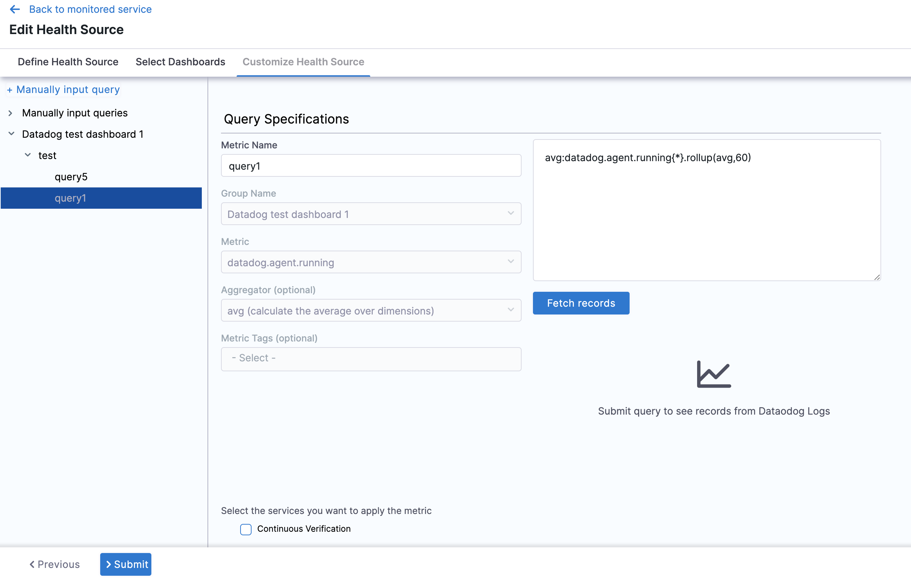
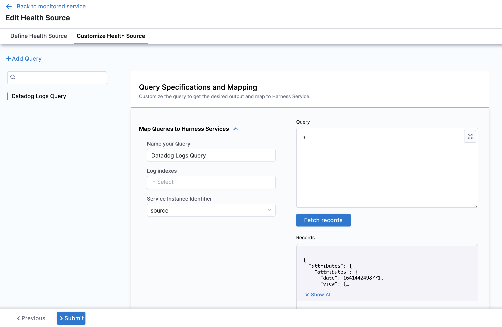

import BeforeYouBegin from '/docs/continuous-delivery/verify/configure-cv/health-sources/static/before-you-begin.md';

<BeforeYouBegin />

Also, [Add Datadog as a verification provider](/docs/platform/connectors/monitoring-and-logging-systems/connect-to-monitoring-and-logging-systems#add-datadog)

## Add Datadog as a health source

This option is available only if you have configured the service and environment as fixed values.

A Health Source is basically a mapping of a Harness Service to the service in a deployment environment monitored by an APM or logging tool.

In **Health Sources**, click **Add**. The **Add New Health Source** settings appear.



In **Select health source type**, select Datadog.

In **Health Source Name**, enter a name for the Health Source.

Under **Connect Health Source**, click **Select Connector**.

In **Connector** settings, you can either choose an existing connector or click **New Connector.**



Click **Apply Selected**. The Connector is added to the Health Source.

In **Select Feature**, select the Datadog feature to be used. You can choose **Cloud Metrics** or **Cloud Logs**.


Click **Next**.

The subsequent settings in **Customize Health Source** depend on the Health Source Type you selected. ### Option: Cloud Metrics

If you select **Cloud Metrics**, the **Select Dashboards** settings appear. It displays a list of Datadog dashboards.



Click the dashboards of your choice. If you don't have any preexisting dashboards or don't want to select the ones in the displayed result, click **Manually input query.**

Click **Next** and the **Customize Health Source** settings appear.

Select a query from the options displayed on the left side of setting panel. The specification of the selected query auto-populates in the fields under **Query Specifications**.



Click **Submit**. The Health Source is displayed in the Verify step.

### Configure Datadog formulas as Harness queries

In manual query mode, the Datadog metrics health source provides support for formulas.
These formulas follow a specific format: 

```Query a ; Query b ; Formula using a, b```

* Query a: "Query-with-a"
* Query b: "Query-with-a"
* The formula is "(a/b) * 100 - 5"

Let's consider an example to illustrate this:


```
kubernetes.cpu.usage{cluster-name:chi-play};kubernetes.memory.total{cluster-name:chi-play};(a/b) * 100 - 5
```

In the example above, 'a' and 'b' represent the respective queries:

* a = kubernetes.memory.usage\{cluster-name:chi-play}
* b = kubernetes.memory.total\{cluster-name:chi-play}

You can use multiple queries represented by alphabetical variables (example: a, b, c, and so on) in the final formula, but only one formula is allowed per query.

### Commonly used Datadog queries

#### Performance

- P90: `synthetics.http.response.time.distrib{availability_zone:*}, pod=~"harness-dummy-.*"}[5m])) by (le))`
- P50: `synthetics.http.response.time.distrib{availability_zone:*}`

#### API

- 5xx response: `sum:synthetics.http.response{status_code_class:5xx}.as_rate() , sum:synthetics.http.response{status_code:502}.as_rate()`
- 4xx response: `sum:synthetics.http.response{status_code_class:4xx}.as_rate() , sum:synthetics.http.response{status_code:401}.as_rate()`  

#### Infrastructure

- CPU: `per_minute(sum:container.cpu.usage{cluster_name:del-play-* cluster-location:us-*}) , system.cpu.num_cores{*} ; Final Value: a/b * 100`
- Memory: `per_minute(sum:container.cpu.usage{cluster_name:del-**, cluster-location:us-**})`   

### Option: Cloud Logs

Select Cloud Logs and click **Next.** The **Customize Health Source** settings appear.

You can customize the metrics to map the Harness Service to the monitored environment in **Query Specifications and Mapping** settings.

Click **Map Queries to Harness Services** dropdown.



Enter a name for the query in **Name your Query**.

In **Log Indexes**, select a log index from the list.

In **Service Instance Identifier**, select the drop-down and choose the path of the service instance. Any of the tags used in metric or log can be used as service instance identifier. It should correspond to instances that are running. The drop-down list contains all the tags returned by data through the API. For more information, go to [List tags by metric name](https://docs.datadoghq.com/api/latest/metrics/#list-tags-by-metric-name).

Click **Submit**. The Health Source is displayed in the Verify step.
