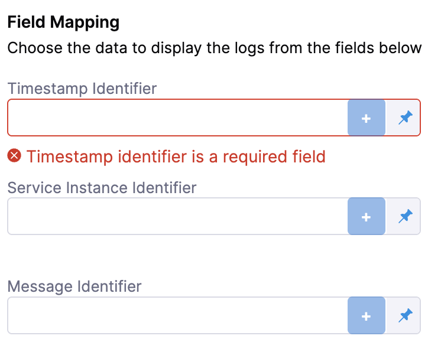

import Tabs from '@theme/Tabs';
import TabItem from '@theme/TabItem';
import RiskProfile from '/docs/continuous-delivery/verify/shared/risk-profile.md'

import BeforeYouBegin from '/docs/continuous-delivery/verify/configure-cv/health-sources/static/before-you-begin.md';

<BeforeYouBegin />

## Add Dynatrace as a health source

This option is available only if you have configured the service and environment as fixed values.

A Health Source is basically a mapping of a Harness Monitored Service to the Service in a deployment environment monitored by an APM or logging tool.

### Define Health Source

In **Health Sources**, click **Add**. The **Add New Health Source** settings appear.

1. In **Select health source type**, select **Dynatrace**.
2. In **Health Source Name**, enter a name for the Health Source. For example Quickstart.
3. Under **Connect Health Source**, click **Select Connector**.
4. In **Connector** settings, you can either choose an existing connector or click **New Connector** to create a new **Connector.**
   
   

5. After selecting the connector, click **Apply Selected**. The Connector is added to the Health Source.
6. In **Select Feature** you can either choose **Full Stack Observability: APM** or **Dynatrace Grail Logs**. Your choice here will change which configuration options you see next. 

:::info

Dynatrace Grail Logs are behind the feature flag `CDS_CV_DYNATRACE_GRAIL_LOGS_ENABLED`. Contact [Harness Support](mailto:support@harness.io) to enable it.

:::

### Configuration

Depending on your feature choice, do the following configuration steps.

<Tabs>
<TabItem value="Full Stack Observability: APM">

7. Click **Next**. The **Configuration** settings appear.
   
   The subsequent steps in **Customize Health Source** depend on the Health Source type you selected.
   
   
   	
8. In **Find a Dynatrace service**, enter the name of the desired Dynatrace service.
9.  In **Select Metric Packs to be monitored,** you can select **Infrastructure** or **Performance** or both.
10. Click **Add Metric** if you want to add any specific metric to be monitored (optional) or simply click **Submit.**
11. If you click Add Metric, click **Map Metric(s) to Harness Services**.
12. In **Metric Name**, enter the name of the metric.
13. In **Group Name**, enter the group name of the metric.
14. Click **Query Specifications and mapping**. To build your query, do the following: 
    1. In **Metric**, choose the desired metric from the list.
    2. In **Select Metric Filter**, choose the desired entity from the list. This will filter your metrics using [entitySelectors](https://docs.dynatrace.com/docs/discover-dynatrace/references/dynatrace-api/environment-api/entity-v2/entity-selector).

    :::note

    Selecting metric filters is behind the feature flag `CDS_CV_DYNATRACE_CANARY_ENABLED`. Contact [Harness Support](mailto:support@harness.io) to enable this feature.

    :::

    3. Click **Fetch Records** to retrieve data for the provided query.
15. In **Assign**, choose the services for which you want to apply the metric.
    
    If you select **Continuous Verification** or **Service Health**, you will need to configure a risk profile. Expand the following block to learn more. 

   

   
<b>Risk Profile settings</b>

   
   <RiskProfile />

For Dynatrace, the only possible values of the SII are your entity selectors. 
    :::note

    The ability to set a SII is behind the feature flag `CDS_CV_DYNATRACE_CANARY_ENABLED`. Contact [Harness Support](mailto:support@harness.io) to enable this feature.
    
    :::
   

16. Click **Submit**. The Health Source is displayed in the Verify step.

You can add one or more Health Sources for each APM or logging provider.

</TabItem>
<TabItem value="Dynatrace Grail Logs">

:::info

This feature is behind the feature flag `CDS_CV_DYNATRACE_GRAIL_LOGS_ENABLED`. Contact [Harness Support](mailto:support@harness.io) to enable it.

:::

7. Click **Next**. The **Configuration** settings will appear. You should see one button, **+ Add Query**.
8. Click **+ Add Query**.
9. Choose a **Query name** and click **Submit**.
10. Under **Define Query**, enter your [query](https://docs.dynatrace.com/docs/discover-dynatrace/references/dynatrace-query-language). This query can also be a runtime input or expression.
11. After writing your fixed input query, click **Validate** to ensure your query is valid.
12. Then click **Run Query**. The query must be validated first from the previous step. 

    

13. Next, complete the field mapping for the **Timestamp Identifier**, **Service Instance Identifier**, and **Message Identifier**. To do so, hit the `+` button icon and select the relevant field from the log that appears. 

    

14. Click **Submit**. The health source is displayed in the verify step!

</TabItem>
</Tabs>

### Sample Dynatrace queries

#### Latency

- Latency trend over time: `timeseries(avg(response.time))`
- Latency distribution: `histogram(response.time)`  
- Latency by application version: `avg(response.time) by application.version`  
- Latency by geographical region: `avg(response.time) by geoip.country_name`
- Latency spike detection: `spike(response.time)`
- Latency comparison between environments: `avg(response.time) by environment`  
- Latency by HTTP method: `avg(response.time) by http.method`  
- Latency by service: `avg(response.time) by service.name`  
- Latency anomaly detection: `anomaly(response.time)`
- Latency percentiles: `percentile(response.time, 50)`, `percentile(response.time, 90)`, `percentile(response.time, 99)`

#### Traffic

- Requests per minute trend: `timeseries(count(request) / 60)`
- Requests by HTTP status code: `count(request) by http.status_code`
- Requests by user agent: `count(request) by useragent.name`
- Requests by endpoint and HTTP method: `count(request) by endpoint, http.method`
- Requests by response time range: `histogram(response.time)`
- Requests by geo-location: `count(request) by geoip.country_name`
- Slow endpoint detection: `top(avg(response.time), 10, endpoint)`
- Requests by hostname: `count(request) by hostname`
- Requests by service: `count(request) by service.name`
- Requests by HTTP version: `count(request) by http.version` 

#### Errors

- Error rate trend over time: `timeseries(count(error) / count(request) * 100)`
- Top error types: `count(error) by errorType`
- Error rate by geographical region: `count(error) by geoip.country_name`
- Error rate by application version: `count(error) by application.version`
- Error rate by HTTP status code: `count(error) by http.status_code`
- Error rate by service: `count(error) by service.name`
- Error rate by user agent: `count(error) by useragent.name`
- Error spike detection: `spike(count(error))`
- Error anomaly detection: `anomaly(count(error))`

#### Saturation

- CPU utilization across hosts: `avg(cpu.usage) by host`
- Memory utilization across hosts: `avg(memory.usage) by host`
- Disk utilization across hosts: `avg(disk.usage) by host`
- Network utilization across hosts: `avg(network.usage) by host`
- CPU utilization by geographical region: `avg(cpu.usage) by geoip.country_name`
- Memory utilization by geographical region: `avg(memory.usage) by geoip.country_name`
- Disk utilization by geographical region: `avg(disk.usage) by geoip.country_name`
- Network utilization by geographical region: `avg(network.usage) by geoip.country_name`

