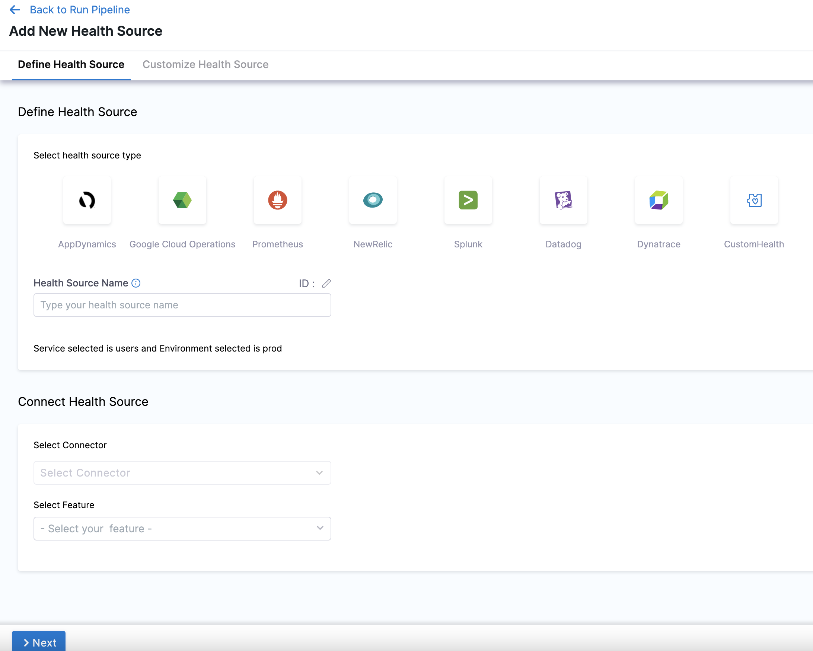
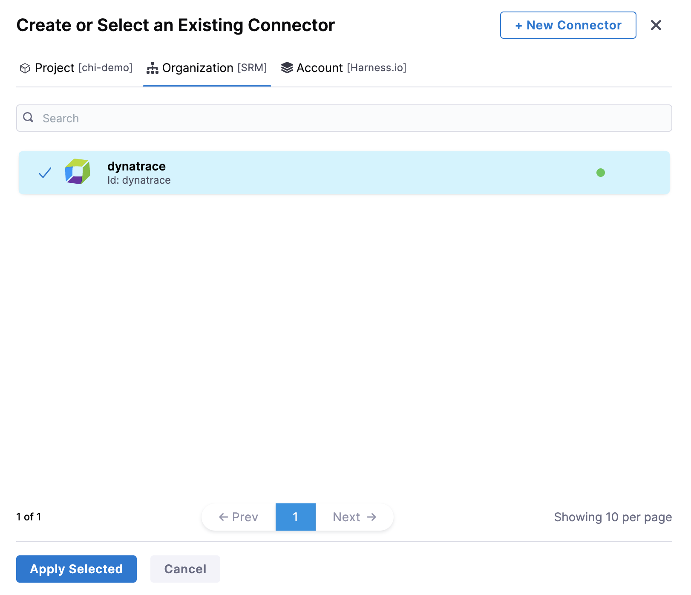
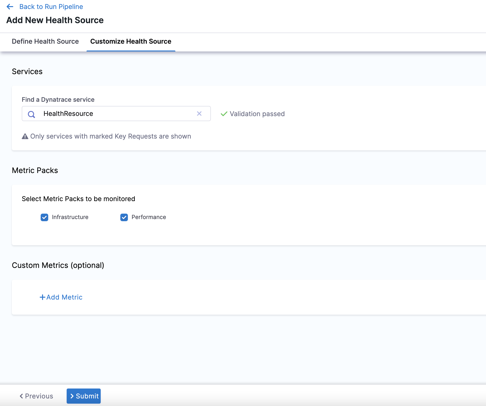
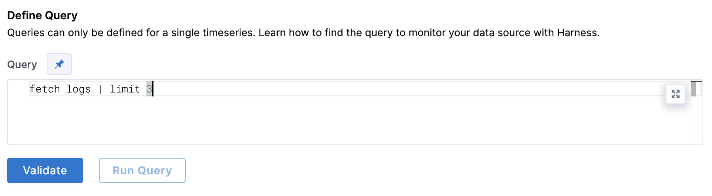
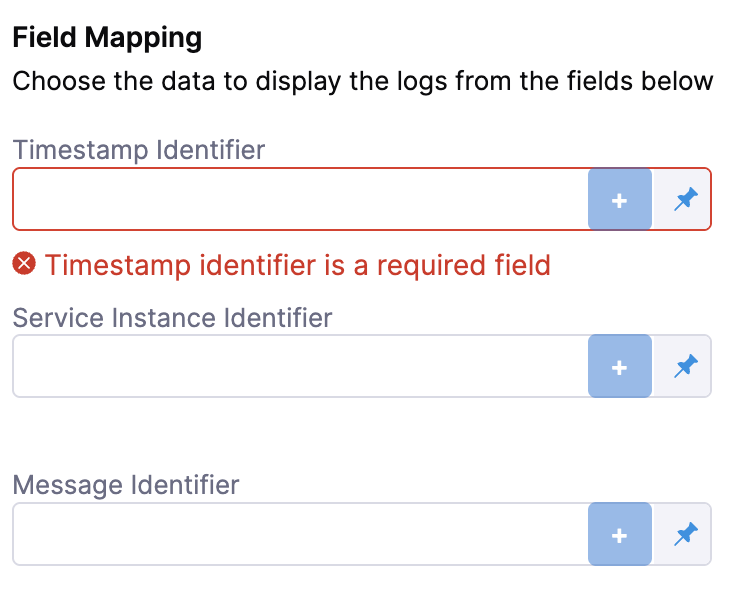
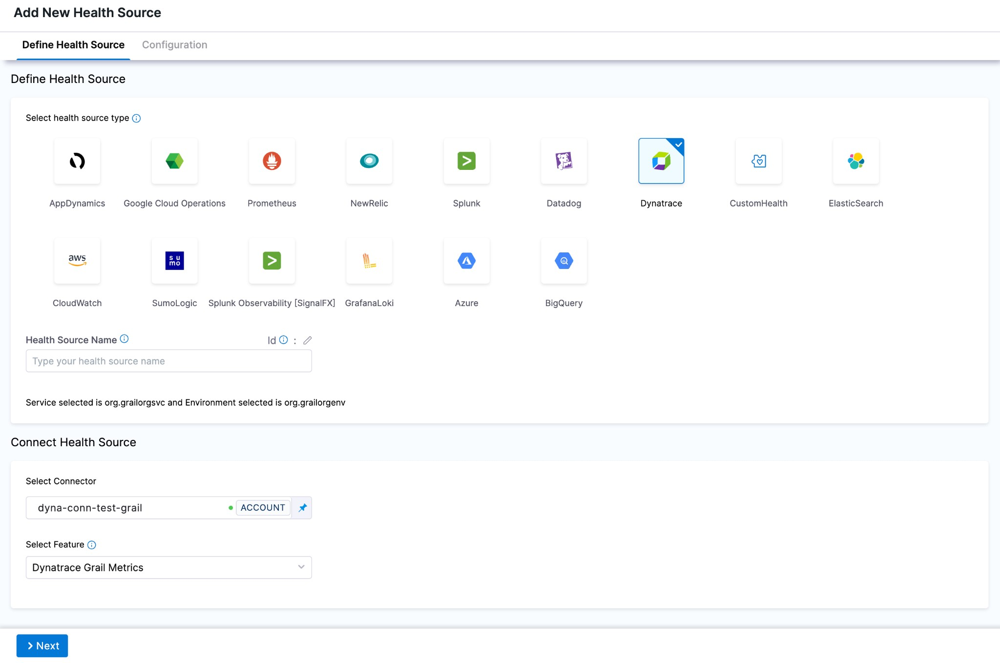
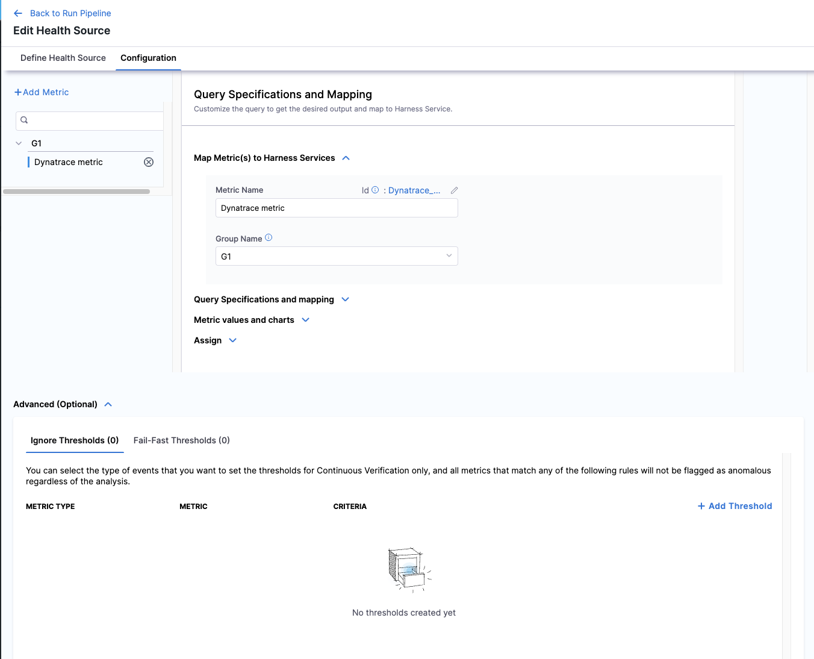
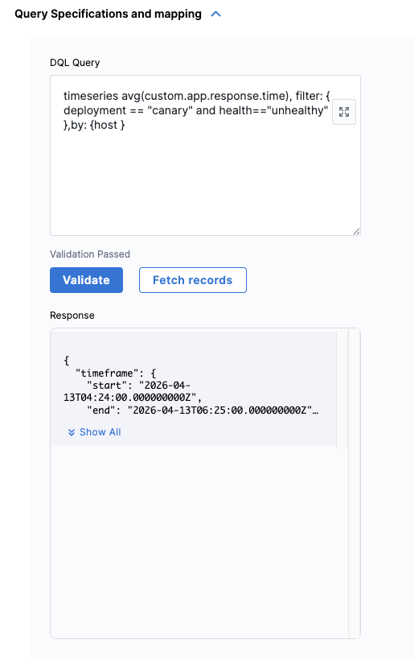
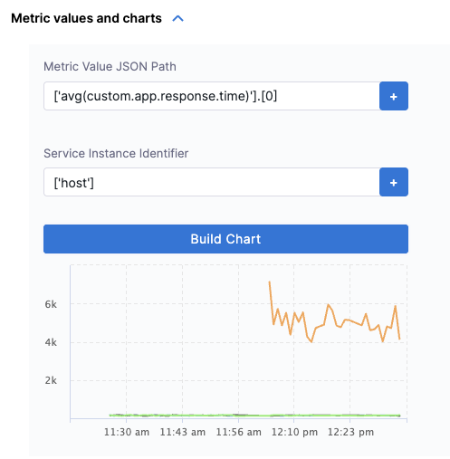
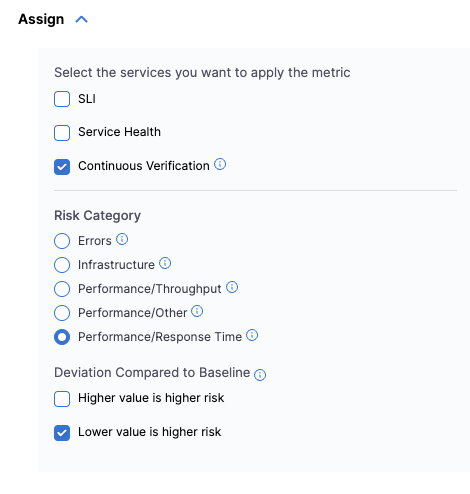

import Tabs from '@theme/Tabs';
import TabItem from '@theme/TabItem';
import RiskProfile from '/docs/continuous-delivery/verify/shared/risk-profile.md'

import BeforeYouBegin from '/docs/continuous-delivery/verify/configure-cv/health-sources/static/before-you-begin.md';

<BeforeYouBegin />

## Add Dynatrace as a health source

This option is available only if you have configured the service and environment as fixed values.

A Health Source is basically a mapping of a Harness Monitored Service to the Service in a deployment environment monitored by an APM or logging tool.

### Define Health Source

In **Health Sources**, click **Add**. The **Add New Health Source** settings appear.



1. In **Select health source type**, select **Dynatrace**.
2. In **Health Source Name**, enter a name for the Health Source. For example Quickstart.
3. Under **Connect Health Source**, click **Select Connector**.
4. In **Connector** settings, you can choose an existing connector or click **New Connector** to create a new **Connector.**
   
   

   :::info note
   When creating a new Dynatrace connector:
   - **Without the feature flag enabled**: You will configure a standard Dynatrace connector with API URL + API Token (for Full Stack Observability metrics).
   - **With the feature flag enabled**: You can choose between **Dynatrace Classic** (for Full Stack Observability metrics) or **Dynatrace Grail** (for Grail Logs). Each connector supports only one type.
   
   For more information on configuring Dynatrace connectors, go to [Add Dynatrace connector](/docs/platform/connectors/monitoring-and-logging-systems/connect-to-monitoring-and-logging-systems/#add-dynatrace).
   :::

5. After selecting the connector, click **Apply Selected**. The Connector is added to the Health Source.
6. In **Select Feature**, choose one of the following options. Your choice determines which configuration options appear next.

   :::info note
   - **Full Stack Observability: APM** requires a Dynatrace Classic connector (API URL + API Token).
   - **Dynatrace Grail Logs** requires a Dynatrace Grail connector (Platform URL + Platform Token) and the feature flag `CDS_CV_DYNATRACE_GRAIL_LOGS_ENABLED`. This feature flag requires a minimum delegate version of `869xx`. Contact [Harness Support](mailto:support@harness.io) to enable it.
   - **Dynatrace Grail Metrics** requires a Dynatrace Grail connector (Platform URL + Platform Token), the feature flag `CDS_CV_DYNATRACE_GRAIL_METRICS_ENABLED`, and a minimum delegate version of `88900`. Contact [Harness Support](mailto:support@harness.io) to enable it.
   :::

### Configuration

Depending on your feature choice, do the following configuration steps.

<Tabs>
<TabItem value="Full Stack Observability: APM">

7. Click **Next**. The **Configuration** settings appear.
      
   

8. Next, you will have the choice between using **Metric Packs** or **Custom Metrics**. 

    Choose **Metric Packs** if you want to use one of the predefined **Infrastructure** or **Performance** packs. Choose **Custom Metrics** to make your own metrics against your data.

    You may choose both options.

<Tabs>
<TabItem value="Metric Packs">

8. In **Find a Dynatrace service**, enter the name of the desired Dynatrace service. This Dynatrace service must be marked as a [key request](https://docs.dynatrace.com/docs/observe/applications-and-microservices/services/analysis/monitor-key-requests) in order to appear in this dropdown menu.
9. In **Select Metric Packs to be monitored**, you can select **Infrastructure**, **Performance**, or both.

</TabItem>
<TabItem value="Custom Metrics">

8. Click **Add Metric** if you want to add any specific metric to be monitored (optional) or simply click **Submit.**
9. If you click Add Metric, click **Map Metric(s) to Harness Services**.
10. In **Metric Name**, enter the name of the metric.
11. In **Group Name**, enter the group name of the metric.
12. Click **Query Specifications and mapping**. To build your query, do the following: 
    1. In **Metric**, choose the desired metric from the list.
    2. In **Select Metric Filter**, choose the desired entity from the list. This will filter your metrics using [entitySelectors](https://docs.dynatrace.com/docs/discover-dynatrace/references/dynatrace-api/environment-api/entity-v2/entity-selector).

    :::note

    Selecting metric filters is behind the feature flag `CDS_CV_DYNATRACE_CANARY_ENABLED`. Contact [Harness Support](mailto:support@harness.io) to enable this feature.

    :::

    3. Click **Fetch Records** to retrieve data for the provided query.
13. In **Assign**, choose the services for which you want to apply the metric.
    
    If you select **Continuous Verification** or **Service Health**, you will need to configure a risk profile. Expand the following block to learn more. 

   <details>
   <summary><b>Risk Profile settings</b></summary>
   
   <RiskProfile />

For Dynatrace, the only possible values of the SII are your entity selectors. 
    :::note

    The ability to set a SII is behind the feature flag `CDS_CV_DYNATRACE_CANARY_ENABLED`. Contact [Harness Support](mailto:support@harness.io) to enable this feature.
    
    :::
   </details>

</TabItem>
</Tabs>

Finally, Click **Submit**. The Health Source is displayed in the Verify step.

You can add one or more Health Sources for each APM or logging provider.

</TabItem>
<TabItem value="Dynatrace Grail Logs">

:::info

This feature is behind the feature flag `CDS_CV_DYNATRACE_GRAIL_LOGS_ENABLED`. This feature requires a minimum delegate version of `869xx`.

Contact [Harness Support](mailto:support@harness.io) to enable the feature flag.

:::

7. Click **Next**. The **Configuration** settings will appear. You should see one button, **+ Add Query**.
8. Click **+ Add Query**.
9. Choose a **Query name** and click **Submit**.
10. Under **Define Query**, enter your [query](https://docs.dynatrace.com/docs/discover-dynatrace/references/dynatrace-query-language). This query can also be a runtime input or expression.
11. After writing your fixed input query, click **Validate** to ensure your query is valid.
12. Then click **Run Query**. The query must be validated first from the previous step. 

    

13. Next, complete the field mapping for the **Timestamp Identifier**, **Service Instance Identifier**, and **Message Identifier**. To do so, hit the `+` button icon and select the relevant field from the log that appears. 

    

14. Click **Submit**. The health source is displayed in the verify step!

</TabItem>
<TabItem value="Dynatrace Grail Metrics">

:::info

This feature is behind the feature flag `CDS_CV_DYNATRACE_GRAIL_METRICS_ENABLED` and requires a minimum delegate version of `88900`.

Contact [Harness Support](mailto:support@harness.io) to enable the feature flag.

:::

Dynatrace Grail Metrics uses [Dynatrace Query Language (DQL)](https://docs.dynatrace.com/docs/discover-dynatrace/references/dynatrace-query-language) to query timeseries metric data from the Dynatrace Grail data lakehouse. You write a `timeseries` DQL query, validate it, fetch sample records, and then map the metric value column and service instance dimension to Harness for continuous verification and live monitoring.

<div style={{textAlign: 'center'}}>



</div>

#### Map metric to Harness services

7. Click **Next**. The **Configuration** tab opens. Click **+ Add Metric**.
8. In **Metric Name**, enter a name for the metric.
9. In **Group Name**, select an existing group or type a new one to create it.

    <div style={{textAlign: 'center'}}>

    

    </div>

#### Write and validate the query

10. Expand **Query Specifications and mapping** and enter your DQL `timeseries` query in the **DQL Query** field. The query must start with the `timeseries` command.

    ```dql
    timeseries avg(custom.app.response.time), filter: {deployment == "canary" and health=="unhealthy"}, by: {host}
    ```

    :::tip
    The `by:` clause splits results per dimension (for example, `by: {host}`). Include it when you need per-instance data for continuous verification. You can omit it for aggregate SLI queries, but note that a **Service Instance Identifier** is required when **Continuous Verification** is enabled.
    :::

11. Click **Validate**. When the query is syntactically correct, a **Validation Passed** confirmation appears below the query field.
12. Click **Fetch Records**. Harness runs the query against your Dynatrace environment and shows the raw JSON response inline.

    <div style={{textAlign: 'center'}}>

    

    </div>

#### Configure metric values and charts

13. Expand **Metric values and charts**. Harness auto-populates the fields based on the sample response. Review and confirm the following:

    - **Metric Value JSON Path** — the JSONPath to the metric values array in the response (for example, `['avg(custom.app.response.time)'].[0]`).
    - **Service Instance Identifier** — the JSONPath to the dimension that identifies each service instance (for example, `['host']`). Required when **Continuous Verification** is enabled.

14. Click **Build Chart** to preview the timeseries chart from your live data. Verify the chart renders correctly before proceeding.

    <div style={{textAlign: 'center'}}>

    

    </div>

    :::info
    DQL `timeseries` responses return metric values as arrays where each element corresponds to one time slot. Harness reconstructs per-point timestamps using `timeframe.start` and `interval` from the response. Because `interval` is in nanoseconds, Harness converts it before applying the formula:

    `timestamp[i] = timeframe.start + (i × (interval / 1,000,000))`
    :::

#### Assign and configure risk profile

15. Expand **Assign** and select which services this metric applies to:

    - **SLI** — uses the metric to track SLO compliance.
    - **Service Health** — monitors the metric continuously outside of deployments.
    - **Continuous Verification** — gates deployments based on this metric.

    If you select **Continuous Verification** or **Service Health**, configure the **Risk Category** and **Deviation Compared to Baseline**:

    - **Risk Category** — select one of **Errors**, **Infrastructure**, **Performance/Throughput**, **Performance/Other**, or **Performance/Response Time**.
    - **Deviation Compared to Baseline** — select **Higher value is higher risk**, **Lower value is higher risk**, or both, depending on what the metric measures.

    <div style={{textAlign: 'center'}}>

    

    </div>

#### Configure advanced thresholds (optional)

16. Expand **Advanced (Optional)** to configure metric thresholds. There are two threshold types:

    - **Ignore Thresholds** — metrics matching these rules are excluded from anomaly flagging during continuous verification.
    - **Fail-Fast Thresholds** — metrics matching these rules immediately fail the verification step.

    Click **+ Add Threshold** to define rules by metric type, metric name, and criteria.

17. Click **Submit**. The health source is displayed in the verify step.


<details>
<summary><b>Sample DQL timeseries queries</b></summary>

The following queries illustrate common patterns for use with the Dynatrace Grail Metrics health source.

**CPU usage grouped by host:**

```dql
timeseries usage=avg(dt.host.cpu.usage), by:{dt.entity.host}
```

**Service response time at the 90th percentile:**

```dql
timeseries p90=percentile(dt.service.request.response_time, 90),
    filter:{startsWith(endpoint.name, "/api/accounts")}
```

**Failure rate per second:**

```dql
timeseries sum(dt.service.request.failure_count, rate:1s),
    filter:{startsWith(endpoint.name, "/api/accounts")}
```

**Multiple disk metrics in one query:**

```dql
timeseries {
    bytes_read=sum(dt.host.disk.bytes_read),
    bytes_written=sum(dt.host.disk.bytes_written)
}, by:{dt.entity.host}
```

**Week-over-week availability comparison:**

```dql
timeseries avail=avg(dt.host.disk.avail), by:{dt.entity.host}, from:-24h
| append [
    timeseries avail_7d=avg(dt.host.disk.avail), by:{dt.entity.host}, shift:-7d
]
```

For the full DQL `timeseries` reference, see the [Dynatrace DQL timeseries documentation](https://docs.dynatrace.com/docs/discover-dynatrace/references/dynatrace-query-language/commands/data-retrieval/timeseries).

</details>

</TabItem>
</Tabs>

---

### Sample Dynatrace queries

#### Latency

- Latency trend over time: `timeseries(avg(response.time))`
- Latency distribution: `histogram(response.time)`  
- Latency by application version: `avg(response.time) by application.version`  
- Latency by geographical region: `avg(response.time) by geoip.country_name`
- Latency spike detection: `spike(response.time)`
- Latency comparison between environments: `avg(response.time) by environment`  
- Latency by HTTP method: `avg(response.time) by http.method`  
- Latency by service: `avg(response.time) by service.name`  
- Latency anomaly detection: `anomaly(response.time)`
- Latency percentiles: `percentile(response.time, 50)`, `percentile(response.time, 90)`, `percentile(response.time, 99)`

#### Traffic

- Requests per minute trend: `timeseries(count(request) / 60)`
- Requests by HTTP status code: `count(request) by http.status_code`
- Requests by user agent: `count(request) by useragent.name`
- Requests by endpoint and HTTP method: `count(request) by endpoint, http.method`
- Requests by response time range: `histogram(response.time)`
- Requests by geo-location: `count(request) by geoip.country_name`
- Slow endpoint detection: `top(avg(response.time), 10, endpoint)`
- Requests by hostname: `count(request) by hostname`
- Requests by service: `count(request) by service.name`
- Requests by HTTP version: `count(request) by http.version` 

#### Errors

- Error rate trend over time: `timeseries(count(error) / count(request) * 100)`
- Top error types: `count(error) by errorType`
- Error rate by geographical region: `count(error) by geoip.country_name`
- Error rate by application version: `count(error) by application.version`
- Error rate by HTTP status code: `count(error) by http.status_code`
- Error rate by service: `count(error) by service.name`
- Error rate by user agent: `count(error) by useragent.name`
- Error spike detection: `spike(count(error))`
- Error anomaly detection: `anomaly(count(error))`

#### Saturation

- CPU utilization across hosts: `avg(cpu.usage) by host`
- Memory utilization across hosts: `avg(memory.usage) by host`
- Disk utilization across hosts: `avg(disk.usage) by host`
- Network utilization across hosts: `avg(network.usage) by host`
- CPU utilization by geographical region: `avg(cpu.usage) by geoip.country_name`
- Memory utilization by geographical region: `avg(memory.usage) by geoip.country_name`
- Disk utilization by geographical region: `avg(disk.usage) by geoip.country_name`
- Network utilization by geographical region: `avg(network.usage) by geoip.country_name`

