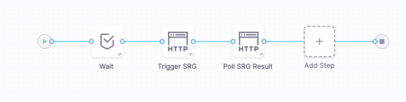
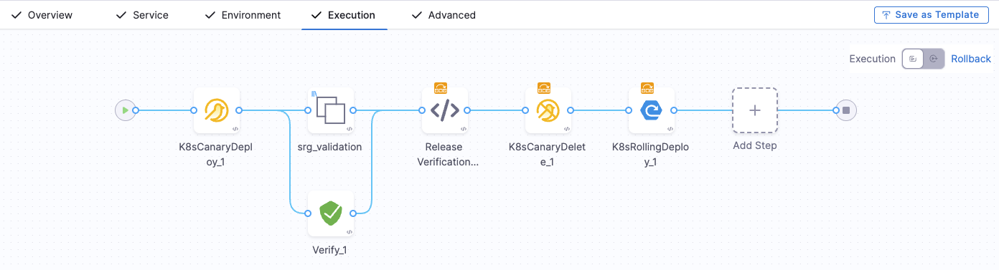
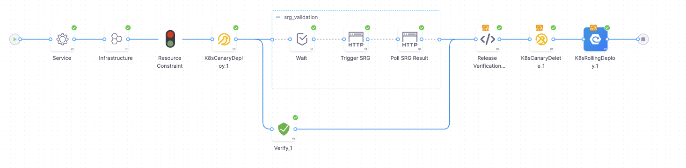
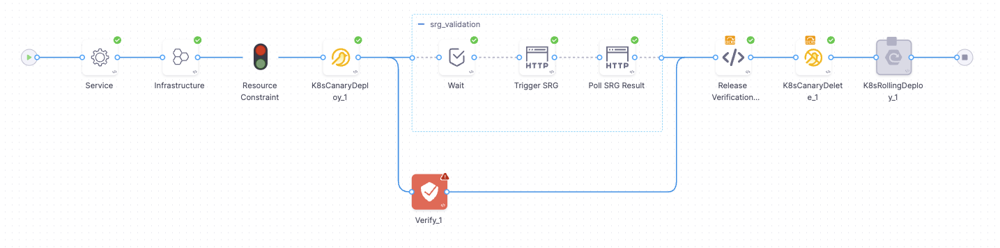

If your organization already uses [Dynatrace Site Reliability Guardian (SRG)](https://docs.dynatrace.com/docs/deliver/site-reliability-guardian) to evaluate release quality, you can integrate it directly into your Harness CD pipelines. This lets you combine Dynatrace's metric-driven validation with Harness's deployment orchestration and the Continuous Verification (CV) Verify step — giving you two independent layers of release verification.

Harness handles the deployment and makes the final promotion decision. Dynatrace performs the reliability evaluation. Together, they create a robust release gate that catches regressions before they reach production traffic.

The integration uses standard Harness pipeline primitives — HTTP steps, shell scripts, and a reusable step group template — to call the Dynatrace SRG API. No custom plugins or feature flags are required.

## Prerequisites

Before setting up this integration, make sure you have:

- A Harness CD deployment pipeline. This integration works with any deployment strategy (canary, rolling, blue-green, etc.). For more information, go to [CD overview](/docs/continuous-delivery/overview).
- A Dynatrace environment with Site Reliability Guardian configured and a workflow that runs the SRG validation.
- A Dynatrace API token (platform token with `automation:workflows:run` and `automation:workflows:read` scopes) stored in [Harness Secret Manager](/docs/platform/secrets/secrets-management/harness-secret-manager-overview) (for example, as `dyna-pf-token`).
- The Dynatrace **Platform URL** (for example, `https://abc123.apps.dynatrace.com`) and **Workflow ID** for your SRG guardian.

## SRG Validation step group template

The SRG integration is packaged as a reusable step group template that you can reference from any pipeline. The template handles three things: waiting for the canary to warm up, triggering the Dynatrace SRG workflow, and polling for the result.

### Template inputs

The template accepts a single input variable:

- **`podName`:** The name of the canary pod deployed by Harness. This is passed to Dynatrace so SRG evaluates metrics scoped to the canary instance only.

### What each step does

The step group contains three steps that execute sequentially:

1. **Wait (3 minutes):** A bake period that gives the canary pod time to receive traffic and generate meaningful metrics before SRG evaluation begins.

2. **Trigger SRG:** An HTTP POST step that calls the Dynatrace Automation API to start the SRG workflow. It passes the canary pod name and a 10-minute evaluation window (`now-10m` to `now`) as input parameters. The step captures the `executionId` from the response for use in the next step.

3. **Poll SRG Result:** An HTTP GET step that polls the workflow execution endpoint until SRG finishes. It uses a retry strategy (up to 10 retries at 5-second intervals) to wait for the guardian to complete evaluation. Once finished, it captures four output variables:
   - `VALIDATION_STATUS` — The SRG verdict (`pass` or `fail`).
   - `TASK_STATE` — The execution state of the guardian task.
   - `GUARDIAN_NAME` — The name of the guardian that ran the evaluation.
   - `POLL_RESPONSE` — The full response body for debugging.

The following screenshot shows the SRG Validation step group template in the Harness Pipeline Studio:



### Template YAML

Create this as an **Account-level step group template** so it can be reused across projects.

<details>
<summary>SRG Validation step group template YAML</summary>

```yaml
template:
  name: SRG Validation
  identifier: SRG_Validation
  versionLabel: "1"
  type: StepGroup
  tags: {}
  spec:
    stageType: Deployment
    steps:
      - step:
          type: Wait
          name: Wait
          identifier: Wait
          spec:
            duration: 3m
      - step:
          name: Trigger SRG
          identifier: triggerSRG
          type: Http
          timeout: 2m
          spec:
            url: <+pipeline.variables.dynaUrl>/platform/automation/v1/workflows/<+pipeline.variables.workflowId>/run
            method: POST
            headers:
              - key: Authorization
                value: Bearer <+secrets.getValue("dyna-pf-token")>
              - key: Content-Type
                value: application/json
            requestBody: |-
              {
                "input": {
                  "timeframe.from": "now-10m",
                  "timeframe.to": "now",
                  "pod.name": "<+stepGroup.variables.podName>"
                }
              }
            outputVariables:
              - name: executionId
                type: String
                value: <+json.select("id", httpResponseBody)>
            inputVariables: []
            assertion: <+httpResponseCode> == 201
      - step:
          type: Http
          name: Poll SRG Result
          identifier: pollSrgResult
          spec:
            url: <+pipeline.variables.dynaUrl>/platform/automation/v1/executions/<+steps.triggerSRG.output.outputVariables.executionId>/tasks
            method: GET
            headers:
              - key: Authorization
                value: Bearer <+secrets.getValue("dyna-pf-token")>
              - key: Accept
                value: application/json
            assertion: <+httpResponseCode> == 200 && <+json.select(".site_reliability_guardian_1.state", httpResponseBody)> != "RUNNING"
            outputVariables:
              - name: POLL_RESPONSE
                type: String
                value: <+httpResponseBody>
              - name: TASK_STATE
                type: String
                value: <+json.select(".site_reliability_guardian_1.state", httpResponseBody)>
              - name: VALIDATION_STATUS
                type: String
                value: <+json.select(".site_reliability_guardian_1.result.validation_status", httpResponseBody)>
              - name: GUARDIAN_NAME
                type: String
                value: <+json.select(".site_reliability_guardian_1.result.guardian_name", httpResponseBody)>
            inputVariables: []
          timeout: 30s
          failureStrategies:
            - onFailure:
                errors:
                  - AllErrors
                action:
                  type: Retry
                  spec:
                    retryCount: 10
                    retryIntervals:
                      - 5s
                    onRetryFailure:
                      action:
                        type: MarkAsFailure
          when:
            stageStatus: Success
    variables:
      - name: podName
        type: String
        value: <+input>
        description: canary pod name
        required: false
```

</details>

## Set up the pipeline

The following pipeline demonstrates a complete canary deployment with both Dynatrace SRG and Harness CV running in parallel. It uses the SRG Validation template from above and adds a Verify step alongside it.

### Pipeline variables

Define these variables at the pipeline level:

- **`dynaUrl`:** Your Dynatrace platform URL (for example, `https://abc123.apps.dynatrace.com`).
- **`workflowId`:** The ID of the Dynatrace Automation workflow that runs your SRG guardian.

### Execution flow

The pipeline execution follows this sequence:

1. **K8sCanaryDeploy** — Deploys a single canary pod.
2. **Parallel verification** — The SRG Validation step group and the CV Verify step run simultaneously. The step group template receives the canary pod name dynamically using the deployment info outcome expression.
3. **Release Verification Summary** — A shell script logs the verdicts from both SRG and CV for visibility. This step runs regardless of the previous step outcomes (configured with `stageStatus: All`).
4. **K8sCanaryDelete** — Cleans up the canary pod.
5. **K8sRollingDeploy** — Promotes the deployment to all pods, but only if SRG returned `pass`. This is controlled by a conditional execution expression on the step.

If any step fails, the pipeline triggers a stage rollback using `K8sRollingRollback`.

The following screenshot shows the full pipeline execution flow in the Harness Pipeline Studio, with the SRG Validation step group and the CV Verify step running in parallel:



### Pipeline YAML

Replace the service, environment, infrastructure, and connector references with your own.

<details>
<summary>Complete pipeline YAML</summary>

```yaml
pipeline:
  projectIdentifier: <PROJECT_ID>
  orgIdentifier: <ORG_ID>
  tags: {}
  stages:
    - stage:
        name: Grail-Deploy
        identifier: GrailDeploy
        description: ""
        type: Deployment
        spec:
          deploymentType: Kubernetes
          service:
            serviceRef: <SERVICE_REF>
            failureStrategies:
              - onFailure:
                  errors:
                    - Timeout
                    - Unknown
                  action:
                    type: PipelineRollback
          environment:
            environmentRef: <ENV_REF>
            deployToAll: false
            infrastructureDefinitions:
              - identifier: <INFRA_DEF_ID>
          execution:
            steps:
              - step:
                  type: K8sCanaryDeploy
                  name: K8sCanaryDeploy_1
                  identifier: K8sCanaryDeploy_1
                  spec:
                    skipDryRun: false
                    instanceSelection:
                      type: Count
                      spec:
                        count: 1
                  timeout: 10m
              - parallel:
                  - stepGroup:
                      name: srg_validation
                      identifier: srg_validation
                      template:
                        templateRef: account.SRG_Validation
                        versionLabel: "1"
                        templateInputs:
                          variables:
                            - name: podName
                              type: String
                              value: <+pipeline.stages.GrailDeploy.spec.execution.steps.K8sCanaryDeploy_1.deploymentInfoOutcome.serverInstanceInfoList.get(<+pipeline.stages.GrailDeploy.spec.execution.steps.K8sCanaryDeploy_1.deploymentInfoOutcome.serverInstanceInfoList.size()> - 1).name>
                    contextType: Pipeline
                  - step:
                      type: Verify
                      name: Verify_1
                      identifier: Verify_1
                      spec:
                        isMultiServicesOrEnvs: false
                        type: Canary
                        monitoredService:
                          type: Default
                          spec: {}
                        spec:
                          sensitivity: HIGH
                          duration: 5m
                      timeout: 2h
                      failureStrategies:
                        - onFailure:
                            errors:
                              - Verification
                            action:
                              type: MarkAsFailure
                        - onFailure:
                            errors:
                              - Unknown
                            action:
                              type: MarkAsFailure
                      when:
                        stageStatus: Success
              - step:
                  type: ShellScript
                  name: Release Verification Summary
                  identifier: Release_Verification_Summary
                  spec:
                    shell: Bash
                    executionTarget: {}
                    source:
                      type: Inline
                      spec:
                        script: |-
                          #!/bin/bash

                          echo "=========================================="
                          echo "  DEPLOYMENT VERIFICATION SUMMARY"
                          echo "=========================================="

                          VALIDATION_STATUS="<+pipeline.stages.GrailDeploy.spec.execution.steps.srg_validation.steps.pollSrgResult.output.outputVariables.VALIDATION_STATUS>"
                          CV_STEP_STATUS="<+pipeline.stages.GrailDeploy.spec.execution.steps.Verify_1.status>"
                          EXECUTION_ID="<+pipeline.stages.GrailDeploy.spec.execution.steps.srg_validation.steps.triggerSRG.output.outputVariables.executionId>"
                          DYNA_URL="<+pipeline.variables.dynaUrl>"

                          echo ""
                          echo "CV Verdict       : $CV_STEP_STATUS"
                          echo "SRG Verdict      : $VALIDATION_STATUS"
                          echo "Dynatrace Run    : ${DYNA_URL}/ui/apps/dynatrace.automations/executions/${EXECUTION_ID}"
                          echo ""
                          echo "=========================================="
                    environmentVariables: []
                    outputVariables: []
                  timeout: 10m
                  when:
                    stageStatus: All
                contextType: Pipeline
              - step:
                  type: K8sCanaryDelete
                  name: K8sCanaryDelete_1
                  identifier: K8sCanaryDelete_1
                  spec: {}
                  timeout: 10m
                  when:
                    stageStatus: All
                contextType: Pipeline
              - step:
                  type: K8sRollingDeploy
                  name: K8sRollingDeploy_1
                  identifier: K8sRollingDeploy_1
                  spec:
                    skipDryRun: false
                    pruningEnabled: false
                  timeout: 10m
                  when:
                    stageStatus: Success
                    condition: <+pipeline.stages.GrailDeploy.spec.execution.steps.srg_validation.steps.pollSrgResult.output.outputVariables.VALIDATION_STATUS>=="pass"
            rollbackSteps:
              - step:
                  name: Rolling Rollback
                  identifier: rollingRollback
                  type: K8sRollingRollback
                  timeout: 10m
                  spec: {}
        tags: {}
        failureStrategies:
          - onFailure:
              errors:
                - AllErrors
              action:
                type: StageRollback
  timeout: 20m
  variables:
    - name: dynaUrl
      type: String
      description: ""
      required: false
      value: <DYNATRACE_PLATFORM_URL>
    - name: workflowId
      type: String
      description: ""
      required: false
      value: <WORKFLOW_ID>
  identifier: Harness_SRG_Canary
  name: Harness-SRG-Canary
```

</details>

### Key expressions explained

A few expressions in this pipeline reference deployment outputs dynamically:

- **Canary pod name passed to SRG:** The `podName` variable uses a chained expression to get the last deployed pod from the canary step's output:
  ```
  <+pipeline.stages.GrailDeploy.spec.execution.steps.K8sCanaryDeploy_1
    .deploymentInfoOutcome.serverInstanceInfoList
    .get(<+...serverInstanceInfoList.size()> - 1).name>
  ```
  This ensures SRG always evaluates metrics for the correct canary pod, even if the pod name changes between runs.

- **Promotion condition:** The rolling deploy step uses a conditional execution to check the SRG verdict:
  ```
  <+pipeline.stages.GrailDeploy.spec.execution.steps.srg_validation
    .steps.pollSrgResult.output.outputVariables.VALIDATION_STATUS>=="pass"
  ```
  The deployment only promotes if the SRG validation returned `pass`.

## How it works

Once the pipeline is set up, the execution follows this flow:

1. **Deploy:** Harness deploys the new version using your chosen deployment strategy (canary, rolling, blue-green, etc.).
2. **Run verification in parallel:** Two verification paths execute simultaneously:
   - **Dynatrace SRG validation** — The step group triggers a Dynatrace SRG workflow, waits for it to complete, and captures the verdict.
   - **Harness CV Verify step** — The standard Verify step evaluates health source metrics using Harness ML-based analysis.
3. **Gate the release:** A shell script inspects the SRG verdict. If SRG returns `pass` and the CV step succeeds, Harness promotes the deployment. If either check fails, the pipeline stops and rolls back.

This parallel approach means SRG and CV validate the deployment independently. A failure from either source blocks the release.

### Successful execution

When both SRG and CV pass, the pipeline promotes the deployment and all steps complete successfully:



### Failed execution

When CV detects anomalies or SRG returns a failing verdict, the pipeline stops the promotion. In this example, the Verify step failed while SRG passed — the downstream steps are skipped and the deployment is not promoted:



## Verification outcomes

Running SRG and CV in parallel produces three possible outcomes:

| SRG Verdict | CV Verdict | Result |
|---|---|---|
| `pass` | Success | Deployment promoted to all pods |
| `fail` | Success | Deployment stopped — SRG blocked the release |
| `pass` | Failure | Deployment stopped — CV detected anomalies |

When both checks fail, the pipeline triggers a rollback automatically through the stage failure strategy.

## Next steps

- [Configure the Verify step](/docs/continuous-delivery/verify/configure-cv/verify-deployments) to set up health sources for Harness CV.
- [Dynatrace health source](/docs/continuous-delivery/verify/configure-cv/health-sources/dynatrace) for configuring Dynatrace as a CV health source alongside the SRG integration.
- [Create a Kubernetes canary deployment](/docs/continuous-delivery/deploy-srv-diff-platforms/kubernetes/kubernetes-executions/create-a-kubernetes-canary-deployment) for setting up the canary strategy used in this guide.
