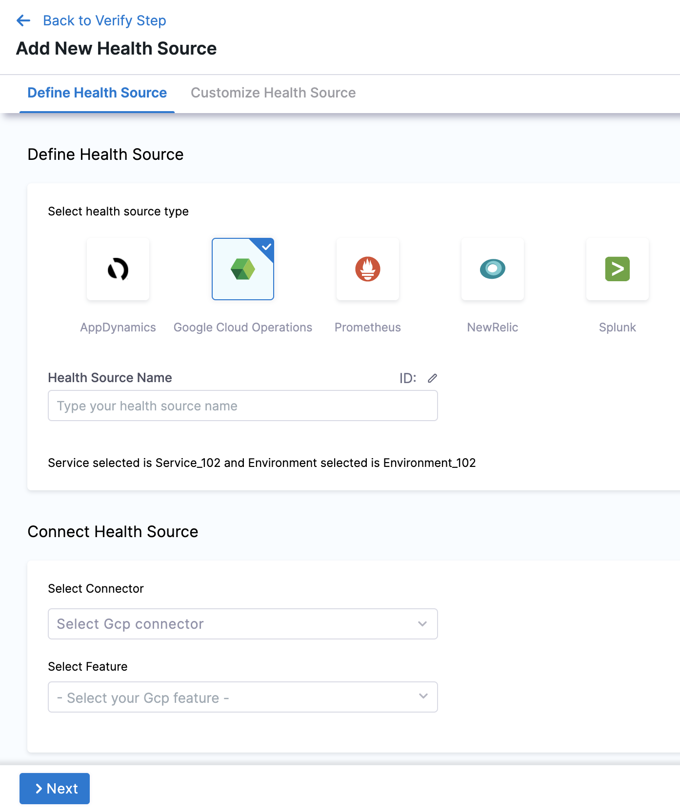
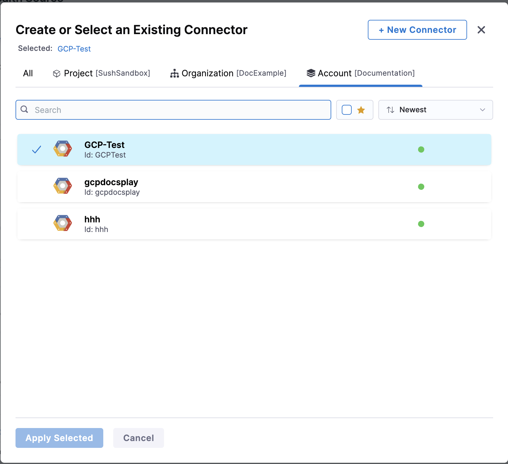
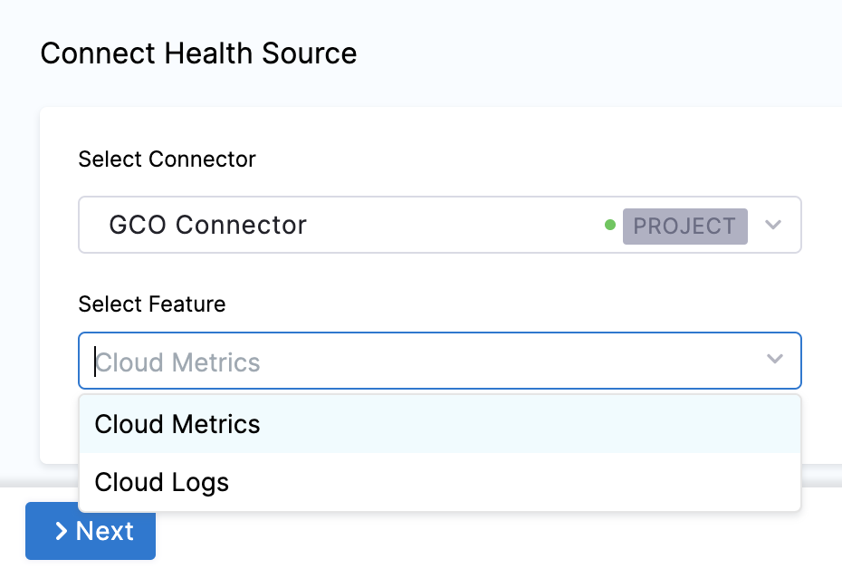
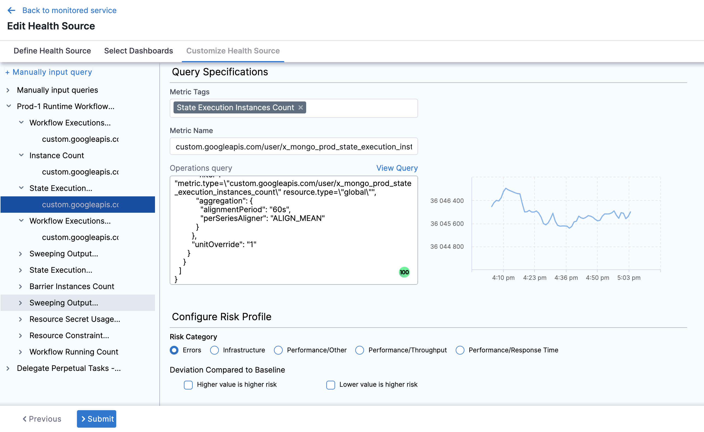
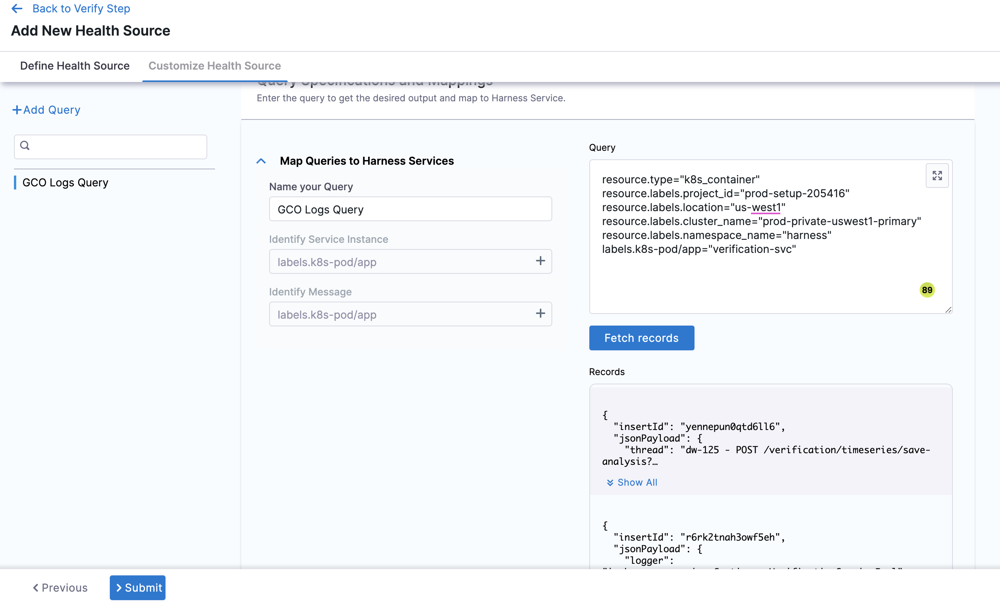

The Google Cloud Operations Suite was formerly known as Stackdriver.

import BeforeYouBegin from '/docs/continuous-delivery/verify/configure-cv/health-sources/static/before-you-begin.md';

<BeforeYouBegin />

- [Add Google Cloud Operations as a verification provider](/docs/platform/connectors/monitoring-and-logging-systems/connect-to-monitoring-and-logging-systems#add-google-cloud-operations-formerly-stackdriver)

- To configure GCP metrics as a health source in Harness, you should first create a GCP dashboard and then import it.

## Step 5: Add Health Sources

This option is available only if you have configured the service and environment as fixed values.

A Health Source is basically a mapping of a Harness Service to the service in a deployment environment monitored by an APM or logging tool.

In **Health Sources**, click **Add**. The **Add New Health Source** settings appear.

1. In **Select health source type**, select Google Cloud Operations.
   
   

2. In **Health Source Name**, enter a name for the Health Source.
3. Under **Connect Health Source**, click **Select Connector**.
4. In **Connector** settings, you can either choose an existing connector GCP connector or click **New Connector.**

   

5. Click **Apply Selected**. The Connector is added to the Health Source.
6. In **Select Feature**, select the feature to be used.

## Option: Cloud Metrics

1. Select Cloud Metrics and click **Next**. The **Select Dashboard** settings appear.
2. Click one or more dashboards from the displayed results. If you don't have any pre-existing dashboards or don't want to select the ones in the displayed result, click **Manually input query.**
   
3. Click **Next** and the **Customize Health Source** settings appear.
4. Select a query from the options displayed on the left side of setting panel. The specification of the selected query auto-populates in the fields under **Query Specifications**.
   
5. In **Configure Risk Profile**, select one of the following risk types in **Risk Category**:
   
   | Risk Type | Type of Values | Deviation Type | Default Delta | Default Ratio |
   | --- | --- | --- | --- | --- |
   | Error | Web / Business transactions | Higher is bad | 0 | 0 |
   | Infrastructure | Cpu, memory .... | Higher and Lower is bad | 20 | 0.2 |
   | Performance/Other | Cpu, memory .... | Higher and Lower is bad | 20 | 0.2 |
   | Performance/Throughput | Web / Business transactions | Lower is bad | 20 | 0.2 |
   | Performance/Response time | Web / Business transactions | Higher is bad | 20 | 0.2 |

6. In **Deviation Compared to Baseline**, select one of the options based on the selected risk type.
7. Click **Submit**. The Health Source is displayed in the Verify step.

## Option: Cloud Logs

Select Cloud Logs and click **Next.** The **Customize Health Source** settings appear.

You can customize the metrics to map the Harness Service to the monitored environment in **Query Specifications and Mapping** settings.

1. Click **Map Queries to Harness Services** drop down.
2. Enter a name for the query in **Name your Query**.
3. In **Query**, enter the query and click **Fetch Records.** The retrived results appear in **Records**.
4. In **Identify Service Instance**, click the plus icon to select the path of the service instance.
5. In **Identify Message**, click the plus icon to select the message identifier.

Click **Submit**. The Health Source is displayed in the Verify step.

You can add one or more Health Sources for each APM or logging provider.
