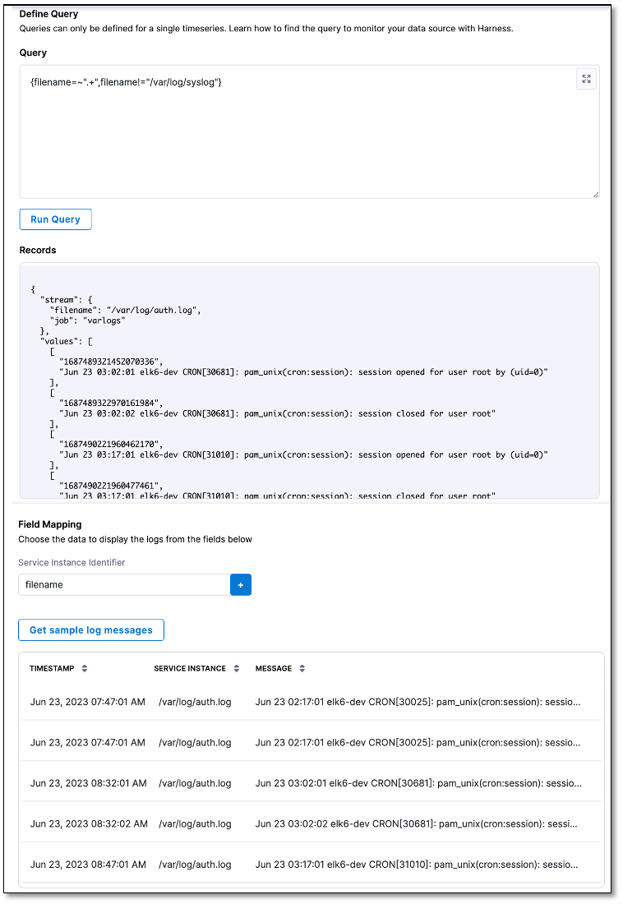

:::info note
Currently, this feature is behind the feature flag `SRM_ENABLE_GRAFANA_LOKI_LOGS`. Contact [Harness Support](mailto:support@harness.io) to enable the feature.
:::

import BeforeYouBegin from '/docs/continuous-delivery/verify/configure-cv/health-sources/static/before-you-begin.md';

<BeforeYouBegin />

## Add Grafana Loki as a health source

To add a health source:

1. In the **Health Sources** section of the Verify screen, select **+ Add New Health Source**.
   
   The Add New Health Source dialog appears.

2. In the **Define Health Source** tab, do the following:
      
   1. In the **Define Health Source** section, select **GrafanaLoki** as the health source type.
      
   2. In the **Health Source Name** field, enter a name for the health source.
      
   3. In the **Connect Health Source** section, select **Select Connector**. 
   
      The Create or Select an Existing Connector dialog appears.
      
   4. Select a connector for the Grafana Loki health source, and then select **Apply Selected**.  
         The selected connector appears in the **Select Connector** dropdown. The **Grafana Loki Logs** option is selected by default in the **Select Feature** field.

<b>Follow these steps to create a new Grafana Loki connector.</b>

         1.	In the Create or Select an Existing Connector dialog, select **+ New Connector**.
         
         2. In the **Overview** tab, enter a name for the connector, an optional description, and a tag, and then select **Continue**. If you are going to use multiple providers of the same type, ensure you give each provider a different name.
         
         3.	In the **Headers** tab, enter the following and select **Next**:

               - **Base URL** of your Grafana Loki account. By default, Grafana Loki exposes its API on the 3100 port without any authentication. 
               - Optionally, the **Key** and **Value** pair for the Grafana Loki log stream that you want to select in the query. For more information on the log stream selector and key-value pairs, go to [Log stream selector](https://grafana.com/docs/loki/latest/logql/log_queries/#log-stream-selector).

         4. Optionally, in the **Parameters** tab, enter the **Key** and **Value** pair.

         5. In the **Validation Path** tab, select either the **GET** or **POST** request method and enter the **Validation Path**.  
            
            If you select **POST**, you must also include the request body. Here's an example of a validation path for a **GET** request: `loki/api/v1/labels`.

         6. In the **Delegates Setup** tab, choose one of the following:

               - **Use any available Delegate**: Harness automatically assigns an available delegate.
               
               - **Only use Delegates with all of the following tags**: You can enter tags to ensure that Harness selects only the delegates that have been assigned those specific tags.

         7. Select **Save** and **Continue**.  
               
               Harness verifies the connection. 

         8. Once the verification is successful, select **Finish**.  
               
               The Grafana Loki connector is added to the list of connectors.

       
      
3. Select **Next**.
         The **Configuration** tab appears.
 

### Define log configuration settings

1. In the Configuration tab, select **+ Add Query**.  
   
   The Add Query dialog appears.

2. Enter a name for the query and then select **Submit**.  
   
   The query that you added gets listed under **Logs Group**. The query specification and mapping settings are displayed.
   These settings help you retrieve the desired logs from the Grafana Loki platform and map them to the Harness service. 

### Define a query
   
1. In the **Query** field, enter a log query and select **Run Query** to execute it.
   
    A sample record in the **Records** field. This helps you confirm the accuracy of the query you've constructed.
   
2. In the **Field Mapping** section, select **+** to map the **service instance identifiers** to select the data that you want to be displayed from the logs. For more information, go to [Service Instance Identifier (SII)](/docs/continuous-delivery/verify/cv-concepts/cvfg-cvng/#service-instance-identifier-sii).

3. Select **Get sample log messages**.  
   
   Sample logs are displayed that help you verify if the query is correct.

<b>Sample log query</b>

   Query for showing data from all filenames, except for syslog: `{filename=~".+",filename!="/var/log/syslog"}`

   

