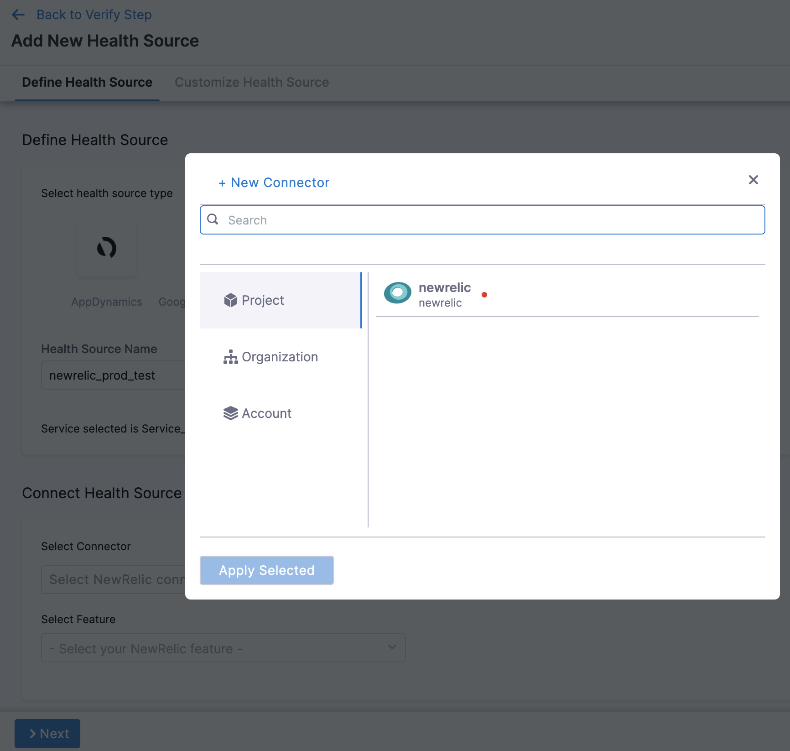
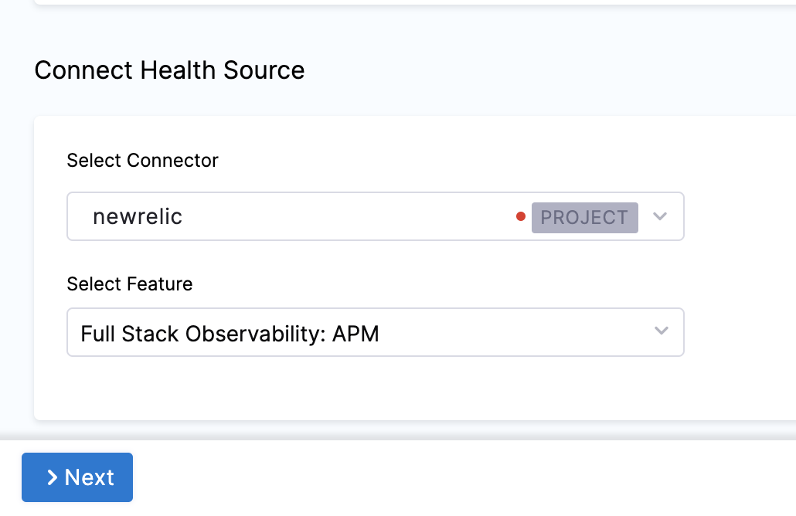
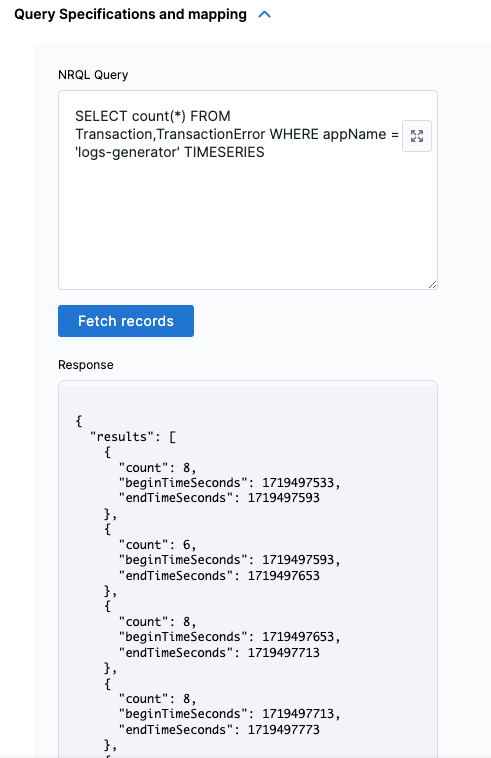
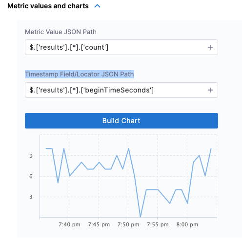
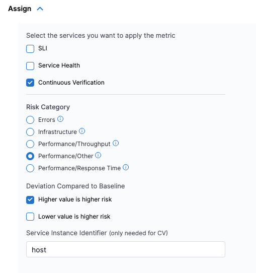
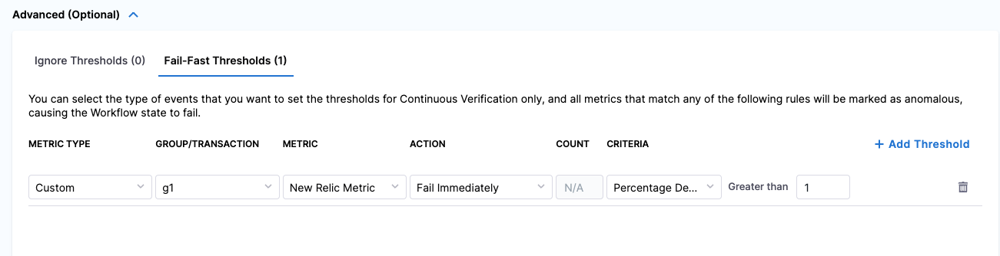

import BeforeYouBegin from '/docs/continuous-delivery/verify/configure-cv/health-sources/static/before-you-begin.md';

<BeforeYouBegin />

* [Add New Relic as a Verification Provider](/docs/platform/connectors/monitoring-and-logging-systems/connect-to-monitoring-and-logging-systems#add-new-relic)

:::info note
New Relic supports multiple APIs. The Harness Connector leverages the New Relic Insights API, which supports NRQL. Your Service/Application also needs to be instrumented as a [New Relic APM Application](https://docs.newrelic.com/introduction-apm). 
:::


## Add New Relic as a health source

This option is available only if you have configured the service and environment as fixed values.

A Health Source is basically a mapping of a Harness Service to the service in a deployment environment monitored by an APM or logging tool.

1. In **Health Sources**, click **Add**. The **Add New Health Source** settings appear.
   
   
    
2. In **Select health source type**, select **NewRelic**.
3. In **Health Source Name**, enter a name for the Health Source.
4. Under **Connect Health Source**, click **Select Connector**.
5. In **Connector** settings, you can either choose an existing connector or click **New Connector**.

    

    New Relic supports multiple APIs. Harness connector leverages the NerdGraph API or the deprecated New Relic Insights API that supports NRQL. See Step 8 for more details on connecting to either APIs. For more details, go to [Add New Relic connector](/docs/platform/connectors/monitoring-and-logging-systems/connect-to-monitoring-and-logging-systems#add-new-relic).

6. Click **Apply Selected**. The Connector is added to the Health Source.
7. In **Select Feature**, select the NewRelic feature to be used. Currently, only **Full Stack Observability: APM** feature is available and it is selected by default.
    
    
    
8. Click **Next**. The **Configuration** page appears.
9. Select the **Performance** checkbox under **Metric Packs** for Harness to monitor the performance metrics.
10. Under **Query Specifications and Mapping**, select **Add Metric** to customize the query to get the desired output and map to Harness service. 
      1.  In **Map Metric(s) to Harness Services**, enter a **Metric Name** and **Group Name**.
      2.  In **Query Specifications and mapping**, enter the **NRQL Query**, and then select **Fetch Records**. (*Optional*: Enter the NRQL for specified metrics with a `TimeSeries` clause.)
       
       

      3.  In **Metric values and charts**, select a Metric Value JSON Path and Timestamp Field/Locator JSON Path and select **Build Chart**. 
       
       

      4. In **Assign**:  
         1. In **Select the services you want to apply the metric**, select **Continuous Verification** (Applied to the pipelines in the Continuous Deployment).
         2. In **Risk Category**, select **Performance/Other**
         3. In **Deviation Compared To Baseline**, select **Higher counts = higher risk**.
         4. In **Service Instance Identifier (only needed for CV)**, enter **host**.
         
         

11. *(Optional)* To set a fail-fast threshold, follow these steps:
      1.  Expand **Advanced (Optional)**, go to the **Fail-Fast Thresholds** tab, and then select **Add Threshold**.

      2. From the **Metric** drop-down, select New Relic Metric. This is the metric you created in the Define metric configuration settings step.

      3. In the Action field, select what the CV should do when applying the rule. For example, **Fail Immediately**.

      4. In the **Criteria** field, choose **Percentage Deviation**, and from **Greater than** select 1. This sets a threshold for memory usage beyond which the system or application is considered to be in a problematic state, and action should be taken.

      

12. Select **Submit**. The Health Source is displayed in the Verify step.

You can add one or more Health Sources for each APM or logging provider.

### Sample New Relic queries

Here are few sample New Relic queries:  

- `SELECT rate(count(duration), 1 minute) FROM Transaction TIMESERIES`
- `SELECT average(duration) FROM Transaction TIMESERIES`
- ```SELECT average(`apm.service.transaction.duration`) FROM Metric WHERE appId = 1329709976 TIMESERIES```

For more details on NRQL structure and how to use it, go to [New Relic documentation](https://docs.newrelic.com/docs/nrql/get-started/introduction-nrql-new-relics-query-language/).
