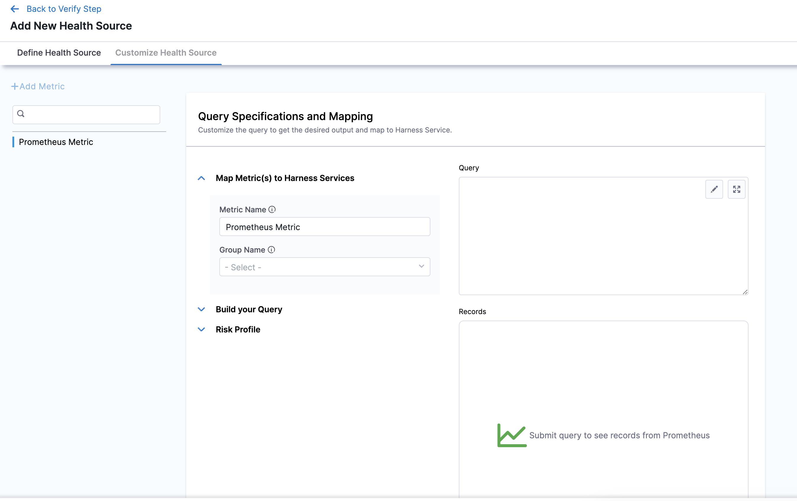

:::important
- Prometheus queries must include filters (enclosed in curly braces) to specify the nodes or data points you want to sample.
- Prometheus queries must produce a single value (scalar). To learn more about Prometheus queries, go to [QUERYING PROMETHEUS](https://prometheus.io/docs/prometheus/latest/querying/basics/).
- The Prometheus connector and health source provided by Harness are compatible with Mimir, Cortex, Thanos, Coralogix, and VictoriaMetrics platforms.
:::

import BeforeYouBegin from '/docs/continuous-delivery/verify/configure-cv/health-sources/static/before-you-begin.md';

<BeforeYouBegin />

- [Add Prometheus as a verification provider](/docs/platform/connectors/monitoring-and-logging-systems/connect-to-monitoring-and-logging-systems)

## Add Prometheus as a health source

This option is available only if you have configured the service and environment as fixed values.

A Health Source is basically a mapping of a Harness Service to the service in a deployment environment monitored by an APM or logging tool.

In **Health Sources**, click **Add**. The **Add New Health Source** settings appear.

1. In **Select health source type**, select Prometheus.
2. In **Health Source Name**, enter a name for the Health Source.
3. Under **Connect Health Source**, click **Select Connector**.
4. In **Connector** settings, you can either choose an existing connector or click **New Connector.**
   
5. After selecting the connector, click **Apply Selected**. The Connector is added to the Health Source.
   
6. In **Select Feature**, select the Prometheus feature to be used.
7. Click **Next**. The **Customize Health Source** settings appear.

   The subsequent settings in **Customize Health Source** depend on the Health Source Type you selected. You can customize the metrics to map the Harness Service to the monitored environment.

   
   
8. In **Query Specifications and Mapping**, first click **Map Metric(s) to Harness Services**.
9. Enter the desired metric name in **Metric** **Name**.
10. Enter a name for the Prometheus group in **Group Name**.
11. Click **Build your Query** drop down.
12. In **Prometheus Metric**, select the Prometheus metric.
13. In **Filter on Environment**, select a filter.
14. In **Filter on Service**, select a filter. To add more filters, click **Additional Filter** which is optional.
15. To add an aggregator for the metric, click **Aggregator** which is also optional.
16. In **Assign**, you can select the services for which you want to apply the metric.
17. Click **Submit**. The Health Source is displayed in the Verify step.

You can add one or more Health Sources for each APM or logging provider.

### **Add Amazon Managed Service for Prometheus as health source**

Harness now supports Amazon Managed Service for Prometheus as health source. To select Amazon Managed Service for Prometheus as health source:

1. In Health Sources, click **Add**.   
The Add New Health Source settings appear.
2. In **Select health source type**, select **Prometheus**.
3. In **Health Source Name**, enter a name for the Health Source.
4. Under **Connect Health Source** > **Via Cloud Provider**, select Amazon web services.
   
   

5. Under **Connect Health Source**, click **Select Connector**.
6. In **Connector** settings, you can either choose an existing connector or click **New Connector**.
7. In the **Select Feature** field, select the Prometheus feature that you want to use.
8. In the **Select AWS Region** field, select the appropriate region.
9.  In the **Select Workplace Id** field, select the appropriate workplace id.
10. Click **Next**. The **Customize Health Source** settings appear.  
    
    You can customize the metrics to map the Harness Service to the monitored environment in **Query Specifications and Mapping** settings.The subsequent settings in **Customize Health Source** depend on the Health Source Type you selected. Click **Map Queries to Harness Services** drop down.

1.  Click **Add Metric**.
2.  Enter a name for the query in **Name your Query**.
3.  Click **Select Query** to select a saved query. This is an optional step. You can also enter the query manually in the **Query** field.
4.  Click **Fetch Records** to retrieve the details. The results are displayed under **Records.**

### Commonly used Prometheus queries

#### Performance

- P90: `histogram_quantile(0.90, sum(rate(flask_http_request_duration_seconds_bucket{datacenter="preprod", status=~"2.*", pod=~"harness-dummy-.*"}[5m])) by (le))`
- P50: `histogram_quantile(0.50, sum(rate(flask_http_request_duration_seconds_bucket{datacenter="preprod", status=~"2.*", pod=~"harness-dummy-.*"}[5m])) by (le))`

#### API

- 5xx response: `sum(rate(flask_http_request_total{datacenter="preprod", status=~"5.*", pod=~"harness-dummy-.*"})) by (le)`
- 4xx response: `sum(rate(flask_http_request_total{datacenter="preprod", status=~"4.*", pod=~"harness-dummy-.*"})) by (le)`  

#### Infrastructure

- CPU: `(sum(rate(container_cpu_usage_seconds_total{namespace="<namespace_name>",pod=~"dummy-.*",source_cluster="<cluster_name>",image!='',container!='POD'}[1m])) by (le) / sum(kube_pod_container_resource_requests_cpu_cores{}) by (le)) * 100`
- Memory: `(sum(container_memory_usage_bytes{namespace="<namespace_name>",pod=~"harness-dummy-.*",source_cluster="<cluster_name>",  container!="POD", container!=""}) by (le) / sum(kube_pod_container_resource_requests_memory_bytes{}) by (le)) * 100`   
