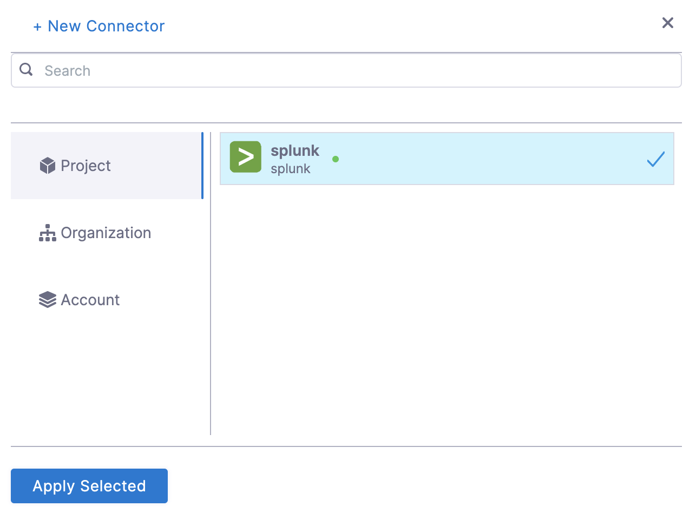
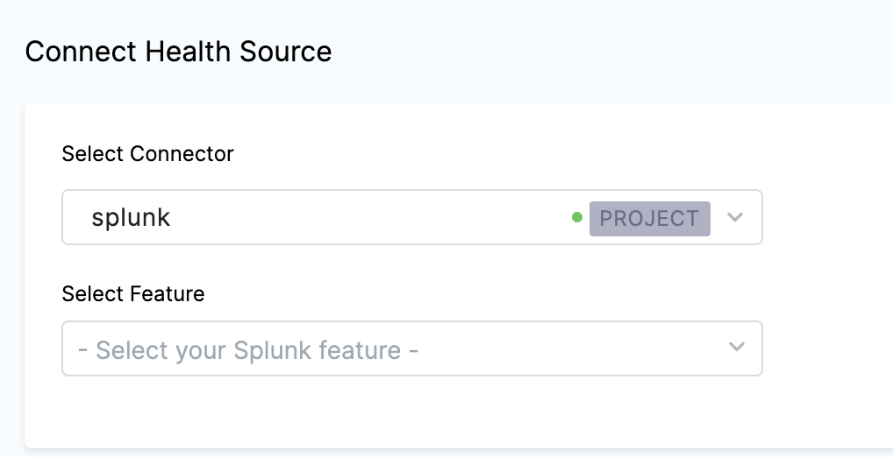
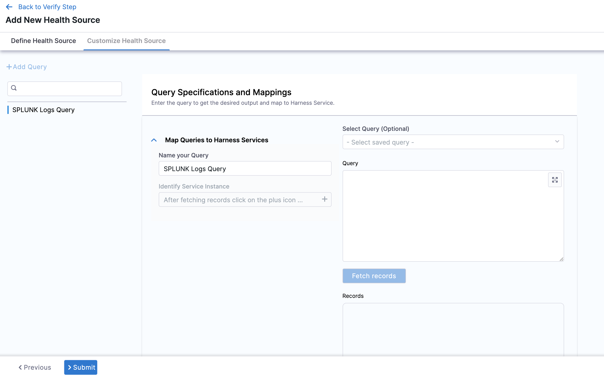
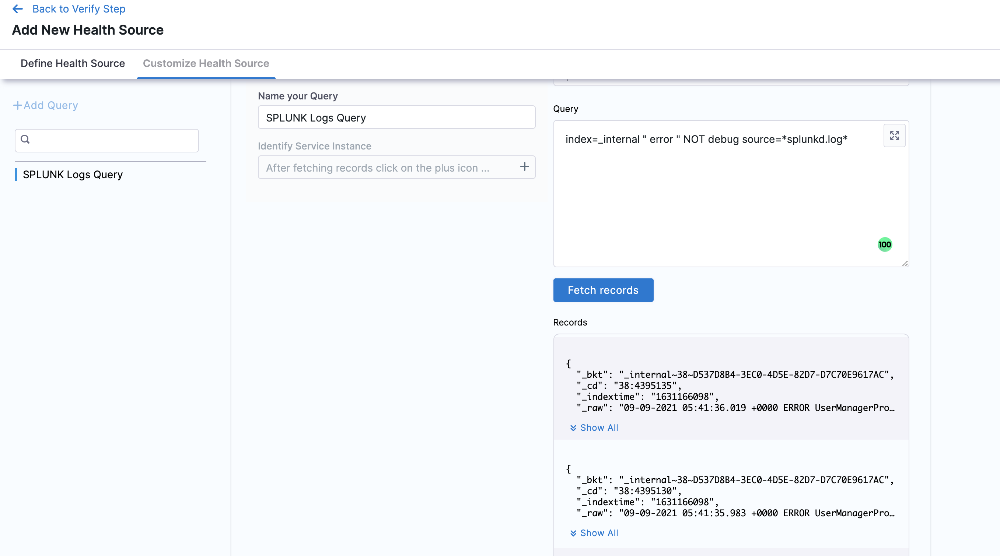
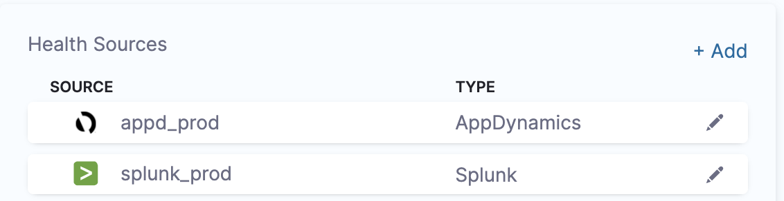

import BeforeYouBegin from '/docs/continuous-delivery/verify/configure-cv/health-sources/static/before-you-begin.md';

<BeforeYouBegin />

Additionally, [add Splunk as a verification provider](/docs/platform/connectors/monitoring-and-logging-systems/connect-to-monitoring-and-logging-systems)

## Step 5: Add Health Sources

This option is available only if you have configured the service and environment as fixed values.

A Health Source is basically a mapping of a Harness Service to the service in a deployment environment monitored by an APM or logging tool.

1. In **Health Sources**, click **Add**. The **Add New Health Source** settings appear.
   
   

2. In **Select health source type**, select Splunk.
3. In **Health Source Name**, enter a name for the Health Source.
4. Under **Connect Health Source**, click **Select Connector**.
5. In **Connector** settings, you can either choose an existing connector or click **New Connector.**
   

6. Click **Apply Selected**. The Connector is added to the Health Source.
   
   

7. In **Select Feature**, select the Splunk feature to be used.
8. Click **Next**. The **Customize Health Source** settings appear.
   The subsequent settings in **Customize Health Source** depend on the Health Source Type you selected. You can customize the metrics to map the Harness Service to the monitored environment in **Query Specifications and Mapping** settings.
   
   

9. Click **Map Queries to Harness Services** drop down.
10. Enter a name for the query in **Name your Query**.
11. Click **Select Query** to select a saved query. This is an optional step. You can also enter the query manually in **Query**.
12. Click **Fetch Records** to retrieve the details. The results are displayed under **Records.**
   

13. Once the records are fetched, click the plus icon in **Identify Service Instance** to select the path for service instance.
14. Click **Submit**. The Health Source is displayed in the Verify step.

You can add one or more Health Sources for each APM or logging provider.
