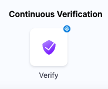
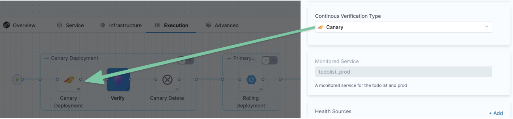
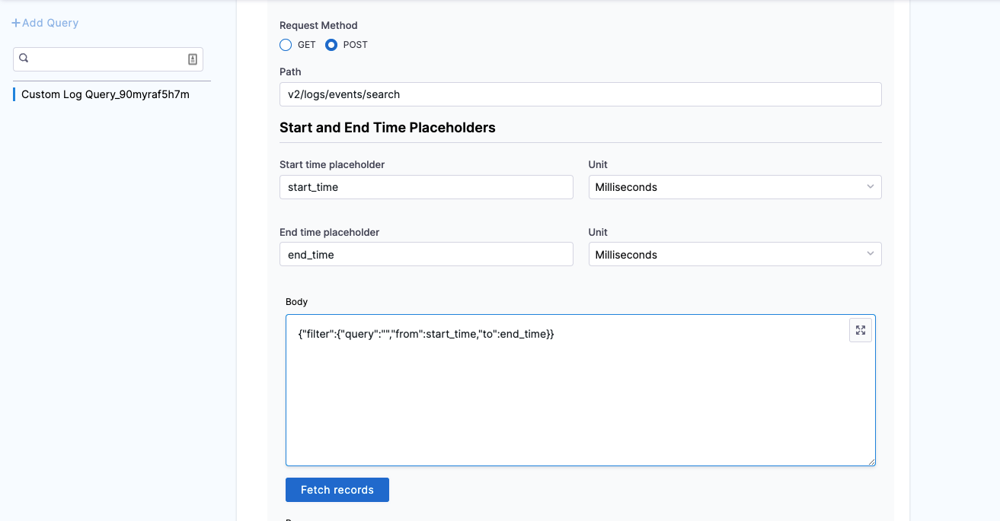
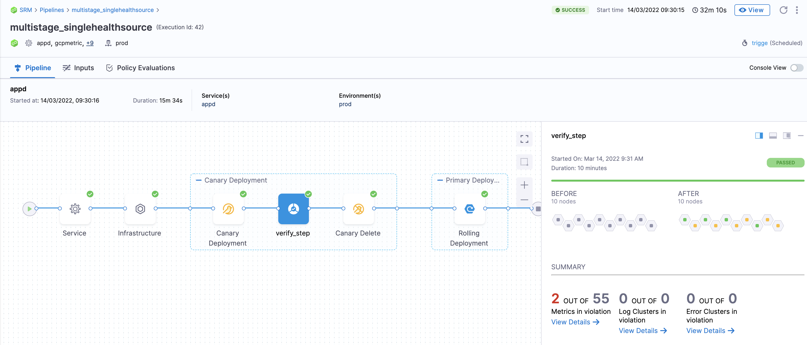
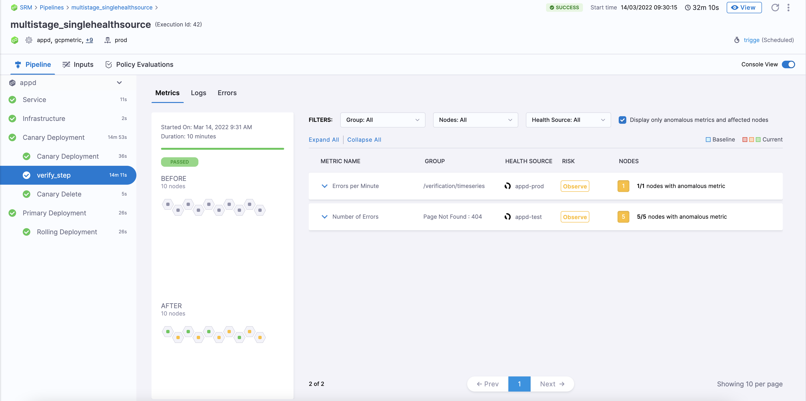

This topic covers how to add and configure Custom Health as a Health Source for the Verify step.

Harness offers support for all major APM vendors and log providers, but there are cases where a customized APM or log provider is needed. The Custom Health Source lets you customize APMs and log providers of your choice.

## Before You Begin

[Add Custom Health as a Verification Provider](/docs/platform/Connectors/Monitoring-and-Logging-Systems/connect-to-monitoring-and-logging-systems#step-add-custom-health)

## Review: CV Setup Options

To use the Verify step, you will need a Harness Service Reliability Management Monitored Service. In the simplest terms, a Harness Monitored Service is a Service and Environment combination that Harness monitors for:

* Any changes, such as deployments, infrastructure changes, and incidents
* Any health trend deviations using logs and metrics obtained from APM and Logging tools, respectively

No matter where you set up the Monitored Service, once it's set up, it's available to both Service Reliability Management and CD modules.

In this topic, we set up the Harness Monitored Service as part of the Verify step setup.

## Step 1: Add Verify Step

There are two ways to add the Verify step:

* **When selecting the stage deployment strategy:**  
The **Verify** step can be enabled in a CD stage the first time you open the **Execution** settings and select the deployment strategy. When you select the deployment strategy you want to use, there is also an **Enable Verification** option. Select the **Enable Verification** option.  
Harness will automatically add the **Verify** step. For example, here is a stage where Canary strategy and the **Enable Verification** option were selected.
* **Add the Verify step to an existing Execution setup:** You can also add the Verify step to the Execution section of a CD stage in a Pipeline you previously created. Simply click **Add Step** after the deployment step, and then select **Verify**.

## Step 2: Enter a Name and Timeout

In **Name**, enter a name for the step.

In **Timeout**, enter a timeout value for the step.

You can use:

* `w` for weeks
* `d` for days
* `h` for hours
* `m` for minutes
* `s` for seconds
* `ms` for milliseconds

The maximum is `53w`. Timeouts can be set at the Pipeline level also.

**Node filtering**

:::info note
Currently, this feature is behind the feature flag `CV_UI_DISPLAY_NODE_REGEX_FILTER`. Contact Harness Support to enable the feature.
:::

This feature allows you to be more specific in node filtering by using Kubernetes PodName as a label. You can make analysis more explicit by telling CV which nodes to filter on. Just specify the filters on the control nodes (nodes that test nodes are compared against) and the test nodes (nodes CV checks).

To filter the nodes:

1. Expand **Optional**.

2. Choose **Control Nodes** and **Test Nodes** that Harness CV should focus on during analysis. You can either type a node’s name or use a simple pattern (Regex) to define the nodes you want to filter.

## Step 3: Select a Continuous Verification Type

In **Continuous Verification Type**, select a type that matches your [deployment strategy](./../verify-deployments-with-the-verify-step.md#continuous-verification-type).

## Step 4: Create a Monitored Service

In **Monitored Service**, click **Click to autocreate a monitored service**.

Harness automatically creates a monitored service using a concatenation of the service and environment names. For example, a service named `todolist` and an environment named `dev` results in a monitored service with the name `todolist_dev`.

:::note

The option to auto-create a monitored service is not available if you have configured either a service, an environment, or both as runtime values. When you run the pipeline, Harness concatenates the service and environment values you enter in the runtime inputs screen and generates a monitored service name. If a monitored service with the same name exists, Harness assigns it to the pipeline. If no monitored service that matches the generated monitored service name exists, Harness skips the verification step. 

For example, suppose you enter the service as `todolist` and the environment as `dev`. In that case, Harness generates the monitored service name `todolist_dev`, checks whether a monitored service with the name `todolist_dev` is available, and assigns it to the pipeline. If no monitored service is available with the name `todolist_dev`, Harness skips the verification step.

:::

## Step 5: Add Health Sources

This option is available only if you have configured the service and environment as fixed values.

A Health Source is basically a mapping of a Harness Service to the service in a deployment environment monitored by an APM or logging tool.

In **Health Sources**, click **Add**. The **Add New Health Source** settings appear.

1. In **Select health source type**, select **Custom Health**.
2. In **Health Source Name**, enter a name for the Health Source. For example Quickstart.
3. In **Connect Health Source**, click **Select Connector**.
4. In **Connector** settings, you can either choose an existing connector or click **New Connector.**
5. Click **Apply Selected**. The Connector is added to the Health Source.
6. In **Select Feature**, select the feature to be monitored. You can either select **Custom Health Metrics** or **Custom Health Logs**.
7. Click **Next**.

#### Option: Custom Health Metrics

1. If you select Custom Health Metrics, the **Customize Health Source** settings appear as:
   
   

2. Click **Map Metric(s) to Harness Services**.
3. In **Metric Name**, enter the name of the metric.
4. In **Group Name**, click **Add New** and enter a name for the metric group.
5. Click **Query specifications and mapping.**
6. In **Query Type** you can choose either **Service Based (used for Health Score and SLI)** or **Host Based (used for CV)**.
	If you select the query type as **Host Based** (Continuous Verification), the verification won't happen for SLI and Health Score (Service Based), and vice versa.
1. In **Request Method**, you can select **GET** or **POST**. If you select POST, you need to define the body format.
2. In **Path**, enter the complete path of the metric.
3. In **Start and End Time Placeholders**, enter the following:
	1. In **Start time placeholder**, enter the start time placeholder in the metric path.
	2. In **Unit**, select the preferred unit of measurement.
	3. In **End time placeholder**, enter the end time placeholder in the metric path.
	4. In **Unit**, select the preferred unit of measurement.
4. Click **Fetch Records** to retrieve records from the provided URL.
5. Click **Metric values and charts**.
6. In **Timestamp Format**, enter a static value in dd/mm/yy format.
7. Click **Assign**. Select the services for which you want to apply the metric. You can select **Health Score** or **SLI** or both options.
   The subsequent steps depend on the service you select in this step.1. In **Risk Category**, select a risk type. Available options for risk types are:
	* Errors
	* Infrastructure
	* Performance/Throughput
	* Performance/Other
	* Performance/Response Time
8. In **Deviation compared to Baseline**, select one of the options based on the selected risk type. Available options are:
	* **Higher value is higher risk** - Select this option if a high value of the selected risk type is a risk.
	* **Lower value is higher risk** - Select this option if lower value of the selected risk type is a risk.
9.  Click **Submit**.

## Option: Custom Health Logs

1. If you select Custom Health Logs, the **Customize Health Source** settings appear as:
   
   

2. Click **Query specifications and mapping**.
3. In **Query Name**, enter a name for the query. For example Custom Log Query.
4. In **Request Method**, you can select **GET** or **POST**. If you select POST, you need to define the body format.
5. In **Path**, enter the complete path of the metric. For example,`v2/logs/events/search`.
6. In **Start and End Time Placeholders**, enter the following:
	1. In **Start time placeholder**, enter the start time placeholder in the metric path. For example, start\_time.
	2. In **Unit**, select the preferred unit of measurement. For example, Milliseconds.
	3. In **End time placeholder**, enter the end time placeholder in the metric path. For example, end\_time.
	4. In **Unit**, select the preferred unit of measurement. For example, Milliseconds.
7. In **Body**, enter the request body. For example,`{"filter":{"query":","from":start_time,"to":end_time}}`.
8. Click **Fetch Records** to retrieve records from the provided URL.
   
   

9.  Once the response is retrieved, click **JSON path selection**.
	5. In **Log Message JSON path**, click the plus icon to select the path to the log message from the data source. For example,`$.data.[*].attributes.message`.
	6. In **Timestamp Field/Locator JSON** Path, click the plus icon to select the path to the log message from the data source. For example,`$.data.[*].attributes.timestamp`.
	7. In **Provide Service Instance to map to Harness Service Instance**, click the plus icon to select the Service instance from the data source. For example,`$.data.[*].attributes.tags.[4]`.

	

10. Click **Submit**.

## Step 7: Select Duration

Select how long you want Harness to analyze and monitor the APM data points. Harness waits for 2-3 minutes to allow enough time for the data to be sent to the APM tool before it analyzes the data. This wait time is standard with monitoring tools.

The recommended **Duration** is **15 min** for APM and infrastructure providers.### Step 8: Specify Artifact Tag

In **Artifact Tag**, use a [Harness expression](..//..platform/../../../platform/12_Variables-and-Expressions/harness-variables.md).

The expression `<+serviceConfig.artifacts.primary.tag>` refers to the primary artifact.

## Option: Advanced Settings

In **Advanced**, you can select the following options:

* [Step Skip Condition Settings](../../platform/../../platform/8_Pipelines/w_pipeline-steps-reference/step-skip-condition-settings.md)
* [Step Failure Strategy Settings](../../platform/../../platform/8_Pipelines/w_pipeline-steps-reference/step-failure-strategy-settings.md)
* [Select Delegates with Selectors](../../platform/../../platform/2_Delegates/manage-delegates/select-delegates-with-selectors.md)

## Step 9: Deploy and Review Results

When you are done setting up the **Verify** step, click **Apply Changes**.

Now you can run the Pipeline. Click **Run**.

In **Run Pipeline**, select the tag for the artifact if a tag wasn't added in the **Artifact Details** settings.

Click **Run Pipeline**.

When the Pipeline is running, click the **Verify** step.

The verification takes a few minutes.

### Summary

The **Summary** section shows the number of metrics and logs that are in violation.

### Console View

Click **Console View** or simply click **View Details** in **Summary** to take a deeper look at verification.

If you have more than one Health Source, you can use the **Health Source** dropdown to select each one.

You can use the search option to search for any specific metric you want.

