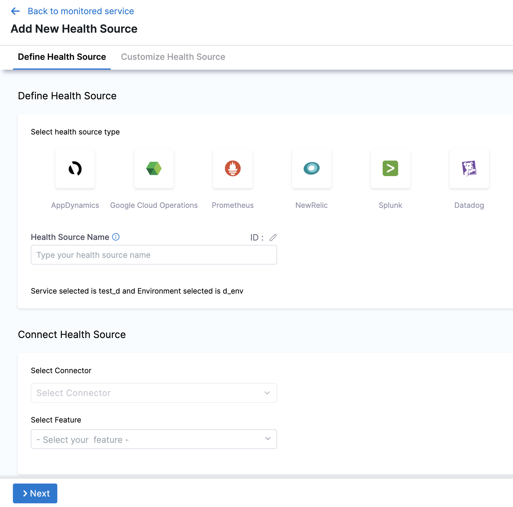
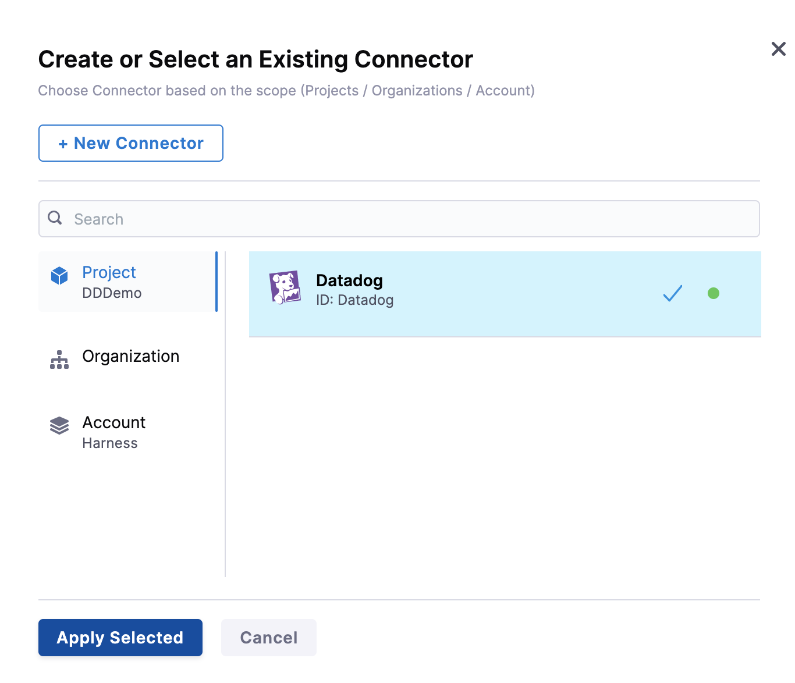
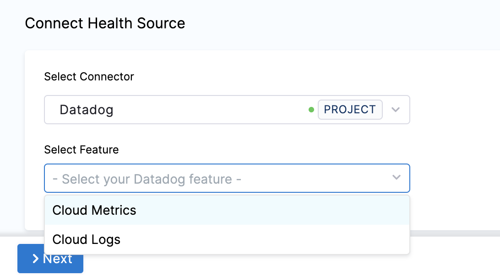
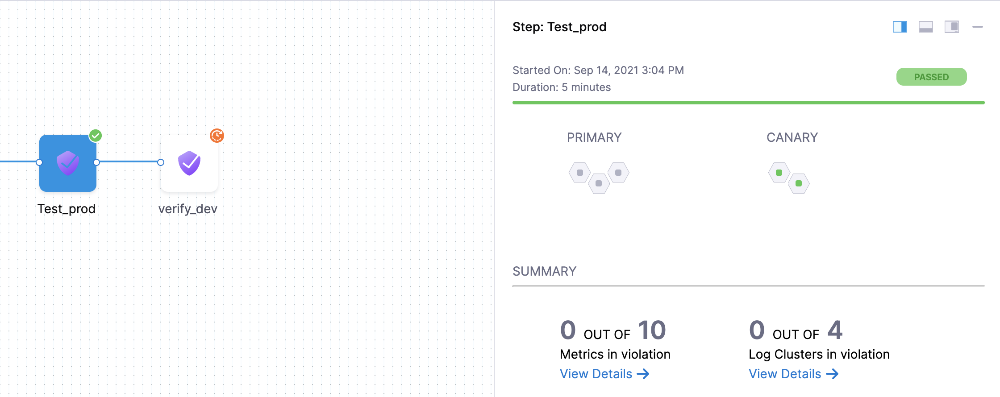
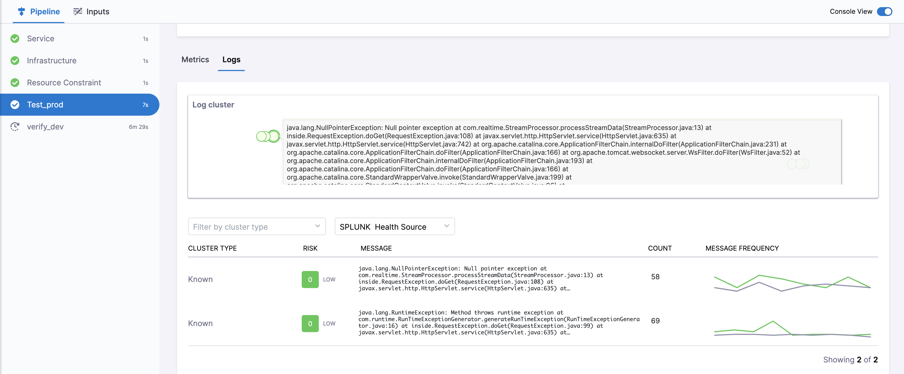

Harness CV integrates with Datadog to:

* Verify if the deployed service is running safely and performing automatic rollbacks.
* Apply machine learning to every deployment to identify and flag anomalies in future deployments.

This topic covers how to add and configure Datadog as a Health Source for the Verify step.

## Before You Begin

[Add Datadog as a verification provider](/docs/platform/Connectors/Monitoring-and-Logging-Systems/connect-to-monitoring-and-logging-systems#add-datadog)

## Review: CV Setup Options

To use the Verify step, you will need a Harness Service Reliability Management Monitored Service. In the simplest terms, a Monitored Service is basically a mapping of a Harness Service to a service monitored by your APM or logging tool.

You can set up a Monitored Service in the Service Reliability Management module or in the Verify step in a CD stage. The process is the same.

No matter where you set up the Monitored Service, once it's set up, it's available to both Service Reliability Management and CD modules.

In this topic we'll set up the Monitored Service as part of the **Verify** step.

## Step 1: Add Verify Step

There are two ways to add the Verify step:

* **When selecting the stage deployment strategy:**  
The **Verify** step can be enabled in a CD stage the first time you open the **Execution** settings and select the deployment strategy. When you select the deployment strategy you want to use, there is also an **Enable Verification** option. Select the **Enable Verification** option.  
Harness will automatically add the **Verify** step. For example, here is a stage where Canary strategy and the **Enable Verification** option were selected.
* **Add the Verify step to an existing Execution setup:** You can also add the Verify step to the Execution section of a CD stage in a Pipeline you previously created. Simply click **Add Step** after the deployment step, and then select **Verify**.

## Step 2: Enter Name and Timeout

In **Name**, enter a name for the step.

In **Timeout**, enter a timeout value for the step.

You can use:

* `w` for weeks
* `d` for days
* `h` for hours
* `m` for minutes
* `s` for seconds
* `ms` for milliseconds

The maximum is `53w`.Timeouts can be set at the Pipeline level also.

## Step 3: Select a Continuous Verification Type

In **Continuous Verification Type**, select a type that matches your [deployment strategy](./../verify-deployments-with-the-verify-step.md#continuous-verification-type).


## Step 4: Create a Monitored Service

In **Monitored Service**, click **Click to autocreate a monitored service**.

Harness automatically creates a monitored service using a concatenation of the service and environment names. For example, a service named `todolist` and an environment named `dev` results in a monitored service with the name `todolist_dev`.

:::note

The option to auto-create a monitored service is not available if you have configured either a service, an environment, or both as runtime values. When you run the pipeline, Harness concatenates the service and environment values you enter in the runtime inputs screen and generates a monitored service name. If a monitored service with the same name exists, Harness assigns it to the pipeline. If no monitored service that matches the generated monitored service name exists, Harness skips the verification step. 

For example, suppose you enter the service as `todolist` and the environment as `dev`. In that case, Harness generates the monitored service name `todolist_dev`, checks whether a monitored service with the name `todolist_dev` is available, and assigns it to the pipeline. If no monitored service is available with the name `todolist_dev`, Harness skips the verification step.

:::

## Step 5: Add Health Sources

This option is available only if you have configured the service and environment as fixed values.

A Health Source is basically a mapping of a Harness Service to the service in a deployment environment monitored by an APM or logging tool.

In **Health Sources**, click **Add**. The **Add New Health Source** settings appear.



In **Select health source type**, select Datadog.

In **Health Source Name**, enter a name for the Health Source.

Under **Connect Health Source**, click **Select Connector**.

In **Connector** settings, you can either choose an existing connector or click **New Connector.**



Click **Apply Selected**. The Connector is added to the Health Source.

In **Select Feature**, select the Datadog feature to be used. You can choose **Cloud Metrics** or **Cloud Logs**.



Click **Next**.

The subsequent settings in **Customize Health Source** depend on the Health Source Type you selected. ### Option: Cloud Metrics

If you select **Cloud Metrics**, the **Select Dashboards** settings appear. It displays a list of Datadog dashboards.


Click the dashboards of your choice. If you don't have any preexisting dashboards or don't want to select the ones in the displayed result, click **Manually input query.**

Click **Next** and the **Customize Health Source** settings appear.

Select a query from the options displayed on the left side of setting panel. The specification of the selected query auto-populates in the fields under **Query Specifications**.


Click **Submit**. The Health Source is displayed in the Verify step.

### Configure Datadog formulas as Harness queries

:::info note 

Currently,this feature is behind the feature flag SRM_DATADOG_METRICS_FORMULA_SUPPORT. Contact [Harness Support](mailto:support@harness.io) to enable the feature.

:::


In manual query mode, the Datadog metrics health source provides support for formulas.
These formulas follow a specific format: 

```Query a ; Query b ; Formula using a, b```

* Query a: "Query-with-a"
* Query b: "Query-with-a"
* The formula is "(a/b) * 100 - 5"

Let's consider an example to illustrate this:


```
kubernetes.cpu.usage{cluster-name:chi-play};kubernetes.memory.total{cluster-name:chi-play};(a/b) * 100 - 5
```


In the example above, 'a' and 'b' represent the respective queries:

* a = kubernetes.memory.usage{cluster-name:chi-play}
* b = kubernetes.memory.total{cluster-name:chi-play}

You can use multiple queries represented by alphabetical variables (example: a, b, c, and so on) in the final formula, but only one formula is allowed per query.


## Option: Cloud Logs

Select Cloud Logs and click **Next.** The **Customize Health Source** settings appear.

You can customize the metrics to map the Harness Service to the monitored environment in **Query Specifications and Mapping** settings.

Click **Map Queries to Harness Services** dropdown.


Enter a name for the query in **Name your Query**.

In **Log Indexes**, select a log index from the list.

In **Service Instance Identifier**, click the drop-down to select the path of the service instance.

Click **Submit**. The Health Source is displayed in the Verify step.

## Step 6: Select Sensitivity

In **Sensitivity**, select **High**, **Medium**, or **Low** based on the risk level used as failure criteria during the deployment.

## Step 7: Select Duration

Select how long you want Harness to analyze and monitor the logs/APM data points. Harness waits for 2-3 minutes to allow enough time for the data to be sent to the APM/logging tool before it analyzes the data. This wait time is a standard with monitoring tools.

The recommended **Duration** is **10 min** for logging providers and **15 min** for APM and infrastructure providers.### Step 8: Specify Artifact Tag

In **Artifact Tag**, use a [Harness expression](/docs/platform/variables-and-expressions/harness-variables/)

The expression `<+serviceConfig.artifacts.primary.tag>` refers to the primary artifact.

## Option: Advanced Settings

In **Advanced**, you can select the following options:

* [Step Skip Condition Settings](/docs/platform/pipelines/w_pipeline-steps-reference/step-skip-condition-settings/)
* [Step Failure Strategy Settings](/docs/platform/pipelines/w_pipeline-steps-reference/step-failure-strategy-settings/)
* [Select Delegates with Selectors](/docs/platform/delegates/manage-delegates/select-delegates-with-selectors/)


## Step 9: Deploy and Review Results

After setting up the **Verify** step, click **Apply Changes**.

Click **Run** to run the pipeline.

In **Run Pipeline**, select the tag for the artifact if a tag was not added in the **Artifact Details** settings.

Click **Run Pipeline**.

When the Pipeline is running, click the **Verify** step. You can see that the verification takes a few minutes.

Once verification is complete, the Verify step shows the following:



The risk level might initially display a number of violations, but the red and orange colored host often change to green over the duration.

### Summary

The **Summary** section shows the number of logs and metrics that are in violation.

### Console View

Click **Console View** or simply click **View Details** in **Summary** to take a deeper look at verification.



Click **Filter by Cluster Type** to drill down the metrics based on known events, unknown events, or unexpected frequency.

