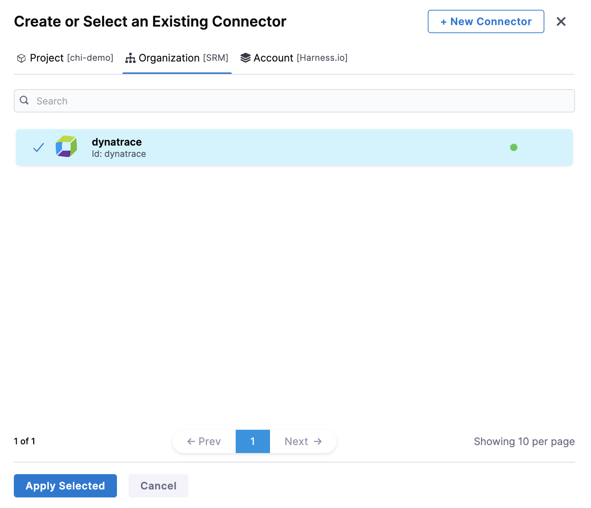
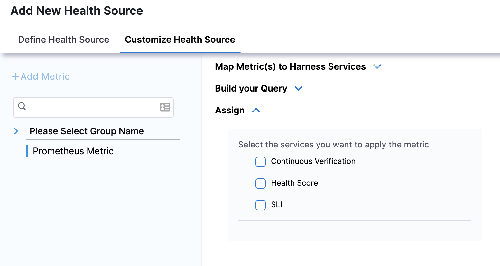
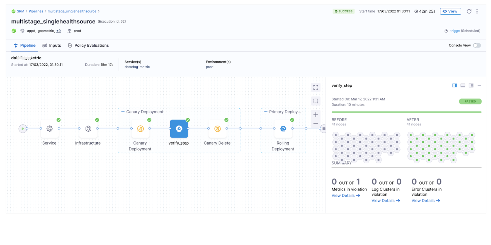
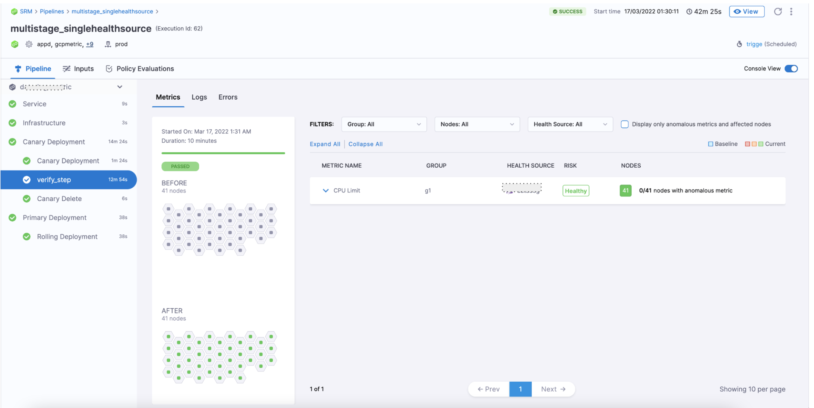

Harness CV integrates with Dynatrace to:

* Verify that the deployed service is running safely and performing automatic rollbacks.
* Apply machine learning to every deployment to identify and flag anomalies in future deployments.

This topic covers how to add and configure Dynatrace as a Health Source for the Verify step.

:::important
When creating a Dynatrace query:

- Mark the service as a key request.

- Ensure that the entity selector for metrics is a service or service method.
:::

## Before You Begin

[Add Dynatrace as a verification provider](/docs/platform/Connectors/Monitoring-and-Logging-Systems/connect-to-monitoring-and-logging-systems#step-add-dynatrace)

:::info
To allow Harness to access Dynatrace metrics through the Dynatrace API, you must label the metrics as [key requests](https://www.dynatrace.com/support/help/platform-modules/applications-and-microservices/services/analysis/monitor-key-requests).
:::

## Review: CV Setup Options

To use the Verify step, you will need a Harness Service Reliability Management Monitored Service. In the simplest terms a Harness Monitored Service is a Service and Environment combination, that Harness monitors for:

* Any changes, such as deployments, infrastructure changes, and incidents
* Any health trend deviations using logs and metrics obtained from APM and Logging tools respectively

No matter where you set up the Monitored Service, once it's set up, it's available to both Service Reliability Management and CD modules.

In this topic, we set up the Harness Monitored Service as part of the Verify step setup.

## Step 1: Add Verify Step

There are two ways to add the Verify step:

* **When selecting the stage deployment strategy:**  
The **Verify** step can be enabled in a CD stage the first time you open the **Execution** settings and select the deployment strategy. When you select the deployment strategy you want to use, there is also an **Enable Verification** option. Select the **Enable Verification** option.  
Harness will automatically add the **Verify** step. For example, here is a stage where Canary strategy and the **Enable Verification** option were selected.
* **Add the Verify step to an existing Execution setup:** You can also add the Verify step to the Execution section of a CD stage in a Pipeline you previously created. Simply click **Add Step** after the deployment step, and then select **Verify**.

## Step 2: Enter a Name and Timeout

In **Name**, enter a name for the step.

In **Timeout**, enter a timeout value for the step.

You can use:

* `w` for weeks
* `d` for days
* `h` for hours
* `m` for minutes
* `s` for seconds
* `ms` for milliseconds

The maximum is `53w`. Timeouts can be set at the Pipeline level also.

**Node filtering**

:::info note
Currently, this feature is behind the feature flag `CV_UI_DISPLAY_NODE_REGEX_FILTER`. Contact Harness Support to enable the feature.
:::

This feature allows you to be more specific in node filtering by using Kubernetes PodName as a label. You can make analysis more explicit by telling CV which nodes to filter on. Just specify the filters on the control nodes (nodes that test nodes are compared against) and the test nodes (nodes CV checks).

To filter the nodes:

1. Expand **Optional**.

2. Choose **Control Nodes** and **Test Nodes** that Harness CV should focus on during analysis. You can either type a node’s name or use a simple pattern (Regex) to define the nodes you want to filter.
   

## Step 3: Select a Continuous Verification Type

In **Continuous Verification Type**, select a type that matches your [deployment strategy](./../verify-deployments-with-the-verify-step.md#continuous-verification-type).

## Step 4: Create a Monitored Service

In **Monitored Service**, click **Click to autocreate a monitored service**.

:::note

The option to auto-create a monitored service is not available if you have configured either a service, an environment, or both as runtime values. When you run the pipeline, Harness concatenates the service and environment values you enter in the runtime inputs screen and generates a monitored service name. If a monitored service with the same name exists, Harness assigns it to the pipeline. If no monitored service that matches the generated monitored service name exists, Harness skips the verification step. 

For example, suppose you enter the service as `todolist` and the environment as `dev`. In that case, Harness generates the monitored service name `todolist_dev`, checks whether a monitored service with the name `todolist_dev` is available, and assigns it to the pipeline. If no monitored service is available with the name `todolist_dev`, Harness skips the verification step.

:::

## Step 5: Add Health Sources

This option is available only if you have configured the service and environment as fixed values.

A Health Source is basically a mapping of a Harness Monitored Service to the Service in a deployment environment monitored by an APM or logging tool.

In **Health Sources**, click **Add**. The **Add New Health Source** settings appear.

1. In **Select health source type**, select **Dynatrace**.
2. In **Health Source Name**, enter a name for the Health Source. For example Quickstart.
3. Under **Connect Health Source**, click **Select Connector**.
4. In **Connector** settings, you can either choose an existing connector or click **New Connector** to create a new **Connector.**
   
   

5. After selecting the connector, click **Apply Selected**. The Connector is added to the Health Source.
6. In **Select Feature**, a Dynatrace feature is selected by default.
7. Click **Next**. The **Customize Health Source** settings appear.
   
   The subsequent steps in **Customize Health Source** depend on the Health Source type you selected.
   
   
   	
8. In **Find a Dynatrace service**, enter the name of the desired Dynatrace service.
9.  In **Select Metric Packs to be monitored,** you can select **Infrastructure** or **Performance** or both.
10. Click **Add Metric** if you want to add any specific metric to be monitored (optional) or simply click **Submit.**
11. If you click Add Metric, click **Map Metric(s) to Harness Services**.
12. In **Metric Name**, enter the name of the metric.
13. In **Group Name**, enter the group name of the metric.
14. Click **Query Specifications and mapping**.
15. In **Metric**, choose the desired metric from the list.
16. Click **Fetch Records** to retrieve data for the provided query.
17. In **Assign**, choose the services for which you want to apply the metric. Available options are:
	* Continuous Verification
	* Health Score
	* SLI
18. In **Risk Category**, select a risk type.
19. In **Deviation Compared to Baseline**, select one of the options based on the selected risk type.
    
20. Click **Submit**. The Health Source is displayed in the Verify step.

You can add one or more Health Sources for each APM or logging provider.

## Step 6: Select Sensitivity

1. In **Sensitivity**, select **High**, **Medium**, or **Low** based on the risk level used as failure criteria during the deployment.

## Step 7: Select Duration

Select how long you want Harness to analyze and monitor the logs/APM data points. Harness waits for 2-3 minutes to allow enough time for the data to be sent to the APM/logging tool before it analyzes the data. This wait time is a standard with monitoring tools.

The recommended **Duration** is **10 min** for logging providers and **15 min** for APM and infrastructure providers.### Step 8: Specify Artifact Tag

In **Artifact Tag**, use a [Harness expression](..//..platform/../../../platform/12_Variables-and-Expressions/harness-variables.md)

The expression `<+serviceConfig.artifacts.primary.tag>` refers to the primary artifact.

## Option: Advanced Settings

In **Advanced**, you can select the following options:

* [Step Skip Condition Settings](../../platform/../../platform/8_Pipelines/w_pipeline-steps-reference/step-skip-condition-settings.md)
* [Step Failure Strategy Settings](../../platform/../../platform/8_Pipelines/w_pipeline-steps-reference/step-failure-strategy-settings.md)
* [Select Delegates with Selectors](../../platform/../../platform/2_Delegates/manage-delegates/select-delegates-with-selectors.md)

## Step 9: Deploy and Review Results

When you are done setting up the **Verify** step, click **Apply Changes**.

Now you can run the Pipeline. Click **Run**.

In **Run Pipeline**, select the tag for the artifact if a tag was not added in the **Artifact Details** settings.

Click **Run Pipeline**.

When the Pipeline is running, click the **Verify** step.

The verification takes a few minutes.

The risk level might initially display a number of violations, but often changes over the duration.

### Summary

The **Summary** section shows the number of metrics that are in violation.

### Console View

Click **Console View** or simply click **View Details** in **Summary** to take a deeper look at verification.

If you have more than one Health Source, you can use the **Health Source** dropdown to select each one.

