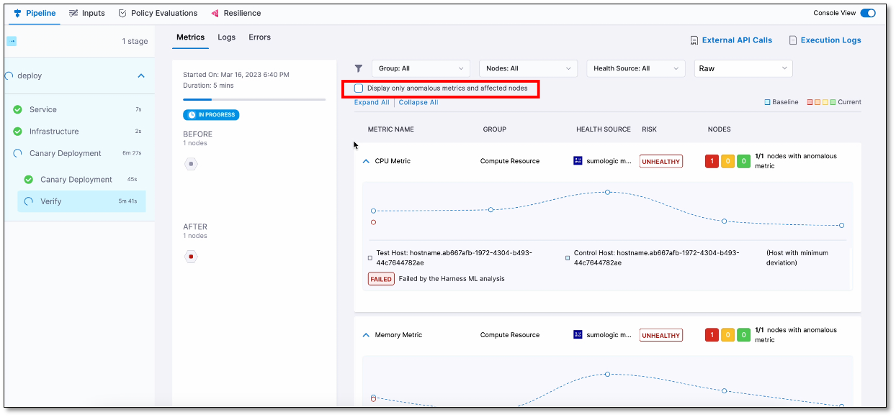
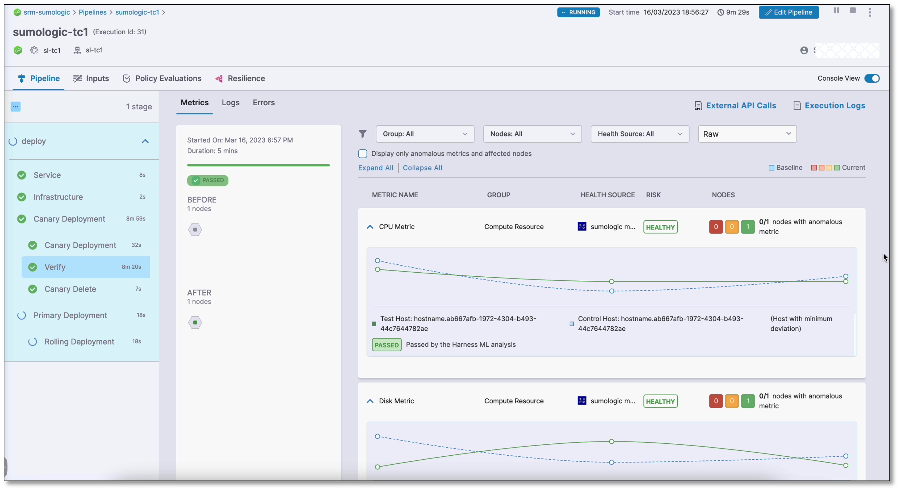
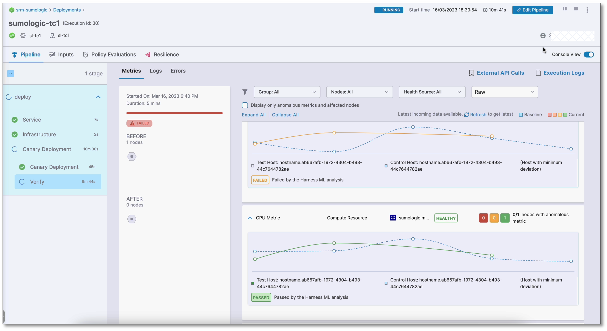

```mdx-code-block
import Tabs from '@theme/Tabs';
import TabItem from '@theme/TabItem';
```


Harness Continuous Verification (CV) integrates with Elasticsearch to:

* Verify that the deployed service is running safely and performing automatic rollbacks.
* Apply machine learning to every deployment to identify and flag anomalies in future deployments.

This topic describes how to set up an Elasticsearch health source when adding a CV step to your Continuous Deployment (CD).


:::important
- Harness only supports the Lucene query language. 

- Use the Java-supported format when specifying dates in a query.
:::


## Prerequisite

Elasticsearch is added as a verification provider in Harness.


## Set up continuous verification

To set up CV, you need to configure a Service Reliability Management (SRM)-monitored service. A monitored service is a mapping of a Harness service to a service that is being monitored by your Application Performance Monitoring (APM) or logging tool.


## Add Verify Step

To add a Verify step to your pipeline, use one of the methods below.


### Add a Verify step while building a deployment stage

If you're building a deployment stage and currently on the **Execution Strategies** page:

1. Select the **Enable Verification** option. 
    
   The Verify step gets added to the pipeline.

2. Select the **Verify** step.  
   
   The Verify settings page appears.


### Add a Verify step to an existing deployment stage

If you already have a deployment stage:

1. Select the stage where you want to add the Verify step.
   
2. On the stage settings pane, select the **Execution** tab.
3. On the pipeline, hover over where you want the Verify step, select the + icon, and then choose **Add Step**.  

   The Step Library page appears.
You can add a step at various points in the pipeline such as the beginning, end, in between existing steps, or below an existing step. Simply choose the location where you want to add the step and follow the prompts to add it.

4. In the **Continuous Verification** section, select **Verify**.  
   
   The Verify settings page appears.

## Define name and time out information

1. In **Name**, enter a name for the Verification step.
   
2. In **Timeout**, enter a timeout value for the step. Harness uses this information to time out the verification. Use the following syntax to define timeout:
   - **w** for weeks. For example, to define one week, enter 1w.
   - **d** for days. For example, to define 7 days, enter 7d.
   - **h** for hours. For example, to define 24 hours, enter 24h.
   - **m** for minutes, For example, to define 100 minutes, enter 100m.
   - **s** for seconds. For example, to define 500 seconds, enter 500s.
   - **ms** for milliseconds. For example, to define 1000 milliseconds, enter 1000ms.

3. The maximum timeout value you can set is **53w**. You can also set timeouts at the pipeline level.

4. Expand **Optional** and specify the desired **Control Nodes** and **Test Nodes** that Harness CV should consider for analysis. When dealing with a large number of nodes, you can optimize the analysis process by filtering the nodes that need to be examined using CV. This can be done by specifying control nodes (nodes against which the test nodes are verified) and test nodes (the nodes that CV tests). You can enter either a specific node name or use a regular expression (Regex) to define the nodes to be filtered.
 

## Select a continuous verification type, sensitivity, and duration

1. In **Continuous Verification Type**, select a type that matches your deployment strategy. The following options are available:
   
   - **Auto**: Harness automatically selects the best continuous verification type based on the deployment strategy.
   - **Rolling Update**: Rolling deployment is a deployment technique that gradually replaces old versions of a service with a new version by replacing the infrastructure on which the service runs. Rolling updates are useful in situations where a sudden changeover might cause downtime or errors.
   - **Canary**: Canary deployment involves a two-phased deployment. In phase one, new pods and instances with the new service version are added to a single environment. In phase two, a rolling update is performed in the same environment. Canary deployment helps to detect issues with the new deployment before fully deploying it.
   - **Blue Green**: Blue-green deployment is a technique used to deploy services to a production environment by gradually shifting user traffic from an old version to a new one. The previous version is referred to as the blue environment, while the new version is known as the green environment. Upon completion of the transfer, the blue environment remains on standby in case of a need for rollback or can be removed from production and updated to serve as the template for future updates.
   - **Load Test**: Load testing is a strategy used in lower-level environments, such as quality assurance, where a consistent load is absent and deployment validation is typically accomplished through the execution of load-generating scripts. This is useful to ensure that the application can handle the expected load and validate that the deployment is working as expected before releasing it to the production environment.

2. In **Sensitivity**, choose the sensitivity level. The available options are **High**, **Medium**, and **Low**. When the sensitivity is set to high, even minor anomalies are treated as verification failures. When the sensitivity is set to **High**, any anomaly, no matter how small, will be treated as a verification failure. This ensures that even the slightest issue is detected and addressed before releasing the deployment to production.
   
3. In **Duration**, choose a duration. Harness will use the data points within this duration for analysis. For instance, if you select 10 minutes, Harness will analyze the first 10 minutes of your log or APM data. It is recommended to choose 10 minutes for logging providers and 15 minutes for APM and infrastructure providers. This helps you thoroughly analyze and detect issues before releasing the deployment to production.
   
4. In the **Artifact Tag** field, reference the primary artifact that you added in the **Artifacts** section of the Service tab. Use the Harness expression `<+serviceConfig.artifacts.primary.tag>` to reference this primary artifact. To learn about artifact expression, go to [Harness expression](..//..platform/../../../platform/12_Variables-and-Expressions/harness-variables.md).
   
5. Select **Fail On No Analysis** if you want the pipeline to fail if there is no data from the health source. This ensures that the deployment fails when there is no data for Harness to analyze.


## Create a monitored service

Harness Continuous Verification monitors the health trend deviations using logs and metrics obtained from the health source, such as APM and logging tools, via a monitored service.

To create a monitored service:

1. In the **Monitored Service Name** section, select **Click to autocreate a monitored service**.

      Harness automatically generates a monitored service name by combining the service and environment names. The generated name appears in the **Monitored Service Name** field. Note that you cannot edit the monitored service name.

If a monitored service with the same name and environment already exists, the **Click to autocreate a monitored service** option is hidden and the existing monitored service is assigned to the Verify step by Harness.

:::info note

If you've set up a service or environment as runtime values, the auto-create option for monitored services won't be available. When you run the pipeline, Harness combines the service and environment values to create a monitored service. If a monitored service with the same name already exists, it will be assigned to the pipeline. If not, Harness skips the Verification step.

For instance, if you input the service as `todolist` and the environment as `dev`, Harness creates a monitored service with the name `todolist_dev`. If a monitored service with that name exists, Harness assigns it to the pipeline. If not, Harness skips the Verification step.

:::


## Add a health source

A health source is an APM or logging tool that monitors and aggregates data in your deployment environment.

### Define health source

To add a health source:

1. In the **Health Sources** section, select **+ Add New Health Source**.
   
   The Add New Health Source dialog appears.

2. On the **Define Health Source** tab, do the following:
      1. In the **Define Health Source** section, select **ElasticSearch** as health source type.
      2. In the **Health Source Name** field, enter a name for the health source.
      3. In the **Connect Health Source** section, select **Select Connector**.  
     The Create or Select an Existing Connector dialog appears.
      1. Select a connector for the Elasticsearch health source and then select **Apply Selected**.  
     The selected connector appears in the **Select Connector** dropdown.
      1. Select **Next**.  
      
         The **Configuration** tab appears.


:::info note
Currently, Harness supports only Elasticsearch logs. The **ElasticSearch Logs** option is selected by default in the **Select Feature** field.
:::

   

### Define log configuration settings

1. On the Configuration tab, select **+ Add Query**.  
   
   The Add Query dialog appears.

2. Enter a name for the query and then select **Submit**.  
   
   The query that you added gets listed under the Logs Group. The Custom Queries settings are displayed.
   These settings help you retrieve the desired logs from the Elasticsearch platform and map them to the Harness service. 

#### Define a query

1. In the **Query Specifications and Mapping** section, select a log index from the **Log Indexes** list.
   
2. In the **Query** field, enter a log query and select **Run Query** to execute it.
   
    A sample record in the **Records** field. This helps you confirm the accuracy of the query you've constructed.
   
3. In the **Field Mapping** section, map the following identifiers to select the data that you want to be displayed from the logs.
   - **Timestamp Identifier**
   - **Service Instance Identifier**
   - **Message Identifier**
   - **Timestamp Format**

   To define mapping, in each identifier field, do the following:

   1. Select **+**. 
    
      The Select path for Service Instance Identifier page appears.

   2. Go to the identifier value that you want to map and choose **Select**.  
   
      The selected value gets mapped to the corresponding identifier field. 

4. Select **Get sample log messages**.  
   
   Sample logs are displayed that help you verify if the query you built is correct.


### Save the health source settings

1. After configuring all the settings, select **Submit** to add the health source to the Verify step.
   
2. Select **Apply Changes** to save the changes made to the Verify step.

## Run the pipeline

To run the pipeline:

1. In the upper-right corner, select **Run**.  
   
   The Run Pipeline dialog box appears.

2. In the dialog box, do the following:
   - **Tag**: If you did not add a tag in the** Artifact Details** settings, select it now.
   - **Skip preflight check**: Select this option if you want to skip the preflight check.
   - **Notify only me about execution status**: Select this option if you want Harness to alert only you about the execution status.
  
3. Select **Run Pipeline**.  
   
   The pipeline starts running.

## View results

The Summary section displays the following details when the Verify step begins:

- Metrics in violation
- Log Clusters in violation
- Error Clusters in violation

Note that it may take some time for the analysis to begin. The screenshot below shows a Verification step running in a deployment:


## Console view

The console view displays detailed logs of the pipeline, including verification logs. To view the console, select **View Details** in the **Summary** section or turn on the **Console View** toggle switch in the upper-right corner.


By default, the console displays logs of only the anomalous metrics and affected nodes. To see all logs, clear the **Display only anomalous metrics and affected nodes** check box.



The following screenshots show successful and failed verifications in a deployment run:

**Successful verification**



**Failed verification**




