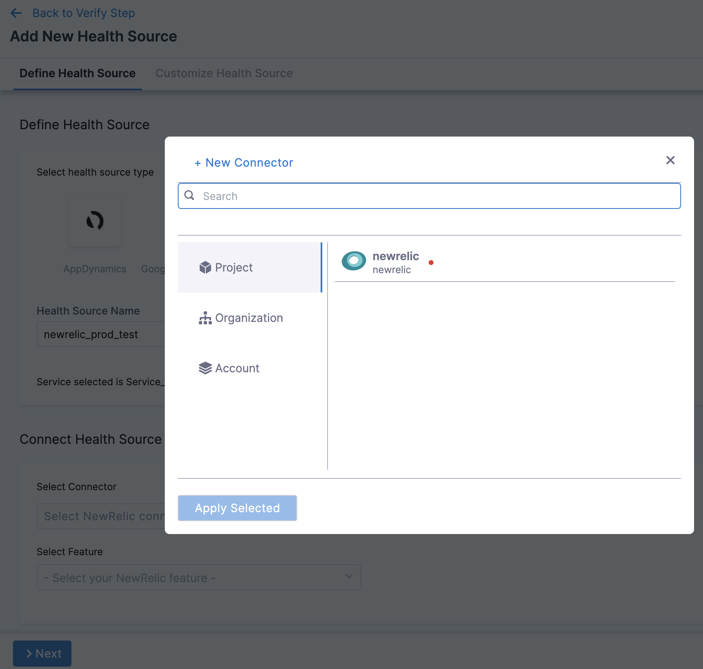
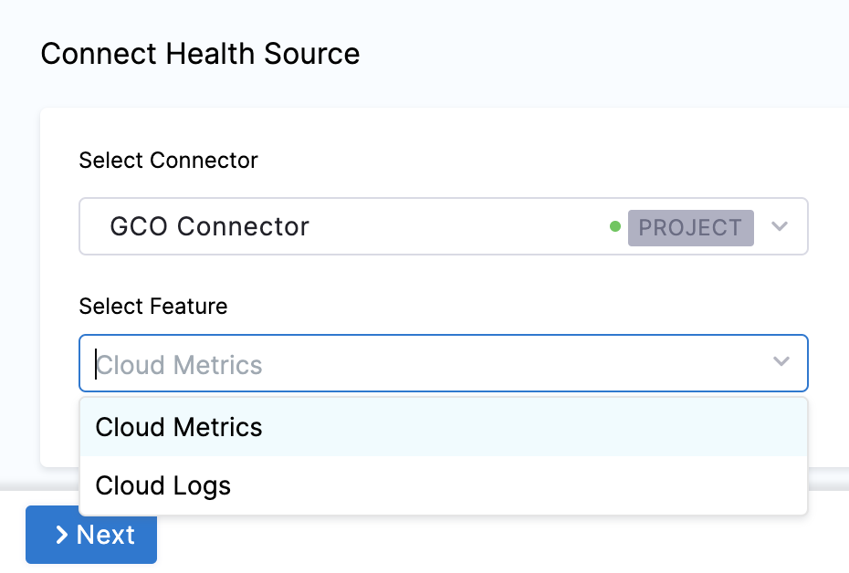
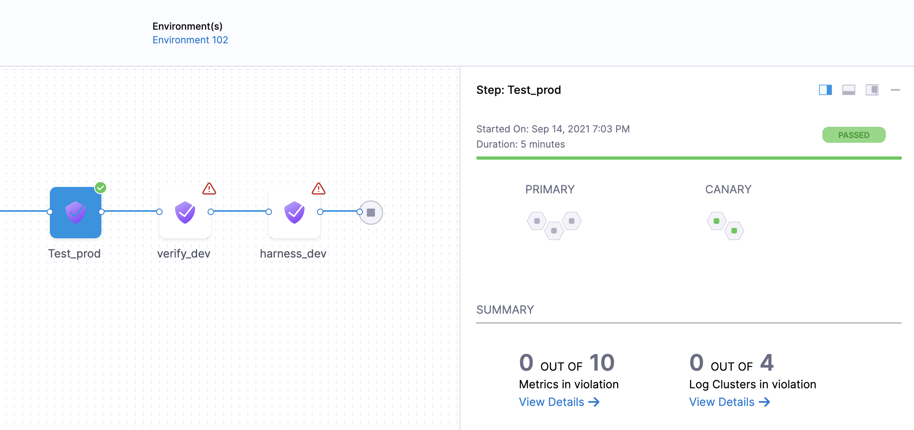
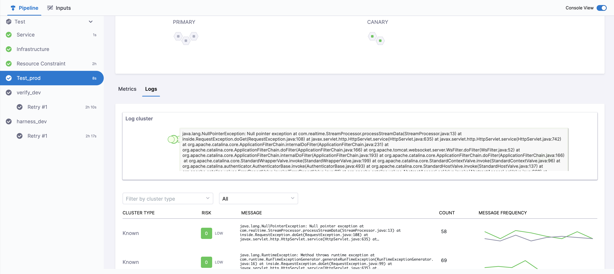

Harness CV integrates with Google Cloud Operations to:

* Verify that the deployed service is running safely and performing automatic rollbacks.
* Apply machine learning to every deployment to identify and flag anomalies in future deployments.

This topic covers how to add and configure Google Cloud Operations as a Health Source for the Verify step.

Google Cloud Operations Suite was formerly known as Stackdriver.

## Before You Begin

- [Add Google Cloud Operations as a verification provider](/docs/platform/Connectors/Monitoring-and-Logging-Systems/connect-to-monitoring-and-logging-systems)

- To configure GCP metrics as a health source in Harness, you should first create a GCP dashboard and then import it.

## Review: CV Setup Options

To use the Verify step, you will need a Harness Service Reliability Management Monitored Service. In the simplest terms, a Monitored Service is basically a mapping of a Harness Service to a service monitored by your APM or logging tool.

You can set up a Monitored Service in the Service Reliability Management module or in the Verify step in a CD stage. The process is the same.

No matter where you set up the Monitored Service, once it's set up, it's available to both Service Reliability Management and CD modules.

In this topic we'll set up the Monitored Service as part of the **Verify** step.

## Step 1: Add Verify Step

There are two ways to add the Verify step:

* **When selecting the stage deployment strategy:**  
The **Verify** step can be enabled in a CD stage the first time you open the **Execution** settings and select the deployment strategy. When you select the deployment strategy you want to use, there is also an **Enable Verification** option. Select the **Enable Verification** option.  
Harness will automatically add the **Verify** step. For example, here is a stage where Canary strategy and the **Enable Verification** option were selected.
* **Add the Verify step to an existing Execution setup:** You can also add the Verify step to the Execution section of a CD stage in a Pipeline you previously created. Simply click **Add Step** after the deployment step, and then select **Verify**.

## Step 2: Enter a Name and Timeout

In **Name**, enter a name for the step.

In **Timeout**, enter a timeout value for the step.

You can use:

* `w` for weeks
* `d` for days
* `h` for hours
* `m` for minutes
* `s` for seconds
* `ms` for milliseconds

The maximum is `53w`. Timeouts can be set at the Pipeline level also.

### Node filtering

:::info note
Currently, this feature is behind the feature flag `CV_UI_DISPLAY_NODE_REGEX_FILTER`. Contact Harness Support to enable the feature.
:::

The node filtering feature allows you to select specific nodes within your Kubernetes environment using the PodName label. This allows for focused analysis, enabling you to choose specific nodes as service instances for in-depth analysis.

Harness CV autonomously identifies new nodes as they are added to the cluster. However, the node filtering feature allows you to focus the analysis explicitly on the nodes that you want to analyze. Imagine you have a Kubernetes cluster with multiple nodes, and you want to analyze the performance of pods running on specific nodes. You want to analyze the nodes that match a certain naming pattern.

Procedure:

1.	On the Verify settings page, expand **Optional** to navigate to the node filtering settings section.

2.	(Optional) Select **Use node details from CD** if you want Harness CV to collect and analyze the metrics and log details for the recently deployed nodes.

3.	Specify the **Control Nodes** and **Test Nodes**:

      - **Control Nodes**: These are the nodes against which the test nodes are compared. You can specify the control nodes to provide a baseline for analysis.
      
      - **Test Nodes**: These are the nodes that Harness CV evaluates and compares against the control nodes.

      To specify the **Control Nodes** and **Test Nodes**, in one of the following ways:

         - Type node names: Enter the names of specific nodes you want to include in the analysis.
         
         - Use simple patterns (Regex): Define a regular expression pattern to match the nodes you want to filter. For example, if your nodes follow a naming convention such as "node-app-1", "node-app-2", and so on, you could use a pattern such as "node-app-*" to include all nodes with names starting with "node-app-".

      Example: Let's say you want Harness CV to analyze the only nodes that have "backend" in their PodName label:
         
         1. In the Control Nodes field, enter "backend-control-node" as the control node.
      
         2. In the Test Nodes field, enter the pattern "backend-*" to include all nodes with names starting with "backend-".

## Step 3: Select a Continuous Verification Type

In **Continuous Verification Type**, select a type that matches your [deployment strategy](./../verify-deployments-with-the-verify-step.md#continuous-verification-type).

## Step 4: Create a Monitored Service

In **Monitored Service**, click **Click to autocreate a monitored service**.

:::note

The option to auto-create a monitored service is not available if you have configured either a service, an environment, or both as runtime values. When you run the pipeline, Harness concatenates the service and environment values you enter in the runtime inputs screen and generates a monitored service name. If a monitored service with the same name exists, Harness assigns it to the pipeline. If no monitored service that matches the generated monitored service name exists, Harness skips the verification step. 

For example, suppose you enter the service as `todolist` and the environment as `dev`. In that case, Harness generates the monitored service name `todolist_dev`, checks whether a monitored service with the name `todolist_dev` is available, and assigns it to the pipeline. If no monitored service is available with the name `todolist_dev`, Harness skips the verification step.

:::

## Step 5: Add Health Sources

This option is available only if you have configured the service and environment as fixed values.

A Health Source is basically a mapping of a Harness Service to the service in a deployment environment monitored by an APM or logging tool.

In **Health Sources**, click **Add**. The **Add New Health Source** settings appear.

1. In **Select health source type**, select Google Cloud Operations.
   
   

2. In **Health Source Name**, enter a name for the Health Source.
3. Under **Connect Health Source**, click **Select Connector**.
4. In **Connector** settings, you can either choose an existing connector Gcp connector or click **New Connector.**
   

5. Click **Apply Selected**. The Connector is added to the Health Source.
6. In **Select Feature**, select the feature to be used.

The subsequent settings in **Customize Health Source** depend on the Health Source Type you selected. 

## Option: Cloud Metrics

1. Select Cloud Metrics and click **Next.** The **Select Dashboard** settings appear.
2. Click one or more dashboards from the displayed results. If you don't have any preexisting dashboards or don't want to select the ones in the displayed result, click **Manually input query.**
   
3. Click **Next** and the **Customize Health Source** settings appear.
4. Select a query from the options displayed on the left side of setting panel. The specification of the selected query auto-populates in the fields under **Query Specifications**.
   
5. In **Configure Risk Profile**, select one of the following risk types in **Risk Category**:
   
   | Risk Type | Type of Values | Deviation Type | Default Delta | Default Ratio |
   | --- | --- | --- | --- | --- |
   | Error | Web / Business transactions | Higher is bad | 0 | 0 |
   | Infrastructure | Cpu, memory .... | Higher and Lower is bad | 20 | 0.2 |
   | Performance/Other | Cpu, memory .... | Higher and Lower is bad | 20 | 0.2 |
   | Performance/Throughput | Web / Business transactions | Lower is bad | 20 | 0.2 |
   | Performance/Response time | Web / Business transactions | Higher is bad | 20 | 0.2 |

6. In **Deviation Compared to Baseline**, select one of the options based on the selected risk type.
7. Click **Submit**. The Health Source is displayed in the Verify step.

## Option: Cloud Logs

Select Cloud Logs and click **Next.** The **Customize Health Source** settings appear.

You can customize the metrics to map the Harness Service to the monitored environment in **Query Specifications and Mapping** settings.

1. Click **Map Queries to Harness Services** drop down.
2. Enter a name for the query in **Name your Query**.
3. In **Query**, enter the query and click **Fetch Records.** The retrived results appear in **Records**.
4. In **Identify Service Instance**, click the plus icon to select the path of the service instance.
5. In **Identify Message**, click the plus icon to select the message identifier.

Click **Submit**. The Health Source is displayed in the Verify step.

You can add one or more Health Sources for each APM or logging provider.

## Step 6: Select Sensitivity

In **Sensitivity**, select **High**, **Medium**, or **Low** based on the risk level used as failure criteria during the deployment.

## Step 7: Select Duration

Select how long you want Harness to analyze and monitor the logs/APM data points. Harness waits for 2-3 minutes to allow enough time for the data to be sent to the APM/logging tool before it analyzes the data.This wait time is a standard with monitoring tools.

The recommended **Duration** is **10 min** for logging providers and **15 min** for APM and infrastructure providers.

## Step 8: Specify Artifact Tag

In **Artifact Tag**, use a [Harness expression](..//..platform/../../../platform/12_Variables-and-Expressions/harness-variables.md)

The expression `<+serviceConfig.artifacts.primary.tag>` refers to the primary artifact.

## Option: Advanced Settings

In **Advanced**, you can select the following options:

* [Step Skip Condition Settings](../../platform/../../platform/8_Pipelines/w_pipeline-steps-reference/step-skip-condition-settings.md)
* [Step Failure Strategy Settings](../../platform/../../platform/8_Pipelines/w_pipeline-steps-reference/step-failure-strategy-settings.md)
* [Select Delegates with Selectors](../../platform/../../platform/2_Delegates/manage-delegates/select-delegates-with-selectors.md)

## Step 9: Deploy and Review Results

After setting up the **Verify** step, click **Apply Changes**.

Click **Run** to run the pipeline.

In **Run Pipeline**, select the tag for the artifact if a tag was not added in the **Artifact Details** settings.

Click **Run Pipeline**.

When the Pipeline is running, click the **Verify** step.

You can see that the verification takes a few minutes.

Once verification is complete, the Verify step shows the following:

The risk level might initially display a number of violations, but the red and orange colored host often change to green over the duration.

### Summary

The **Summary** section shows the number of logs that are in violation.

### Console View

Click **Console View** or simply click **View Details** in **Summary** to take a deeper look at verification.

If you have more than one Health Source, you can use the **View** dropdown to select each one.

## Set a pinned baseline

:::info note
Currently, this feature is behind the feature flag `SRM_ENABLE_BASELINE_BASED_VERIFICATION`. Contact Harness Support to enable the feature.
:::

You can set specific verification in a successful pipeline execution as a baseline. This is available with **Load Testing** as the verification type.

### Set successful verification as a baseline

To set a verification as baseline for future verifications:

1. In Harness, go to **Deployments**, select **Pipelines**, and find the pipeline you want to use as the baseline.
   
2. Select the successful pipeline execution with the verification that you want to use as the baseline.
   
   The pipeline execution is displayed.
   
3. On the pipeline execution, navigate to the **Verify** section, and then select **Pin baseline**.
   
   The selected verification is now set as the baseline for future verifications.

### Replace an existing pinned baseline

To use a new baseline from a pipeline and replace the existing pinned baseline, follow these steps:

1. In Harness, go to **Deployments**, select **Pipelines**, and find the pipeline from which you want to remove the baseline.

2. Select the successful pipeline execution with the verification that you have previously pinned as the baseline.
   
3. On the pipeline execution, navigate to the **Verify** section, and then select **Pin baseline**.
   
   A confirmation alert message appears, asking if you want to replace the existing pinned baseline with the current verification. After you confirm, the existing pinned baseline gets replaced with the current verification.