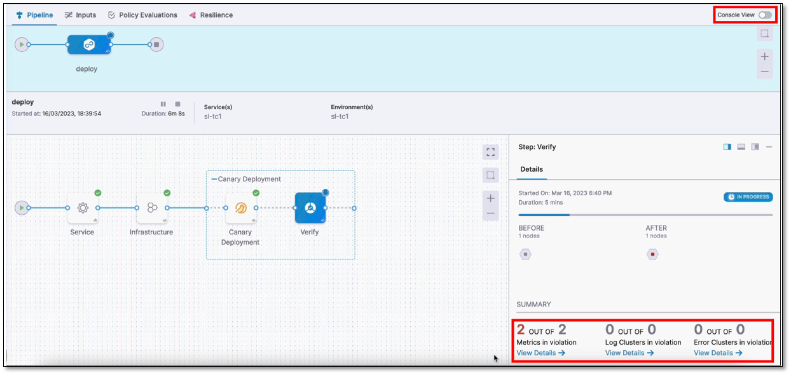

# Set up a Grafana Loki health source

```mdx-code-block
import Tabs from '@theme/Tabs';
import TabItem from '@theme/TabItem';
```

:::info note
Currently, this feature is behind the feature flag `SRM_ENABLE_GRAFANA_LOKI_LOGS`. Contact [Harness Support](mailto:support@harness.io) to enable the feature.
:::


Harness Continuous Verification (CV) integrates with Grafana Loki to:

* Verify that the deployed service is running safely and performing automatic rollbacks.
* Apply machine learning to every deployment to identify and flag anomalies in future deployments.

This topic describes how to set up a Grafana Loki health source when adding a CV step to your Continuous Deployment (CD) pipeline.


## Set up continuous verification

To set up CV, you need to configure a Service Reliability Management (SRM)-monitored service. A monitored service is a mapping of a Harness service to a service that is being monitored by your Application Performance Monitoring (APM) or logging tool.


## Add a Verify step to your CD pipeline

To add a Verify step to your pipeline, use one of the methods below.


### Add a Verify step while building a deployment stage

If you're building a deployment stage and are currently on the **Execution Strategies** page:

1. Select the **Enable Verification** option. 
    
   The Verify step gets added to the pipeline.

2. Select the **Verify** step.  
   
   The Verify settings page appears.


### Add a Verify step to an existing deployment stage

If you already have a deployment stage:

1. Select the stage where you want to add the Verify step.
   
2. On the stage settings pane, select the **Execution** tab.
3. On the pipeline, hover over where you want to add the Verify step, select the **+** icon, and then choose **Add Step**.  

   The Step Library page appears.
You can add a step at various points in the pipeline, such as the beginning, end, in between existing steps, or below an existing step. Simply choose the location where you want to add the step and follow the prompts to add it.

4. In the **Continuous Verification** section, select **Verify**.  
   
   The Verify settings page appears.

## Define name and timeout information

1. In **Name**, enter a name for the Verification step.
   
2. In **Timeout**, enter a timeout value for the step. Harness uses this information to time out the verification. Use the following syntax to define a timeout:
   - **w** for weeks.
   - **d** for days.
   - **h** for hours.
   - **m** for minutes.
   - **s** for seconds.
   - **ms** for milliseconds.

   For example, use 1w for one week, 7d for 7 days, 24h for 24 hours, 100m for 100 minutes, 500s for 500 seconds, and 1000ms for 1000 milliseconds.
   
   The maximum timeout value you can set is **53w**. You can also set timeouts at the pipeline level.

### Node filtering

:::info note
Currently, this feature is behind the feature flag `CV_UI_DISPLAY_NODE_REGEX_FILTER`. Contact Harness Support to enable the feature.
:::

The node filtering feature allows you to select specific nodes within your Kubernetes environment using the PodName label. This allows for focused analysis, enabling you to choose specific nodes as service instances for in-depth analysis.

Harness CV autonomously identifies new nodes as they are added to the cluster. However, the node filtering feature allows you to focus the analysis explicitly on the nodes that you want to analyze. Imagine you have a Kubernetes cluster with multiple nodes, and you want to analyze the performance of pods running on specific nodes. You want to analyze the nodes that match a certain naming pattern.

Procedure:

1.	On the Verify settings page, expand **Optional** to navigate to the node filtering settings section.

2.	(Optional) Select **Use node details from CD** if you want Harness CV to collect and analyze the metrics and log details for the recently deployed nodes.

3.	Specify the **Control Nodes** and **Test Nodes**:

      - **Control Nodes**: These are the nodes against which the test nodes are compared. You can specify the control nodes to provide a baseline for analysis.
      
      - **Test Nodes**: These are the nodes that Harness CV evaluates and compares against the control nodes.

      To specify the **Control Nodes** and **Test Nodes**, in one of the following ways:

         - Type node names: Enter the names of specific nodes you want to include in the analysis.
         
         - Use simple patterns (Regex): Define a regular expression pattern to match the nodes you want to filter. For example, if your nodes follow a naming convention such as "node-app-1", "node-app-2", and so on, you could use a pattern such as "node-app-*" to include all nodes with names starting with "node-app-".

      Example: Let's say you want Harness CV to analyze the only nodes that have "backend" in their PodName label:
         
         1. In the Control Nodes field, enter "backend-control-node" as the control node.
      
         2. In the Test Nodes field, enter the pattern "backend-*" to include all nodes with names starting with "backend-".

 
## Select a continuous verification type, sensitivity, and duration

1. In **Continuous Verification Type**, one of the type below:
   
   - **Auto**: Harness automatically selects the best continuous verification type based on the deployment strategy.
   
   - **Rolling Update**: Rolling deployment is a deployment technique that gradually replaces old versions of a service with a new version by replacing the infrastructure on which the service runs. Rolling updates are useful in situations where a sudden changeover might cause downtime or errors.
   
   - **Canary**: A Canary deployment involves a two-phased deployment. In phase one, new pods and instances with the new service version are added to a single environment. In phase two, a rolling update is performed in the same environment. A Canary deployment helps detect issues with the new deployment before fully deploying it.
   
   - **Blue Green**: Blue-green deployment is a technique used to deploy services to a production environment by gradually shifting user traffic from an old version to a new one. The previous version is referred to as the blue environment, while the new version is known as the green environment. Upon completion of the transfer, the blue environment remains on standby in case of a need for rollback or can be removed from production and updated to serve as the template for future updates.
   
   - **Load Test**: Load testing is a strategy used in lower-level environments, such as quality assurance, where a consistent load is absent, and deployment validation is typically accomplished through the execution of load-generating scripts. This is useful to ensure that the application can handle the expected load and validate that the deployment is working as expected before releasing it to the production environment.

2. In **Sensitivity**, choose the sensitivity level. The available options are **High**, **Medium**, and **Low**. When the sensitivity is set to high, even minor anomalies are treated as verification failures. This ensures that even the slightest issue is detected and addressed before releasing the deployment to production.
   
3. In **Duration**, choose a duration. Harness uses the data points within this duration for analysis. For instance, if you select 10 minutes, Harness analyzes the first 10 minutes of your log or APM data. It is recommended to choose 10 minutes for logging providers and 15 minutes for APM and infrastructure providers. This helps you thoroughly analyze and detect issues before releasing the deployment to production.
   
4. In the **Artifact Tag** field, reference the primary artifact that you added in the **Artifacts** section of the Service tab. Use the Harness expression `<+serviceConfig.artifacts.primary.tag>` to reference this primary artifact. To learn about artifact expression, go to [Harness expression](..//..platform/../../../platform/12_Variables-and-Expressions/harness-variables.md).
   
5. Select **Fail On No Analysis** if you want the pipeline to fail if there is no data from the health source. This ensures that the deployment fails when there is no data for Harness to analyze.


## Create a monitored service

The next step is to create a monitored service for the Verify step. Harness CV uses a monitored service to monitor health trend deviations, using logs and metrics obtained from the health source, such as APM and logging tools.


:::info note
If you've set up a service or environment as runtime values, the auto-create option for monitored services won't be available. When you run the pipeline, Harness combines the service and environment values to create a monitored service. If a monitored service with the same name already exists, it will be assigned to the pipeline. If not, Harness skips the Verification step.

For instance, when you run the pipeline, if you input the service as `todolist` and the environment as `dev`, Harness creates a monitored service with the name `todolist_dev`. If a monitored service with that name exists, Harness assigns it to the pipeline. If not, Harness skips the Verification step.
:::


To create a monitored service:

1. In the **Monitored Service Name** section, select **Click to autocreate a monitored service**.

      Harness automatically generates a monitored service name by combining the service and environment names. The generated name appears in the **Monitored Service Name** field. Note that you cannot edit the monitored service name.

      If a monitored service with the same name and environment already exists, the **Click to autocreate a monitored service** option is hidden, and the existing monitored service is assigned to the Verify step by Harness.


## Add a health source

A health source is an APM or logging tool that monitors and aggregates data in your deployment environment.

### Define a health source

To add a health source:

1. In the **Health Sources** section of the Verify screen, select **+ Add New Health Source**.
   
   The Add New Health Source dialog appears.

2. In the **Define Health Source** tab, do the following:
      
   1. In the **Define Health Source** section, select **GrafanaLoki** as the health source type.
      
   2. In the **Health Source Name** field, enter a name for the health source.
      
   3. In the **Connect Health Source** section, select **Select Connector**. 
   
      The Create or Select an Existing Connector dialog appears.
      
   4. Select a connector for the Grafana Loki health source, and then select **Apply Selected**.  
         The selected connector appears in the **Select Connector** dropdown. The **Grafana Loki Logs** option is selected by default in the **Select Feature** field.
         
      <details>
      <summary><b>Follow these steps to create a new Grafana Loki connector.</b></summary>

         1.	In the Create or Select an Existing Connector dialog, select **+ New Connector**.
         
         2. In the **Overview** tab, enter a name for the connector, an optional description, and a tag, and then select **Continue**. If you are going to use multiple providers of the same type, ensure you give each provider a different name.
         
         3.	In the **Headers** tab, enter the following and select **Next**:

               - **Base URL** of your Grafana Loki account. By default, Grafana Loki exposes its API on the 3100 port without any authentication. 
               - Optionally, the **Key** and **Value** pair for the Grafana Loki log stream that you want to select in the query. For more information on the log stream selector and key-value pairs, go to [Log stream selector](https://grafana.com/docs/loki/latest/logql/log_queries/#log-stream-selector).

         4. Optionally, in the **Parameters** tab, enter the **Key** and **Value** pair.

         5. In the **Validation Path** tab, select either the **GET** or **POST** request method and enter the **Validation Path**.  
            
            If you select **POST**, you must also include the request body. Here's an example of a validation path for a **GET** request: `loki/api/v1/labels`.

         6. In the **Delegates Setup** tab, choose one of the following:

               - **Use any available Delegate**: Harness automatically assigns an available delegate.
               
               - **Only use Delegates with all of the following tags**: You can enter tags to ensure that Harness selects only the delegates that have been assigned those specific tags.

         7. Select **Save** and **Continue**.  
               
               Harness verifies the connection. 

         8. Once the verification is successful, select **Finish**.  
               
               The Grafana Loki connector is added to the list of connectors.

      </details>
       
      
3. Select **Next**.
         The **Configuration** tab appears.
 

### Define log configuration settings

1. In the Configuration tab, select **+ Add Query**.  
   
   The Add Query dialog appears.

2. Enter a name for the query and then select **Submit**.  
   
   The query that you added gets listed under **Logs Group**. The query specification and mapping settings are displayed.
   These settings help you retrieve the desired logs from the Grafana Loki platform and map them to the Harness service. 


#### Define a query
   
1. In the **Query** field, enter a log query and select **Run Query** to execute it.
   
    A sample record in the **Records** field. This helps you confirm the accuracy of the query you've constructed.
   
2. In the **Field Mapping** section, select **+** to map the **service instance identifiers** to select the data that you want to be displayed from the logs. For more information, go to [Service Instance Identifier (SII)](/docs/continuous-delivery/verify/cv-concepts/cvfg-cvng/#service-instance-identifier-sii).

3. Select **Get sample log messages**.  
   
   Sample logs are displayed that help you verify if the query is correct.

   <details>
   <summary><b>Sample log query</b></summary>

   Query for showing data from all filenames, except for syslog: `{filename=~".+",filename!="/var/log/syslog"}`

   

   </details>


### Save the health source settings

1. After configuring all the settings, select **Submit** to add the health source to the Verify step.
   
2. Select **Apply Changes** to save the changes made to the Verify step.

## Run the pipeline

To run the pipeline:

1. In the upper-right corner, select **Run**.  
   
   The Run Pipeline dialog box appears.

2. In the dialog box, do the following:
   - **Tag**: If you did not add a tag in the** Artifact Details** settings, select it now.
   - **Skip preflight check**: Select this option if you want to skip the preflight check.
   - **Notify only me about execution status**: Select this option if you want Harness to alert only you about the execution status.
  
3. Select **Run Pipeline**.  
   
   The pipeline starts running.

## View results

The Summary section displays the following details when the Verify step begins:

- Metrics in violation
- Log Clusters in violation
- Error Clusters in violation

Note that it may take some time for the analysis to begin. The screenshot below shows a Verification step running in a deployment:


## Console view

The console view displays detailed logs of the pipeline, including verification logs. To view the console, select **View Details** in the **Summary** section or turn on the **Console View** toggle switch in the upper-right corner.



To see the logs, go to the **Logs** tab.


## Set a pinned baseline

:::info note
Currently, this feature is behind the feature flag `SRM_ENABLE_BASELINE_BASED_VERIFICATION`. Contact Harness Support to enable the feature.
:::

You can set specific verification in a successful pipeline execution as a baseline. This is available with **Load Testing** as the verification type.


### Set successful verification as a baseline

To set a verification as baseline for future verifications:

1. In Harness, go to **Deployments**, select **Pipelines**, and find the pipeline you want to use as the baseline.
   
2. Select the successful pipeline execution with the verification that you want to use as the baseline.
   
   The pipeline execution is displayed.
   
3. On the pipeline execution, navigate to the **Verify** section, and then select **Pin baseline**.
   
   The selected verification is now set as the baseline for future verifications.


### Replace an existing pinned baseline

To use a new baseline from a pipeline and replace the existing pinned baseline, follow these steps:

1. In Harness, go to **Deployments**, select **Pipelines**, and find the pipeline from which you want to remove the baseline.

2. Select the successful pipeline execution with the verification that you have previously pinned as the baseline.
   
3. On the pipeline execution, navigate to the **Verify** section, and then select **Pin baseline**.
   
   A confirmation alert message appears, asking if you want to replace the existing pinned baseline with the current verification. After you confirm, the existing pinned baseline gets replaced with the current verification.