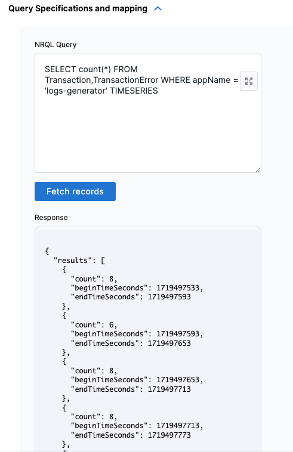
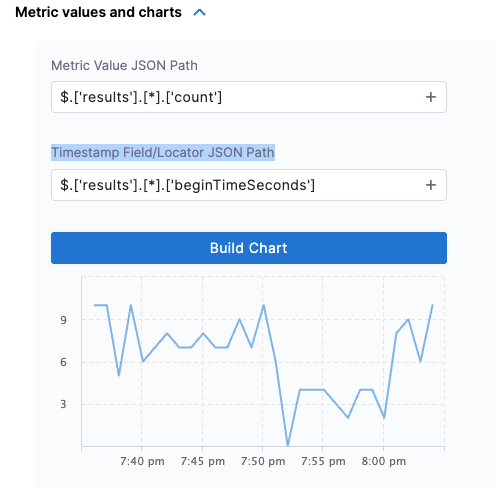
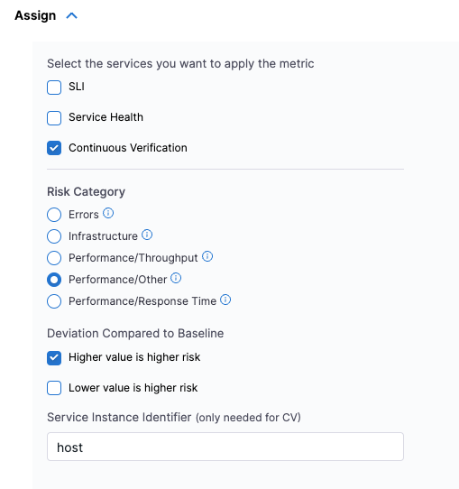

Harness CV integrates with New Relic to:

* Verify that the deployed service is running safely and performing automatic rollbacks.
* Apply machine learning to every deployment to identify and flag anomalies in future deployments.

This topic covers how to add and configure New Relic as a Health Source for the Verify step.

## Before You Begin

* [Add New Relic as a Verification Provider](/docs/platform/connectors/monitoring-and-logging-systems/connect-to-monitoring-and-logging-systems#add-new-relic)

:::info note
New Relic supports multiple APIs. The Harness Connector leverages the New Relic Insights API, which supports NRQL. Your Service/Application also needs to be instrumented as a [New Relic APM Application](https://docs.newrelic.com/introduction-apm). 
:::

## Review: CV Setup Options

To use the Verify step, you will need a Harness Monitored Service. In the simplest terms, a Monitored Service is basically a mapping of a Harness Service to a service monitored by your APM or logging tool.

You can set up a Monitored Service in the Verify step in a CD stage.

There are other ways to set up a Monitored Service. To learn more see: [Monitored Service](docs/platform/monitored-service.md)

In this topic we'll set up the Monitored Service as part of the **Verify** step.

## Step 1: Add Verify Step

There are two ways to add the Verify step:

* **When selecting the stage deployment strategy:**  
The **Verify** step can be enabled in a CD stage the first time you open the **Execution** settings and select the deployment strategy. When you select the deployment strategy you want to use, there is also an **Enable Verification** option. Select the **Enable Verification** option.  
Harness will automatically add the **Verify** step. For example, here is a stage where Canary strategy and the **Enable Verification** option were selected.
* **Add the Verify step to an existing Execution setup:** You can also add the Verify step to the Execution section of a CD stage in a Pipeline you previously created. Simply click **Add Step** after the deployment step, and then select **Verify**.

## Step 2: Enter a Name and Timeout

In **Name**, enter a name for the step.

In **Timeout**, enter a timeout value for the step.

You can use:

* `w` for weeks
* `d` for days
* `h` for hours
* `m` for minutes
* `s` for seconds
* `ms` for milliseconds

The maximum is `53w`. Timeouts can be set at the Pipeline level also.

### Node filtering

:::info note
Currently, this feature is behind the feature flag `CV_UI_DISPLAY_NODE_REGEX_FILTER`. Contact Harness Support to enable the feature.
:::

The node filtering feature allows you to select specific nodes within your Kubernetes environment using the PodName label. This allows for focused analysis, enabling you to choose specific nodes as service instances for in-depth analysis.

Harness CV autonomously identifies new nodes as they are added to the cluster. However, the node filtering feature allows you to focus the analysis explicitly on the nodes that you want to analyze. Imagine you have a Kubernetes cluster with multiple nodes, and you want to analyze the performance of pods running on specific nodes. You want to analyze the nodes that match a certain naming pattern.

Procedure:

1.	On the Verify settings page, expand **Optional** to navigate to the node filtering settings section.

2.	(Optional) Select **Use node details from CD** if you want Harness CV to collect and analyze the metrics and log details for the recently deployed nodes.

3.	Specify the **Control Nodes** and **Test Nodes**:

      - **Control Nodes**: These are the nodes against which the test nodes are compared. You can specify the control nodes to provide a baseline for analysis.
      
      - **Test Nodes**: These are the nodes that Harness CV evaluates and compares against the control nodes.

      To specify the **Control Nodes** and **Test Nodes**, in one of the following ways:

         - Type node names: Enter the names of specific nodes you want to include in the analysis.
         
         - Use simple patterns (Regex): Define a regular expression pattern to match the nodes you want to filter. For example, if your nodes follow a naming convention such as "node-app-1", "node-app-2", and so on, you could use a pattern such as "node-app-*" to include all nodes with names starting with "node-app-".

      Example: Let's say you want Harness CV to analyze the only nodes that have "backend" in their PodName label:
         
         1. In the Control Nodes field, enter "backend-control-node" as the control node.
      
         2. In the Test Nodes field, enter the pattern "backend-*" to include all nodes with names starting with "backend-".


## Step 3: Select a Continuous Verification Type

In **Continuous Verification Type**, select a type that matches your [deployment strategy](./../verify-deployments-with-the-verify-step.md#continuous-verification-type)


## Step 4: Create a Monitored Service

In **Monitored Service**, click **Click to autocreate a monitored service**.

To learn how to view your service after its created see [Monitored Service](docs/platform/monitored-service.md).

:::note

The option to auto-create a monitored service is not available if you have configured either a service, an environment, or both as runtime values. When you run the pipeline, Harness concatenates the service and environment values you enter in the runtime inputs screen and generates a monitored service name. If a monitored service with the same name exists, Harness assigns it to the pipeline. If no monitored service that matches the generated monitored service name exists, Harness skips the verification step. 

For example, suppose you enter the service as `todolist` and the environment as `dev`. In that case, Harness generates the monitored service name `todolist_dev`, checks whether a monitored service with the name `todolist_dev` is available, and assigns it to the pipeline. If no monitored service is available with the name `todolist_dev`, Harness skips the verification step.

:::

## Step 5: Add Health Sources

This option is available only if you have configured the service and environment as fixed values.

A Health Source is basically a mapping of a Harness Service to the service in a deployment environment monitored by an APM or logging tool.

1. In **Health Sources**, click **Add**. The **Add New Health Source** settings appear.
   
   
    
2. In **Select health source type**, select **NewRelic**.
3. In **Health Source Name**, enter a name for the Health Source.
4. Under **Connect Health Source**, click **Select Connector**.
5. In **Connector** settings, you can either choose an existing connector or click **New Connector**.

    

    New Relic supports multiple APIs. Harness connector leverages the NerdGraph API or the deprecated New Relic Insights API that supports NRQL. See Step 8 for more details on connecting to either APIs. For more details, go to [Add New Relic connector](/docs/platform/connectors/monitoring-and-logging-systems/connect-to-monitoring-and-logging-systems#add-new-relic).

6. Click **Apply Selected**. The Connector is added to the Health Source.
7. In **Select Feature**, select the NewRelic feature to be used. Currently, only **Full Stack Observability: APM** feature is available and it is selected by default.
    
    
    
8. Click **Next**. The **Configuration** page appears.
9. Select the **Performance** checkbox under **Metric Packs** for Harness to monitor the performance metrics.
10. Under **Query Specifications and Mapping**, select **Add Metric** to customize the query to get the desired output and map to Harness service. 
      1.  In **Map Metric(s) to Harness Services**, enter a **Metric Name** and **Group Name**.
      2.  In **Query Specifications and mapping**, enter the **NRQL Query**, and then select **Fetch Records**. (*Optional*: Enter the NRQL for specified metrics with a `TimeSeries` clause.)
       
       

      3.  In **Metric values and charts**, select a Metric Value JSON Path and Timestamp Field/Locator JSON Path and select **Build Chart**. 
       
       

      4. In **Assign**:  
         1. In **Select the services you want to apply the metric**, select **Continuous Verification** (Applied to the pipelines in the Continuous Deployment).
         2. In **Risk Category**, select **Performance/Other**
         3. In **Deviation Compared To Baseline**, select **Higher counts = higher risk**.
         4. In **Service Instance Identifier (only needed for CV)**, enter **host**.
         
         

11. *(Optional)* To set a fail-fast threshold, follow these steps:
      1.  Expand **Advanced (Optional)**, go to the **Fail-Fast Thresholds** tab, and then select **Add Threshold**.

      2. From the **Metric** drop-down, select New Relic Metric. This is the metric you created in the Define metric configuration settings step.

      3. In the Action field, select what the CV should do when applying the rule. For example, **Fail Immediately**.

      4. In the **Criteria** field, choose **Percentage Deviation**, and from **Greater than** select 1. This sets a threshold for memory usage beyond which the system or application is considered to be in a problematic state, and action should be taken.

      

12. Select **Submit**. The Health Source is displayed in the Verify step.

You can add one or more Health Sources for each APM or logging provider.

### Sample New Relic queries

Here are few sample New Relic queries:  

- `SELECT rate(count(duration), 1 minute) FROM Transaction TIMESERIES`
- `SELECT average(duration) FROM Transaction TIMESERIES`
- ```SELECT average(`apm.service.transaction.duration`) FROM Metric WHERE appId = 1329709976 TIMESERIES```

For more details on NRQL structure and how to use it, go to [New Relic documentation](https://docs.newrelic.com/docs/nrql/get-started/introduction-nrql-new-relics-query-language/).

## Step 6: Select Sensitivity

In **Sensitivity**, select **High**, **Medium**, or **Low** based on the risk level used as failure criteria during the deployment.

## Step 7: Select Duration

Select how long you want Harness to analyze and monitor the logs/APM data points. Harness waits for 2-3 minutes to allow enough time for the data to be sent to the APM/logging tool before it analyzes the data. This wait time is a standard with monitoring tools.

The recommended **Duration** is **10 min** for logging providers and **15 min** for APM and infrastructure providers.

## Step 8: Specify Artifact Tag

In **Artifact Tag**, use a [Harness expression](/docs/platform/variables-and-expressions/harness-variables.md)

The expression `<+serviceConfig.artifacts.primary.tag>` refers to the primary artifact.

## Option: Advanced Settings

In **Advanced**, you can select the following options:

* [Step Skip Condition Settings](/docs/platform/pipelines/step-skip-condition-settings.md)
* [Step Failure Strategy Settings](/docs/platform/pipelines/failure-handling/define-a-failure-strategy-on-stages-and-steps)
* [Select Delegates with Selectors](/docs/platform/delegates/manage-delegates/select-delegates-with-selectors.md)


## Step 9: Deploy and Review Results

After setting up the **Verify** step, click **Apply Changes**.

Click **Run** to run the pipeline.

In **Run Pipeline**, select the tag for the artifact if a tag was not added in the **Artifact Details** settings.

Click **Run Pipeline**.

When the Pipeline is running, click the **Verify** step. You can see that the verification takes a few minutes.

Once verification is complete, the Verify step shows the following:


The risk level might initially display a number of violations, but the red and orange colored host often change to green over the duration.


### Summary

The **Summary** section shows the number of logs that are in violation.


### Console View

Click **Console View** or simply click **View Details** in **Summary** to take a deeper look at verification.

If you have more than one Health Source, you can use the **View** dropdown to select each one.

You can use the search option to search for any specific metric or transaction you want.


## Set a pinned baseline

:::info note
Currently, this feature is behind the feature flag `SRM_ENABLE_BASELINE_BASED_VERIFICATION`. Contact Harness Support to enable the feature.
:::

You can set specific verification in a successful pipeline execution as a baseline. This is available with **Load Testing** as the verification type.


### Set successful verification as a baseline

To set a verification as baseline for future verifications:

1. In Harness, go to **Deployments**, select **Pipelines**, and find the pipeline you want to use as the baseline.
   
2. Select the successful pipeline execution with the verification that you want to use as the baseline.
   
   The pipeline execution is displayed.
   
3. On the pipeline execution, navigate to the **Verify** section, and then select **Pin baseline**.
   
   The selected verification is now set as the baseline for future verifications.


### Replace an existing pinned baseline

To use a new baseline from a pipeline and replace the existing pinned baseline, follow these steps:

1. In Harness, go to **Deployments**, select **Pipelines**, and find the pipeline from which you want to remove the baseline.

2. Select the successful pipeline execution with the verification that you have previously pinned as the baseline.
   
3. On the pipeline execution, navigate to the **Verify** section, and then select **Pin baseline**.
   
   A confirmation alert message appears, asking if you want to replace the existing pinned baseline with the current verification. After you confirm, the existing pinned baseline gets replaced with the current verification.
