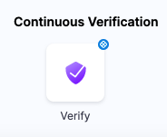
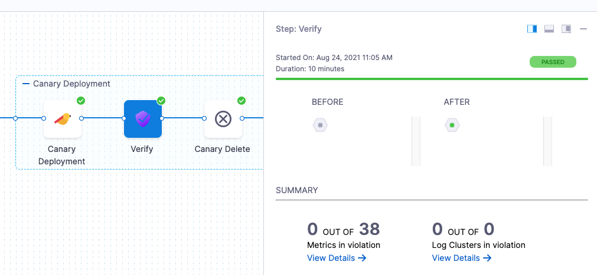

Harness Continuous Verification (CV) integrates with [various health sources](/docs//continuous-delivery/verify/configure-cv/health-sources/) to:

- Verify that the deployed service is running safely.
- Perform automatic rollbacks.
- Apply machine learning to every deployment to identify and flag anomalies in future deployments.

This topic covers how to add and configure health sources for the verify step.

## Review: CV setup options

To use the verify step, you will need a [Harness Monitored Service](/docs/platform/monitored-service). In the simplest terms, a monitored service is basically a mapping of a Harness Service to a service monitored by your APM or logging tool.

You can set up a Monitored Service in the Verify step in a CD stage.

There are other ways to set up a Monitored Service. To learn more, go to [Monitored Service](/docs/platform/monitored-service)

In this topic we'll set up the Monitored Service as part of the **Verify** step.

## Step 1: Add verify step

There are two ways to add the verify step:

1. **When selecting the stage deployment strategy:**  
    - The **Verify** step can be enabled in a CD stage the first time you open the **Execution** settings and select the deployment strategy. 
    - When you select the deployment strategy you want to use, there is also an **Enable Verification** option. Select it.  
    - Harness will automatically add the **Verify** step. For example, here is a stage where Canary strategy and the **Enable Verification** option were selected 

2. **Add the Verify step to an existing Execution setup:** 
    - You can also add the Verify step to the Execution section of a CD stage in a Pipeline you previously created. 
    - Simply click **Add Step** after the deployment step, and then select **Verify**.

## Step 2: Enter a name and timeout

In **Name**, enter a name for the step.

In **Timeout**, enter a timeout value for the step.

You can use:

* `w` for weeks
* `d` for days
* `h` for hours
* `m` for minutes
* `s` for seconds
* `ms` for milliseconds

The maximum is `53w`. Timeouts can be set at the Pipeline level also.

## Step 3: Select a Continuous Verification Type

In **Continuous Verification Type**, select a type that matches your [deployment strategy](./../verify-deployments-with-the-verify-step.md#continuous-verification-type)

## Step 4: Create a Monitored Service

In **Monitored Service**, click **Click to autocreate a monitored service**.

Harness automatically creates a monitored service using a concatenation of the service and environment names. For example, a service named `todolist` and an environment named `dev` results in a monitored service with the name `todolist_dev`.

:::note

The option to auto-create a monitored service is not available if you have configured either a service, an environment, or both as runtime values. When you run the pipeline, Harness concatenates the service and environment values you enter in the runtime inputs screen and generates a monitored service name. If a monitored service with the same name exists, Harness assigns it to the pipeline. If no monitored service that matches the generated monitored service name exists, Harness skips the verification step. 

For example, suppose you enter the service as `todolist` and the environment as `dev`. In that case, Harness generates the monitored service name `todolist_dev`, checks whether a monitored service with the name `todolist_dev` is available, and assigns it to the pipeline. If no monitored service is available with the name `todolist_dev`, Harness skips the verification step.

:::

## Step 5: Add Health Sources

Harness supports a wide variety of health sources. For a full list, and instructions how to set up each one, go to [health sources](/docs/category/health-sources/).

## Step 6: Select Sensitivity

In **Sensitivity**, select **High**, **Medium**, or **Low** based on the risk level used as failure criteria during the deployment.

## Step 7: Select Duration

Select how long you want Harness to analyze and monitor the logs/APM data points. Harness waits for 2-3 minutes to allow enough time for the data to be sent to the APM/logging tool before it analyzes the data. This wait time is a standard with monitoring tools.

The recommended **Duration** is **10 min** for logging providers and **15 min** for APM and infrastructure providers.

## Step 8: Specify Artifact Tag

In **Artifact Tag**, use a [Harness expression](/docs/platform/variables-and-expressions/harness-variables).

The expression `<+serviceConfig.artifacts.primary.tag>` refers to the primary artifact.

## Option: Advanced Settings

In **Advanced**, you can select the following options:

* [Step Skip Condition Settings](/docs/platform/pipelines/step-skip-condition-settings.md)
* [Step Failure Strategy Settings](/docs/platform/pipelines/failure-handling/define-a-failure-strategy-on-stages-and-steps)
* [Select Delegates with Selectors](/docs/platform/delegates/manage-delegates/select-delegates-with-selectors.md)

## Step 9: Deploy and Review Results

After setting up the **Verify** step, click **Apply Changes**.

Click **Run** to run the pipeline.

In **Run Pipeline**, select the tag for the artifact if a tag was not added in the **Artifact Details** settings.

Click **Run Pipeline**.

When the Pipeline is running, click the **Verify** step.

You can see that the verification takes a few minutes.

Once verification is complete, the Verify step shows the following:

The risk level might initially display a number of violations, but the red and orange colored host often change to green over the duration.

### Summary

The **Summary** section shows the number of logs that are in violation.

### Console View

Click **Console View** or simply click **View Details** in **Summary** to take a deeper look at verification.

You can use the search option to search for any specific metric or transaction you want.

## Set a pinned baseline

:::info note
Currently, this feature is behind the feature flag `SRM_ENABLE_BASELINE_BASED_VERIFICATION`. Contact Contact [Harness support](mailto:support@harness.io) to enable the feature.
:::

You can set specific verification in a successful pipeline execution as a baseline. This is available with **Load Testing** as the verification type.

### Set successful verification as a baseline

To set a verification as baseline for future verifications:

1. In Harness, go to **Deployments**, select **Pipelines**, and find the pipeline you want to use as the baseline.
   
2. Select the successful pipeline execution with the verification that you want to use as the baseline.
   
   The pipeline execution is displayed.
   
3. On the pipeline execution, navigate to the **Verify** section, and then select **Pin baseline**.
   
   The selected verification is now set as the baseline for future verifications.

### Replace an existing pinned baseline

To use a new baseline from a pipeline and replace the existing pinned baseline, follow these steps:

1. In Harness, go to **Deployments**, select **Pipelines**, and find the pipeline from which you want to remove the baseline.

2. Select the successful pipeline execution with the verification that you have previously pinned as the baseline.
   
3. On the pipeline execution, navigate to the **Verify** section, and then select **Pin baseline**.
   
   A confirmation alert message appears, asking if you want to replace the existing pinned baseline with the current verification. After you confirm, the existing pinned baseline gets replaced with the current verification.
