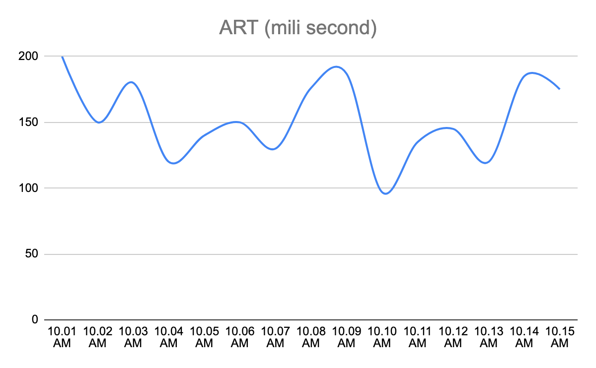
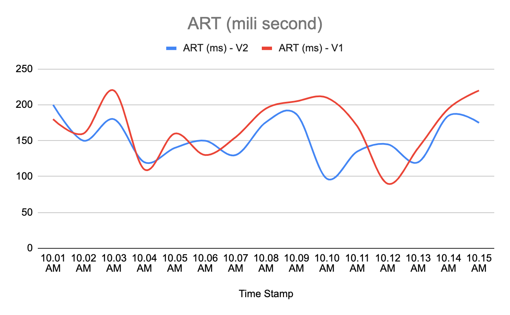
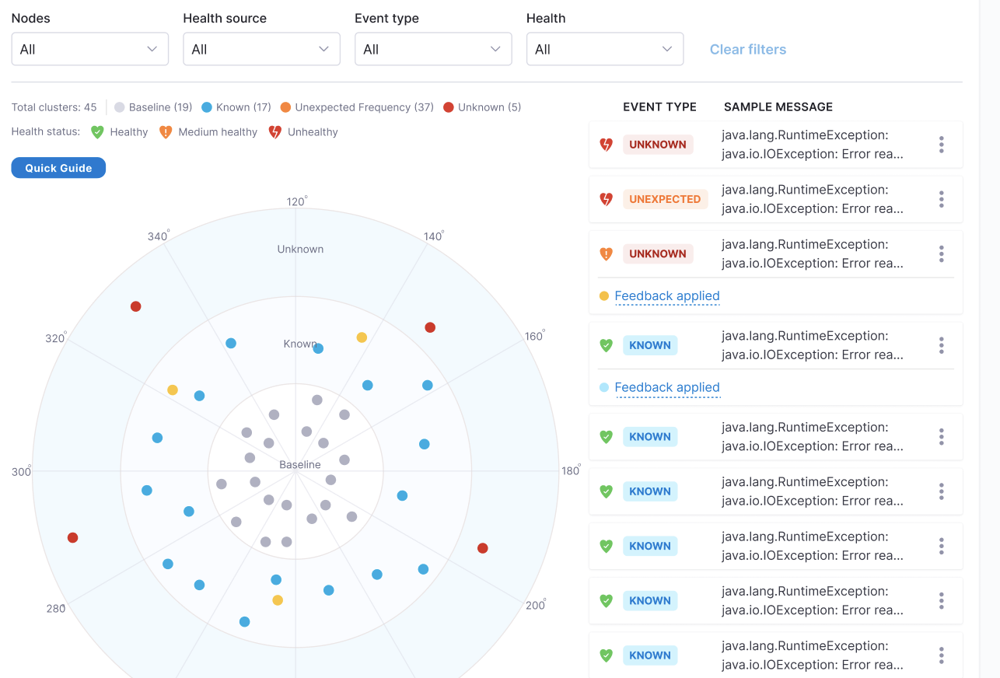
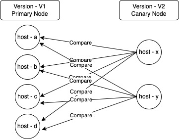

# Machine Learning Usage in Continuous Verification

Continuous Verification [CV] works on two basic units which are metric & logs. Metrics are time series data plotted against time stamps, while logs are raw text.

## Metrics
Let us consider an example; Average Response Time (aka ART) metric of a service after deployment 

There are two ways one can determine whether this deployment has caused any impact on ART or not.

* The Service owner can say till the ART remains below 500ms, the deployment was successful. One can run a watch party of next 24 hours and set some alert on 500ms threshold.
* Service owners might be interested in comparing the ART of the new version with the previous version of the service. One does not want to wait for ART to go above 500 ms instead wants to know how ART is looking compared to previous version of the service.

So in second scenario let us see how the two ART metrics look.

How to compare these two time series data and how to quantify the difference between both of them? 

This is where the statistical model (which is a well proven standard to compare time series data) comes into picture. The ML model (Symbolic Aggregate Approximation) calculates the deviation between two graphs in the unit of “standard deviation".
Based on these standard deviation counts and sensitivity input (by user through step configuration); model can tell whether ART with version V2 has deteriorated compared to ART with version V1.

## Logs

Log emitted by a service gives insight into the happening of the service. Developers use logs generally for two purpose.

* To support custom metrics data (which can be aggregated based on the information present in the log).
* To debug the service when a problem is reported.

As part of debugging process, two of the frequent things developers do are: 

* To figure out if the service has started reporting any new error.
* To check if the occurrence frequency of an error has changed.

Doing the above two (specially the first) manually is quite tedious. Mostly developers start filtering out errors one by one , till they stumble upon some new error. They try to use wild card based filters to remove similar errors etc and again these are not fixed patterns instead vary for different errors.

Now visualize the above in context of an issue that gets reported in the context of deployment that you did recently. Developers will do the above analysis manually by figuring out new error & error frequency compared to the last version of the service.

This is where log analysis as part of CV helps developers. It helps in: 

* Identifying new errors & error frequency changes automatically after deployment before it becomes a wider problem.
* Debugging the issue.

Log analysis uses a clustering mechanism to club similar errors together and compares it with the error clusters seen with previous versions of the service. ML plays a role in clustering and comparison because as you can see it can not be done by any fixed user defined rule.

As shown in the below image, you can see as part of log analysis; the ML model has identified three category of error clusters:

* **Known**: Errors were seen with the previous version also.
* **Unknown**: New errors.
* **Unexpected Frequency**: Errors whose occurrence frequency has increased.

## Uniqueness of CV

So in nutshell, machine learning modal plays the important role in eliminating the tedious manual approach which developers take in analyzing metrics & log data. It helps in:

* Metric
	* Identifying the deviation in time series data.
	* Early detection of the trend in time series data before it hits the status thresholds.
* Log
	*  Detecting the new errors which got introduced.
	*  Detecting the change in frequency of an error.
	*  Identifying similar logs.

If a service owner has made observability of its service robust, then CV can play a critical role in detecting problems in those observability parameters. In case, service owners do not have a robust mechanism to observe their service in production then they need to start first on observability before CV adds value for them.

## Instance Based vs Service Based

All the deployment methodologies can be broadly categorized into “Canary” & “Non-Canary” deployments. 

Currently CV does the verification by comparing metric/logs at node level instead of service level. Many times customers do not understand its need because in their day to day operations, they have focused more on service level metrics/logs. Their alerting mechanism also is largely based on service level threshold (just like Harness) except for customers who are doing canary deployment.

### Canary Deployment

In canary deployment, new nodes are brought up with the new version while some of the existing nodes continue to operate with the older version. For verification to be effective, we need to compare metrics/log of canary nodes with nodes which are running the previous version.

Here we have opted to compare each one of the canary nodes (version V2) with each one of the primary nodes (version V1). Since both versions are active concurrently (post deployment); we use only post deployment metric/log data to do the verification.

A question that can come up here is why are we comparing each canary node with each primary node individually, why not compare the aggregate metrics of V2 version with version V1?

Reason is that generally version information is not part of emitted metrics & log while node information is by default present as a characteristic of the emitted metric & log by service (it is more evident in case of APM tools like Appd).

Health source configuration for Non-APM sources (like prometheus, data dog etc), has a field named “service instance identifier”. This field allows CV to identify the name of the host which has emitted the metric/log. For example , if the user configures “service instance identifier’ as ‘pod’; then CV will map the value of field ‘pod’ as host name.

### B/G Deployment / Rolling Deployment

In both of these deployments, verification is done when traffic gets shifted completely to the new version of the service after completion of deployment. So to do verification, the metric/log data needs to be compared between pre deployment & post deployment. 
Node wise comparison as explained in case of (canary deployment) takes place here also. The difference is:

* Pre-Deployment metric/log is collected (For example , let us assume deployment gets completed at 10.00 AM, takes 2 mins to settle and verification is running for 5 mins. In this case the metric/log is collected from 9.55 AM to 10.00 AM and compared with data of 10.02-10.07 AM).

In case of B/G deployment, where you place the verification matters. In case you want to run verification after the blue environment is ready then you need to put some traffic to it. In this case while running verification, analysis will be done between blue and green environment nodes. In case you put the verify step after complete switch of traffic to blue environment, then analysis will be done between pre deployment & post deployment data.

## Alternative Usage

While CV has been designed to verify deployment, it can still act as a verification for any kind of change getting done through a Harness pipeline. You can add the verify step at any place, and it will do a pre & post action analysis (similar to rolling deployment). Only condition to be satisfied is that there shall be some metric/log data before the change was introduced and also after that change is completed.

### Load Test

The user can configure the verify step to work in *Load Test* configuration. Here the verification is done by comparing the post deployment data with a predefined baseline data. Analysis is done at service level instead of node. Currently we support last passed verification of the same service as baseline.

### Plain Threshold Based Verification

Another option is to do plain threshold based verification without doing any comparative analysis. In this the user can define the failure threshold for the metric and verify step can fail if thresholds are breached during verification. It does not include any node based analysis and any ML usage.

## Feedback

Harness allows users to configure input that can be used while doing the verification. It is available for both metric (called metric threshold) & log health sources (called log feedback). It helps in tweaking the result of verification and make it more accurate in the context of that particular service.

Apart from this another configuration , called sensitivity, is available to the users for controlling the outcome of verification.

### Metric Threshold

Users can define thresholds for metric as part of health source configuration. There are two kinds of thresholds that users can define. They are:

* **Fail Fast**: These are thresholds, if breached verification will fail without doing any kind of analysis. For example, a user can define that ART value of more than 10 seconds consecutively for 5 mins will fail the verification. In this scenario, no comparative analysis with the older version will be done.
* **Ignore**: These are thresholds , if breached then comparative analysis (with the metric of older version) will be done & verification will pass/fail based on the analysis result. If metric values are within the ‘ignore’ threshold then analysis will ignore those points. For example, an user can define that ART value of less than 200 ms can be ignored for analysis. In this scenario, all data points in a metric graph with a value less than 200ms will not be included in verification analysis. If metric value remained below 200ms throughout the verification duration then verification will pass without any analysis; other wise comparative analysis will be done.

### Log Feedback

Once a log verification has run as part of the verify step, users can review the logs detected and provide feedback for them. These feedbacks will be considered when next time verification runs. Feedback can be provided as the risk value of that particular log. Supported values are:

* **High Risk**: It means any time this log is seen, verification will fail. So it can happen that this log was seen with the older version, but verification will fail if it is seen again with the new version.
* **Medium Risk**: A log with medium risk will make verification fail only if user is running verification with high sensitivity.
* **No Risk**: log marked as “no risk” will not contribute to the verification result. It will be ignored.

### Sensitivity

Users can configure the sensitivity parameter to control the strictness of verification. Supports three possible values:

* **High**: Even small deviation in metric or detection of single unknown log will make verification fail.
* **Medium**: It runs verification with medium tolerance. For example,  verification will not fail if metrics are deviating with small amounts. Log verification will not fail because of “unexpected” frequency logs.
* **Low**: Tolerance will be high for this verification. For example metrics need to deviate substantially from the previous version. Log verification needs to have some unknown cluster of logs detected in log analysis for verification to fail.

