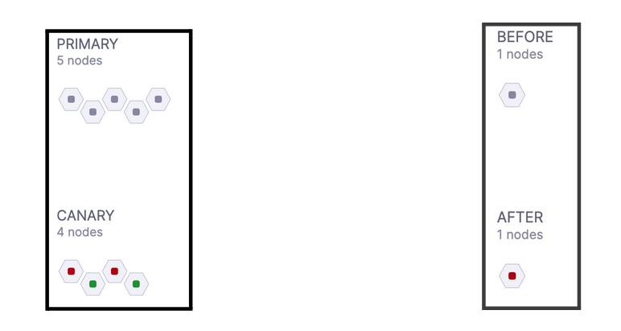
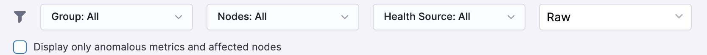
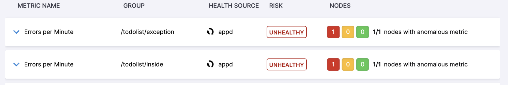
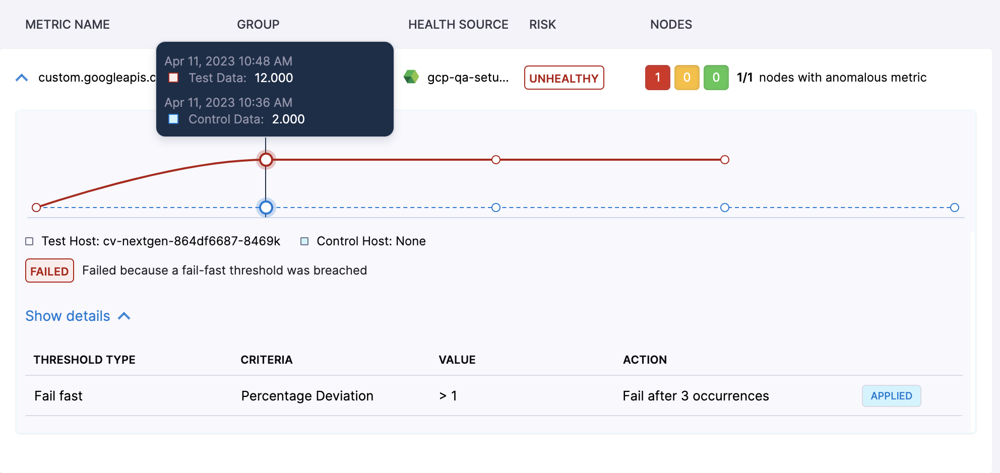
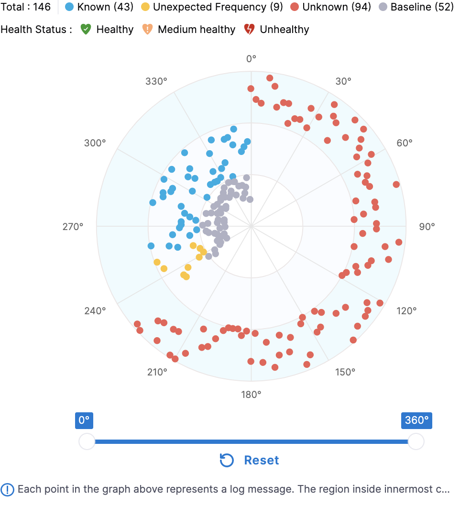

# Interpretation of Continuous Verification Results 

## Metric Verification Results

Following is an example of verification results for an Appdynamics health source. 

<docimage path={require('./static/cv_results/verification_result_appd.jpg')} />

We can look into each one of the individual sections to understand the information being conveyed.

### Nodes

This section indicates the nodes detected by the continuous verification. There can be two variations to it based on the deployment type.

In case of Canary type of deployment, this section will describe all the primary and canary nodes. “Canary” nodes are those nodes which are seen only after deployment and “Primary” nodes are those which are seen before and after deployment.

In case of Rolling or B/G deployment, the analysis happens by comparing metric data of post-deployment with pre-deployment. So here “Before” nodes are all those nodes which were seen before deployment and “After” nodes are all those nodes which were seen after deployment.

Other points to note:

* CV detects nodes based on the user configured field “Service Instance identifier” as part of health source configuration. If this field is not configured correctly, then a user might see the node names here which will not correspond to actual running nodes.
* “Red” color on the hexagon indicates that there is at least one metric for which the verification has failed.
* In the case of a Dynatrace health source,  a user will always see only one node because Dynatrace does not support nodes based metric.

### Filters

This section allows you to filter the metric verification results.

* **Group**: While configuring the health source, users can combine a set of metrics under a single group (for example a transaction group). All those groups will be available here as filter options. In the case of Appdynamics, Newelic & Dynatrace; metrics are automatically grouped based on transactions. So for these health sources, the dropdown of this filter will contain all the transactions.
* **Nodes**: User can filter the results for a specific “Canary” or “After” node (depending on the deployment type).
* **Health Source**: In case there are multiple metric health sources used in verification, then the user can filter the result specific to a health source.
* **Raw**: Here users will see two options, “Raw” & “Normalised”. For the purpose of ML analysis, the system normalizes the metric data by converting 3 adjacent minutes metric data into a single data point.
 * In the case of the “Raw” option, users will see the metric data exactly as provided by the source itself.
 * In the case of the “Normalised” option, users will see the metric data in normalized form as it is used by ML. This representation helps the user understand the deviation based on which verification has passed or failed.

### Metric Summary View

This view represents the summary of verification results for each metric.

* **Risk**: Users will see three levels of risk for each metric. They are “Healthy”, “Observe” and “Unhealthy”. 
 * Risk is determined based on two factors; deviation between the metric data for that particular node & sensitivity configuration of the verify step. 
 * While aggregating the risk across all nodes, we take the highest risk across all nodes as the overall risk of the metric.
* **Nodes**: It is a summary of this particular metric’s risk on all the nodes (either “Canary” or “After”) for which this metric data is available. Their color indicates the three risk categories. 

There are error scenarios around calculation of the risk.

* In case there is a metric for which data is available for a particular Canary/After node but the metric data is not available for any of the Primary/Before nodes; the risk is marked as ‘No Analysis” for that particular Canary/After node.
* In case there is a metric for which data is not available for a particular Canary/After node but the metric data is available for any of the Primary/Before nodes; the risk is marked as ‘No Data” for that particular Canary/After node.
* Any metric which is marked as “Throughput” is not analyzed in verification.

### Metric Detailed Graph View

This view explains the actual metric data along with comparative analysis, the metric thresholds and the reason for the failure.

In these metric graphs, the Canary/After nodes are called “Test Host” and the Primary/Before nodes are called “Control Host”.

<docimage path={require('./static/cv_results/metric_detailed_view.png')} />

In the above example there are two Canary nodes : “test-host-1” and “test-host-2”. As we know each one the canary node is compared against all the Primary nodes as part of verification, but in the result graph the user is shown only that comparison where deviation is minimum. In the above example, we can see that the “test-host-1” metric graph is shown against the Primary node “control-host-1” while for the “test-host-2” the metric graph is shown against the Primary node “control-host-2”.

Below every graph, the user is shown the result and it also indicates whether the metric comparison has failed because of ML analysis or due to metric threshold. In the above example you can see that both of the nodes have failed due to ML analysis. Here the fail fast threshold was not breached that why ML analysis happened and ML analysis failed because of deviation in the metric values.

Under the details section, users can see all the thresholds which are defined for that metric. In case the comparison has failed due to a metric threshold then the corresponding metric threshold will be indicated in UI.

An example is shown below, the user can see that the reason for failure is mentioned as “failed because a fail-fast threshold was breached”. Users can also see that under the detailed section, threshold configuration is shown and an “applied” marker is shown for it. Points to note here is that in case a fail-fast threshold is applied, users will not see any normalized data. The reason being that if metric is violating any fail-fast threshold then ML analysis does not come in the play hence no normalization of metric data is needed.

Users can also hover over the graph to see the metric value for a particular point on the graph. In case of canary deployment, users can notice that the time stamp for both test and control data is the same while in case of other deployments, the time stamp for test data is of post deployment period and time stamp of control data is of pre deployment period.

## Log Verification Results

Following is an example of a log verification result screen.

<docimage path={require('./static/cv_results/log_verification.png')} />

The section representing the node information is identical to what users see in the metric verification result. It conveys node information according to the deployment type.

### Event Type

Here the event corresponds to a cluster of logs which are similar. As a result of log verification, the log clusters seen on Canary/After nodes are classified into three categories. They are:

* **Known**: Clusters which were seen even at least on one of Primary/Before nodes.
* **Unknown**: New log clusters seen only on Canary/After nodes.
* **Unexpected Frequency**: Llog clusters which were seen on both Canary/After nodes & Primary/Before nodes but their frequency has increased.

Baseline clusters are all the log clusters which were seen on Primary/Before nodes. All the *Known & Unexpected Frequency* clusters will match with one of the Baseline clusters.

The expectation is that users have configured queries (part of health source configuration) which filters the error log emitted by the service. That way, “Unknown” & “Unexpected Frequency”  log clusters become indications of deployment health.

### Event Health

Event health can have three possible values “Healthy”, “Medium Healthy” & “Unhealthy”. These are directly mapped to “Known”, “Unexpected Frequency” & “Unknown” event type without any user feedback. Users can change this mapping by providing feedback for a log cluster (For example the user can mark a particular “unknown” cluster as non-risky; in this case that cluster will be considered “Healthy”. More details will be provided in a separate section).

Event health determines the result of verification based on the configured sensitivity of the verify step. It is decided based on the rules given below

| Sensitivity       | Verification Result |                                                                                                                                                     
| :------------------------------ | :------------------------------ | 
|High|Verification will fail if there is any “Unhealthy” or “ Medium Healthy” cluster. | 
|Medium|Verification will fail if there is any “Unhealthy” cluster. | 
|Low|Verification will fail if there is any “Unhealthy” cluster. | 

### Radar Chart

It provides a bird eye view of all the log clusters detected during log verification. On top of the circle, users can see the count of each type of cluster.

Clusters are divided into the 3 centric circles. The outermost circle represents all the “Unknown” clusters while the middle circle contains all the “Known”  & “Unexpected frequency” clusters. Users can do following interactions on this chart:

* **Hover**: On hovering over any cluster, the user will be shown a sample message corresponding to the cluster. In case of “Known” & “Unexpected frequency” clusters, the cluster being highlighted in the innermost circle at the sameat same angle; this cluster is the one which was seen on Primary/Before nodes.
* **Selecting**: On click of any cluster user will be taken to a detailed screen of that cluster.
* **Zoom** : Slider present below allows users to zoom in on a particular set of log clusters. 

The cluster listing present on the right side of the radar chart is always a reflection of the clusters shown in the radar chart. So whenever the user zooms in through the slider or applies any kind of filter, the log cluster list also gets updated accordingly.

### Log Cluster Detail Card

Users can look into details of a cluster by clicking on the radar chart or cluster listing. An example for the details screen is shown below.

<docimage path={require('./static/cv_results/log_cluster.png')} />

The above example is of a “known” log cluster. Following details are shown on this screen.

* **Total Count**: It is the total occurrence count of this log cluster across Canary/After nodes.
* **Cluster Occurrence Graph**: User will see a graph corresponding to each one of the Canary/After nodes where this log cluster is seen. It depicts the occurrence of this log cluster on each node along with its time stamp.
 * In the above example, this log cluster was seen on two nodes so two graphs are shown.  
 * Here the verification ran for 10 minutes so the graph contains 10 points corresponding to each minute. 
 * Users can see the time stamp and occurrence count for each minute.
 * Users will also see the baseline cluster occurrence count for “Known” & “Unexpected Frequency” clusters. The count of the baseline cluster is the summation of its occurrences across all Primary/Before nodes.

