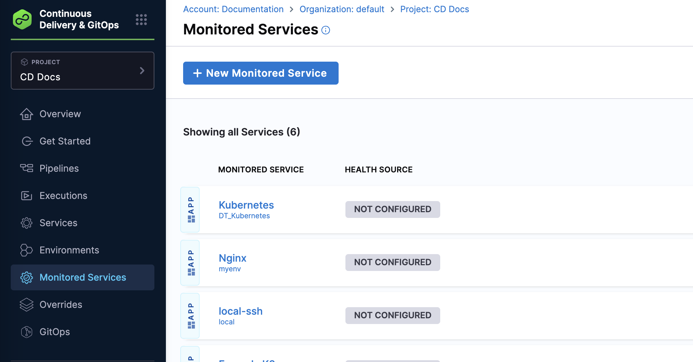
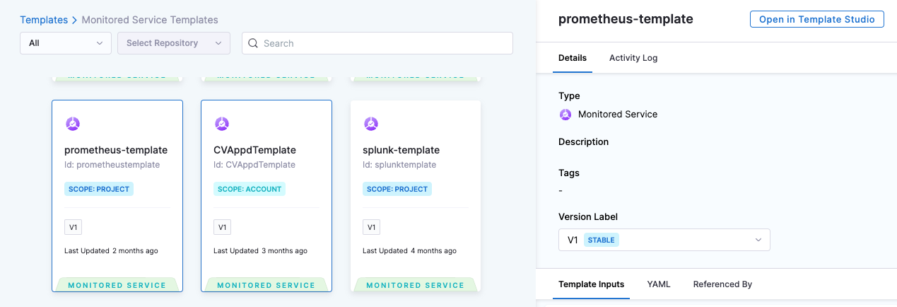
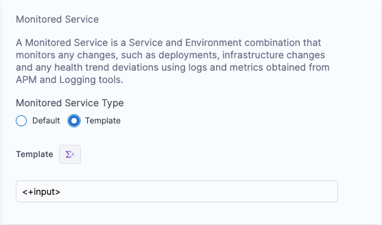
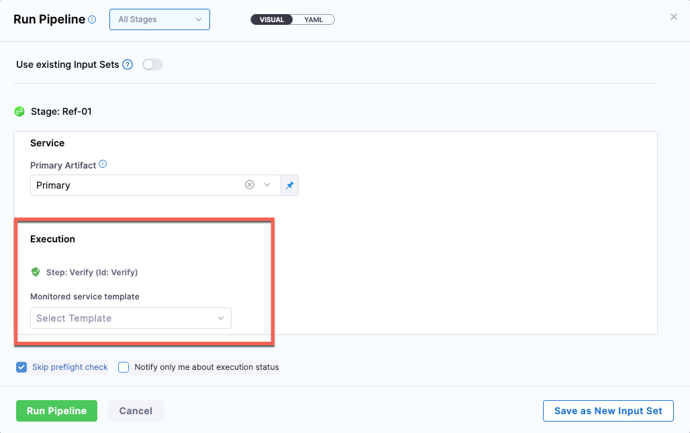
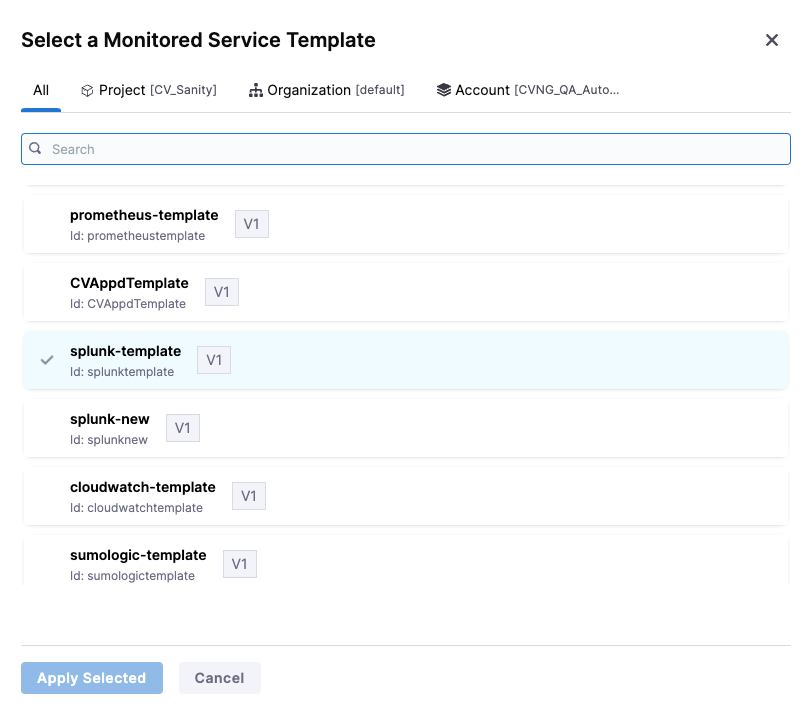

A monitored service in the context of the Harness platform is a combination of a Harness service and environment. This entity can be any workload that can be monitored, including microservices. Environments represent the deployment targets such as QA, production, or any other environment where the workload will be deployed. By connecting a monitored service to change sources and health sources, you can monitor the health of the service. 

The following steps explain how to create a monitored service in Harness.

## Prerequisites

- Ensure that you have installed a delegate and it can communicate with Harness, the health source, and the change source. To learn more about delegates, go to [Get started with delegates](/docs/category/delegate-concepts).
- Create an organization if you have not already created one. To learn more about organizations in Harness, go to [Create organizations and projects](/docs/platform/organizations-and-projects/create-an-organization).

## Create a monitored service

A monitored service is a logical entity that combines a Harness service and environment. The service could be a microservice or any other workload that can be monitored. Environments represent your deployment targets such as QA, prod, and so on.

To create a monitored service:

1. In your Harness project, navigate to the **Continuous Delivery** module, and then select **Monitored Services** > **+ New Monitored Service**.

   

   The **Create new monitored service** page appears.

2. In the **Overview** section, define a service and environment to set up a monitored service for a particular application. 
    * In **Service**: Do one of the following:
     
       * If the service that you want to monitor exists, select it.
       * If you want to create a service, select **Add New**, enter the following information, and then select **Save**. 
       
          *  **Name**: Enter a name for the service. For example, _sample_service_.
          *  **Description (Optional)**
          *  **Tag (Optional)** 
           
    * In **Environment**: Do one of the following:
     
       * If the environment that you want to monitor exists, select it.
       * If you want to create an environment, select **Add New**, enter the following information, and then select **Save**. 
       
          *  **Name**: Enter a name for the environment.
          *  **Description (Optional)**
          *  **Tag (Optional)** 
          *  **Environment Type**: Select an environment type. The available options are **Production** and **Non-Production**.

    Harness automatically populates the **Monitored Service Name** field by combining the service and environment names. This field is not editable.

After creating the monitored service template, you can edit it to add a Health Source of your preference. While a monitored service entity contains a lot more than a set of health sources, the presence of health sources is sufficient for verification purposes. Hence, a monitored service template can be created only with the required health sources. For more details, go to [Monitored service template documentation](/docs/service-reliability-management/monitored-service/monitored-service-template-quickstart).

## Configure the monitored service template in a Verify step

You can configure the monitored service template in the Verify step configuration. You can select whether you want to use Default or Template for verification.

* **Default**: Verify step will automatically identify the right monitored service based on the service and environment configuration of the stage to be used for verification. If it does not find the corresponding monitored service, then the step will be skipped.
  
  :::important
  When using the Default option for Monitored Service Type in the Verify step, you can see the option, **Click to autocreate a monitored service**. It is done just to make the user interaction simpler while using a deployment stage with fixed service and environment input. The Verify step identifies if a corresponding monitored service exists or not. If it does not exist, then the step provides the option to automatically create a monitored service. You can add add health sources and configure the complete monitored service using this option.
  :::
  
* **Template**: You can specify the monitored service template to be used for verification as a fixed value or runtime input.

To select a monitored service template, select **Template** under **Monitored Service** > **Monitored Service Type** in the Verify step configuration page. The template input can be a fixed value or runtime input. 

### Select a fixed monitored service template 

1. Select Template input as a fixed value.
2. Select **Select Template**.
3. In the **Templates > Monitored Service Templates** page, select a template of your choice.
4. Select the **Version Label**.
5. Select **Use Template**.

   

### Select a monitored service template during runtime

:::important
This feature is currently behind the feature flag, `CV_MONITORED_SERVICE_TEMPLATIZATION`. To enable a feature flag in your Harness account, contact [Harness Support](mailto:support@harness.io).
:::

To select a monitored service template during runtime, on the Verify step settings page, do the following:

1. Select Template input as a runtime value, and apply changes to the step configuration.
   
   

2. During run time, in the **Run Pipeline** page's **Execution** > **Step: Verify** > **Monitored service template** section, select **Select Template**.
   
   

3. In the **Select a Monitored Service Template** page, select a monitored service template.
   
   

4. Select **Apply Selected**.

## Advanced use cases

A monitored service template allows the following use cases:

* Multiple verify steps with different monitored service templates can be configured to be run in a particular stage. These steps can be then configured to be run based on certain conditions.
* A monitored service template with an user impacting metric (not necessarily satisfied/linked to a single service) can be created and use in verification in addition to a template with service linked metric.

