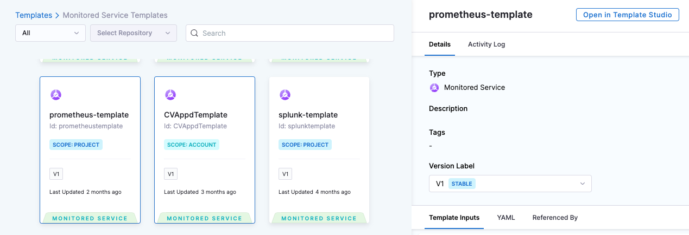
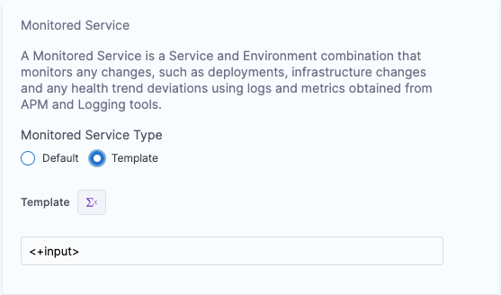
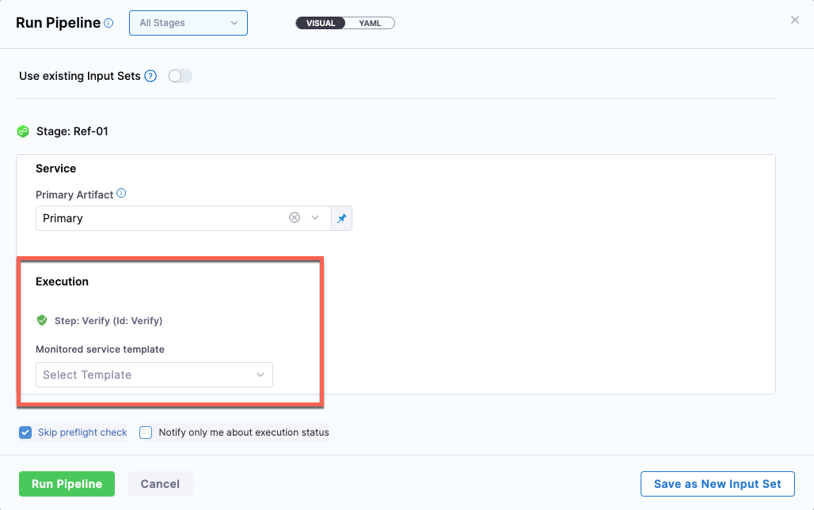
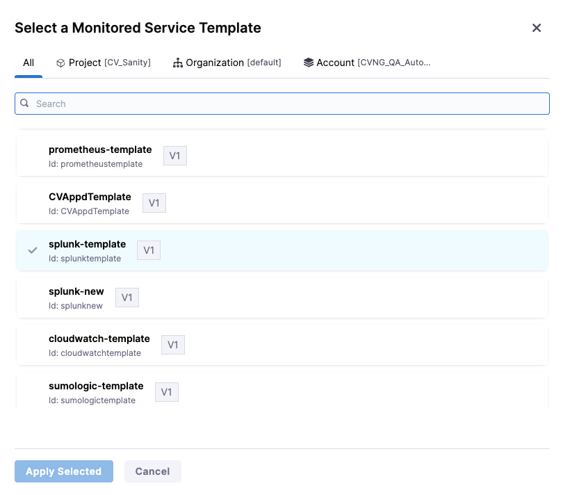

Continuous Verification is achieved by adding a Verify step in the deployment pipeline. The Verify step uses monitored services to figure out what metrics and logs need to be included in the verification. A monitored service definition is associated with a particular service running in the environment. 

When a Verify step is added in a pipeline, it determines the service that is getting deployed and the environment that it the service is getting deployed to for that particular pipeline stage. Based on the service and environment information, the Verify step picks the corresponding monitored service (i.e the monitored service which is mapped to that service & environment) and uses it for verification.

A monitored service entity can contain a set of Health Sources. A Health Source is a collection of either metric or log configurations to be used for verification. Each health source corresponds to one particular source. For example AppDynamics, Splunk, Prometheus, etc. The users can add a combination of log and metric type of health sources in a particular monitored service.

## Creating a monitored service template

Creating monitored services for each of the deployed services (service running in a particular environment) is a tedious and repetitive task if it needs to be created for many services. Many of the metric and log configurations only change slightly for each service. To alleviate this problem, you can create a monitored service template for monitoring the deployed services.

While a monitored service entity contains a lot more than a set of health sources, the presence of health sources is sufficient for verification purposes. Hence, a monitored service template can be created only with required health sources. Coupling a monitored service template with services and environments is intentionally kept loose to allow using a template used for deployment for different services.

You can input the monitored service template as runtime input or expression. This helps in tweaking the template at runtime based on the context of a deployment (for a particular service getting deployed to a particular environment). 

For more details on creating a monitored service template, go to [Monitored service template documentation](/docs/service-reliability-management/monitored-service/monitored-service-template-quickstart).

## Configuring the monitor service template in a Verify step

Like any other construct of a pipeline (step, stage, pipeline), a step template for a Verify step can also be created. Verify step template can be used in conjunction with other pipeline constructs like pipeline, stage template, etc.

You can configure the monitored service template in the Verify step configuration. You can select whether you want to use Default or Template for verification.

* **Default**: Verify step will automatically identify the right monitored service based on the service and environment configuration of the stage to be used for verification. If it does not find the corresponding monitored service, then the step will be skipped.
  
  :::important
  When using the Default option for Monitored Service Type in the Verify step, you can see the option, **Click to autocreate a monitored service**. It is done just to make the user interaction simpler while using a deployment stage with fixed service and environment input. The Verify step identifies if a corresponding monitored service exists or not. If it does not exist, then the step provides the option to automatically create a monitored service. You can add add health sources and configure the complete monitored service using this option.
  :::
  
* **Template**: You can specify the monitored service template to be used for verification as a fixed value or runtime input.

To select a monitored service template, select **Template** under **Monitored Service** > **Monitored Service Type** in the Verify step configuration page. The template input can be a fixed value or runtime input. 

### Select a fixed monitored service template 

1. Select Template input as a fixed value.
2. Select **Select Template**.
3. In the **Templates > Monitored Service Templates** page, select a template of your choice.
4. Select the **Version Label**.
5. Select **Use Template**.

### Select a monitored service template during runtime

:::important
This feature is currently behind the feature flag, `CV_MONITORED_SERVICE_TEMPLATIZATION`. To enable a feature flag in your Harness account, contact [Harness Support](mailto:support@harness.io).
:::

To select a monitored service template during runtime, on the Verify step settings page, do the following:

1. Select Template input as a runtime value, and apply changes to the step configuration.
   
   
2. During run time, in the **Run Pipeline** page's **Execution** > **Step: Verify** > **Monitored service template** section, select **Select Template**.
   
   
3. In the **Select a Monitored Service Template** page, select a monitored service template.
   
   
4. Select **Apply Selected**.

## Advanced use cases

A monitored service template allows the following use cases:

* Multiple verify steps with different monitored service templates can be configured to be run in a particular stage. These steps can be then configured to be run based on certain conditions.
* A monitored service template with an user impacting metric (not necessarily satisfied/linked to a single service) can be created and use in verification in addition to a template with service linked metric.

