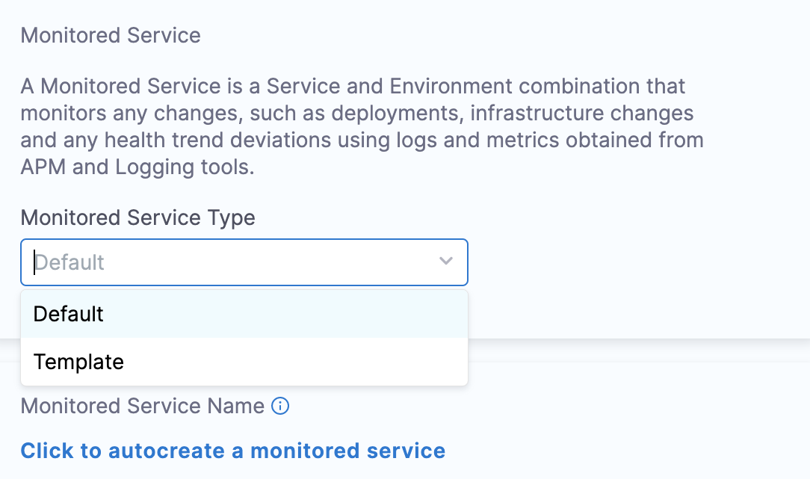
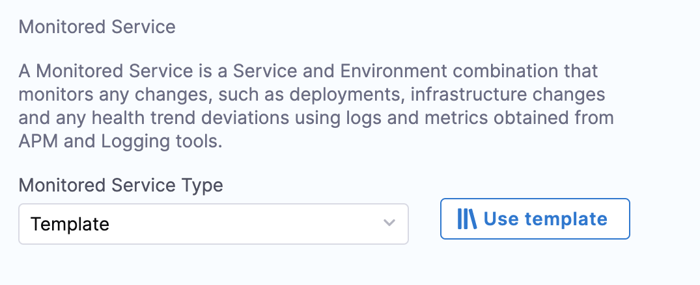

# Templates and Templatization in Continuous Verification

Continuous Verification is achieved by adding a “Verify Step” in the deployment pipeline; while verify step uses the construct of “Monitored Service” to figure out what metric & log needs to be included in the verification.

A monitored service definition includes its associated with a particular service running in the environment. When a “verify” step is added in a pipeline, it figures out the service which is getting deployed in that particular pipeline stage and also the environment to which it is getting deployed. Based on this service & environment information, “verify” step picks the corresponding monitored service (i.e the monitored service which is mapped to that service & environment) and uses it for verification.

A monitored service entity can contain a set of “Health Sources”. A “Health Source” is a collection of either metric or log configurations (to be used for verification). Each health source corresponds to one particular source; for example Appdynamics, Splunk, Prometheus etc. The users can add a combination of log & metric type of health sources in a particular monitored service.

## Monitored Service Template

Creating monitored services for each of the deployed services (service running in a particular environment) can soon become a tedious & repetitive task if it needs to be created for many services. We have noticed that a lot of metric & log configuration only changes slightly for each service. That's how the need to have a “Monitored Service Template” became evident.

While a monitored service entity contains a lot more than a set of  health sources; but with respect to verification presence of health sources is sufficient condition. Hence a monitored service template can be created only with required health sources. Coupling of a monitored service template with service & environment is intentionally kept loose; which allows a template to be used for deployment for different services.

Monitored service template allows runtime inputs & expression for configuration; which helps in tweaking the template at run time based on the context of a deployment ( for particular service getting deployed to a particular environment). 

Details documentation for creation of monitored service template is available [here](https://developer.harness.io/docs/service-reliability-management/use-service-reliability-management/monitored-service-template/monitored-service-template-quickstart).

## Verify Step -  Monitored Service Template Configuration

The user can configure the monitored service template to be used in verification through Verify Step Configuration.

As shown above, the user can select whether it wants to use “default” or “template” for verification. 

* **Default**: Verify step will automatically identify the right monitored service ,based on the service & environment configuration of the stage, to be used for verification. If it does not find the corresponding monitored service then the step will be skipped.
* **Template**: Here the user can specify the monitored service template to be used for verification (as shown in image below). Key points to note:
	* In case there is any run time input field or variables to be provided; the step will be displaying all those fields for the user's input. 
	* User can choose to populate those fields with pipeline variable.  
	* User can choose to keep those fields as run time input and provide the input as part of pipeline execution.

## Verify Step Template

Like any other construct of pipeline (step, stage, pipeline); a step template for verify step can also be created. Verify step template can be used in conjunction with other pipeline constructs like pipeline, stage template etc.

It also allows, user to specify whether it wants to use the “default” or “template” option for the monitored service. What it means is that a monitored service template can be used as part of concrete verify step and also with verify step template. If the purpose is to standardize the step configuration then create a step template for verify step. 

### Advanced Use Cases

Flexibility available with monitored service template allows following use cases:

* Multiple verify steps with different monitored service templates can be configured to be run in a particular stage. These steps can be then configured to be run based on certain conditions.
* A monitored service template with user impacting metric (not necessarily satisfied/linked to a single service) can be created and use in verification in addition to a template with service linked metric.

While using “default” option for  “Monitored Service Type” in the verify step; users will notice an option of “click to autocreate a monitored service”. It is done just to make user interaction simpler while using a deployment stage with fixed service & environment input. Here the verify step identifies if a corresponding monitored service exists or not; if it does not exist then it will provide the option of auto creation. Users can click on it, then it will further request users to add health sources. Hence use can configure the complete monitored service itself through the verify step.

