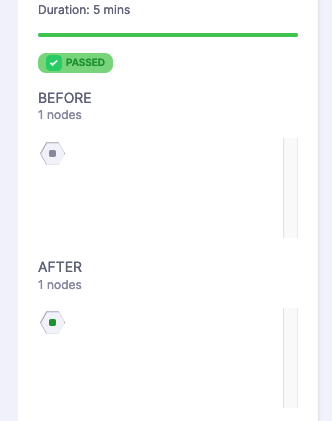

# Harness Continuous Verification FirstGen and Continuous Verification NextGen - key differences 

This topic lists the differences between Harness Continuous Verification FirstGen and Harness Continuous Verification NextGen. It also provides the address mappings between them.

Harness Continuous Verification NextGen introduces a more reliable and customizable approach to Continuous Verification (CV). It relies on your monitoring, logging, and observability solutions as the primary data source for deployment-related information.

Compared to Harness Continuous Verification FirstGen, Harness Continuous Verification NextGen offers increased flexibility and control over the queries used. You can specify the queries to run and retrieve data from your monitoring, logging, and observability solutions based on the defined analysis time. This ensures precise and targeted verification of your deployments.

Harness Platform provides flexible CV capabilities. You can easily add CV as a step in your pipeline and access skip conditions, failure strategies, and other features of a Harness Step or Stage. This level of control allows seamless integration and optimized verification process.

## Key differences

* Introduction of "Monitored Service" concept: In Harness Continuous Verification NextGen, the verification process involves configuring the "when" and "where" to verify as part of the Pipeline Verify step. However, the specifics of "what" to query and "how" to query against your health source are defined in a Monitored Service configuration. Monitored Services can be templated and utilize run-time or expressions.

* Multiple health sources in a single Verify step: Harness Continuous Verification NextGen allows adding multiple health sources (data providers) within a single Verify step. This means you can validate against multiple sources, such as Prometheus and Datadog, in a unified manner. This eliminates the need for separate steps, as was required in Harness Continuous Verification FirstGen.

* Shifting data responsibility to monitoring/logging/observability solution: In Harness Continuous Verification NextGen, the responsibility of tracking deployed components is placed on the monitoring/logging/observability solution. This is accomplished through the concept of [Service Instance Identifier (SII)](#service-instance-identifier-sii), which replaces the Continuous Delivery (CD) pipeline as the source of deployment data. The SII enables querying for changes and focuses on specific deployed elements within the analysis window, such as using the SII "pod" for Kubernetes deployments.

* Expanded verification types: Harness Continuous Verification NextGen introduces additional verification types, including support for rolling deployments and load tests. In contrast, Harness Continuous Verification FirstGen was limited to "canary" and "previous" deployment scenarios.

## Field mappings

The following table lists the Harness Continuous Verification FirstGen and Harness Continuous Verification NextGen field mappings:

| **Harness Continuous Verification FirstGen**            | **Harness Continuous Verification NextGen**                    |
|---------------------|-----------------------------|
| Duration            | Duration, 1:1 Map           |
| Connectors          | 1:1 Map                     |
| Tolerance           | Sensitivity                 |
| Fail on Empty Nodes | Fail on No Data             |
| Host Config         | Service Instance Identifier |

## Service Instance Identifier (SII)

The Service Instance Identifier (SII) is a feature used in Harness Continuous Verification NextGen to identify [new or changed nodes](https://developer.harness.io/docs/continuous-delivery/verify/cv-results/interpret-metric-results#nodes-section) during a deployment. It acts as a filter to pinpoint metrics related to what has been deployed. Harness Continuous Verification NextGen uses the SII to calculate the deployed components based on observed metrics. This is particularly useful in scenarios like canary deployments, where the SII helps determine which nodes are stable and which nodes represent the canary in the current phase of analysis.

### Use SII in Harness Continuous Verification NextGen

Here's an example of how to set up Harness Continuous Verification NextGen with a 5-minute analysis window using a [Prometheus Health Source](https://developer.harness.io/docs/continuous-delivery/verify/configure-cv/verify-deployments-with-prometheus) for a rolling deployment to a Kubernetes endpoint. This example also demonstrates using SII to filter and identify specific deployments.

PromQL:

```
max(
    CV_Counter_Example_total    {
   	 app="harness-cv-prom-example"
})
```

SII: `pod`

#### Query execution process

Let's use the Prometheus query as an example to understand this process:
 
1. Queries the SII (in this case, pod) to list all possible pods within the specified time range.
   
   `/api/v1/label/**pod**/values?start=1685548800&end=1685549100&match[]={app="harness-cv-prom-example"}`

2. Retrieves the PromQL metric values by iterating over the returned SII results for each pod.
   
   `api/v1/label/**app**/values?start=1685548800&end=1685549100&match[]={app="harness-cv-prom-example"}`

By leveraging the SII, Harness Continuous Verification NextGen determines the pods that existed before and after the deployment by querying the monitoring solution. If a pod was present before and after, it is considered stable. If a pod is present after but not before, it is identified as a canary pod. The node determination is then made.

	

### SII configuration tips

The purpose of the SII is to determine what has been deployed from a monitoring system. Different monitoring systems handle this differently, depending on how the system is configured and how labeling is applied to the deployed resources. In the [query execution process](#query-execution-process), iterating over the SII is necessary. However, with other monitoring solutions, the process may vary, but the end result is the same: gathering information about what was available before and after deployment for node determination.

#### Potential SII’s

| **SII**       | **Usage**                                                                             |
|---------------|-------------------------------------------------------------------------------------|
| pod/podname   | Kubernetes                                                                          |
| containername | ECS                                                                                 |
| version       | When resources for deployment are tagged with versions, utilizing the version as SII can be an effective way to filter and identify specific deployments. |

