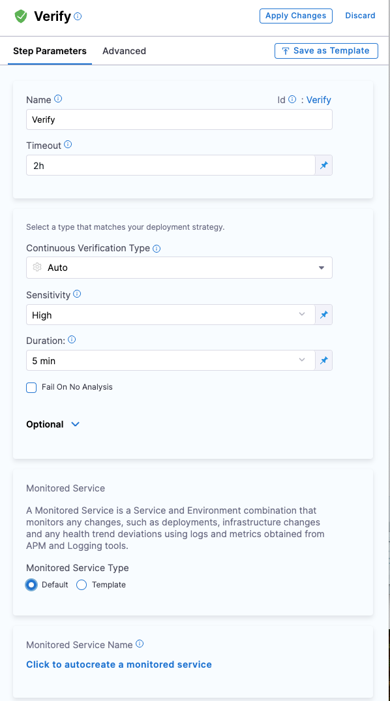

This topic describes how to add a simple Harness Continuous Verification (CV) step to a Harness CD pipeline, configure your Application Performance Monitoring (APM) tool as a health source, and verify your deployment.

## Prerequisites

Make sure that you have created:

- A connector for your health source in Harness. To learn how to add a connector, go to [Connect to monitoring and logging systems](/docs/platform/Connectors/Monitoring-and-Logging-Systems/connect-to-monitoring-and-logging-systems).

- A CD pipeline in Harness. To learn how to create a CD pipeline in Harness yet, go to [Create your first CD pipeline](/docs/continuous-delivery/get-started/create-first-pipeline). 

## Add a Verify step to your CD pipeline

To add a Verify step to your pipeline, use one of the methods below.

### Add a Verify step while building a deployment stage

If you're building a deployment stage and are currently on the Execution Strategies page:

1. Select the **Enable Verification** option. 
    
   The Verify step gets added to the pipeline.

2. Select the **Verify** step.  
   
   The Verify settings page appears.

### Add a Verify step to an existing deployment stage

If you already have a deployment stage:

1. Select the stage where you want to add the Verify step.
   
2. On the stage settings pane, select the **Execution** tab.
   
3. On the pipeline, hover over where you want to add the Verify step, select the **+** icon, and then choose **Add Step**.  

   The Step Library page appears.
You can add a step at various points in the pipeline, such as the beginning, end, in between existing steps, or below an existing step. Simply choose the location where you want to add the step and follow the prompts to add it.

4. In the **Continuous Verification** section, select **Verify**.  
   
   The Verify settings page appears.

## Define name and timeout information

On the Verify settings page, do the following:

1. In **Name**, enter a name for the Verification step.
   
2. In **Timeout**, enter a timeout value for the step. Harness uses this information to time out the verification. Use the following syntax to define a timeout:
   - **w** for weeks.
   - **d** for days.
   - **h** for hours.
   - **m** for minutes.
   - **s** for seconds.
   - **ms** for milliseconds.

   For example, use 1w for one week, 7d for 7 days, 24h for 24 hours, 100m for 100 minutes, 500s for 500 seconds, and 1000ms for 1000 milliseconds.
   
   The maximum timeout value you can set is **53w**. You can also set timeouts at the pipeline level.

## Select a continuous verification type, sensitivity, and duration

On the Verify settings page, do the following:

1. In **Continuous Verification Type**, select **Threshold Analysis [No ML]**.
   
2. In **Duration**, choose a duration. Harness uses the data points within this duration for analysis. For instance, if you select 10 minutes, Harness analyzes the first 10 minutes of your APM data. Harness recommends choosing 15 minutes for APM. This helps you thoroughly analyze and detect issues before releasing the deployment to production.
   
3. In the **Artifact Tag** field, reference the primary artifact that you added in the **Artifacts** section of the **Service** tab. Use the Harness expression `<+serviceConfig.artifacts.primary.tag>` to reference the primary artifact. To learn about artifact expression, go to [Harness expression](..//..platform/../../../platform/12_Variables-and-Expressions/harness-variables.md).

## Create a monitored service

The next step is to create a monitored service for the Verify step. Harness CV uses a monitored service to monitor health trend deviations, using logs and metrics obtained from the health source, such as APM and logging tools.

:::info note
If you've set up a service or environment as runtime values, the auto-create option for monitored services won't be available. When you run the pipeline, Harness combines the service and environment values to create a monitored service. If a monitored service with the same name already exists, it will be assigned to the pipeline. If not, Harness skips the Verification step.

For instance, when you run the pipeline, if you input the service as `todolist` and the environment as `dev`, Harness creates a monitored service with the name `todolist_dev`. If a monitored service with that name exists, Harness assigns it to the pipeline. If not, Harness skips the Verification step.
:::

To create a monitored service, on the Verify settings page, do the following:

1. In the **Monitored Service Name** section, select **Click to autocreate a monitored service**.

      Harness automatically generates a monitored service name by combining the service and environment names. The generated name appears in the **Monitored Service Name** field. Note that you cannot edit the monitored service name.

      If a monitored service with the same name and environment already exists, the **Click to autocreate a monitored service** option is hidden, and Harness assigns the existing monitored service to the Verify step.

## Add a health source

A health source is an APM tool that monitors and aggregates data in your deployment environment. 

The following steps use SumoLogic as an example to describe how to add a heath source.

### Define a health source

On the Verify settings page, do the following to add a health source:

1. In the **Health Sources** section of the Verify settings page, select **+ Add New Health Source**.
   
   The Add New Health Source dialog appears.

2. In the **Define Health Source** tab, do the following:
      
   1. In the **Define Health Source** section, select **Sumologic** as the health source type.
      
   2. In the **Health Source Name** field, enter a name for the health source.
      
   3. In the **Connect Health Source** section, select **Select Connector**. 
   
      The Create or Select an Existing Connector dialog appears.
      
   4. Select a connector, and then select **Apply Selected**.  
         The selected connector appears in the **Select Connector** dropdown.
         
   5. In the **Select Feature** field, choose SumoLogic Cloud Metrics, and then select **Next**.  
   
      The **Configuration** tab appears.

### Define metric configuration settings

1. On the **Configuration** tab, select **+ Add Metric**.  
   The Add Metric dialog appears.
2. Enter the following information, and then select **Submit**:  
      * **Metric name**: Enter a name for the metric. For example, Memory Metric.
      * **Group name**: If the group to which you want to add the metric already exists, select it.   
     If you want to create a new group, select **+ Add New**. In the Add Group Name dialog, enter a group name, and then select **Submit**.
3. In the Add Metric dialog, select **Submit**.   
   New group and metric are created. The query specifications and mapping settings are displayed. These settings help you get the desired metric data from your health source and map it to the Harness service.

#### Define a query

   In the **Query** box, enter your metric query, and then select **Run Query**.  
   Sample data is displayed in the **Records** box. The **Chart** box displays the graph corresponding to the sample data. This helps you verify if the query that you have built is correct.

   

   
<b>Sample query for memory usage</b>

   Query: `metric=memory`

   

   Disk usage records and chart being displayed for the query:

   

   

#### Assign services

In the **Assign** section, select the services to which you want to apply the metric. Following options are available:
   
   * **Continuous Verification (Applied to the pipelines in the Continuous Deployment)**: Select this option to use the metric data in the CD pipeline to ensure that the deployed service is running safely.

#### Configure risk profile
  
:::info note
The **Risk Profile** section is only visible if you have selected **Continuous Verification (Applied to the pipelines in the Continuous Deployment)** in the **Assign** section.
:::

1. Under **Risk Category**, select one of the following options:
   
   - **Errors**
   - **Infrastructure**
   - **Performance/Throughput**
   - **Performance/Other**
   - **Performance/Response Time**

2. Under **Deviation Compared To Baseline**, select the following settings to measure your service's behavior and calculate deviations from the health source:

   - **Higher counts = higher risk**
   - **Lower counts = higher risk**

  You can select multiple options.

#### Map service instance identifier

:::info note
The **Map service instance identifier** section is visible only if you have selected **Continuous Verification (Applied to the pipelines in the Continuous Deployment)** in the **Assign** section.
:::

In **Service Instance Identifier (only needed for CV)**, specify the service instance identifier, which represents a dynamically created service that you deploy using Harness. The default value is `_sourceHost`.

#### Advanced (Optional)

:::info note
The **Advanced (Optional)** section is only visible if you have selected **Continuous Verification (Applied to the pipelines in the Continuous Deployment)** in the **Assign** section.
:::

##### Ignore thresholds

You can select the types of events for which you want to set thresholds in CV. Metrics that match the selected rules will not be flagged as anomalous, regardless of the analysis. 

To set the **Ignore Thresholds** for CV:

1. Go to the **Ignore Thresholds** tab and select the **+ Add Threshold** button.
2. From the **Metric** dropdown, select the desired metric for which you want to set the rule.
3. In the **Criteria** field, choose **Absolute Value**, and enter the **Greater than** and **Lesser than** values.

##### Fail-Fast thresholds

You can select the type of events for which you want to set thresholds in CV. Any metric that matches the selected rules will be marked as anomalous and cause the workflow state to fail.

To set fail-fast thresholds for CV, follow these steps:

1. Go to the **Fail-Fast Thresholds** tab and select the **+ Add Threshold** button.
2. From the **Metric** dropdown, select the desired metric for which you want to set the rule.
3. In the **Action** field, select what the CV should do when applying the rule:
- **Fail Immediately**
- **Fail after multiple occurrences**
- **Fail after consecutive occurrences**
4. In the **Count** field, set the number of occurrences. This setting is only visible if you have selected **Fail after multiple occurrences** or **Fail after consecutive occurrences** in the **Action** field. The minimum value must be two.
5. In the **Criteria** field, choose **Absolute Value**, and enter the **Greater than** and **Lesser than** values.
   Harness verifies the deployment against the values that you set.

### Save the health source settings

1. After configuring all the settings, select **Submit** to add the health source to the Verify step.
   
2. Select **Apply Changes** to save the changes made to the Verify step.

## Run the pipeline

To run the pipeline:

1. In the upper-right corner, select **Run**.  
   
   The Run Pipeline dialog appears.

2. In the dialog, do the following:
   - **Tag**: If you did not add a tag in the **Artifact Details** settings, select it now.
   - **Skip preflight check**: Select this option if you want to skip the preflight check.
   - **Notify only me about execution status**: Select this option if you want Harness to alert only you about the execution status.
  
3. Select **Run Pipeline**.  
   
   The pipeline starts running.

   To view the console, select **View Details** in the **Summary** section or turn on the **Console View** toggle switch in the upper-right corner.

   Note that it may take some time for the analysis to begin. The screenshot below shows a Verification step running in a deployment:

   

## View results

After the verification is complete, the Console View displays the verification details such as metric name, health source, risk, and so on.

The following screenshots show the console view of successful and failed verifications in a deployment run:

**Successful verification**

**Failed verification**

