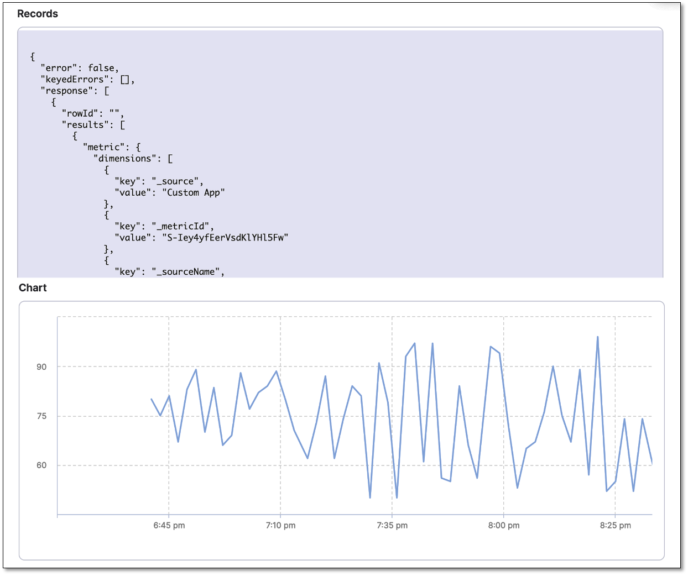

:::info note
Currently, this feature is behind the feature flag `SRM_ENABLE_SIMPLE_VERIFICATION`. Contact Harness Support to enable the feature.
:::

This section outlines the process of adding a Harness Continuous Verification (CV) step into a Harness CD pipeline, configuring a health source, and conducting deployment verification.

For illustration purposes, this topic uses SumoLogic as a sample health source to guide you through the health source configuration steps.

## Prerequisites

Make sure that you have created:

- A connector for your health source in Harness. To learn how to add a connector, go to [Connect to monitoring and logging systems](/docs/platform/Connectors/Monitoring-and-Logging-Systems/connect-to-monitoring-and-logging-systems).

- A CD deployment pipeline in Harness. To learn how to create a CD pipeline in Harness yet, go to [Create your first CD pipeline](/docs/continuous-delivery/get-started/onboarding-guide#step-2-create-your-first-cd-pipeline). 

## Add a Verify step to your CD pipeline  

To add a Verify step to your pipeline, use one of the methods below.

1. In your Harness project, go to the **Deployments** module > **Pipelines**. 

2. Select the pipeline to which you want to add the **Verify** step.
   The Pipeline Studio page appears.

3. Select the stage where you want to add the Verify step. 

4. On the stage settings pane, select the **Execution** tab.

5. On the pipeline, hover over where you want to add the **Verify** step, select the **+** icon, and then choose **Add Step**.  
The Step Library page appears.
You can add a step at various points in the pipeline, such as the beginning, end, in between existing steps, or below an existing step. Simply choose the location where you want to add the step and follow the prompts to add it.

4. In the **Continuous Verification** section, select **Verify**.  
   The Verify settings page appears.

## Define name and timeout information

On the Verify settings page, do the following:

1. In **Name**, enter a name for the Verification step.
   
2. In **Timeout**, enter a timeout value for the step. Harness uses this information to time out the verification. Use the following syntax to define a timeout:
   - **w** for weeks.
   - **d** for days.
   - **h** for hours.
   - **m** for minutes.
   - **s** for seconds.
   - **ms** for milliseconds.

   For example, use 1w for one week, 7d for 7 days, 24h for 24 hours, 100m for 100 minutes, 500s for 500 seconds, and 1000ms for 1000 milliseconds.
   
   The maximum timeout value you can set is **53w**. You can also set timeouts at the pipeline level.

## Select the continuous verification type and duration

On the Verify settings page, do the following:

1. In **Continuous Verification Type**, select **Threshold Analysis [No ML]**.
   
2. In **Duration**, choose a duration. Harness uses the data points within this duration for analysis. For instance, if you select 15 minutes, Harness analyzes the first 15 minutes of your health source data.
   
3. In the **Artifact Tag** field, reference the primary artifact that you added in the **Artifacts** section of the **Service** tab. Use the Harness expression `<+serviceConfig.artifacts.primary.tag>` to reference the primary artifact. To learn about artifact expression, go to [Harness expressions](/docs/platform/Variables-and-Expressions/harness-variables).

## Create a monitored service

The next step is to create a monitored service for the Verify step. Harness CV uses a monitored service to monitor health trend deviations using logs and metrics obtained from your SumoLogic health source.

:::info note
When setting up the pipeline, if you've configured a service or an environment as runtime values, the auto-create option for monitored services won't be available. When you run the pipeline, Harness combines the service and environment values to create a monitored service. If a monitored service with the same name already exists in your project, it will be assigned to the pipeline. If not, Harness skips the verification step.

For instance, when you run the pipeline, if you input the service as `todolist` and the environment as `dev`, Harness creates a monitored service with the name `todolist_dev`. If a monitored service with that name exists, Harness assigns it to the pipeline. If not, Harness skips the Verification step.
:::

To create a monitored service, on the Verify settings page, do the following:

1. In the **Monitored Service Name** section, select **Click to autocreate a monitored service**.

      Harness automatically generates a monitored service name by combining the service and environment names. The generated name appears in the **Monitored Service Name** field. Note that you cannot edit the monitored service name.

      If a monitored service with the same name and environment already exists, the **Click to autocreate a monitored service** option is hidden, and Harness assigns the existing monitored service to the Verify step.

## Add a health source

A health source is an APM tool that monitors and aggregates data in your deployment environment. 

The following steps describe how to add SumoLogic as a health source and write a query for memory usage.

### Define health source

On the Verify settings page, do the following to add and define the health source:

1. In the **Health Sources** section of the Verify settings page, select **+ Add New Health Source**.
   
   The Add New Health Source dialog appears.

2. In the **Define Health Source** tab, do the following:
      
   1. In the **Define Health Source** section, select **Sumologic** as the health source type.
      
   2. In the **Health Source Name** field, enter a name for the health source.
      
   3. In the **Connect Health Source** section, select **Select Connector**. 
   
      The Create or Select an Existing Connector dialog appears.
      
   4. Select a connector, and then select **Apply Selected**.  
         The selected connector appears in the **Select Connector** dropdown.
         
   5. In the **Select Feature** field, choose **SumoLogic Cloud Metrics**.  
   
    

   6. Select **Next**.  
   
      The **Configuration** tab appears.

### Define metric configuration settings

The following steps describe defining a query and configuring a risk profile:

1. On the **Configuration** tab, select **+ Add Metric**.  
   The Add Metric dialog appears.

2. Enter the following information, and then select **Submit**:  
      - **Metric name**: Enter a name for the metric. For example, "SumoLogic Metric".
      - **Group name**: Create a new group, by selecting **+ Add New**. In the Add Group Name dialog, enter a group name. For example, "SumoLogic".

3. Select **Submit**.
   
4. In the Add Metric dialog, select **Submit**.   
   A new group and metric are created. The query specifications and mapping settings are displayed. These settings help you get the desired metric data from your health source and map it to the Harness service.

#### Define a query

1. In the **Query** box, write a query. As an example, enter the query `metric=memory` for querying the disk usage.
   
2. Select **Run Query**.
   
   Sample data is displayed in the **Records** box. The **Chart** box displays the graph corresponding to the sample data. This helps you verify if the query that you have built is correct.

   

   Disk usage records and chart are being displayed for the query:

   

### Assign services and configure risk profile

1. In the **Assign** section, select **Continuous Verification (Applied to the pipelines in the Continuous Deployment)**.

2. Under **Risk Category**, select **Performance/Throughput**

3. Under **Deviation Compared To Baseline**, select **Higher counts = higher risk**.

  
  

#### Configure threshold

Harness CV evaluates the metrics based on the fail-fast threshold you configure. If the metrics breach the fail-fast threshold, the verification step fails. In the context of the [SumoLogic query](#define-a-query) you defined, the purpose here is to set a threshold for memory usage beyond which the application is considered to be in a problematic state, and the verification fails.

To set fail-fast threshold, follow these steps:

1. Expand **Advanced (Optional)**, go to the **Fail-Fast Thresholds** tab, and then select the **+ Add Threshold** button.

2. From the **Metric** dropdown, select **SumoLogic Metric**. This is the metric you created in the [Define metric configuration settings](#define-metric-configuration-settings) step.

3. In the **Action** field, select what the CV should do when applying the rule. Let's select **Fail Immediately**.

4. In the **Criteria** field, choose **Percentage Deviation**, and from the greater than select **1**. The purpose here is to set a threshold for memory usage beyond which the system or application is considered to be in a problematic state, and action should be taken.

### Save the health source settings

1. After configuring all the settings, select **Submit** to add the health source to the Verify step.
   
2. Select **Apply Changes** to save the changes made to the **Verify** step. You will now see the health source listed in the **Health Sources** section.
   
3. Select **Save**.
   
   You have successfully added and configured CV in your Harness pipeline.

## Run the pipeline

When you run the pipeline, Harness executes the verification step.

To run the pipeline, follow these steps:

1. In the upper-right corner, select **Run**.  
   
   The Run Pipeline dialog appears.

2. In the dialog, do the following:
   - **Tag**: If you did not add a tag in the **Artifact Details** settings, select it now.
   - **Skip preflight check**: Select this option if you want to skip the preflight check.
   - **Notify only me about execution status**: Select this option if you want Harness to alert only you about the execution status.
  
3. Select **Run Pipeline**.  
   
   The pipeline starts running.

   To view the console, select **View Details** in the **Summary** section or turn on the **Console View** toggle switch in the upper-right corner.

   Note that it may take some time for the analysis to begin. The screenshot below shows a Verification step running in a deployment:

   

## View results

After the verification is complete, the Console View displays the verification details, such as metric name, health source, risk, and so on.

The following screenshots show the console view of successful and failed verifications in a deployment run:

**Successful verification**

**Failed verification**

