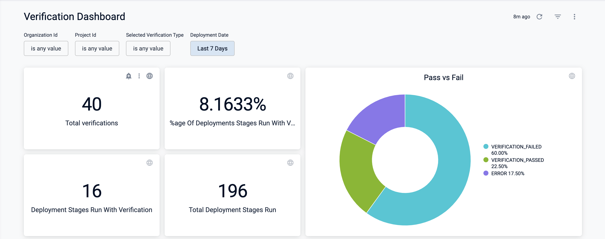
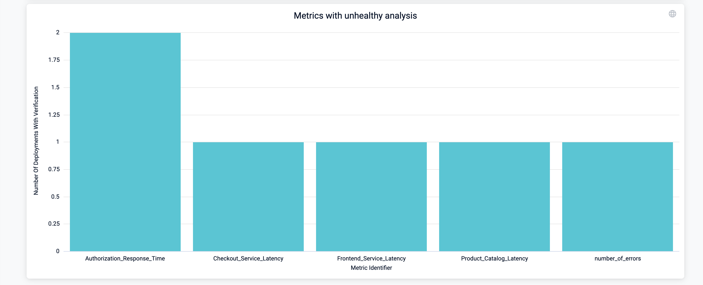

Harness provides many out-of-the-box dashboards, including the Verification Dashboard. To learn more about Harness Dashboards, go to [Harness Dashboards](/docs/platform/dashboards/dashboards-overview.md)

This topic describes the out-of-the-box Verification Dashboard and its features. 

### Prerequisites

Before you learn more about the Verification Dashboard, ensure that:

- You have an understanding of [Continuous Verification](/docs/continuous-delivery/verify/verify-deployments-with-the-verify-step) at Harness.
- You know where to find [Harness Dashboards](/docs/platform/dashboards/dashboards-overview.md) and how they work. 

### Verification Dashboard

The first row of the dashboard gives a broad overview of verifications on your account.

Pay special attention to the options for **Organization ID**, **Project Id**, **Selected Verification Type**, and **Deployment Date** to ensure you are looking at the data that's relevant to you.

Dashboard Elements:
- **Total verifications**: The total number of verifications on your account.
- **%age Of Deployments Stages Run With Verification**: The percentage of deployment stages run in your account with a verification step. This number is the ratio of **Deployment Stages Run with Verification** over **Total Deployment Stages Run**.
- **Deployment Stages Run with Verification**: The total number of deployment stages run in your account with a verification step. 
- **Total Deployment Stages Run**: The total number of deployment stages run in your account. 
- **Pass vs Fail**: Pie graph that displays the result of all deployment stages run with verification.

The second row of the dashboard provides more insight into the frequency and type of verifications run on your account.

Dashboard Elements:
- **Verifications ran daily**: Displays the number of verifications ran each day.
- **Selected verification types**: Pie graph that shows the distribution of verification [deployment types](/docs/continuous-delivery/verify/verify-deployments-with-the-verify-step#deployment-strategies-for-cv) in use in your account.

The third row of the dashboard gives insight into failure strategy and information on relevant monitored services. 

Dashboard Elements:
- **Failure strategy**: Breaks down the number of times a failure strategy was used on a per-day basis. 
- **Monitored service type**: Pie graph that breaks down the type of the [monitored services](/docs/platform/monitored-service/) used for verification. 

The fourth row of the dashboard tracks health source usage:

Dashboard Elements:
- **Number of times different health sources are used**: Bar graph that shows the total number of times a health source was used for verification over the period specified by the **Deployment Date**.

The fifth row of the dashboard tracks custom queries. 

Dashboard Elements:
- **Custom queries**: Bar graph that breaks down custom queries on a per health source basis. 

The sixth row of the dashboard tracks unhealthy metrics.

Dashboard Elements;
- **Metrics with unhealthy analysis**: Bar graph that displays the number of deployments with verifications that resulted in an `UNHEALTHY` analysis risk. Use this graph to track unhealthy metrics and understand what's causing the verification issues.  