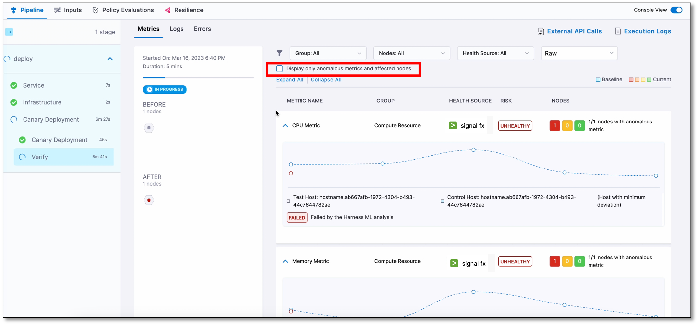
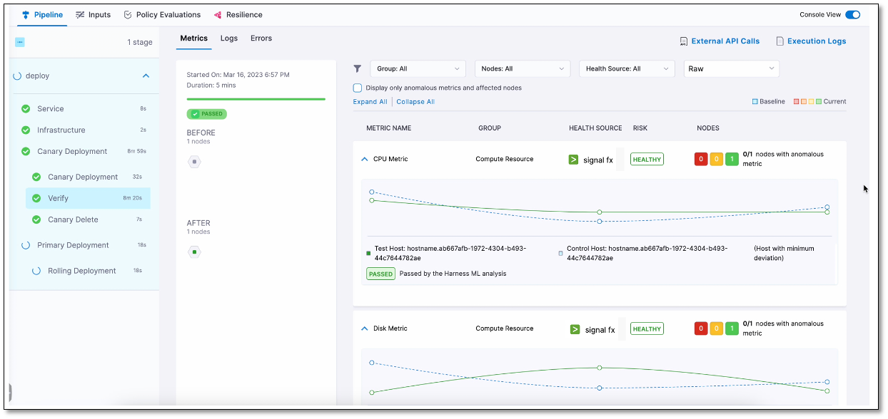
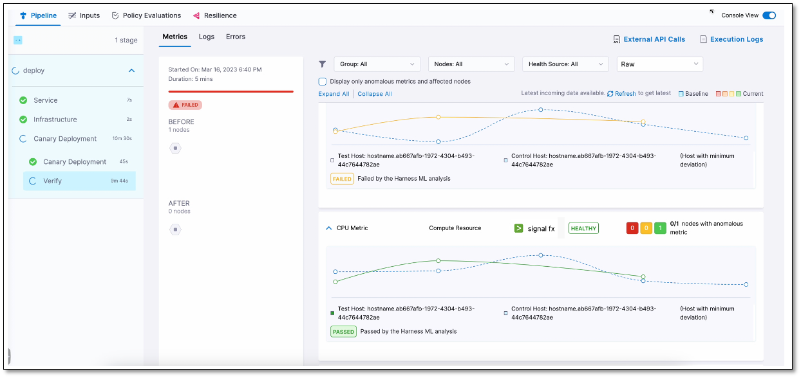

The console view displays detailed logs of the pipeline, including verification logs. To view the console, select **View Details** in the **Summary** section or turn on the **Console View** toggle switch in the upper-right corner.

By default, the console displays logs of only the anomalous metrics and affected nodes. To see all logs, clear the **Display only anomalous metrics and affected nodes** check box.

The following screenshots show successful and failed verifications in a deployment run:

**Successful verification**

**Failed verification**

