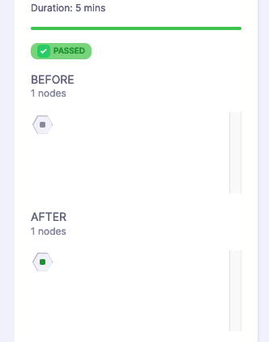

# Harness Continuous Verification (CV) overview

Harness CV is a critical step in the deployment pipeline that validates deployments. Harness CV integrates with APMs and logging tools to verify that the deployment is running safely and efficiently. Harness CV applies machine learning algorithms to every deployment for identifying normal behavior. This allows Harness to identify and flag anomalies in future deployments. During the Verify step, Harness CV automatically triggers a rollback if anomalies are found.

This topic provides an overview of the prerequisites and steps involved in setting up Harness CV.

:::info note
If you are already familiar with setting up Harness CV and the verification step and are looking for instructions on configuring the verification step for a specific health source, then go to [Configure CV](/docs/category/configure-cv).
:::


## Before You Begin

* [Learn Harness' Key Concepts](/docs/platform/get-started/key-concepts.md).
* [Learn about Kubernetes deployments](../deploy-srv-diff-platforms/kubernetes/kubernetes-cd-quickstart.md).
* [Refer to the supported platforms and technologies](/docs/continuous-delivery/verify/cv-whats-supported.md)


## Deployment strategies for CV

You can set up Harness CV by adding a Verify step to a pipeline. The following are deployment strategies that you can apply while configuring CV.


###  Continuous verification type
   
- **Auto**: Harness automatically selects the best continuous verification type based on the deployment strategy.
    
- **Rolling Update**: Rolling deployment is a deployment technique that gradually replaces old versions of a service with a new version by replacing the infrastructure on which the service runs. Rolling updates are useful in situations where a sudden changeover might cause downtime or errors.
    
- **Canary**: Canary deployment involves a two-phased deployment. In phase one, new pods and instances with the new service version are added to a single environment. In phase two, a rolling update is performed in the same environment. Canary deployment helps to detect issues with the new deployment before fully deploying it.
    
- **Blue Green**: Blue-green deployment is a technique used to deploy services to a production environment by gradually shifting user traffic from an old version to a new one. The previous version is referred to as the blue environment, while the new version is known as the green environment. Upon completion of the transfer, the blue environment remains on standby in case of a need for rollback, or can be removed from production and updated to serve as the template for future updates.
    
- **Load Test**: Load testing is a strategy used in lower-level environments, such as quality assurance, where a consistent load is absent, and deployment validation is typically accomplished through the execution of load-generating scripts. This is useful to ensure that the application can handle the expected load and validate that the deployment is working as expected before releasing it to the production environment.


## Sensitivity

You can set the sensitivity option as **High**, **Medium**, or **Low**.

Using the following table to see how sensitivity will affect the verification results. 

:::note

"With feedback" in this context refers user updated feedback. To learn more go to [Event Preference](/docs/continuous-delivery/verify/cv-results/log-feedback#set-event-preference).

:::

| Sensitivity | Health Status                  | Result |
|-------------|--------------------------------|--------|
| High        | Healthy                        | Pass   |
| High        | Medium Healthy                 | Fail   |
| High        | Medium Healthy (With feedback) | Pass   |
| High        | Unhealthy                      | Fail   |
| Medium      | Healthy                        | Pass   |
| Medium      | Medium Healthy                 | Pass   |
| Medium      | Medium Healthy (With feedback) | Pass   |
| Medium      | Unhealthy                      | Fail   |
| Low         | Healthy                        | Pass   |
| Low         | Medium Healthy                 | Pass   |
| Low         | Medium Healthy (With feedback) | Pass   |
| Low         | Unhealthy                      | Fail   |

## Duration

Harness uses the data points within this duration for analysis. For instance, if you select 10 minutes, Harness analyzes the first 10 minutes of your log or APM data. Harness recommends you choose 10 minutes for logging providers and 15 minutes for APM and infrastructure providers. This helps you thoroughly analyze and detect issues before releasing the deployment to production.


## Artifact tag

Use the Harness expression `<+serviceConfig.artifacts.primary.tag>` to reference this primary artifact. To learn about artifact expression, go to [Service artifacts expressions](/docs/platform/variables-and-expressions/harness-variables.md#service-artifacts-expressions).


## Fail on no analysis. 
   
You can configure the pipeline to fail if there is no data from the health source. This ensures that the deployment fails when there is no data for Harness to analyze.

The Verify step also includes a metric-level option to fail the Verify step when the analysis of a given custom metric is not possible because there is no data for the custom metric on either the test nodes or the control nodes.

To enable the metric-level fail-on-no-analysis option, in the configuration pane of your Verify step, select **Step Parameters**, expand **Optional**, and select **Fail if any custom metrics has no analysis**.

## Health source

Harness CV monitors health trend deviations using logs and metrics obtained from the health source, such as APM and logging tools, via a monitored service. A health source is an APM or logging tool that monitors and aggregates data in your deployment environment. You can add multiple health sources.

## Service Instance Identifier (SII)

The Service Instance Identifier (SII) is a feature used in Harness Continuous Verification to identify [new or changed nodes](/docs/continuous-delivery/verify/cv-results/interpret-metric-results#nodes-section) during a deployment. It acts as a filter to pinpoint metrics related to what has been deployed. Harness Continuous Verification uses the SII to calculate the deployed components based on observed metrics. This is particularly useful in scenarios like canary deployments, where the SII helps determine which nodes are stable and which nodes represent the canary in the current phase of analysis.

### Use SII in Harness Continuous Verification

Here's an example of how to set up Harness Continuous Verification with a 5-minute analysis window using a [Prometheus Health Source](/docs/continuous-delivery/verify/configure-cv/health-sources/prometheus) for a rolling deployment to a Kubernetes endpoint. This example also demonstrates using SII to filter and identify specific deployments.

PromQL:

```
max(
    CV_Counter_Example_total    {
   	 app="harness-cv-prom-example"
})
```

SII: `pod`

#### Query execution process

Let's use the Prometheus query as an example to understand this process:
 
1. Queries the SII (in this case, pod) to list all possible pods within the specified time range.
   
   `/api/v1/label/**pod**/values?start=1685548800&end=1685549100&match[]={app="harness-cv-prom-example"}`

2. Retrieves the PromQL metric values by iterating over the returned SII results for each pod.
   
   `api/v1/label/**app**/values?start=1685548800&end=1685549100&match[]={app="harness-cv-prom-example"}`

By leveraging the SII, Harness Continuous Verification determines the pods that existed before and after the deployment by querying the monitoring solution. If a pod was present before and after, it is considered stable. If a pod is present after but not before, it is identified as a canary pod. The node determination is then made.

	

### SII configuration tips

The purpose of the SII is to determine what has been deployed from a monitoring system. Different monitoring systems handle this differently, depending on how the system is configured and how labeling is applied to the deployed resources. In the [query execution process](#query-execution-process), iterating over the SII is necessary. However, with other monitoring solutions, the process may vary, but the end result is the same: gathering information about what was available before and after deployment for node determination.

#### Potential SII’s

| **SII**       | **Usage**                                                                             |
|---------------|-------------------------------------------------------------------------------------|
| pod/podname   | Kubernetes                                                                          |
| containername | ECS                                                                                 |
| version       | When resources for deployment are tagged with versions, utilizing the version as SII can be an effective way to filter and identify specific deployments. |


## Next steps

- To start using Harness CV, go to [Configure CV](/docs/category/configure-cv).
- To understand more about Harness CV, go to the [knowledge base](/kb/continuous-delivery).

## FAQs

For frequently asked questions about Harness Continuous Verification, go to [Continuous Verification FAQs](/docs/continuous-delivery/verify/continuous-verification-faqs).


