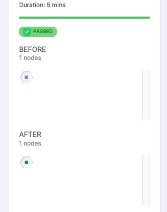

Continuous Verification is a critical step in the deployment pipeline that validates deployments. It integrates with APMs and logging tools to verify that the deployment is running safely and efficiently. Harness applies machine learning algorithms to every deployment for identifying normal behavior, which allows it to identify and flag anomalies in future deployments. During the Verify step, Continuous Verification automatically triggers a rollback if anomalies are found.

This topic provides an overview of the prerequisites and steps involved in setting up Continuous Verification.

:::info note
If you are already familiar with setting up Continuous Verification and the Verify step and are looking for instructions on configuring the verification step for a specific health source, go to [Configure verification](/docs/category/configure-cv).
:::


## Before you begin

* [Learn Harness' Key Concepts](/docs/platform/get-started/key-concepts.md).
* [Learn about Kubernetes deployments](../deploy-srv-diff-platforms/kubernetes/kubernetes-cd-quickstart.md).
* [Refer to the supported platforms and technologies](/docs/continuous-delivery/verify/cv-whats-supported.md)


## Deployment strategies

You can set up Continuous Verification by adding a Verify step to a pipeline. The following deployment strategies are available when configuring verification.


### Continuous verification type
   
- **Auto**: Harness automatically selects the best continuous verification type based on the deployment strategy.
    
- **Rolling Update**: Rolling deployment is a deployment technique that gradually replaces old versions of a service with a new version by replacing the infrastructure on which the service runs. Rolling updates are useful in situations where a sudden changeover might cause downtime or errors.
    
- **Canary**: Canary deployment involves a two-phased deployment. In phase one, new pods and instances with the new service version are added to a single environment. In phase two, a rolling update is performed in the same environment. Canary deployment helps to detect issues with the new deployment before fully deploying it.
    
- **Blue Green**: Blue-green deployment is a technique used to deploy services to a production environment by gradually shifting user traffic from an old version to a new one. The previous version is referred to as the blue environment, while the new version is known as the green environment. Upon completion of the transfer, the blue environment remains on standby in case of a need for rollback, or can be removed from production and updated to serve as the template for future updates.
    
- **Load Test**: Load testing is a strategy used in lower-level environments, such as quality assurance, where a consistent load is absent, and deployment validation is typically accomplished through the execution of load-generating scripts. This is useful to ensure that the application can handle the expected load and validate that the deployment is working as expected before releasing it to the production environment.


## Sensitivity

You can set the sensitivity option as **High**, **Medium**, or **Low**.

Sensitivity controls how strictly the anomaly detection evaluates deviations in your deployment by adjusting the statistical threshold (measured in standard deviations) that determines what counts as an anomaly.

### How it works

Harness uses machine learning to establish a baseline of normal behavior from your historical data. During deployment verification, it compares new data points against this baseline. The sensitivity setting determines how many standard deviations away from the baseline a data point must be before it is flagged as an anomaly:

- **High sensitivity (1σ threshold)**: Flags data points that deviate by 1 or more standard deviations from the baseline. This is the strictest threshold, catching smaller deviations that may indicate issues. Best for stable services with predictable behavior where even minor deviations may signal problems.

- **Medium sensitivity (2σ threshold)**: Flags data points that deviate by 2 or more standard deviations from the baseline. This provides a balanced threshold that filters out normal variance while catching significant anomalies. This is the default and works well for most production services.

- **Low sensitivity (3σ threshold)**: Flags only data points that deviate by 3 or more standard deviations from the baseline. This is the most lenient threshold, filtering out most normal variance and reducing false positives. Best for services with high variability or frequent changes where you want to catch only significant anomalies.

### Choose the right sensitivity

Based on the statistical thresholds above, consider the following guidance when selecting sensitivity for your services:

| Service Characteristics | Suggested Sensitivity | Why This Works |
|------------------------|----------------------|----------------|
| Stable microservices with consistent traffic patterns | High | The 1σ threshold is strict and catches small deviations that may indicate issues in predictable services |
| Production services with moderate variance | Medium (default) | The 2σ threshold balances anomaly detection with tolerance for normal variance |
| Services with high variability (batch jobs, scheduled tasks) | Low | The 3σ threshold is lenient and filters out expected variance while catching extreme outliers |
| Services undergoing frequent changes or experiments | Low | Higher tolerance (3σ) reduces false positives from ongoing changes |
| Critical payment or security services | High | Lower tolerance (1σ) maximizes early detection of any deviation from normal behavior |

### Verification results by sensitivity

The following table shows how sensitivity affects the verification results based on the health status determined by anomaly detection.

:::note

"With feedback" in this context refers user updated feedback. To learn more go to [Event Preference](/docs/continuous-delivery/verify/cv-results/log-feedback#set-event-preference).

:::

| Sensitivity | Health Status                  | Result | Explanation |
|-------------|--------------------------------|--------|-------------|
| High        | Healthy                        | Pass   | All metrics and logs are within acceptable thresholds (within 1σ). For logs: only Known event clusters detected. For metrics: all data points fall within the normal range established by baseline. |
| High        | Medium Healthy                 | Fail   | Anomalies detected that exceed 1σ threshold. For logs: Unexpected Frequency clusters found (known errors occurring more frequently). For metrics: data points deviate by 1-2σ from baseline. High sensitivity treats these deviations as deployment issues. |
| High        | Medium Healthy (With feedback) | Pass   | Same anomalies detected, but user has explicitly marked them as acceptable via event preferences. This overrides the automatic risk assessment. |
| High        | Unhealthy                      | Fail   | Severe anomalies detected. For logs: Unknown event clusters found (new errors not seen in baseline). For metrics: data points exceed 2σ deviation. These indicate genuine deployment problems. |
| Medium      | Healthy                        | Pass   | All metrics and logs within acceptable thresholds (within 2σ). Only Known event clusters for logs. |
| Medium      | Medium Healthy                 | Pass   | Minor anomalies detected but within medium tolerance (1-2σ). For logs: Unexpected Frequency clusters are tolerated. For metrics: deviations up to 2σ are considered normal variance. Medium sensitivity filters these as acceptable. |
| Medium      | Medium Healthy (With feedback) | Pass   | User feedback reinforces the default behavior of medium sensitivity. |
| Medium      | Unhealthy                      | Fail   | Severe anomalies exceeding 2σ threshold. For logs: Unknown event clusters (new errors). For metrics: data points deviate by more than 2σ from baseline. |
| Low         | Healthy                        | Pass   | All metrics and logs within acceptable thresholds (within 3σ). Only Known event clusters for logs. |
| Low         | Medium Healthy                 | Pass   | Moderate anomalies detected but within low tolerance (1-3σ). For logs: Unexpected Frequency clusters are tolerated. For metrics: deviations up to 3σ are filtered as normal variance. Low sensitivity is very permissive. |
| Low         | Medium Healthy (With feedback) | Pass   | User feedback aligns with the high tolerance of low sensitivity. |
| Low         | Unhealthy                      | Fail   | Extreme anomalies exceeding 3σ threshold. For logs: Unknown event clusters that are statistically significant outliers. For metrics: only data points with extreme deviations (>3σ) cause failure. |

## Duration

Harness uses the data points within this duration for analysis. For instance, if you select 10 minutes, Harness analyzes the first 10 minutes of your log or APM data. Harness recommends choosing 10 minutes for logging providers and 15 minutes for APM and infrastructure providers. This helps you thoroughly analyze and detect issues before releasing the deployment to production.


## Artifact tag

Use the Harness expression `<+serviceConfig.artifacts.primary.tag>` to reference this primary artifact. To learn about artifact expression, go to [Service artifacts expressions](/docs/platform/variables-and-expressions/harness-variables.md#service-artifacts-expressions).


## Fail on no analysis
   
You can configure the pipeline to fail if there is no data from the health source. This ensures that the deployment fails when there is no data for Harness to analyze.

The Verify step also includes a metric-level option to fail the Verify step when the analysis of a given custom metric is not possible because there is no data for the custom metric on either the test nodes or the control nodes.

To enable the metric-level fail-on-no-analysis option, in the configuration pane of your Verify step, select **Step Parameters**, expand **Optional**, and select **Fail if any custom metrics has no analysis**.

## Fail-fast thresholds

Fail-fast thresholds allow you to terminate verification immediately when specific conditions are met, enabling faster feedback on critical issues without waiting for the full analysis duration to complete.

### Availability by data type

| Data Type | Fail-Fast Support | Reason |
|-----------|-------------------|--------|
| **Metrics** | Supported | Metrics can be evaluated in real-time against numeric thresholds. You can define custom thresholds (e.g., "error rate > 5%" or "response time > 500ms") and mark them as fail-fast. When a threshold is breached, verification terminates immediately. |
| **Logs** | Not supported | Logs require complete analysis window for statistical clustering and frequency analysis. Real-time evaluation is not possible due to the ML-based nature of log analysis. |

### Why logs do not support fail-fast

Log verification uses machine learning to cluster similar log messages and compare them against baseline patterns. This process requires the complete analysis duration because:

1. **Clustering requires full dataset**: The ML model must collect all logs over the analysis period to identify patterns and group similar messages together. Individual log entries cannot be classified as "known," "unknown," or "unexpected frequency" until the clustering is complete.

2. **Frequency analysis needs time**: To determine if an error has "unexpected frequency," the system must observe the cluster's occurrence rate over the full duration and compare it statistically to baseline rates. A single occurrence early in the analysis window does not provide enough information.

3. **Statistical confidence requires samples**: If you see a new error in minute 1, you cannot determine if it is a genuine deployment issue or a transient error that also appeared in the baseline until you analyze the complete time window and establish statistical significance.

4. **No predefined thresholds**: Unlike metrics where you can set specific numeric thresholds, log risk is determined dynamically based on:
   - Whether the error cluster is new (unknown)
   - Whether a known error's frequency changed significantly
   - Statistical comparison against baseline behavior

For these reasons, log verification always runs for the complete analysis duration specified in the Verify step configuration.

### Configure fail-fast for metrics

To configure fail-fast thresholds for metrics:

1. In your Verify step, go to **Health Sources**
2. Select a metric-based health source (APM or infrastructure monitoring tool)
3. Configure custom thresholds for specific metrics
4. Set the threshold action to **Fail Fast**
5. Define the threshold criteria (greater than, less than, percentage deviation)

When a fail-fast threshold is breached during verification, the deployment is marked as failed immediately, and you can configure failure strategies (rollback, manual intervention, etc.) to handle the situation.

## Health source

Continuous Verification monitors health trend deviations using logs and metrics obtained from the health source, such as APM and logging tools, via a monitored service. A health source is an APM or logging tool that monitors and aggregates data in your deployment environment. You can add multiple health sources.

## Service Instance Identifier (SII)

The Service Instance Identifier (SII) is a feature used in Continuous Verification to identify [new or changed nodes](/docs/continuous-delivery/verify/cv-results/interpret-metric-results#nodes-section) during a deployment. It acts as a filter to pinpoint metrics related to what has been deployed. Continuous Verification uses the SII to calculate the deployed components based on observed metrics. This is particularly useful in scenarios like canary deployments, where the SII helps determine which nodes are stable and which nodes represent the canary in the current phase of analysis.

### Use SII in Continuous Verification

Here's an example of how to set up Continuous Verification with a 5-minute analysis window using a [Prometheus Health Source](/docs/continuous-delivery/verify/configure-cv/health-sources/prometheus) for a rolling deployment to a Kubernetes endpoint. This example also demonstrates using SII to filter and identify specific deployments.

PromQL:

```
max(
    CV_Counter_Example_total    {
   	 app="harness-cv-prom-example"
})
```

SII: `pod`

#### Query execution process

Let's use the Prometheus query as an example to understand this process:
 
1. Queries the SII (in this case, pod) to list all possible pods within the specified time range.
   
   `/api/v1/label/**pod**/values?start=1685548800&end=1685549100&match[]={app="harness-cv-prom-example"}`

2. Retrieves the PromQL metric values by iterating over the returned SII results for each pod.
   
   `api/v1/label/**app**/values?start=1685548800&end=1685549100&match[]={app="harness-cv-prom-example"}`

By leveraging the SII, Continuous Verification determines the pods that existed before and after the deployment by querying the monitoring solution. If a pod was present before and after, it is considered stable. If a pod is present after but not before, it is identified as a canary pod. The node determination is then made.

	

### SII configuration tips

The purpose of the SII is to determine what has been deployed from a monitoring system. Different monitoring systems handle this differently, depending on how the system is configured and how labeling is applied to the deployed resources. In the [query execution process](#query-execution-process), iterating over the SII is necessary. However, with other monitoring solutions, the process may vary, but the end result is the same: gathering information about what was available before and after deployment for node determination.

#### Potential SIIs

| **SII**       | **Usage**                                                                             |
|---------------|-------------------------------------------------------------------------------------|
| pod/podname   | Kubernetes                                                                          |
| containername | ECS                                                                                 |
| version       | When resources for deployment are tagged with versions, utilizing the version as SII can be an effective way to filter and identify specific deployments. |


## Next steps

- To start using Continuous Verification, go to [Configure verification](/docs/category/configure-cv).
- To understand more about Continuous Verification, go to the [knowledge base](/docs/category/knowledge-base-article).

## FAQs

For frequently asked questions about Continuous Verification, go to [Continuous Verification FAQs](/docs/continuous-delivery/verify/continuous-verification-faqs).
