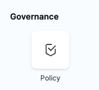
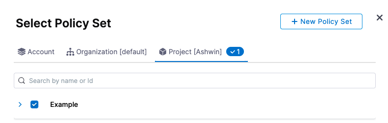
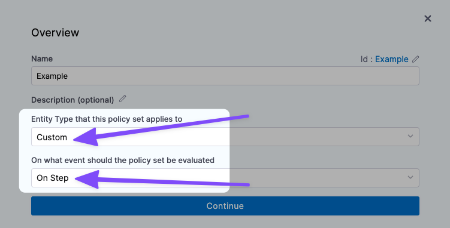
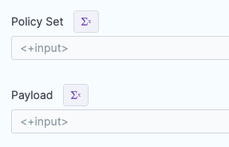
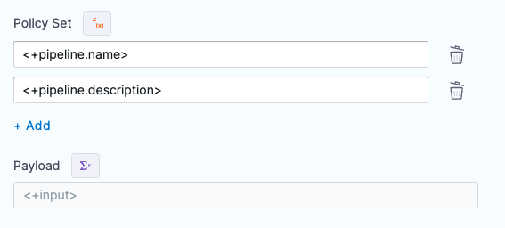
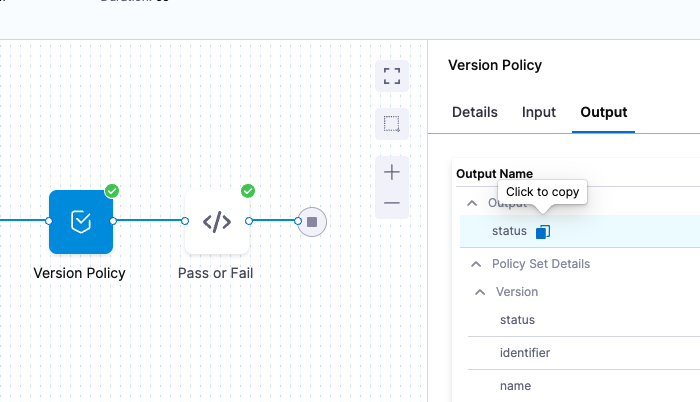

Currently, this feature is behind the feature flags `OPA_PIPELINE_GOVERNANCE` and `CUSTOM_POLICY_STEP`. Contact [Harness Support](mailto:support@harness.io) to enable the feature. Harness provides governance using Open Policy Agent (OPA), Policy Management, and Rego policies.

You can enforce policies in two ways:

* **Account, Org, and** **Project-specific:** you can create the policy and apply it to all pipelines in your account, org, and project. The policy is evaluated on Pipeline-level events like On Run and On Save. For more details, go to [Harness Governance quickstart](/docs/platform/Governance/Policy-as-code/harness-governance-quickstart).
* **Stage-specific:** you can add a Policy step, add a new/existing Policy Set to it, and then provide a JSON payload to evaluate.
	+ The policy is evaluated whenever the pipeline reaches the Policy step.
	+ Policy evaluation can be performed on data generated when the pipeline is running, such as resolved expressions.
	+ Policy evaluation can fail Pipeline execution.

This topic describes how to add a Policy step to a Stage.

### Before you begin

* If you are new to Harness Governance, see [Harness Governance overview](/docs/platform/Governance/Policy-as-code/harness-governance-overview/) and [Harness Governance quickstart](/docs/platform/Governance/Policy-as-code/harness-governance-quickstart).

### Limitations

* The policies that can be enforced are currently restricted by the Harness entities supported by the OPA service.
* Currently, the Policy Step is only available in Continuous Delivery stages.
* Currently, only the **Custom** entity type is supported for the Policy step.
	+ A Custom entity type allows flexibility to enforce policy evaluations during pipeline execution with different input data. For example, Terraform plans and deployment environment details. A Policy Set with a Custom type does not have an event configured.
* [Runtime inputs](/docs/platform/References/runtime-inputs) are expanded before evaluation. You cannot perform checks to ensure a setting is always a runtime input, expression, or fixed value.

### Visual Summary

Here's a quick video showing you how to use the Policy step to evaluate a custom JSON payload.

### Step 1: Add the Policy Step

Open a Harness pipeline, and then add or open a new CD Stage.

In the **Execution** phase of the stage, click **Add Step**.

In **Governance**, click the **Policy** step.


The Policy step is added the to Stage.

Enter a name and timeout for the step.

Next you will specify the Entity Type and then add the Policy and Payload to the step.

### Step 2: Select Entity Type

In **Entity Type**, select the Harness entity type for the step. For example, **Custom**.

Currently, only the **Custom** entity type is supported. Additional entity types such as pipeline will be added soon.A **Custom** entity type allows flexibility to enforce policy evaluations during pipeline execution with different input data. For example, Terraform plans and deployment Environment details.

A **Custom** type does not have an event configured. It is triggered when the pipeline step is reached during pipeline execution.

Next, you can add the Policy Set to the step.

### Step 3: Add Policy Sets

A Policy Set is a set of rules (policies) that are evaluated together.

Policy Sets are stored to the Harness OPA server for a given entity type and event in Harness.

Policy Sets are saved at the Harness account, Organization, or Project level, and where they are saved determines the scope of the Policy Set.

A Policy Set at the account level can be used in any Policy Step in the Orgs and Projects in the account. A Policy Set at the Project level can only be used in steps in that Project alone.

In **Policy Set**, click **Add/Modify Policy Set**.

In this example, we'll use an existing policy set. For details on creating a policy set, see [Harness Governance quickstart](/docs/platform/Governance/Policy-as-code/harness-governance-quickstart).


Navigate to a **Policy Set**, select it, and click **Apply**.

The Policy Set you select must be evaluated **On Step**.Currently, only the **Custom** entity type is supported. The Policy Set you select must have the **Custom** entity type selected.
Also, select how you want the pipeline to handle policy evaluation failures:


The Policy Set is added.

### Step 4: Add Payload

Currently, only the **Custom** entity type is supported. The JSON payload you add is a free form payload that can be evaluated by your Policy Set at runtime.In **Payload**, enter the payload to be evaluated by the Policy Set(s) you selected in **Policy Set**.

### Option: Using Fixed Values, Runtime Inputs, and Expressions in Policy Steps

The **Policy Set** and **Payload** settings allow for Fixed Values, Runtime Inputs, and Expressions.

For details on how these work in Harness, go to [fixed values, runtime inputs, and expressions](/docs/platform/References/runtime-inputs).

#### Fixed Values

Fixed Values is show in the **Policy Set** and **Payload** settings earlier in this topic.

#### Runtime Inputs

You can select Runtime Inputs for one or both settings and when the pipeline is executed you can provide the Policy Set and/or Payload for the step.


#### Expressions

You can select Expressions for one or both settings and when the pipeline is executed Harness will resolve the expressions for the Policy Set and/or Payload for the step.


### Step 5: Test the Policy Step

New to policies and Policy Sets? See [Harness Governance quickstart](/docs/platform/Governance/Policy-as-code/harness-governance-quickstart).Let's look at an example of the Policy step.

We'll use an HTTP step to do a REST GET and get the Harness SaaS version number and then use the Policy step to evaluate the response to see if it match a version number check policy.

The policy checks to see if a version is greater than v0.200.0.


```
package pipeline_environment  
  
deny[sprintf("version must be greater than v0.200.0 but is currently '%s'", [input.version])] {  
    version := trim(input.version, "v")  
    semver.compare(version, "0.200.0") < 0  
}
```
Currently, only the **Custom** entity type is supported. The JSON payload you add is a free form payload that can be evaluated by your Policy Set at runtime. It does not need to be a Harness entity.Next, in our pipeline we'll add an [HTTP step](/docs/continuous-delivery/x-platform-cd-features/cd-steps/cd-general-steps/using-http-requests-in-cd-pipelines) to check the version at the HTTP endpoint `https://app.harness.io/prod1/pm/api/v1/system/version`, and a **Policy** step to that uses our policy to check the version returned from the HTTP step:

Here's the YAML for a pipeline that uses the step:
```
pipeline:  
    name: Policy  
    identifier: Policy  
    allowStageExecutions: false  
    projectIdentifier: CD_Examples  
    orgIdentifier: default  
    tags: {}  
    stages:  
        - stage:  
              name: Test  
              identifier: Test  
              description: ""  
              type: Approval  
              spec:  
                  execution:  
                      steps:  
                          - step:  
                                type: Http  
                                name: Get version  
                                identifier: Get_version  
                                spec:  
                                    url: https://app.harness.io/prod1/pm/api/v1/system/version  
                                    method: GET  
                                    headers: []  
                                    outputVariables: []  
                                timeout: 10s  
                          - step:  
                                type: Policy  
                                name: Version Policy  
                                identifier: Version_Policy  
                                spec:  
                                    policySets:  
                                        - Version  
                                    type: Custom  
                                    policySpec:  
                                        payload: <+pipeline.stages.Test.spec.execution.steps.Get_version.output.httpResponseBody>  
                                timeout: 10m  
                          - step:  
                                type: ShellScript  
                                name: Pass or Fail  
                                identifier: Pass_or_Fail  
                                spec:  
                                    shell: Bash  
                                    onDelegate: true  
                                    source:  
                                        type: Inline  
                                        spec:  
                                            script: echo <+pipeline.stages.Test.spec.execution.steps.Version_Policy.output.status>  
                                    environmentVariables: []  
                                    outputVariables: []  
                                    executionTarget: {}  
                                timeout: 10m  
              tags: {}
```
The pipeline YAML also includes a Shell Script step that displays an output expression for the Policy step.As you can see in the above **Policy** step, in **Payload**, we reference the output from the HTTP step:


```
<+pipeline.stages.Test.spec.execution.steps.Get_version.output.httpResponseBody>
```
Now when we run the pipeline, the Policy Step will evaluate the JSON in Payload and see that it passes.

### Policy Step Expressions

You can use the following Harness expressions to output Policy Step status in a [Shell Script](/docs/continuous-delivery/x-platform-cd-features/cd-steps/cd-general-steps/using-shell-scripts) step:

* `<+execution.steps.[policy step Id].output.status>`
* `<+execution.steps.[policy step Id].output.policySetDetails.Example.status>`


For example, if the Policy Step [Id](/docs/platform/References/entity-identifier-reference) is `Check`, you would reference it like this:


```
echo "status: "<+execution.steps.Check.output.status>  
  
echo "projectPolicySetDetails: "<+execution.steps.Check.output.policySetDetails.Example.status>
```
The output would be something like this:


```
Executing command ...  
status: pass  
projectPolicySetDetails: pass  
Command completed with ExitCode (0)
```
