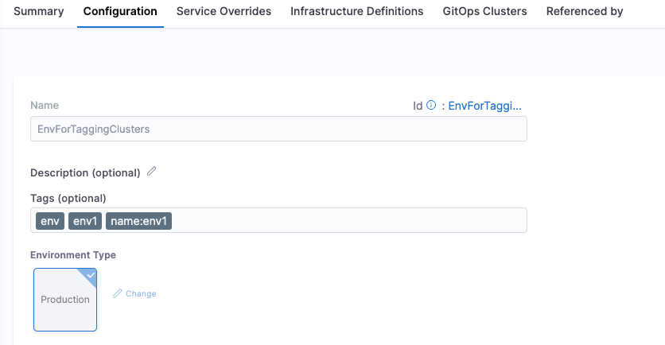
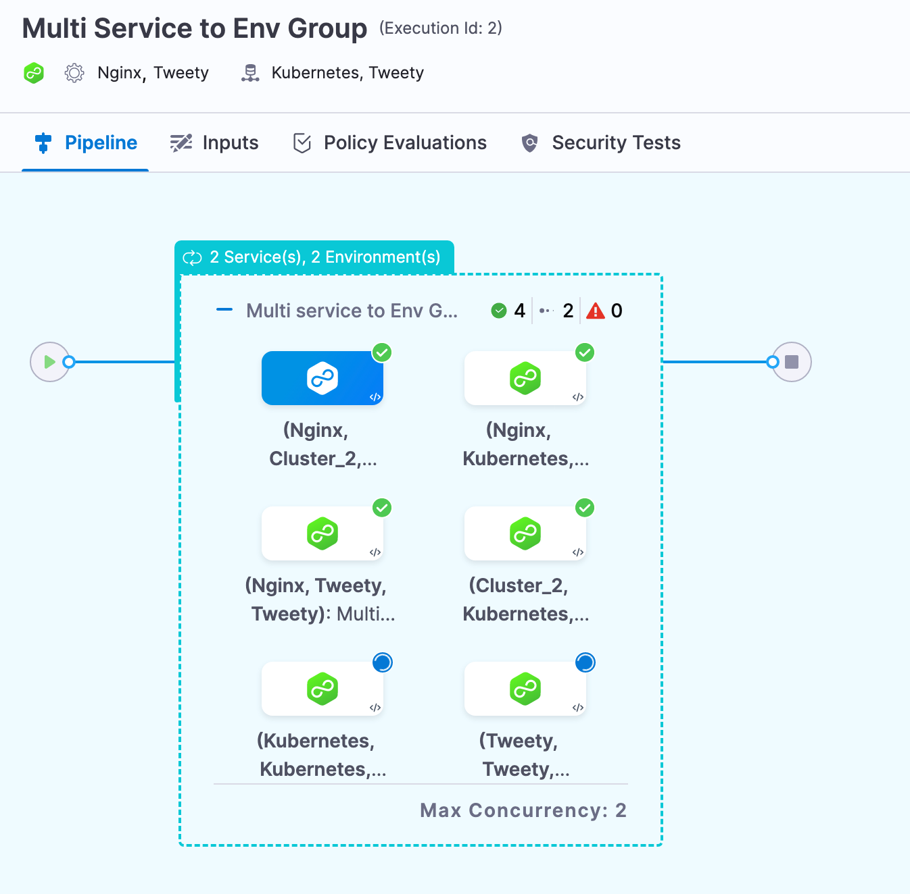

This topic describes how to use multiple services and multiple environments in a deployment.

Often, you will deploy one service to one Environment in a CD stage. In some cases, you might want to use multiple services and environments in the same stage.

For example, let's say you host one infrastructure per customer and want to deploy your service to all customer infrastructures in the same pipeline. Instead of creating separate stages for each service and infrastructure combination, you can just deploy a single service to all infrastructures in the same stage. 

:::note

This functionality is also supported for GitOps clusters by configuring multiple clusters per environment.

:::

Another example would be when you have multiple QA environments and what to deploy to all of them together.

With multiple Harness services and environments in the same CD stage, you can:

* Deploy one service to multiple environments.
* ​Deploy multiple services to one environment.
* ​Deploy multiple services to multiple environments.

## Creating multiple services and environments

You can create services, environments, and environment groups inline when creating your CD stage, or you can create them separately and select them in the stage.

For more information on services and environments, go to [services and environments overview](/docs/continuous-delivery/get-started/services-and-environments-overview).

## Deploy one service to multiple environments or infrastructures

You can deploy one service to multiple environments.

1. In your CD stage, select **Service**.
2. In **Select Services**, select the service you want to deploy. Here's an example using Nginx:
   
   

3. Select **Continue**.
4. In **Environments**, enable **Deploy to multiple Environments or Infrastructures**.
   You can select one or more environments, and then one or more infrastructures in each environment.
5. In **Specify Environments**, select one or more **Environments**. Each environment is now listed.
6. For each environment, in **Specify Infrastructures**, select one or more infrastructures, or select **All**.
   Here's an example using one environment and two of its infrastructures.

   
 
:::note

The UI component is updated to make the list of infrastructure searchable and sorted based on creation time. You can also select all the infrastructures in the environment by choosing the `All Infrastructures` checkbox.

Make sure the feature flag `CDS_SPECIFY_INFRASTRUCTURES` is enabled for the new component. Contact [Harness Support](mailto:support@harness.io) to enable the feature.

   
:::

   For details on **Deploy to Environments or Infrastructures in parallel?**, go to [deploying in parallel or serial](#deploying-in-parallel-or-serial) below.

7. Select **Continue**, select an execution strategy, and complete the execution steps.
8. Select **Save**.
9. Select **Run**, and then **Run Pipeline**.
   You can see both infrastructures displayed in the target environment:
   
   

   You can click each infrastructure to see the deployment to it or user the console view to jump between the infrastructures:

   

## Deploy multiple services to one environment

You can deploy multiple services to the same environment and single infrastructure. You can deploy the services serially or in parallel.

1. In your CD stage, select **Service**.
2. Enable the **Deploy multiple Services** setting.
3. In **Select Services**, select the services you want to deploy.


For information on **Deploy services in parallel**, go to [deploying in parallel or serial](#deploying-in-parallel-or-serial) below.

If one or more of the services uses runtime inputs, you can view the settings or switch them to fixed value and add a value.


The services displayed depend on the **Deployment Type** in **Overview**. For example, if the deployment type is Kubernetes, only Kubernetes services are listed in the **Select Services** list.


1. Select **Continue**.
2. In **Environment**, select a single environment and infrastructure. You don't need to enable **Deploy to multiple Environments or Infrastructures**.


1. Select **Continue**, select an execution strategy, and complete the execution steps.
2. Select **Save**.
3. Select **Run**, and then **Run Pipeline**.

You can see the two service deployments running in parallel on the same infrastructure.


## Deploy multiple services to multiple environments

You can deploy multiple services to multiple environments and infrastructures. You can deploy the services serially or in parallel.

1. In your CD stage, select **Service**.
2. Enable the **Deploy multiple Services** setting.
3. In **Select Services**, select the services you want to deploy.
   

   For information on **Deploy services in parallel**, go to [deploying in parallel or serial](#deploying-in-parallel-or-serial) below. If one or more of the services uses runtime inputs, you can view the settings or switch them to fixed value and add a value.

   

   The services displayed depend on the **Deployment Type** in **Overview**.

4. Select **Continue**.
5. In **Environment**, enable **Deploy to multiple Environments or Infrastructures**.
6. Select multiple environments and infrastructures.
   In the following example, we are deploying to a single environment but multiple infrastructures in the environment.
   
   
   
7. Select **Continue**, select an execution strategy, and complete the execution steps.
8. Select **Save**.
9. Select **Run**, and then **Run Pipeline**.

You can see the two service deployments running in parallel on both infrastructures.


The service deployments are grouped by Infrastructure. The first two services are running in parallel on one infrastructure and the second two services are running on the other infrastructure.

## Deploy services to environments using filtered list

You can deploy services to the GitOps clusters in an environment using filtered list.

You can add tags to an environment while creating the environment. 



You can also add tags to existing environment by navigating through **Project Settings** -> **Environments** -> **Configuration** tab and add the relevant tags.

:::note

Make sure that the feature flags `ENV_GROUP`, `OPTIMIZED_GIT_FETCH_FILES` are enabled. Contact [Harness Support](mailto:support@harness.io) to enable the feature.

:::
Now, lets deploy the service using filtered list in your CD pipeline.

1. In your pipeline, create a **Deploy** stage.
2. In your CD stage, select **Service**.
3. In **Select Services**, select the services you want to deploy.
4. Select **Continue**.
5. In the **Environments** tab, enable **Deploy to multiple Environments or Clusters**.
6. Select **Environment** or **Environment Group**.  
   You can select one or more environments (or an environment group), and then one or more infrastructures in each environment.
7. In **Environments**, select **Deploy to filtered list**, and then select **+ Add Filters**.
8. Under **Identifier**, enter the name of the filter. In **FILTERS ON ENTITIES**, select **Environments**.
9. In **Type**, select: 
   * **All** to deploy the selected services to all clusters within the environment or environment group.
   * **Tags**, and then enter the tags in **CONDITION** to deploy the selected services to the clusters with these tags. 
        
     Select **Any** to deploy the selected services to clusters that have any of these tags. 
     
     Select **All** to deploy the selected services to clusters having all these tags. 

     You can select **CONDITION** as a fixed value, runtime input, or expression. The supported expressions are `<+service.tags>` and `<+pipeline.tags>`.

  <DocImage path={require('./static/deploy-to-env-filter.png')} width="100%" height="100%" title="Click to view full size image" />

10. Select **Continue**, select an execution strategy, and complete the execution steps.
11. Select **Save**.
12. Select **Run**, and then **Run Pipeline**.
    
    You can see the clusters with the selected tags displayed in the target environment.


## Deploy services to infrastructures using filtered list

You can deploy services to infrastructures in an environment or environment group using filtered list.

You can add tags to an infrastructure while creating the infrastructure. 


You can also add tags to existing infrastructure by navigating through **Project Settings** -> **Environments** -> **Infrastructure Definitions** tab and choose the infrastructure where the tag needs to be added.

:::note

Make sure that the feature flags  `ENV_GROUP`, `OPTIMIZED_GIT_FETCH_FILES` are enabled. Contact [Harness Support](mailto:support@harness.io) to enable the feature.

:::
Now, lets deploy the service using filtered list in your CD pipeline.

1. In your CD stage, select **Service**.
2. In **Select Services**, select the services you want to deploy.
3. Select **Continue**.
4. In the **Environments** tab, enable **Deploy to multiple Environments or Infrastructures**.
5. Select **Environment** or **Environment Group**.  
   You can select one or more environments (or an environment group), and then one or more infrastructures in each environment.
6. In **Infrastructures**, select **Deploy to filtered list**, and then select **+ Add Filters**.
7. Under **Identifier**, enter the name of the filter. In **FILTERS ON ENTITIES**, select **Infrastructure**.
8. In **Type**, select: 
   * **All** to deploy the selected services to all infrastructures within the environment or environment group.
   * **Tags**, and then enter the tags in **CONDITION** to deploy the selected service(s) to the infrastructures with these tags. 
        
     Select **Any** to deploy the selected services to infrastructures that have any of these tags. 
     
     Select **All** to deploy the selected services to infrastructures having all these tags. 

     You can select **CONDITION** as a fixed value, runtime input, or expression. The supported expressions are `<+service.tags>` and `<+pipeline.tags>`.

   <DocImage path={require('./static/deploy-to-infra-filter.png')} width="100%" height="100%" title="Click to view full size image" />
9. Select **Continue**, select an execution strategy, and complete the execution steps.
10. Select **Save**.
11. Select **Run**, and then **Run Pipeline**.
    
    You can see the infrastructures with the selected tags displayed in the target environment.

## Deploy services to GitOps clusters using filtered list

You can deploy services to the GitOps clusters in an environment using filtered list.

You can deploy services to the GitOps clusters in an environment using filtered list.

You can add tags to an environment while creating the environment. 

You can also add tags to existing environment by navigating through **Project Settings** -> **Environments** -> **Configuration** tab and add the relevant tags.

:::note

Make sure that the feature flags `ENV_GROUP`, `OPTIMIZED_GIT_FETCH_FILES` are enabled. Contact [Harness Support](mailto:support@harness.io) to enable the feature.

:::

Now, lets deploy the service using filtered list in your CD pipeline.
1. In your pipeline, create a **Deploy** stage with the **GitOps** option enabled.
2. In your CD stage, select **Service**.
3. In **Select Services**, select the services you want to deploy.
4. Select **Continue**.
5. In the **Environments** tab, enable **Deploy to multiple Environments or Clusters**.
6. Select **Environment** or **Environment Group**.  
   You can select one or more environments (or an environment group), and then one or more infrastructures in each environment.
7. In **Clusters**, select **Deploy to filtered list**, and then select **+ Add Filters**.
8. Under **Identifier**, enter the name of the filter. In **FILTERS ON ENTITIES**, select **Clusters**.
9. In **Type**, select: 
   * **All** to deploy the selected services to all clusters within the environment or environment group.
   * **Tags**, and then enter the tags in **CONDITION** to deploy the selected services to the clusters with these tags.
        
     Select **Any** to deploy the selected services to clusters that have any of these tags. 
     
     Select **All** to deploy the selected services to clusters having all these tags. 

     You can select **CONDITION** as a fixed value, runtime input, or expression. The supported expressions are `<+service.tags>` and `<+pipeline.tags>`.

   <DocImage path={require('./static/deploy-to-clusters-filter.png')} width="100%" height="100%" title="Click to view full size image" />
10. Select **Continue**, select an execution strategy, and complete the execution steps.
11. Select **Save**.
12. Select **Run**, and then **Run Pipeline**.
    
    You can see the clusters with the selected tags displayed in the target environment.

## Deploying in parallel or serial

You can deploy services to environments and infrastructures in parallel or serial, with the following options:

* Services in parallel to environments in parallel.
* Services in parallel to environments in serial.
* Services in serial to environments in parallel.
* Services in serial to environments in serial.

Parallel executions are shown vertically and serial executions are show horizontally.

You can see two service deployments running in parallel on the same infrastructure.


Here you can see two service deployments run serially on the same infrastructure:


## Propagating multiple services


You can propagate a stage configured with multi-service from previous configured stage. In the example below, If configured multi-service in stage `deployKubernetes` you will be able to reference the service configuration in stage `dev`.

```yaml
    - stage:
        name: deployKubernetes
        identifier: Deploy_Kubernetes
        description: Golden Kubernetes Deployment Stage
        type: Deployment
        spec:
          deploymentType: Kubernetes
          execution:
            steps:
              - step:
                  type: K8sDryRun
                  name: Dry Run
                  identifier: Dry_Run
                  spec: {}
                  timeout: 10m
              - step:
                  type: K8sApply
                  name: Apply
                  identifier: Apply
                  spec:
                    filePaths:
                      - cdng/
                    skipDryRun: false
                    skipSteadyStateCheck: false
                    skipRendering: false
                    overrides: []
                  timeout: 10m
              - step:
                  type: HarnessApproval
                  name: Approval
                  identifier: Approval
                  spec:
                    approvalMessage: Please review the following information and approve the pipeline progression
                    includePipelineExecutionHistory: true
                    isAutoRejectEnabled: false
                    approvers:
                      userGroups:
                        - account._account_all_users
                      minimumCount: 1
                      disallowPipelineExecutor: false
                    approverInputs: []
                  timeout: 1d
                  when:
                    stageStatus: Success
              - step:
                  type: K8sRollingDeploy
                  name: Rolling Deployment
                  identifier: RRolling_Deployment
                  spec:
                    skipDryRun: <+input>
                    pruningEnabled: false
                  timeout: 10m
              - step:
                  type: K8sDelete
                  name: Cleanup
                  identifier: Cleanup
                  spec:
                    deleteResources:
                      type: ReleaseName
                      spec:
                        deleteNamespace: false
                  timeout: 10m
            rollbackSteps:
              - step:
                  name: Rollback Rollout Deployment
                  identifier: rollbackRolloutDeployment
                  type: K8sRollingRollback
                  timeout: 10m
                  spec:
                    pruningEnabled: false
          services:
            values:
              - serviceRef: kubernetes
                serviceInputs:
                  serviceDefinition:
                    type: Kubernetes
                    spec:
                      artifacts:
                        primary:
                          primaryArtifactRef: <+input>
                          sources: <+input>
            metadata:
              parallel: false
          environments:
            metadata:
              parallel: true
            values:
              - environmentRef: k8sdev
                deployToAll: false
                infrastructureDefinitions:
                  - identifier: dev
                    inputs:
                      identifier: dev
                      type: KubernetesDirect
                      spec:
                        namespace: <+input>
        tags: {}
        failureStrategies:
          - onFailure:
              errors:
                - AllErrors
              action:
                type: StageRollback
        when:
          pipelineStatus: Success
    - stage:
        name: dev
        identifier: dev
        description: ""
        type: Deployment
        spec:
          deploymentType: Kubernetes
          services:
            useFromStage:
              stage: Deploy_Kubernetes
```

In the subesequent stage you will see a Propagate from previous stage option. This will allow you to pick the previous stage's service configuration.

```yaml
    - stage:
        name: dev
        identifier: dev
        description: ""
        type: Deployment
        spec:
          deploymentType: Kubernetes
          services:
            useFromStage:
              stage: Deploy_Kubernetes
```

## Using environment groups

You can select target environments and infrastructures using environment groups.

1. In **Environment**, select **Deploy to multiple Environments or Infrastructures**, and then select **Environment Groups**.
2. In **Specify Environment Group**, select one **Environment Group**. You cannot select multiple environment groups.
3. In **Specify Environments**, select the environments you want to use.
4. For each environment, in **Specify Infrastructures**, select the infrastructures you want to use.

Here's an example with an environment group containing two environments. One environment has two infrastructures and the other has one infrastructure.


Here's what the deployment looks like:



The console view can also help view multiple deployments clearly:


## Rollback with multiple services and environments

With a multi service to multi infrastructure stage, every combination of service and infrastructure is treated as a separate deployment.

Consequently, if you are deploying services A and B to infrastructure 1 and the deployment of service A to infrastructure 1 fails, it will only impact the deployment of service B to infrastructure 1 if the services are deployed serially (and service A is first).

If the services are deployed in parallel, the failure of of service A to infrastructure 1 will not impact the deployment of of service B to infrastructure 1. The failed deployment of service A to infrastructure 1 will roll back, but the deployment of of service B to infrastructure 1 will not roll back.

## Triggers and multiple services

Triggers are applied at the pipeline level. If you have a trigger that runs a pipeline when a service's manifest or artifact changes, and that service is part of a multi service stage, the trigger will initiate the deployment of all services in that pipeline.

The trigger runs the entire pipeline, not just the service with the manifest or artifact that initiated the trigger.

## Max concurrency

When you view a multi service or environment deployment, you can see **Max Concurrency**:


Max concurrency changes based on the following:

* If you select **Deploy services in parallel**, Max concurrency is equal to the number of services.
* If you select **Deploy to Environments or Infrastructures in parallel**, Max concurrency is equal to the number of environments or infrastructures.
* If you select **Deploy services in parallel** and **Deploy to Environments or Infrastructures in parallel**, Max concurrency is equal to the number of services multiplied by the number of environments.

## Limitations

* Reconciliation for Harness services, environments, and infrastructure definitions is not supported for deployments using multiple services, environments, or infrastructures, respectively.
* You cannot propagate multi environments between stages
* When using stage variables with multi environments, the expression used for a particular stage changes. For example, if the expression for a stage without multi environment is `<+pipeline.stages.sampleStage.variables.resourceNamePrefix>`, for multi environment, expression path changes and gets updated based on the iteration number of stage like this, `<+pipeline.stages.sampleStage_1.variables.resourceNamePrefix>`.


