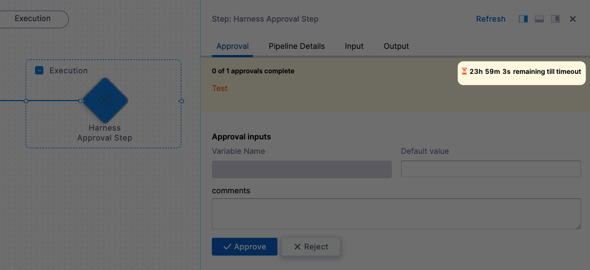
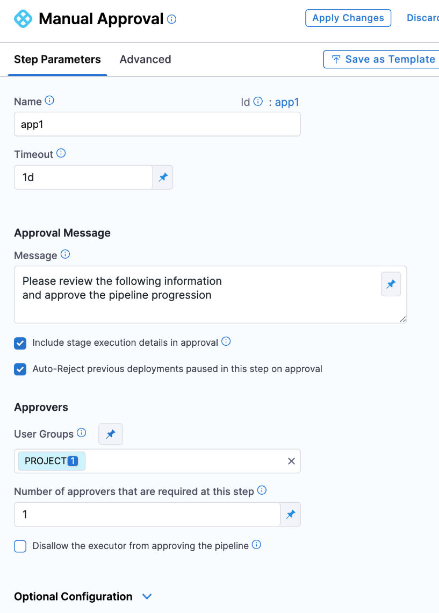

This topic describes how to enable Harness user group(s) to approve or reject a stage at any point in its execution.

During deployment, the user group members use the Harness Manager to approve or reject the deployment manually.

Approvals are usually added in between stage steps to prevent the stage execution from proceeding without an approval.

For example, in a [Kubernetes blue green deployment](/docs/continuous-delivery/deploy-srv-diff-platforms/kubernetes/kubernetes-executions/create-a-kubernetes-blue-green-deployment), you might want to add an approval step between the stage deployment step, where the new app version is deployed to the staging environment, and the Swap Primary with Stage step, where production traffic is routed to the pods for the new version.

Other approval methods are:

* [Harness Approval stages](/docs/platform/Approvals/adding-harness-approval-stages): Add Approval stages for manual intervention.
* [Adding Jira Approval stages and steps](/docs/platform/Approvals/adding-jira-approval-stages): Add Jira Approval stages and steps.
* [Adding ServiceNow Approval steps and stages](/docs/platform/Approvals/service-now-approvals): Add ServiceNow Approval stages and steps.

## Visual Summary

Here's a manual approval step during the execution of a pipeline:


An approver can approve or reject the step, stopping the pipeline. The approver can also add comments and define variables for use by subsequent approvers and steps.

Here's a quick video that walks you through setting up and running the step:

<!-- Video:
https://www.youtube.com/watch?v=V-d6kaMBf-w-->
<docvideo src="https://www.youtube.com/watch?v=V-d6kaMBf-w" />


Here's what a manual approval step looks like in YAML:

```yaml
- step:  
      type: HarnessApproval  
      name: Harness Approval Step  
      identifier: Harness_Approval_Step  
      timeout: 1d  
      spec:  
          approvalMessage: Test  
          includePipelineExecutionHistory: true  
          approvers:  
              userGroups:  
                  - docs  
              minimumCount: 1  
              disallowPipelineExecutor: false  
          approverInputs:  
              - name: foo  
                defaultValue: bar
```
## Important notes

Approval steps should not be added to run in parallel with other steps, including other Approval steps. The Harness Pipeline Studio will not allow you to add Approval steps in parallel with other steps, but the pipeline YAML editor does not prevent this setup. During execution, a successful parallel Approval step will not fail the deployment, but it is not a valid configuration because Approvals are checks on the release process and should always be used between steps.

## Add approval step

1. In a CD stage, in **Execution**, select **Add Step**.
2. Select **Harness Approval**. The **Harness Approval** settings appear.

## Set timeout

Set a default for the step timeout. Leave enough time for the Users in **Approvers** to see and respond to the waiting step.

The default timeout for an Approval step is **1d** (24 hours). 

You can use: 

- `w`  for week
- `d`  for day
- `h`  for hour
- `m`  for minutes
- `s`  for seconds
- `ms` for milliseconds

For example, 1d for one day.

The maximum timeout duration is 53 weeks.The timeout countdown appears when the step in executed.



## Add Message

1. In **Approval Message**, add the message for the users in **Approvers**.

2. Enable the **Include Pipeline execution history in approval details** option to show approvers the pipeline's execution history. This can help an approver compare the current execution info with historical data.
3. Enable the **Auto-Reject previous deployments paused in this step on approval** option to reject old executions waiting for approval when a latest step is approved. 
   
   :::info Limitations:

   * If you have two approval steps in a step group of a stage with the same step identifier, Harness won't be able to differentiate between the approval steps, and rejects previous deployments with the same identifier.
   * If you change the services in a CD stage, Harness won't reject the previous pipeline waiting for approval because you added/updated the service in the pipeline.

   :::

## Select approvers

1. In **User Groups**, select the Harness user groups that will approve the step. For more information, go to [add and manage user groups](/docs/platform/User-Management/add-user-groups).
2. In **Number of approvers that are required at this step**, enter how many of the users in the user groups must approve the step.
   
   

## Prevent approval by pipeline executor

If you don't want the User that initiated the pipeline execution to approve this step, select the **Disallow the executor from approving the pipeline** option.

Even if the User is in the user group selected in **User Group**, they won't be able to approve this step.


## Automatic Approvals

:::note

Currently, the automatic approvals feature is behind the feature flag `CDS_AUTO_APPROVAL`. Contact [Harness Support](mailto:support@harness.io) to enable the feature.

:::

You can set the Approval step to automatically approve at a specific date and time.

1. In **Schedule Auto Approval**, select **Auto Approve**.
2. In **Timezone**, select the timezone to use for the schedule.
3. In **Time**, select the date and time when the automatic approval should occur.
4. In **Message**, enter the message that the users in the **User Groups** setting will see when the automatic approval occurs.


:::note

- The Auto approve schedule should be greater than 15 minutes past the current time.
- In addition to automatic approvals, you can also set a step-level failure strategy of **Mark as Success**. If the step exceeds its **Timeout** setting or fails for a different reason, **Mark as Success** will automatically approve the step. This is not a replacement for the **Auto Approve** option.

:::

## Approver inputs

In **Inputs to be provided by approver**, you can enter variables and when the approver views the step, they can provide new values for the variables.

If there are multiple approvers, the first approver sees the variables as you entered them in the step. If the first approver enters new values, the next approver sees the values the first approver entered.

A third approver will see all of the variables the first and second approver provided.

The variable values entered by the final approver populate the expressions created from the inputs.

For example, if there were three approvers and you added a Shell Script step that referenced the input variables with an expression, the expression would render the variable values entered by the final, third approver.

You can reference input variables using the `approverInputs` expression:

`<+pipeline.stages.[stage_name].spec.execution.steps.[step_name].output.approverInputs.[variable_name]>`

These variables can serve as inputs to later stages of the same pipeline, where they support conditional execution or user overrides. 

For example, in a subsequent step's **Conditional Execution** settings, you could use an expression that only runs the step if the expression evaluates to 1.

`<+pipeline.stages.Shell_Script.spec.execution.steps.Harness_Approval_Step.output.approverInputs.foo> == 1`


## Advanced settings

In **Advanced**, you can use the following options:

* [Delegate Selector](https://developer.harness.io/docs/platform/delegates/manage-delegates/select-delegates-with-selectors/)
* [Conditional Execution](https://developer.harness.io/docs/platform/pipelines/w_pipeline-steps-reference/step-skip-condition-settings/)
* [Failure Strategy](https://developer.harness.io/docs/platform/pipelines/w_pipeline-steps-reference/step-failure-strategy-settings/)
* [Looping Strategy](https://developer.harness.io/docs/platform/pipelines/looping-strategies-matrix-repeat-and-parallelism/)
* [Policy Enforcement](https://developer.harness.io/docs/platform/Governance/Policy-as-code/harness-governance-overview)

## See also

* [Update Jira Issues in CD stages](/docs/continuous-delivery/x-platform-cd-features/cd-steps/ticketing-systems/update-jira-issues-in-cd-stages)

