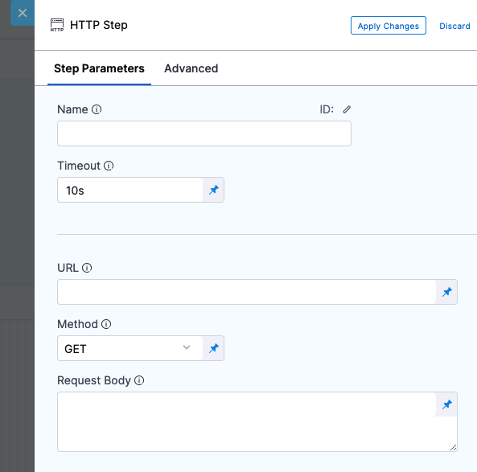

You can use the HTTP step to run HTTP methods containing URLs, methods, headers, assertions, and variables. It helps you avoid having script cURL commands for simple REST calls.

The most common use of the HTTP step is to run a health check post-deployment. For example, make sure that an HTTP or IP endpoint, such as a load balancer, is properly exposed.

Other common uses are:

* Making a call to a third-party system to gather deployment information, such as a Nexus IQ scan.
* Open Policy Agent (OPA) policy agent call.
* General HTTP testing calls to the deployed application.

This topic describes how to use the HTTP step. For comprehensive details on each setting, see [HTTP step reference](/docs/continuous-delivery/x-platform-cd-features/cd-steps/utilities/http-step).

Go to [Harness REST API quickstart](/docs/platform/Resource-Development/APIs/api-quickstart) for more information.

## Before you begin

* [Kubernetes CD quickstart](/docs/continuous-delivery/deploy-srv-diff-platforms/kubernetes/kubernetes-cd-quickstart)
* [Define your Kubernetes target infrastructure](/docs/continuous-delivery/deploy-srv-diff-platforms/kubernetes/define-your-kubernetes-target-infrastructure): You can run an HTTP step in a CD stage without specifying specs or artifacts, but you do need to set up the infrastructure definition.

## Add the HTTP step

You can add the HTTP step to any CD Pipeline stage independent of deployment strategy.

1. In your Harness pipeline stage, in **Execution**, select **Add Step**.
2. Select **HTTP**. The HTTP step appears.



## Name and Timeout

1. Enter a name for the step.  
   
   Harness automatically creates an **Id**. You'll use this Id to reference this step's settings in other steps.

   For example, if the stage name is **dev** and the step Id is **HTTP** and you want to reference the URL entered in its **URL** setting, you'd use:

   `<+pipeline.stages.dev.spec.execution.steps.HTTP.spec.url>`

2. In **Timeout**, enter a timeout for this step.You can use:

   * `w` for weeks
   * `d` for days
   * `h` for hours
   * `m` for minutes
   * `s` for seconds
   * `ms` for milliseconds

   The maximum is `53w`.Timeouts are set at the Pipeline level also.

## URL for HTTP call

In **URL**, enter a URL for the call. It must include the `http://` scheme.

For more information on runtime inputs and expressions, go to [Fixed values runtime inputs and expressions](https://developer.harness.io/docs/platform/references/runtime-inputs/)..

You can use [Harness variables](/docs/platform/Variables-and-Expressions/harness-variables) too. For example, if the Service name matches the domain name of the HTTP address, you can use `http://<+service.name>/...`.

Before handing the execution of the HTTP step to a Harness Delegate, Harness performs a capability check on the URL to ensure that a non-400 response code is returned.

### Character encoding

:::note

Currently, character encoding is behind the feature flag `CDS_ENCODE_HTTP_STEP_URL`. Contact [Harness Support](mailto:support@harness.io) to enable the feature.

:::

By default, Harness validates the URL you enter to ensure it is not an invalid URL (or a URL with invalid characters) before it sends the request to the URL.

Harness can allow URLs with invalid characters such as a blank space, `^`, `{`, `}` and URL encode them before sending the request. 

<!-- ### Using secrets in the HTTP step URL

In some cases, you might want to use a [Harness text secret](/docs/platform/Secrets/add-use-text-secrets) in the **URL** setting. For example, `https://www.google.com/<+secrets.getValue("xyz")>`.

It's important to know how Harness uses the secret when evaluating the URL.

Harness does not use the actual secret value, but rather it uses the secret Id. So, if you have a secret with the Id `xyz` and the value `gmail`, Harness will perform the capability check using `https://www.google.com/<<xyz>>`. This will fail the capability check.

If you use a Harness text secret for the entire URL, the capability check will fail. -->

## HTTP method

In HTTP Method, select the method for the call.

Harness supports the following [HTTP methods](https://restfulapi.net/http-methods/#summary):

* GET
* POST
* PUT
* DELETE
* HEAD
* OPTIONS

## Request Body

In Request **Body**, enter the body of the HTTP payload to send to the URL.

You can use a **Fixed Value**, **Runtime Input**, or **Expression**.

You can use [Harness variables](/docs/platform/Variables-and-Expressions/harness-variables) too. For example, if the Service name matches the domain name of the HTTP address, you can use `http://<+service.name>/...`.

Before handing the execution of the HTTP step to a Harness Delegate, Harness performs a capability check on the URL to ensure that a non-400 response code is returned.

## Assertion

The assertion is used to validate the incoming response. For example, if you wanted to check the health of an HTTP connection, you could use the assertion `<+httpResponseCode> == 200`.

The expression `<+httpResponseCode> == 200` will evaluate to true if the HTTP call returns a 200 code.

Expressions can use the following aliases to refer to the HTTP responses, URL, and method:

* `<+httpResponseCode>`
* `<+httpUrl>`
* `<+httpMethod>`
* `<+httpResponseBody>`

You can use a Fixed Value, Runtime Input, or Expression.

You can use [Harness variables](/docs/platform/Variables-and-Expressions/harness-variables) too.

## Headers

Headers are `key:value` pairs. For example:

* `Content-Type: application/json`
* `Content-Type: text/html`

You can use a Fixed Value, Runtime Input, or Expression.

You can use [Harness variables](/docs/platform/Variables-and-Expressions/harness-variables) too.

You can reference [Harness secrets](/docs/platform/Secrets/add-use-text-secrets) in the **Value** setting too.

For example, in **Key**, enter `Token`.

In **Value**, enter `<+secrets.getValue("aws-playground_AWS_secret_key")>`.

## Output variables

You can create output variables and reference them in other steps in the stage. The **Value** setting can contain any HTTP step input, output, or response information.

To reference the value of the output variable in another step using its fully-qualified name (FQN).

For example, here's a variable `example` with the value `1234`. The step name is `GET`.


Save the step and then click **Variables**.

1. In the **Variables** drawer, copy the **example** variable.
2. In another step, like a **Shell Script** step, paste the FQN.

The FQN will resolve to the variable value at execution runtime.

You can also use ​JSON and XML functors in the values for the output variable. For example, `<+json.select("data.attributes.version_pins.mvn-service://new-construction-api", httpResponseBody)>`.

See [JSON and XML functors](/docs/continuous-delivery/x-platform-cd-features/cd-steps/utilities/json-and-xml-functors).

## Simulate load by running steps in parallel

You can use multiple HTTP steps in parallel to simulate load.

Create a step group and add multiple HTTP steps with the same URL pointing to your service.


The steps are executed in parallel and simulate load.

You can add multiple steps to the group quickly using YAML. Just paste additional steps into the Step Group. Be sure to rename each step. Here's an example:


```yaml
...  
- stepGroup:  
  name: Simulate Load  
  identifier: Simulate_Load  
  steps:  
      - parallel:  
            - step:  
                  type: Http  
                  name: Load 1  
                  identifier: Load_1  
                  spec:  
                      url: http://example.com  
                      method: GET  
                      headers: []  
                      outputVariables: []  
                  timeout: 10s  
            - step:  
                  type: Http  
                  name: Load 2  
                  identifier: Load_2  
                  spec:  
                      url: http://example.com  
                      method: GET  
                      headers: []  
                      outputVariables: []  
                  timeout: 10s  
            - step:  
                  type: Http  
                  name: Load 3  
                  identifier: Load_3  
                  spec:  
                      url: http://example.com  
                      method: GET  
                      headers: []  
                      outputVariables: []  
                  timeout: 10s  
  failureStrategies: []  
  spec: {}  
...
```


