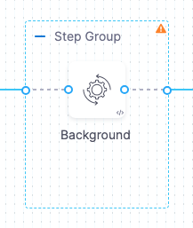
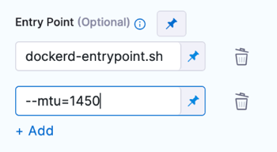

:::note

Currently, the Background step in Deploy stages is behind the feature flag `CDS_CONTAINER_STEP_GROUP`. Contact [Harness Support](mailto:support@harness.io) to enable the feature.

:::

Background steps run dependent services needed for the entire lifetime of a CD step group or stage. For example, you can set up your stage to run multiple background services that implement a local, multi-service app.

:::note

A Background step starts a service and then proceeds. For any later step that relies on the service, it is good practice to verify that the service is running before sending requests.

:::

## Docker in Docker (DinD)

Some steps in a containerized step group might require Docker in Docker (DinD). For example, some deployment types might use DinD because of the requirements of their platforms.

:::note

There is no DinD requirement for containerized step groups. Unless a step requires DinD, Harness needs only a Kubernetes cluster to run the containerized step.

If a Harness deployment type requires DinD, the Background step is added automatically as part of the stage Execution setup.

Whether the dind step is added automatically or manually, you must configure it.

:::


If step(s) in a containerized step group require DinD, you can add a **Background** step that performs the Docker in Docker (DinD) setup.

  

The Background step creates the DinD environment. In this environment, each subsequent step group step is run inside the Kubernetes pod as containers.

## Background step settings

The Background step has the following settings.

### Name and Id

When you name the step, Harness automatically adds an [Id](https://developer.harness.io/docs/platform/References/entity-identifier-reference) based on the name.

You can use the Background step Id to call services started by Background steps in later steps, such as commands in Run steps. For example, a cURL command could call `STEPGROUPID_BACKGROUNDSTEPID:5000` where it might otherwise call `localhost:5000`.

  

You must include step group Id, such as `curl STEP_GROUP_ID_BACKGROUND_STEP_ID:5000`, even if both steps are in the same step group.

### Container Registry

**Container Registry** is the Harness container registry connector that connects to the container registry hosting the image to use for this step.

### Image

This is the container image to use for the background service.

For example, `docker:dind`.

The image name should include the tag, or it defaults to the `latest` tag if unspecified. You can use any Docker image from any Docker registry, including Docker images from private registries. Different container registries require different name formats:

* **Docker Registry:** Input the name of the artifact you want to use, such as `library/tomcat`. Wildcards aren't supported. FQN is required for images in private container registries.
* **ECR:** Input the FQN (fully-qualified name) of the artifact you want to use. Images in repos must reference a path, for example: `40000005317.dkr.ecr.us-east-1.amazonaws.com/todolist:0.2`.
* **GCR:** Input the FQN (fully-qualified name) of the artifact you want to use. Images in repos must reference a path starting with the project Id that the artifact is in, for example: `us.gcr.io/playground-243019/quickstart-image:latest`.

### Entry Point

Supply a list of arguments in `exec` format. Enter each argument separately.


```mdx-code-block
<Tabs>
  <TabItem value="Visual" label="Visual">
```
<figure>

  

<figcaption><b>Entry Point</b> arguments in the Pipeline Studio Visual editor.</figcaption>
</figure>

```mdx-code-block
  </TabItem>
  <TabItem value="YAML" label="YAML" default>
```

```yaml
entrypoint:
  - dockerd-entrypoint.sh
  - "--mtu=1450"
```

```mdx-code-block
  </TabItem>
</Tabs>
```
**Entry Point** arguments override the image `ENTRYPOINT` and any commands in the **Command** field. 

### Shell and Command

For **Shell**, select the shell script type for the arguments and commands defined in **Entry Point** and **Command**.

In **Command**, enter POSIX shell script commands to execute inside the container.

For example, a command that checks the Java version installed on the system and verifies if it is equal to 17.

```
JAVA_VER=$(java -version 2>&1 | head -1 | cut -d'"' -f2 | sed '/^1\./s///' | cut -d'.' -f1)
if [[ $JAVA_VER == 17 ]]; then
  echo successfully installed $JAVA_VER
else
  exit 1
fi
```

Notes:
- You can use `docker-compose up` to start multiple services in one Background step.
- You can run PowerShell commands on Windows VMs running in AWS build farms.
- You can run PowerShell Core commands in pods or containers that have pwsh installed.

### Privileged

Enable this option to run the container with escalated privileges. This is equivalent to running a container with the Docker `--privileged` flag.

### Report Paths

Specify the file paths or directories within the container where various reports or log files generated by applications or processes running inside the container are stored.

### Environment Variables

You can inject environment variables into a container and use them in the **Command** script. You must input a **Name** and **Value** for each variable.

You can reference environment variables in the **Command** script by their name. For example, a Bash script would use `$var_name` or `${var_name}`, and a Windows PowerShell script would use `$Env:varName`.

### Image Pull Policy

Select an option to set the pull policy for the image.

- **Always:** The kubelet queries the container image registry to resolve the name to an image digest every time the kubelet launches a container. If the kubelet encounters an exact digest cached locally, it uses its cached image; otherwise, the kubelet downloads (pulls) the image with the resolved digest, and uses that image to launch the container.
- **If Not Present:** The image is pulled only if it is not already present locally.
- **Never:** The image is assumed to exist locally. No attempt is made to pull the image.

### Set Container Resources

Maximum resource limits for containers that clone the codebase at runtime. For more information, go to [Resource units in Kubernetes](https://kubernetes.io/docs/concepts/configuration/manage-resources-containers/#resource-units-in-kubernetes).

### DinD Background step example

When you run a pipeline that uses a containerized step group and Background step, you can see the DinD set up in the step log in the pipeline execution.

Select the step to see its log and how the DinD is set up. The general sequence is:

1. The log shows certificate requests being self-signed for the Docker in Docker (DinD) server and client.
2. The DinD environment is starting up.
3. It indicates that containerd is not running and starts the managed containerd process.
4. Containerd starts with information about the revision and version.
5. Various plugins are loaded, such as snapshotter, content, metadata, differ, event, GC scheduler, lease manager, NRI (disabled), runtime, sandbox, streaming, and services.
6. The log ends without further actions or errors.

## Advanced settings

In **Advanced**, you can use the following options:

* [Conditional Execution](https://developer.harness.io/docs/platform/pipelines/w_pipeline-steps-reference/step-skip-condition-settings/)
* [Failure Strategy](https://developer.harness.io/docs/platform/pipelines/w_pipeline-steps-reference/step-failure-strategy-settings/)
* [Looping Strategy](https://developer.harness.io/docs/platform/pipelines/looping-strategies-matrix-repeat-and-parallelism/)
* [Policy Enforcement](https://developer.harness.io/docs/platform/governance/policy-as-code/harness-governance-overview/)