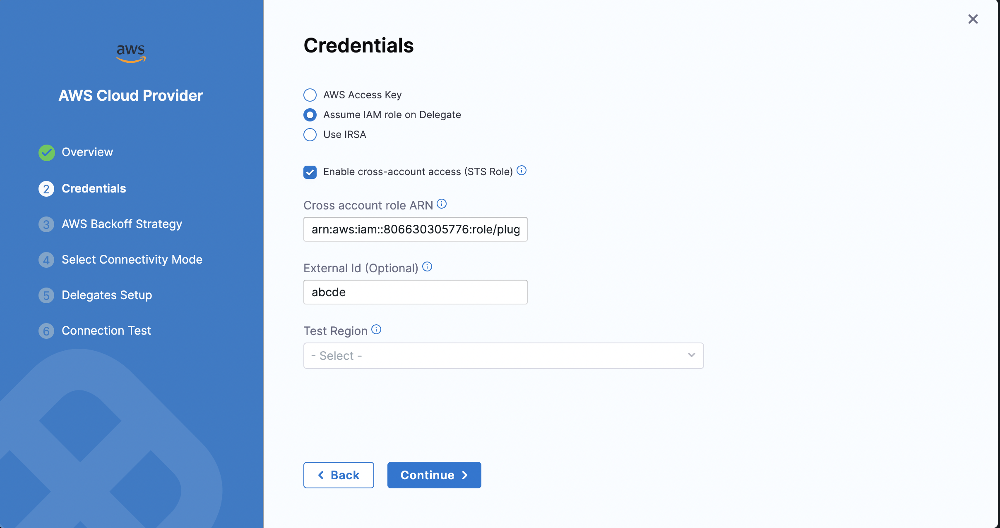
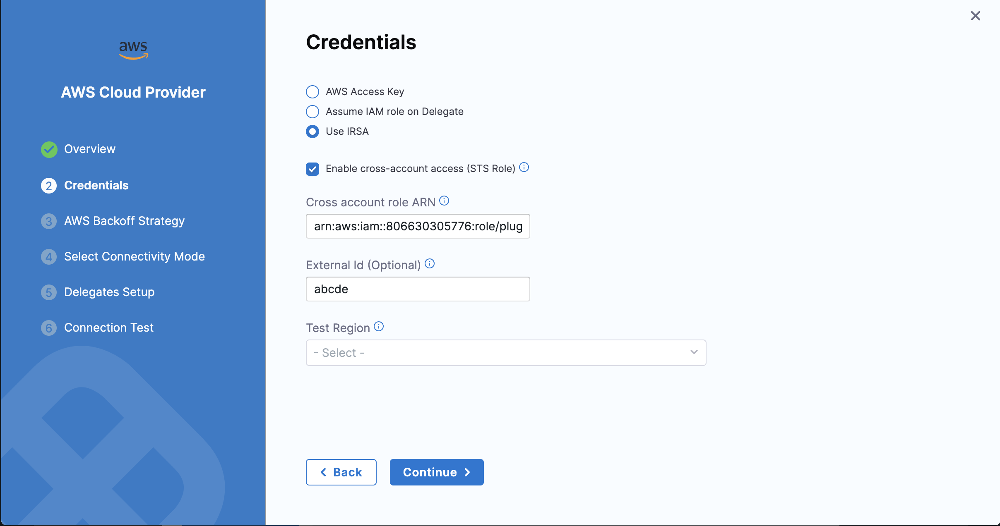
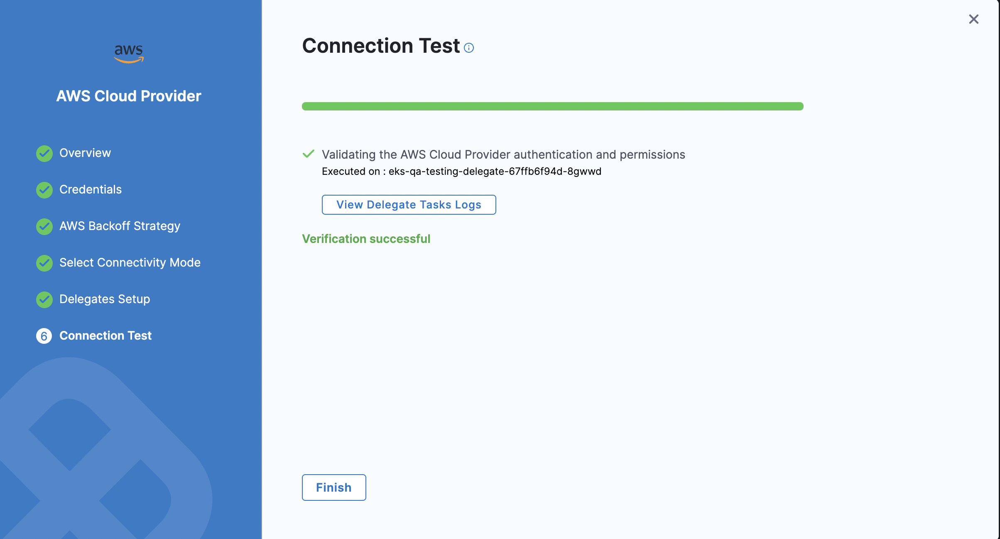
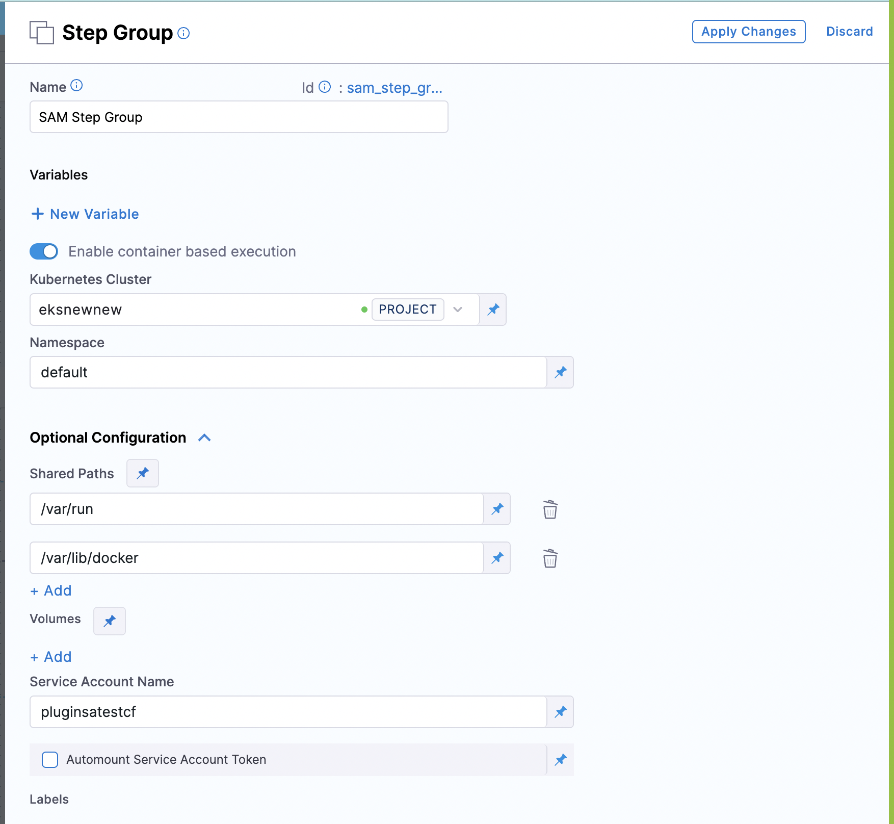
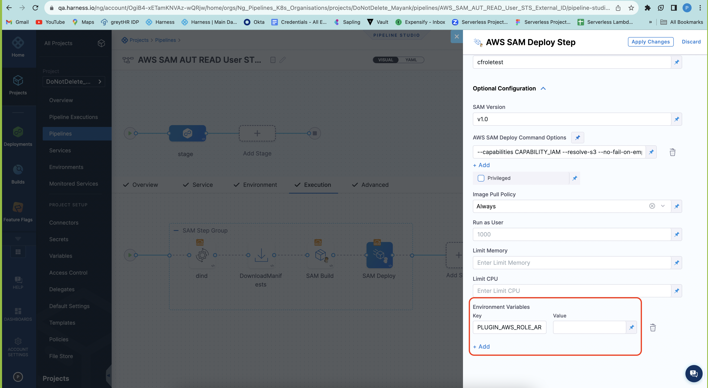

import Tabs from '@theme/Tabs';
import TabItem from '@theme/TabItem';


By default, the tasks performed by Harness CD steps are run on the Harness Delegate host system, for example, the Kubernetes cluster where a Kubernetes delegate is running.

To provide greater control over the resources used for CD steps, Harness also lets you use your own Kubernetes cluster as the runtime infrastructure for CD steps.

You can use a CD step group that points to your cluster as the runtime infrastructure. Next, in the step group, you can add the steps supported by containerized step groups.

In this architecture, no tooling is installed on delegates. Delegates simply act as orchestrators. Any tooling is installed and removed on demand in the ephemeral step containers.

When you use deployment types that support containerized step groups (for example, AWS SAM), containerized steps are automatically generated when you add the execution strategy for the stage.

When you manually add a step group, you can enable containerized step groups by selecting the **Enable container based execution** option.

  

This option is disabled for deployment types that do not support containerized step groups.


## Important notes
- CD containerized step groups are supported in Deploy and Custom stages.
- Not all steps are supported in containerized step groups. You can see which steps are supported when you try to add steps in the containerized step group.
- You can use the same cluster to run the Harness Delegate and the containerized step group(s), but it is not required.
- Permissions configuration are inherited by a step within a step group. This logic has been updated over the course of Harness NextGen's lifespan. This has caused breaking changes for some users. To learn more about it, go to [Step Group Inheritance Logic](/kb/continuous-delivery/articles/configuration-inheritance-stepgroup-step).


## Add a containerized step group

Typically, Harness adds the step group and steps needed for a deployment automatically when you select the stage execution strategy in the **Execution** section.

Whether the containerized step group is added automatically or manually, you must configure it.

Here are the steps for adding a containerized step group manually: 

1. In your Deploy (CD) stage, in **Execution**, select **Add Step**, and then select **Add Step Group**.
2. To configure a step group as containerized, enable the **Enable container based execution** setting.
3. Configure the following settings.

### Kubernetes Cluster

Select or add a Harness Kubernetes Cluster connector to connect to the cluster where the containers will run.

### Namespace

Enter an existing namespace in the cluster.

### Shared Paths

This setting is the same as Kubernetes `mountPath`. The `name` for the `volumeMounts` is added internally.

Enter shared directories or specific paths within the filesystem to have them shared between containers running within the same pod.

### Volumes

This setting is the same as Kubernetes `volumes`. Harness supports Host Path (`hostPath`), Empty Directory (`emptyDir`), and Persistent Volume Claim (`persistentVolumeClaim`).

### Service Account Name

Specify a Kubernetes service account for step containers to use when communicating with the Kubernetes API server. Leave blank to use the namespace's default service account.

### Automount Service Account Token

An application running inside a pod can access the Kubernetes API using automatically mounted service account credentials. See [Accessing the Cluster](https://kubernetes.io/docs/tasks/access-application-cluster/access-cluster/) to learn more.

To use a different service account, enter its name here.

### Labels

Enter any labels to apply to the pods.

### Annotations

Enter any annotations to apply to the pods.

### Privileged

The standard `privileged` property for Kubernetes `securityContext`.

When this setting is enabled, it grants the container elevated privileges within the underlying host environment. This means that the container has access to all Linux kernel capabilities and devices, similar to running processes outside the container. It effectively removes the isolation provided by the container runtime and can potentially pose security risks if not used carefully.

### Allow Privilege Escalation

The standard `allowPrivilegeEscalation` property for Kubernetes `securityContext`.

When this setting in enabled, it allows the container to gain additional privileges beyond those initially granted during container startup.

### Add Capabilities

The standard `add` setting for the `capabilities` property in the Kubernetes `securityContext`.

Simply add the name of the capability, like `NET_ADMIN`.

### Drop Capabilities

The standard `drop` setting for the `capabilities` property in the Kubernetes `securityContext`.

Simply add the name of the capability, like `CHOWN`.

### Run as Non Root

Enable this setting to run the container as a non-root user.

### Read-only Root Filesystem

The standard `readOnlyRootFilesystem` setting for the `securityContext` property.

Enable this setting to ensure that the root filesystem of the container is mounted as read-only.

### Run as User

The standard `runAsUser` setting for the `securityContext` property.

Specify the user ID (UID) under which the container should run.

### Priority Class

The standard Kubernetes `PriorityClass`.

Enter a standard `priorityClassName` like `system-node-critical`.

### Node Selector

The standard Kubernetes `nodeSelector`.

Enter a key like `disktype` and and value like `ssd`.

### Tolerations

The standard Kubernetes `tolerations`. Use the settings to specify that a pod can tolerate (or ignore) the effects of node taints.

### Init Timeout

The standard Kubernetes `timeoutSeconds` for `initContainers`.

### Override Image Connector

By default, at pipeline runtime, Harness pulls certain images from public Docker Hub repos. These images are only used for backend processes. At runtime, the Harness Delegate makes an outbound connection to the public repo and pulls the images.

The Harness Container Image Registry is dedicated exclusively to Harness-supported images. 

You might want to override the default behavior and download your build images from this repo instead. To view the list of images in this registry, enter the following command.

```
curl -X  GET https://app.harness.io/registry/_catalog
```

Add or select a connector to use instead of the default connector used for the Harness Container Image Registry.

For more information, go to [Connect to the Harness container image registry](/docs/platform/connectors/artifact-repositories/connect-to-harness-container-image-registry-using-docker-connector).

### Advanced settings

In **Advanced**, you can use the following options:

* [Delegate Selector](/docs/platform/delegates/manage-delegates/select-delegates-with-selectors)
* [Conditional Execution](/docs/platform/pipelines/step-skip-condition-settings)
* [Failure Strategy](/docs/platform/pipelines/failure-handling/define-a-failure-strategy-on-stages-and-steps)
* [Looping Strategy](/docs/platform/pipelines/looping-strategies/looping-strategies-matrix-repeat-and-parallelism)

## Containerized step group example

When you run a pipeline that uses a containerized step group, you can see the container set up in the automatically generated **Initialize** step in the pipeline execution.

Select **Initialize** to see its log and how the container is set up.

<details>
<summary>Step group setup log</summary>

In the following log, the containerized step group is created and a Background step using Docker in Docker (DinD) is also set up. The Background step is only required for certain subsequent step types that need DinD. It is provided here as an example only.


```
Successfully assigned harness-delegate-ng/harnesscd-asdasd-89xlhk71 to gke-qa-target-ng-pool-1-b4499db2-2431
Pulling image "harness/ci-addon:1.16.8"
Successfully pulled image "harness/ci-addon:1.16.8" in 437.806182ms (437.815597ms including waiting)
Created container setup-addon
Started container setup-addon
Container image "harness/drone-git:1.3.4-rootless" already present on machine
Created container step-harness-git-clonem1
Started container step-harness-git-clonem1
Container image "harness/drone-git:1.3.4-rootless" already present on machine
Created container step-harness-git-clonem2
Started container step-harness-git-clonem2
Pulling image "harnessdev/sam-deploy:1.82.0-latest"
Successfully pulled image "harnessdev/sam-deploy:1.82.0-latest" in 429.518494ms (429.527506ms including waiting)
Created container step-samdeploy
Started container step-samdeploy
Pulling image "harnessdev/sam-build:1.82.0-latest"
Successfully pulled image "harnessdev/sam-build:1.82.0-latest" in 380.845932ms (380.855397ms including waiting)
Created container step-sambuild
Started container step-sambuild
Container image "docker:dind" already present on machine
Created container step-dind
Started container step-dind
Pulling image "harness/ci-lite-engine:1.16.8"
Successfully pulled image "harness/ci-lite-engine:1.16.8" in 355.654902ms (355.690135ms including waiting)
Created container lite-engine
Started container lite-engine
```

</details>

## Harness Docker connector for all group steps

In each step in a containerized step group, you must provide a [Harness connector](/docs/category/connectors) to a Docker container registry and an image for the container step to run.

You can create connectors in-line while adding steps or separately outside of the pipeline creation process. Images are specified at the step level.

<details>
<summary>Add a Docker registry connector</summary>

Harness offers several types of Docker-compliant cloud provider and artifact repository connectors, and there are several ways you can create connectors. These steps demonstrate several ways you can create a [Docker connector](/docs/platform/connectors/cloud-providers/ref-cloud-providers/docker-registry-connector-settings-reference).

<Tabs>
<TabItem value="platform" label="Harness Platform" default>

In the Harness Platform, you can use the connector creation wizard to create connectors.

1. In Harness, go to **Account Settings**, **Organization Settings**, or **Project Settings**, depending on the [scope](https://developer.harness.io/docs/platform/role-based-access-control/rbac-in-harness/#permissions-hierarchy-scopes) at which you want to create the connector.
2. Select **Connectors**, select **New Connector**, and then select the **Docker Registry** connector.
3. Enter a **Name** and select **Continue**.
4. Configure the **Details** settings as follows, and then select **Continue**:

   * **Provider Type:** Select **DockerHub**.
   * **Docker Registry URL:** Enter `https://docker.dev.harness.io/v2/`.
   * **Authentication:** For the quickest setup, select **Anonymous**.

   

5. Connect using a Harness Delegate, and select **Continue**.
6. Select any delegate or select/create a specific delegate, and then select **Save and Continue**.
7. When the connection test is complete, select **Finish**.

</TabItem>
<TabItem value="yaml" label="YAML">

You can create connectors in [Harness YAML](/docs/platform/pipelines/harness-yaml-quickstart), for example:

```yaml
connector:
  name: Docker Hub with Pwd
  identifier: Docker_Hub_with_Pwd
  description: ""
  orgIdentifier: default
  projectIdentifier: CD_Docs
  type: DockerRegistry
  spec:
    dockerRegistryUrl: https://docker.dev.harness.io/v2/
    providerType: DockerHub
    auth:
      type: Anonymous
    executeOnDelegate: true
```

</TabItem>
<TabItem value="API" label="API">

You can create a Docker connector using the [Create a Connector endpoint](https://apidocs.harness.io/tag/Connectors#operation/createConnector), for example:

```
curl --location --request POST 'https://app.harness.io/gateway/ng/api/connectors?accountIdentifier=123456' \
--header 'Content-Type: text/yaml' \
--header 'x-api-key: PERSONAL_ACCESS_TOKEN' \
--data-raw 'connector:
  name: dockerhub
  identifier: dockerhub
  description: ""
  tags: {}
  orgIdentifier: default
  projectIdentifier: APISample
  type: DockerRegistry
  spec:
    dockerRegistryUrl: https://docker.dev.harness.io/v2/
    providerType: DockerHub
    auth:
      type: Anonymous'
```

</TabItem>
<TabItem value="Terraform Provider" label="Terraform Provider">

For the Terraform Provider Docker connector resource, go to the Terraform documentation for the [harness_platform_connector_docker](https://registry.terraform.io/providers/harness/harness/latest/docs/resources/platform_connector_docker).

Here's an example of Terraform provider Docker connector JSON:

```json
# credentials anonymous
resource "harness_platform_connector_docker" "test" {
  identifier  = "identifer"
  name        = "name"
  description = "test"
  tags        = ["foo:bar"]

  type               = "DockerHub"
  url                = "https://docker.dev.harness.io/v2/"
  delegate_selectors = ["harness-delegate"]
}
```

</TabItem>
</Tabs>

:::info

- When pulling images from Docker repos, Harness is restricted by Docker repo limits, such as [Docker Hub limits](https://docs.docker.com/docker-hub/download-rate-limit/).
- The maximum number of artifact image tags fetched by Harness is 10000.

:::

</details>

When configuring pipelines, you'll most often select a Docker connector when you need to pull images into individual steps. For example, if a Shell Script step needs to run curl commands, you might pull an image containing the curl binary.

Behind the scenes, Harness also uses a Docker connector to pull the required Harness images that support pipeline execution. Harness can pull the images from the public Harness container registry (using the default, built-in Harness Image connector) or you can configure your pipelines to use your own Docker connector to pull with authentication credentials or pull from a private container registry where you have cloned the Harness images. For more information, go to [Connect to the Harness container image registry](/docs/platform/connectors/artifact-repositories/connect-to-harness-container-image-registry-using-docker-connector).

## DinD Background step

Some steps in a containerized step group might require Docker in Docker (DinD). For example, some deployment types might use DinD because of the requirements of their platforms.

:::info

There is no DinD requirement for containerized step groups. Unless a step requires DinD, Harness needs only a Kubernetes cluster to run the containerized step.

If a Harness deployment type requires DinD, the Background step is added automatically as part of the stage Execution setup.

Whether the dind step is added automatically or manually, you must configure it.

:::


If step(s) in a containerized step group require DinD, you can add a **Background** step that performs the Docker in Docker (DinD) setup.

  

The Background step creates the DinD environment. In this environment, each subsequent step group step is run inside the Kubernetes pod as containers.


### Container Registry

**Container Registry** is the Harness container registry connector that connects to the container registry hosting the image to use for this step.

### Image

This is the container image to use for the background service.

Simply enter `docker:dind`.

### Entry Point

Supply a list of arguments in `exec` format. Enter each argument separately.


<Tabs>
  <TabItem value="Visual" label="Visual">

<figure>

  

<figcaption><b>Entry Point</b> arguments in the Pipeline Studio Visual editor.</figcaption>
</figure>


</TabItem>
  <TabItem value="YAML" label="YAML" default>


```yaml
entrypoint:
  - dockerd-entrypoint.sh
  - "--mtu=1450"
```


</TabItem>
</Tabs>

**Entry Point** arguments override the image `ENTRYPOINT` and any commands in the **Command** field. 

### Shell and Command

For **Shell**, select the shell script type for the arguments and commands defined in **Entry Point** and **Command**.

In **Command**, enter POSIX shell script commands to execute inside the container.

For example, a command that checks the Java version installed on the system and verifies if it is equal to 17.

```
JAVA_VER=$(java -version 2>&1 | head -1 | cut -d'"' -f2 | sed '/^1\./s///' | cut -d'.' -f1)
if [[ $JAVA_VER == 17 ]]; then
  echo successfully installed $JAVA_VER
else
  exit 1
fi
```

Notes:
- You can use `docker-compose up` to start multiple services in one Background step.
- You can run PowerShell commands on Windows VMs running in AWS build farms.
- You can run PowerShell Core commands in pods or containers that have pwsh installed.

### Privileged

Enable this option to run the container with escalated privileges. This is equivalent to running a container with the Docker `--privileged` flag.

### Report Paths

Specify the file paths or directories within the container where various reports or log files generated by applications or processes running inside the container are stored.

### Environment Variables

You can inject environment variables into a container and use them in the **Command** script. You must input a **Name** and **Value** for each variable.

You can reference environment variables in the **Command** script by their name. For example, a Bash script would use `$var_name` or `${var_name}`, and a Windows PowerShell script would use `$Env:varName`.

### Image Pull Policy

Select an option to set the pull policy for the image.

- **Always:** The kubelet queries the container image registry to resolve the name to an image digest every time the kubelet launches a container. If the kubelet encounters an exact digest cached locally, it uses its cached image; otherwise, the kubelet downloads (pulls) the image with the resolved digest, and uses that image to launch the container.
- **If Not Present:** The image is pulled only if it is not already present locally.
- **Never:** The image is assumed to exist locally. No attempt is made to pull the image.

### Set Container Resources

Maximum resource limits for containers that clone the codebase at runtime. For more information, go to [Resource units in Kubernetes](https://kubernetes.io/docs/concepts/configuration/manage-resources-containers/#resource-units-in-kubernetes).

### DinD Background step example

When you run a pipeline that uses a containerized step group and Background step, you can see the DinD set up in the step log in the pipeline execution.

Select the step to see its log and how the DinD is set up. The general sequence is:

1. The log shows certificate requests being self-signed for the Docker in Docker (DinD) server and client.
2. The DinD environment is starting up.
3. It indicates that containerd is not running and starts the managed containerd process.
4. Containerd starts with information about the revision and version.
5. Various plugins are loaded, such as snapshotter, content, metadata, differ, event, GC scheduler, lease manager, NRI (disabled), runtime, sandbox, streaming, and services.
6. The log ends without further actions or errors.


## Using AWS SAM and Serverless.com Harness Connectors with containerized step groups

For AWS SAM and Serverless deployments with CD containerized steps, users were not able to deploy with a Harness connector using ISRA and IAM roles for the authentication performed by the Harness Delegate.

The primary issue stemmed from the fact that the service account specified in the step group configuration was not being utilized by the step images during deployment.

To address this issue, we've made the following enhancements.

- **Additional Credential Parameters:** In addition to passing the Access Key and Secret Key, Harness now transmits the Cross Account Role ARN and an optional External Id. These credentials are utilized by the step images to assume the necessary roles for deployment. 
- **Service Account Integration:** Harness has introduced the functionality to use the Service Account specified in the step group configuration. 

The following environment variables have been configured in the images:

  1. Specified in the Connector
    - `PLUGIN_AWS_ROLE_ARN` (Cross account role)
    - `PLUGIN_AWS_STS_EXTERNAL_ID`
    - `PLUGIN_AWS_ACCESS_KEY`
    - `PLUGIN_AWS_SECRET_KEY`
  2. `PLUGIN_REGION` (region provided in the infrastructure configuration)

To leverage the Harness Connector for AWS SAM and Serverless.com container steps, follow these steps: 

### Connector configuration

In your Connector configuration, configure the Cross Account Role and an optional External Id. 





The Connection test is used to verify delegate connectivity to the AWS account.




### Service Account configuration

For the pods to connect to the AWS account, you will have to configure the service account in the step group level settings:



If the Access Key and Secret Key environment variables are set, then the image uses these keys for deployment. However, if the Access Key and Secret Key are not configured, the image will assume the role of service account configured for deployment.

Harness will pass the cross account role in the image. If you do not want to use that in the image, you can set it to empty:



