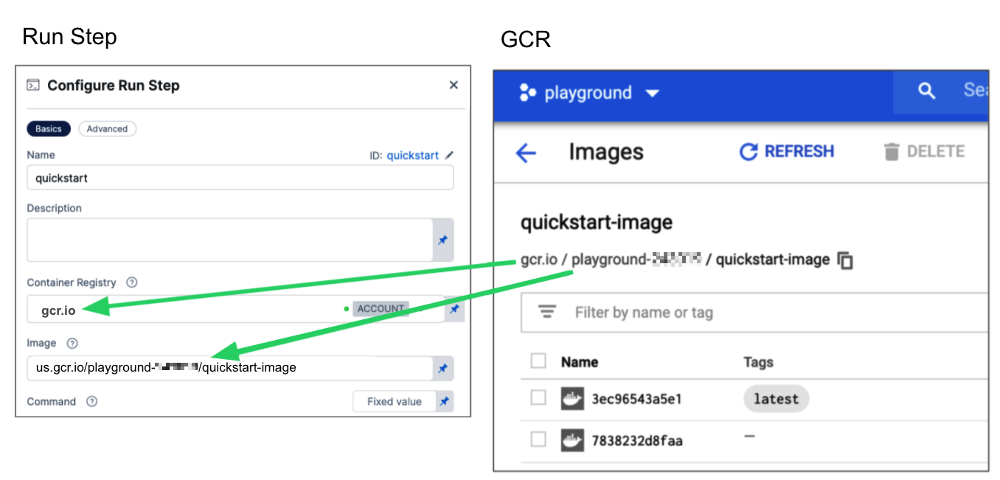
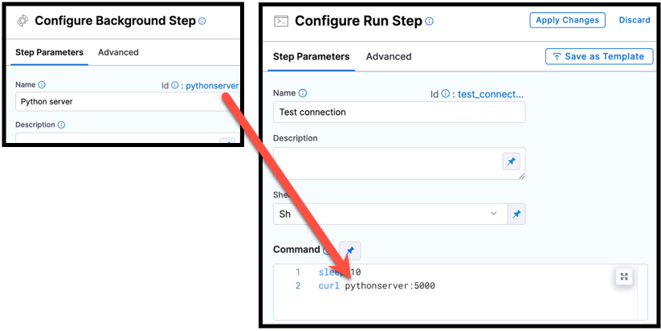

```mdx-code-block
import Tabs from '@theme/Tabs';
import TabItem from '@theme/TabItem';
```

:::note

Currently, the Run step in Deploy stages is behind the feature flag `CDS_CONTAINER_STEP_GROUP`. Contact [Harness Support](mailto:support@harness.io) to enable the feature.

:::

The Run step allows you to run scripts using specific container images and shells. 

The Run step can be used for operations such as running configuration scripts that apply configuration settings specific to the deployment environment, or running database migration scripts that handle database schema changes or migrations required for the deployment.

Harness CD also includes a general scripting step, the [Shell Script](/docs/continuous-delivery/x-platform-cd-features/cd-steps/utilities/shell-script-step) step, but the Shell Script step is simply a Bash/PowerShell scripting step and does not let you select a container.

The Run step settings are described below.

## Container Registry and Image

**Container Registry** is a Harness Docker registry connector for the image that you want Harness to run commands on, such as Docker Hub.

The **Image** is the FQN (fully-qualified name) or artifact name of the Docker image to use when this step runs commands, for example `us.gcr.io/playground-123/quickstart-image`. The image name should include the tag. If you don't include a tag, Harness uses the `latest` tag.

You can use any Docker image from any Docker registry, including Docker images from private registries. Different container registries require different name formats:

* **Docker Registry:** Input the name of the artifact you want to use, such as `library/tomcat`. Wildcards aren't supported. FQN is required for images in private container registries.
* **ECR:** Input the FQN (fully-qualified name) of the artifact you want to use. Images in repos must reference a path, for example: `40000005317.dkr.ecr.us-east-1.amazonaws.com/todolist:0.2`.
* **GCR:** Input the FQN of the artifact you want to use. Images in repos must reference a path starting with the project ID that the artifact is in, for example: `us.gcr.io/playground-243019/quickstart-image:latest`.

   <figure>

    

  <figcaption>Configuring GCR Container Registry and Image settings.</figcaption>
  </figure>


## Shell and Command

Use **Shell** and **Command** to define the commands that you need to run in this step.

For **Shell**, select the shell script type. Options include: **Bash**, **PowerShell**, **Pwsh**, **Sh**, and **Python**. If the step includes commands that aren't supported for the selected shell type, the step fails. 

The binaries required by the script must be available on the infrastructure running the step or the image specified in **Container Registry** and **Image**.

In **Command**, enter [POSIX](https://en.wikipedia.org/wiki/POSIX) shell script commands for this step. The commands are executed inside the container.

:::tip

You can reference services started in CD [Background steps](/docs/continuous-delivery/x-platform-cd-features/cd-steps/containerized-steps/background-step.md) by using the Background step's **Id** in your Run step's **Command**. For example, a cURL command could call `STEPGROUPID_BACKGROUNDSTEPID:5000` where it might otherwise call `localhost:5000`.

<figure>



<figcaption>The Background step Id, <code>pythonscript</code>, is used in a cURL command in a Run step.</figcaption>
</figure>

You must include step group Id, such as `curl STEPGROUPID_BACKGROUNDSTEPID:5000`, even if both steps are in the same step group.

:::

Select each tab below to view examples for each shell type.

```mdx-code-block
<Tabs>
  <TabItem value="bash" label="Bash">
```

This Bash script example checks the Java version.

```yaml
              - step:
                  ...
                  spec:
                    shell: Bash
                    command: |-
                      JAVA_VER=$(java -version 2>&1 | head -1 | cut -d'"' -f2 | sed '/^1\./s///' | cut -d'.' -f1)
                      if [[ $JAVA_VER == 17 ]]; then
                        echo successfully installed $JAVA_VER
                      else
                        exit 1
                      fi
```

```mdx-code-block
  </TabItem>
  <TabItem value="powershell" label="PowerShell">
```

This is a simple PowerShell `Wait-Event` example.

```yaml
              - step:
                  ...
                  spec:
                    shell: Powershell
                    command: Wait-Event -SourceIdentifier "ProcessStarted"
```


```mdx-code-block
  </TabItem>
  <TabItem value="pwsh" label="Pwsh">
```

This PowerShell Core example runs `ForEach-Object` over a list of events.

```yaml
              - step:
                  ...
                  spec:
                    shell: Pwsh
                    command: |-
                      $Events = Get-EventLog -LogName System -Newest 1000
                      $events | ForEach-Object -Begin {Get-Date} -Process {Out-File -FilePath Events.txt -Append -InputObject $_.Message} -End {Get-Date}
```

:::tip

You can run PowerShell Core commands in pods or containers that have `pwsh` installed.

:::


```mdx-code-block
  </TabItem>
  <TabItem value="sh" label="Sh">
```

In this example, the pulls a `python` image and executes a shell script (`Sh`) that runs `pytest` with code coverage.

```yaml
              - step:
                  ...
                  spec:
                    connectorRef: account.harnessImage
                    image: python:latest
                    shell: Sh
                    command: |-
                      echo "Welcome to Harness CI"
                      uname -a
                      pip install pytest
                      pip install pytest-cov
                      pip install -r requirements.txt

                      pytest -v --cov --junitxml="result.xml" test_api.py test_api_2.py test_api_3.py
```

```mdx-code-block
  </TabItem>
  <TabItem value="python" label="Python">
```

If the `shell` is `Python`, supply Python commands directly in `command`.

This example uses a basic `print` command.

```
            steps:
              - step:
                  ...
                  spec:
                    shell: Python
                    command: print('Hello, world!')
```

```mdx-code-block
  </TabItem>
</Tabs>
```

:::info

If your script produces an output variable, you must declare the output variable in the Run step's [Output Variables](#output-variables). For example, the following step runs a `python` script that defines an output variable called `OS_VAR`, and `OS_VAR` is also declared in the `outputVariables`.

```yaml
              - step:
                  type: Run
                  name: Run_2
                  identifier: Run_2
                  spec:
                    shell: Python
                    command: |-
                      import os
                      os.environ["OS_VAR"] = value
                    outputVariables:
                      - name: OS_VAR
```

:::

## Privileged

Enable this option to run the container with escalated privileges. This is equivalent to running a container with the Docker `--privileged` flag.

## Report Paths

Specify one or more paths to files that store information in JUnit XML format. You can add multiple paths. If you specify multiple paths, make sure the files contain unique information to avoid duplicates. [Glob](https://en.wikipedia.org/wiki/Glob_(programming)) is supported.


## Environment Variables

You can inject environment variables into a container and use them in the **Command** script. You must input a **Name** and **Value** for each variable.

You can reference environment variables in the **Command** script by their name. For example, a Bash script would use `$var_name` or `${var_name}`, and a Windows PowerShell script would use `$Env:varName`.

Variable values can be [Fixed Values, Runtime Inputs, and Expressions](/docs/platform/20_References/runtime-inputs.md). For example, if the value type is expression, you can input a value that references the value of some other setting in the stage or pipeline. 

## Output Variables


Output variables expose values for use by other, subsequent steps or stages in the pipeline.

<details>
<summary>YAML example: Output variable</summary>

In the following YAML example, step `alpha` exports an output variable called `myVar`, and then step `beta` references that output variable.

```yaml
              - step:
                  type: Run
                  name: alpha
                  identifier: alpha
                  spec:
                    shell: Sh
                    command: export myVar=varValue
                    outputVariables:
                      - name: myVar
              - step:
                  type: Run
                  name: beta
                  identifier: beta
                  spec:
                    shell: Sh
                    command: |-
                      echo <+steps.alpha.output.outputVariables.myVar>
                      echo <+execution.steps.alpha.output.outputVariables.myVar>
```

</details>

:::caution

If an output variable value contains a secret, be aware that the secret will be visible in the following areas of the pipeline execution:

*  On the **Output** tab of the step where the output variable originates.
*  In the step logs for any later steps that reference that variable.

For information about best practices for using secrets in pipelines, go to the [Secrets documentation](/docs/category/secrets).

:::

### Create an output variable

To create an output variable, do the following in the step where the output variable originates:

1. In **Command**, export the output variable. For example, the following command exports a variable called `myVar` with a value of `varValue`:

   ```
   export myVar=varValue
   ```

2. In the same step's **Output Variables**, declare the variable name, such as `myVar`.

### Reference an output variable

To reference an output variable in a later step or stage in the same pipeline, use a variable [expression](/docs/platform/references/runtime-inputs/#expressions) that includes the originating step's Id and the variable's name.

Use either of the following expressions to reference an output variable in another step in the same stage:


```
<+steps.STEP_ID.output.outputVariables.VAR_NAME>
<+execution.steps.STEP_GROUP_ID.steps.STEP_ID.output.outputVariables.VAR_NAME>
```

Use either of the following expressions to reference an output variable in a different stage than the one where it originated:

```
<+pipeline.stages.STAGE_ID.spec.execution.steps.STEP_GROUP_ID.steps.STEP_ID.output.outputVariables.VAR_NAME>
```

## Image Pull Policy

Select an option to set the pull policy for the image.

* **Always**: The kubelet queries the container image registry to resolve the name to an image digest every time the kubelet launches a container. If the kubelet encounters an exact digest cached locally, it uses its cached image; otherwise, the kubelet downloads (pulls) the image with the resolved digest, and uses that image to launch the container.
* **If Not Present**: The image is pulled only if it is not already present locally.
* **Never**: The image is assumed to exist locally. No attempt is made to pull the image.

## Set Container Resources

Maximum resource limits for containers that clone the codebase at runtime. For more information, go to [Resource units in Kubernetes](https://kubernetes.io/docs/concepts/configuration/manage-resources-containers/#resource-units-in-kubernetes).


## Advanced settings

In **Advanced**, you can use the following options:

* [Conditional Execution](https://developer.harness.io/docs/platform/pipelines/w_pipeline-steps-reference/step-skip-condition-settings/)
* [Failure Strategy](https://developer.harness.io/docs/platform/pipelines/w_pipeline-steps-reference/step-failure-strategy-settings/)
* [Looping Strategy](https://developer.harness.io/docs/platform/pipelines/looping-strategies-matrix-repeat-and-parallelism/)
* [Policy Enforcement](https://developer.harness.io/docs/platform/governance/policy-as-code/harness-governance-overview/)