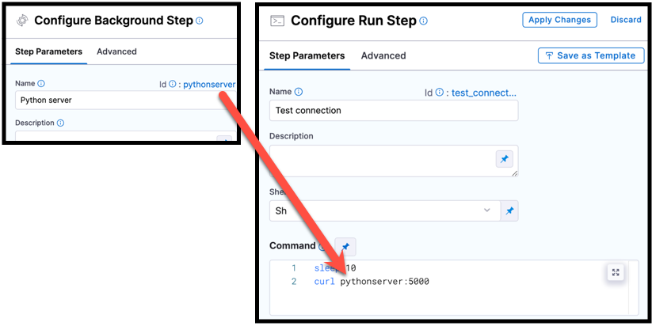

import Tabs from '@theme/Tabs';
import TabItem from '@theme/TabItem';


The **Run** step allows you to run scripts using specific container images and shells. 

The **Run** step can be used for operations such as running configuration scripts that apply configuration settings specific to the deployment environment, or running database migration scripts that handle database schema changes or migrations required for the deployment.

Harness CD also includes a general scripting step, the [Shell Script](/docs/continuous-delivery/x-platform-cd-features/cd-steps/utilities/shell-script-step) step, but the Shell Script step is a Bash or PowerShell scripting step and does not let you select a container.

This topic describes the **Run** step settings.

:::note
When you run a **Run** step within a [Containerized Step Group](/docs/continuous-delivery/x-platform-cd-features/cd-steps/containerized-steps/containerized-step-groups), go to [Harness permissions inheritance logic](/docs/continuous-delivery/kb-articles/articles/configuration-inheritance-stepgroup-step) to review how permissions are inherited.
:::

---

## What will you learn in this topic?

- How to set the [container registry and image](#container-registry-and-image) for the step.
- How to define the [shell and command](#shell-and-command) to run.
- How to configure [environment variables](#environment-variables) and [output variables](#output-variables).
- How to set the [privileged](#privileged) mode, [image pull policy](#image-pull-policy), and [container resources](#set-container-resources).

---

## Container Registry and Image

The **Run** step runs your commands inside a container image. When the **Run** step is inside a [Containerized Step Group](/docs/continuous-delivery/x-platform-cd-features/cd-steps/containerized-steps/containerized-step-groups) with container-based execution enabled, the **Registry Type** setting controls where Harness pulls the container image from. Two options are supported:

- **Artifact Registry**: Pull the image directly from a Harness Artifact Registry, without a Docker connector.
- **Third-Party Artifact Registry**: Pull the image from an external Docker registry through a Harness Docker connector. This is the default option.

### Artifact Registry

Select **Artifact Registry** as the **Registry Type** to pull the image directly from a Harness Artifact Registry. You do not need a Docker connector.

- In **Container Registry**, select the Harness Artifact Registry that hosts the image.
- In **Image**, enter the image reference in the `imageName:tag` format, such as `myapp:1.2.3`.

### Third-Party Container Registry

**Container Registry** field is a Harness Docker registry connector for the image that you want Harness to run commands in, such as an image hosted on Docker Hub.

The **Image** field is the Fully-qualified name (FQN) or artifact name of the Docker image to use when this step runs commands. For example `us.gcr.io/playground-123/quickstart-image`. The image name should include the tag. If you do not include a tag, Harness uses the `latest` tag.

You can use any Docker image from any Docker registry, including private registries. Different container registries require different name formats:

* **Docker Registry**: Enter the name of the artifact you want to use, such as `library/tomcat`. Wildcards are not supported. An FQN is required for images in private container registries.
* **ECR**: Enter the fully qualified name (FQN) of the artifact that you want to use. Images stored in repositories must reference a path. For example: `40000005317.dkr.ecr.us-east-1.amazonaws.com/todolist:0.2`.
* **GCR**: Enter the fully qualified name (FQN) of the artifact that you want to use. Images stored in repositories must reference a path that starts with the project ID where the artifact is stored. For example: `us.gcr.io/playground-243019/quickstart-image:latest`.

<div align="center">
  <DocImage path={require('./static/659f371c3e8d30d831642c9fef9dbf652dca4c5fd050f0dc68b128f0b04101d9.png')} alt="GCR Container Registry and Image settings" width="80%" />
</div>

:::warning
Google Container Registry (GCR) is being deprecated. Go to the [Deprecation Notice](/docs/continuous-delivery/x-platform-cd-features/services/artifact-sources#google-container-registry-gcr) to review the details.
:::

---

## Shell and Command

Use **Shell** and **Command** to define the commands that you need to run in this step.

For **Shell**, select the shell script type. Options include: **Bash**, **PowerShell**, **Pwsh**, **Sh**, and **Python**. If the step includes commands that are not supported for the selected shell type, the step fails. 

The binaries required by the script must be available on the infrastructure running the step or the image specified in **Container Registry** and **Image**.

In **Command**, enter [POSIX](https://en.wikipedia.org/wiki/POSIX) shell script commands for this step. The commands are executed inside the container.

:::tip

You can reference services started in CD [Background steps](/docs/continuous-delivery/x-platform-cd-features/cd-steps/containerized-steps/background-step.md) by using the Background step's **Id** in your **Run** step's **Command**. For example, a cURL command could call `STEPGROUPID_BACKGROUNDSTEPID:5000` where it might otherwise call `localhost:5000`.



You must include step group Id, such as `curl STEPGROUPID_BACKGROUNDSTEPID:5000`, even if both steps are in the same step group.

:::

Select each tab below to view examples for each shell type.


<Tabs className="tabs--block">
  <TabItem value="bash" label="Bash">


This Bash script example checks the Java version.

```yaml
              - step:
                  ...
                  spec:
                    shell: Bash
                    command: |-
                      JAVA_VER=$(java -version 2>&1 | head -1 | cut -d'"' -f2 | sed '/^1\./s///' | cut -d'.' -f1)
                      if [[ $JAVA_VER == 17 ]]; then
                        echo successfully installed $JAVA_VER
                      else
                        exit 1
                      fi
```


</TabItem>
  <TabItem value="powershell" label="PowerShell">


This is a simple PowerShell `Wait-Event` example.

```yaml
              - step:
                  ...
                  spec:
                    shell: Powershell
                    command: Wait-Event -SourceIdentifier "ProcessStarted"
```


</TabItem>
  <TabItem value="pwsh" label="Pwsh">


This PowerShell Core example runs `ForEach-Object` over a list of events.

```yaml
              - step:
                  ...
                  spec:
                    shell: Pwsh
                    command: |-
                      $Events = Get-EventLog -LogName System -Newest 1000
                      $events | ForEach-Object -Begin {Get-Date} -Process {Out-File -FilePath Events.txt -Append -InputObject $_.Message} -End {Get-Date}
```

:::tip

You can run PowerShell Core commands in pods or containers that have `pwsh` installed.

:::


</TabItem>
  <TabItem value="sh" label="Sh">


In this example, Harness pulls a `python` image and executes a shell script (`Sh`) that runs `pytest` with code coverage.

```yaml
              - step:
                  ...
                  spec:
                    connectorRef: account.harnessImage
                    image: python:latest
                    shell: Sh
                    command: |-
                      echo "Welcome to Harness CI"
                      uname -a
                      pip install pytest
                      pip install pytest-cov
                      pip install -r requirements.txt

                      pytest -v --cov --junitxml="result.xml" test_api.py test_api_2.py test_api_3.py
```


</TabItem>
  <TabItem value="python" label="Python">


If the `shell` is `Python`, supply Python commands directly in `command`.

This example uses a basic `print` command.

```yaml
            steps:
              - step:
                  ...
                  spec:
                    shell: Python
                    command: print('Hello, world!')
```


</TabItem>
</Tabs>


:::note

If your script produces an output variable, you must declare the output variable in the **Run** step's [Output Variables](#output-variables). For example, the following step runs a `python` script that defines an output variable called `OS_VAR`, and `OS_VAR` is also declared in the `outputVariables`.

```yaml
              - step:
                  type: Run
                  name: Run_2
                  identifier: Run_2
                  spec:
                    shell: Python
                    command: |-
                      import os
                      os.environ["OS_VAR"] = value
                    outputVariables:
                      - name: OS_VAR
```

:::

---

## Privileged

Enable this option to run the container with escalated privileges. This is equivalent to running a container with the Docker `--privileged` flag.

---

## Report paths

Specify one or more paths to files that store information in JUnit XML format. You can add multiple paths. If you specify multiple paths, make sure the files contain unique information to avoid duplicates. [Glob](https://en.wikipedia.org/wiki/Glob_(programming)) is supported.

---

## Environment variables

You can inject environment variables into a container and use them in the **Command** script. You must input a **Name** and **Value** for each variable.

You can reference environment variables in the **Command** script by their name. For example, a Bash script would use `$var_name` or `${var_name}`, and a Windows PowerShell script would use `$Env:varName`.

Variable values can be [Fixed Values, Runtime Inputs, and Expressions](/docs/platform/variables-and-expressions/runtime-inputs). For example, if the value type is expression, you can input a value that references the value of some other setting in the stage or pipeline. 

---

## Output variables

Output variables expose values for use by other, subsequent steps or stages in the pipeline.

<details>
<summary>YAML example: Output variable</summary>

In the following YAML example, step `alpha` exports an output variable called `myVar`, and then step `beta` references that output variable.

```yaml
              - step:
                  type: Run
                  name: alpha
                  identifier: alpha
                  spec:
                    shell: Sh
                    command: export myVar=varValue
                    outputVariables:
                      - name: myVar
              - step:
                  type: Run
                  name: beta
                  identifier: beta
                  spec:
                    shell: Sh
                    command: |-
                      echo <+steps.alpha.output.outputVariables.myVar>
                      echo <+execution.steps.alpha.output.outputVariables.myVar>
```

</details>

:::warning

If an output variable value contains a secret, be aware that the secret will be visible in the following areas of the pipeline execution:

*  On the **Output** tab of the step where the output variable originates.
*  In the step logs for any later steps that reference that variable.

For information about best practices for using secrets in pipelines, go to the [Secrets documentation](/docs/category/secrets).

:::

### Create an output variable

Perform the following steps to create an output variable in the step where it originates:

1. In **Command**, export the output variable. For example, the following command exports a variable called `myVar` with a value of `varValue`:

   ```
   export myVar=varValue
   ```

2. In the same step's **Output Variables**, declare the variable name, such as `myVar`.

### Reference an output variable

To reference an output variable in a later step or stage in the same pipeline, use a variable [expression](/docs/platform/variables-and-expressions/runtime-inputs/#expressions) that includes the originating step's Id and the variable's name.

Use either of the following expressions to reference an output variable in another step in the same stage:


```
<+steps.STEP_ID.output.outputVariables.VAR_NAME>
<+execution.steps.STEP_GROUP_ID.steps.STEP_ID.output.outputVariables.VAR_NAME>
```

To reference an output variable in a stage other than the one where the output variable originated, use either of the following expressions:

```
<+stages.STAGE_ID.spec.execution.steps.STEP_ID.output.outputVariables.VAR_NAME>
<+pipeline.stages.STAGE_ID.spec.execution.steps.STEP_GROUP_ID.steps.STEP_ID.output.outputVariables.VAR_NAME>
```

### Scoping output variables using aliases

To prevent variable name conflicts, you can use **Publish Variable Names (Alias)** to scope output variables to different entities.

1. **Export the variables**: Use **Output Variables** to export the variables.
2. **Define an alias**: In **Publish Variable Names (Alias)**, enter an alias to use to reference the exported output variables.
3. **Select a scope**: In **Scope**, select the scope for the exported output variable.

The following screenshot shows the output alias configured with **Stage** scope:

<div align="center">
  <DocImage path={require('./static/stage-output-vars.png')} alt="Stage-scoped output alias configuration" width="80%" />
</div>

The following screenshot shows the output alias configured with **Pipeline** scope:

<div align="center">
  <DocImage path={require('./static/pipeline-output-vars.png')} alt="Pipeline-scoped output alias configuration" width="80%" />
</div>

You can scope output variables to the following entities:

- **Step group**:
  - The output variable must be used in the same step group, including nested child step groups.
  - The format for referencing an exported step group output variable using its alias is:

    ```
    <+exportedVariables.getValue("stepGroup.ALIAS_NAME.OUTPUT_VARIABLE_NAME")>
    ```

- **Stage**:
  - The output variable can be used anywhere in the same stage, including step groups in the same stage. It cannot be used outside of the same stage.
  - The format for referencing an exported stage output variable using its alias is:

    ```
    <+exportedVariables.getValue("stage.ALIAS_NAME.OUTPUT_VARIABLE_NAME")>
    ```

- **Pipeline**:
  - The output variable can be used anywhere in the same pipeline but not in a [chained pipeline](/docs/platform/pipelines/pipeline-chaining).
  - The format for referencing an exported pipeline output variable using its alias is:

    ```
    <+exportedVariables.getValue("pipeline.ALIAS_NAME.OUTPUT_VARIABLE_NAME")>
    ```

To reference a map of exported output variables, reference the alias in the format `<+exportedVariables.getValue("SCOPE.ALIAS_NAME")>`, like `<+exportedVariables.getValue("stepGroup.info")>`.

:::note Important notes

- Exported variables are immutable.
- Variables cannot be exported in looping strategies.
- Exported variables are not supported in pipeline chaining.
- All output variables are exported. You cannot select a subset.

:::

<details>
<summary>Step group scope pipeline example</summary>

```yaml
pipeline:
  projectIdentifier: myproject
  orgIdentifier: default
  tags: {}
  stages:
    - stage:
        identifier: testSimple
        type: Custom
        name: testSimple
        description: ""
        spec:
          execution:
            steps:
              - stepGroup:
                  identifier: stepGroup1
                  name: stepGroup1
                  steps:
                    - step:
                        identifier: Run_1
                        type: Run
                        name: Run_1
                        spec:
                          shell: Bash
                          command: |-
                            export var1="val1"
                            export var2="val2"
                          outputVariables:
                            - name: var1
                            - name: var2
                          outputAlias:
                            key: info
                            scope: StepGroup
                        timeout: 10m
                    - step:
                        type: Run
                        name: outputs
                        identifier: outputs
                        spec:
                          shell: Bash
                          command: |-
                            echo "reference using aliases:"

                            echo "var1:" <+exportedVariables.getValue("stepGroup.info.var1")>
                            echo "var2:" <+exportedVariables.getValue("stepGroup.info.var2")>
                            echo "var map:" <+exportedVariables.getValue("stepGroup.info")>

                            echo "reference using standard output exp:"

                            echo "var1:" <+pipeline.stages.testSimple.spec.execution.steps.stepGroup1.steps.Run_1.output.outputVariables.var1>
                            echo "var2:" <+pipeline.stages.testSimple.spec.execution.steps.stepGroup1.steps.Run_1.output.outputVariables.var2>
                          outputVariables: []
                        timeout: 10m
        tags: {}
  identifier: StepGroupExport
  name: StepGroupExport
```

</details>

Go to [Scoping output variables using aliases](/docs/continuous-delivery/x-platform-cd-features/cd-steps/utilities/shell-script-step#scoping-output-variables-using-aliases) in the Shell Script step documentation to review more examples.

---

## Image pull policy

Select an option to set the pull policy for the image.

* **Always**: The kubelet queries the container image registry to resolve the name to an image digest every time the kubelet launches a container. If the kubelet encounters an exact digest cached locally, it uses its cached image; otherwise, the kubelet downloads (pulls) the image with the resolved digest, and uses that image to launch the container.
* **If Not Present**: The image is pulled only if it is not already present locally.
* **Never**: The image is assumed to exist locally. No attempt is made to pull the image.

---

## Run as user

You can define the UID to run all policies within the pod. Go to [Security Context for a Pod](https://kubernetes.io/docs/tasks/configure-pod-container/security-context/#set-the-security-context-for-a-pod) to review the Kubernetes security context, and go to [Harness permissions inheritance logic](/docs/continuous-delivery/kb-articles/articles/configuration-inheritance-stepgroup-step) to review permission inheritance when you use Containerized Step Groups.


---

## Set container resources

Set the resource limits and requests for the container's CPU and memory. Go to [Manage Resource Containers](https://kubernetes.io/docs/concepts/configuration/manage-resources-containers/#resource-requests-and-limits-of-pod-and-container) to review CPU and memory limits and requests.

:::note
The ability to set resource requests is behind the feature flag `CI_SUPPORT_RESOURCE_REQUESTS`. To enable it, contact [Harness Support](mailto:support@harness.io).
:::

Define the resource limits and requests by using the units defined by Kubernetes. Go to [Resource units in Kubernetes](https://kubernetes.io/docs/concepts/configuration/manage-resources-containers/#resource-units-in-kubernetes) to review the units.

If you use a **Run** step in a Step Group and define resources with variables, the variables must be at the Stage or Pipeline level. Step Group variables are not evaluated at the correct time when the resource is launched.

---

## Hidden or invisible characters

You might experience unexplained behavior in your scripts due to hidden or invisible characters. These characters often appear when you paste from non-plain-text resources, and can cause errors in how the script operates. Harness has a function to display invisible characters, which is enabled by default.

You see a highlighted space within your scripts when an invisible character is present:

<div align="center">
  <DocImage path={require('./static/invisiblechr-01.png')} alt="Highlighted invisible character in a script" width="80%" />
</div>

To see which character is present, hover over the highlight and select `adjust settings`:

<div align="center">
  <DocImage path={require('./static/invisiblechr-hover.png')} alt="Hover over the highlight to view the invisible character" width="80%" />
</div>

If you make a selection accidentally, right-click within the script space and select the `Command Palette` to make adjustments:

<div align="center">
  <DocImage path={require('./static/invisiblechr-cmdplt.png')} alt="Open the Command Palette from the script space" width="80%" />
</div>

A dialog box appears where you can search for the option to toggle how the highlighting is set:

<div align="center">
  <DocImage path={require('./static/invisiblechr-toggle.png')} alt="Toggle invisible character highlighting settings" width="80%" />
</div>

---

## Advanced settings

On the **Advanced** tab, you can use the following options:

* [Conditional Execution](/docs/platform/pipelines/step-skip-condition-settings)
* [Failure Strategy](/docs/platform/pipelines/failure-handling/define-a-failure-strategy-on-stages-and-steps)
* [Looping Strategy](/docs/platform/pipelines/looping-strategies/looping-strategies-matrix-repeat-and-parallelism)
* [Policy Enforcement](/docs/platform/governance/policy-as-code/harness-governance-overview)

---

## Next steps

- [Shell Script step](/docs/continuous-delivery/x-platform-cd-features/cd-steps/utilities/shell-script-step): Run a Bash or PowerShell script without selecting a container.
- [Background step](/docs/continuous-delivery/x-platform-cd-features/cd-steps/containerized-steps/background-step): Start a service that your **Run** step can reference.
- [Containerized Step Groups](/docs/continuous-delivery/x-platform-cd-features/cd-steps/containerized-steps/containerized-step-groups): Configure the step group that runs the **Run** step in a container.
