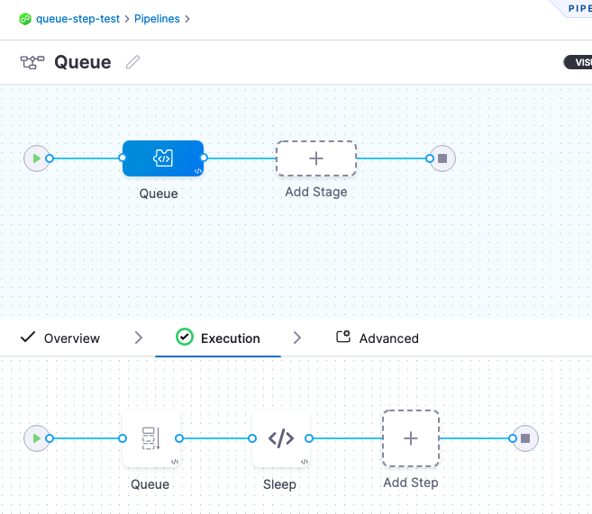
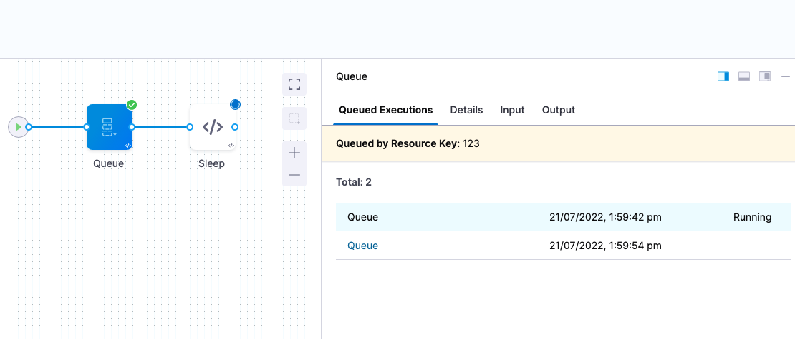
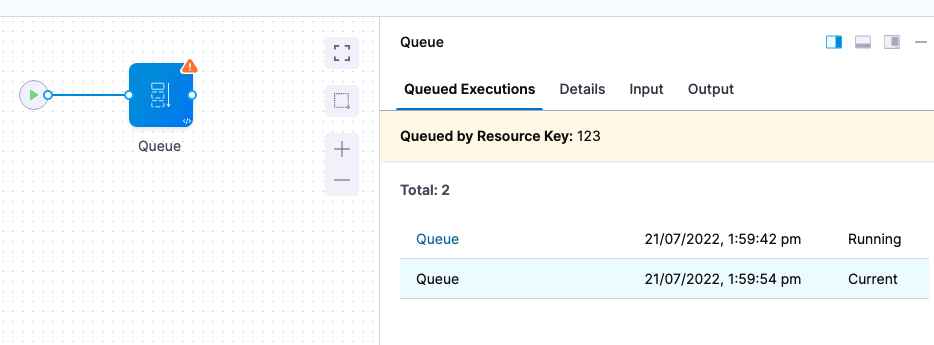
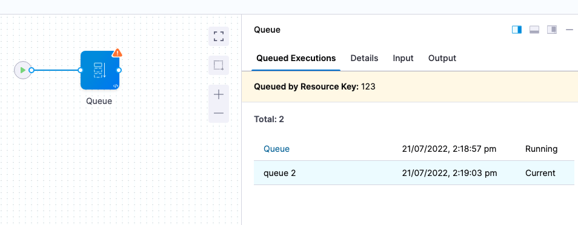

This topic describes how to use the **Queue** step to control the access order to the resources Harness requests during a deployment and prevent multiple pipelines from requesting the same resources at the same time.

For example, two pipelines might be deploying artifacts to a single Kubernetes namespace simultaneously. To avoid collision, and queue deployments, you add a Queue step to each pipeline.

When the first pipeline completes, it releases the lock and the second pipeline can continue.

Queue steps can be used on different pipelines or even multiple executions of the same pipeline.

In this topic, you will learn how to use the Queue step to control the order in which pipelines access resources.

Harness provide multiple options for controlling resource usage and protecting capacity limits. Go to [controlling resource usage with Barriers, Resource Constraints, and Queue steps](/docs/continuous-delivery/x-platform-cd-features/cd-steps/flow-control/controlling-deployments-with-barriers-resource-constraints-and-queue-steps) for more information.

## Add Queue steps

1. In the stage **Execution**, determine where you want to queue deployments and select **Add Step**.
2. In **Flow Control**, select **Queue**.
3. Enter a name and timeout for the Queue step.
4. In **Resource Key**, enter a unique key. This is the same key you will add to the Queue steps in other pipelines.
5. The **Resource Key** supports Fixed Values, Runtime Inputs, and Expressions. For more information, go to [fixed values, runtime inputs, and expressions](/docs/platform/references/runtime-inputs/).
6. In **Run next queued execution after completion of**, select one of the following:
   + **Pipeline:** The entire pipeline must complete before the queued pipelines can deploy.
   + **Stage:** The current Stage must complete before the queued pipelines can deploy.

Queue steps can be used on different pipelines or even multiple executions of the same pipeline.

## Advanced settings

In **Advanced**, you can use the following options:

* [Delegate Selector](https://developer.harness.io/docs/platform/delegates/manage-delegates/select-delegates-with-selectors/)
* [Conditional Execution](https://developer.harness.io/docs/platform/pipelines/w_pipeline-steps-reference/step-skip-condition-settings/)
* [Failure Strategy](https://developer.harness.io/docs/platform/pipelines/w_pipeline-steps-reference/step-failure-strategy-settings/)
* [Looping Strategy](https://developer.harness.io/docs/platform/pipelines/looping-strategies-matrix-repeat-and-parallelism/)
* [Policy Enforcement](https://developer.harness.io/docs/platform/Governance/Policy-as-code/harness-governance-overview)

### Test

Let's look at a simple example to show how Queue steps work.

Here's the YAML for the pipeline that contains a Custom stage with a Queue step followed by a [shell script](/docs/continuous-delivery/x-platform-cd-features/cd-steps/cd-general-steps/using-shell-scripts) step that runs a Bash `sleep 30`.

You can copy it and paste it into your Harness project. You need to update the `projectIdentifier` and `orgIdentifier` settings to match your current [project and org](/docs/platform/organizations-and-projects/projects-and-organizations).


```yaml
pipeline:  
    name: Queue  
    identifier: Queue  
    projectIdentifier: queuesteptest  
    orgIdentifier: default  
    tags: {}  
    stages:  
        - stage:  
              name: Queue  
              identifier: Queue  
              description: ""  
              type: Custom  
              spec:  
                  execution:  
                      steps:  
                          - step:  
                                type: Queue  
                                name: Queue  
                                identifier: Queue  
                                spec:  
                                    key: "123"  
                                    scope: Pipeline  
                                timeout: 10m  
                          - step:  
                                type: ShellScript  
                                name: Sleep  
                                identifier: Sleep  
                                spec:  
                                    shell: Bash  
                                    onDelegate: true  
                                    source:  
                                        type: Inline  
                                        spec:  
                                            script: sleep 30  
                                    environmentVariables: []  
                                    outputVariables: []  
                                    executionTarget: {}  
                                timeout: 10m  
              tags: {}
```

When you're done the Pipeline will look like this:



Open the **Queue** step.

You can see **Run next queued execution after completion of** is set to **Pipeline**. That means that the pipeline must finish deploying before any other queued pipeline executions can proceed.

Now let's run this pipeline twice in a row quickly.

The first run of the pipeline will run without queuing but the second run of the pipeline is queued until the first one is complete.

Here's the first run of the pipeline. It shows the pipeline execution running (**Running**) and the other pipeline execution queued.



You can click the name of the queued pipeline to jump to its execution.

Here's the second run of the pipeline:



You can see the Pipeline execution is queued (**Current**) and you the Pipeline execution that is running.

This example used multiple executions of the same pipeline, but if a Queue step is added to another pipeline and uses the same resource key, the same queuing process is applied to that pipeline.

Here's another pipeline, **queue 2**, with the same Queue step resource key. You can see it waiting for the **Queue** pipeline to complete.



## Queue step scope

Queue steps are account-wide. This ensures that if a Queue step is placed in one pipeline, it will restrict any other pipeline in the account from using resources until it is safe to use.

## Barriers, Resource Constraints, and Queue Steps

Harness has a number of ways to control deployments and resource usage. It's important to understand their differences.

Go to [controlling resource usage with Barriers, Resource Constraints, and Queue steps](/docs/continuous-delivery/x-platform-cd-features/cd-steps/flow-control/controlling-deployments-with-barriers-resource-constraints-and-queue-steps) for more information.

## When to queue

Queue steps can be added anywhere in your stage, so it's important to add them whenever the resource you want to protect is being used.

For example, if pipeline A will perform some Terraform provisioning and pipeline B will deploy to the provisioned infrastructure, you will want to place the Queue step before the [Terraform Apply](/docs/continuous-delivery/cd-infrastructure/terraform-infra/run-a-terraform-plan-with-the-terraform-apply-step) step in pipeline A, and before the deployment step in pipeline B (such as a Kubernetes [Rolling step](/docs/continuous-delivery/deploy-srv-diff-platforms/kubernetes/kubernetes-executions/create-a-kubernetes-rolling-deployment)).

