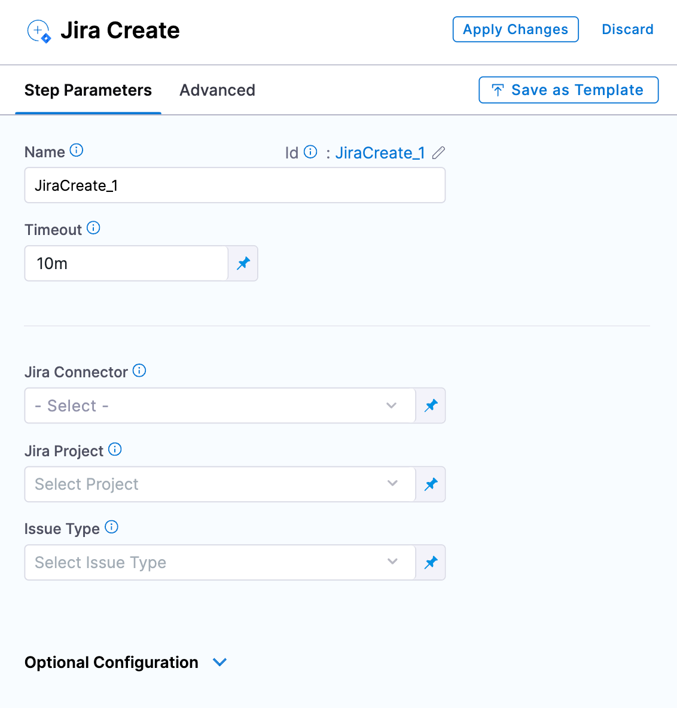
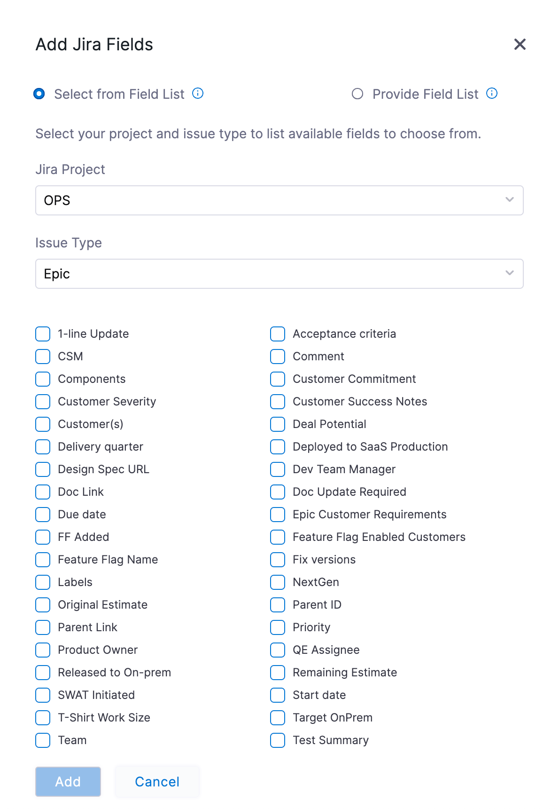

You can create a Jira issue as a step in the execution of a pipeline using the Create Jira step.

You can add the Create Jira step to a Harness CD stage or an approval stage.

You can also [update Jira issues](/docs/continuous-delivery/x-platform-cd-features/cd-steps/ticketing-systems/update-jira-issues-in-cd-stages) and [add Jira approval stages and steps](/docs/platform/Approvals/adding-jira-approval-stages).

## Before you begin

* [Connect to Jira](/docs/platform/Connectors/Ticketing-Systems/connect-to-jira): You can add a Harness Jira connector before or during the Create Jira step setup.

## Visual Summary

The following video shows you how to use the Jira Create, Jira Update, and Jira Approval steps:

## Limitations

While it's not a strict limitation, some users can forget that when you use a Jira Create step it creates a new, independent Jira issue every time it is run (as opposed to [updating](/docs/continuous-delivery/x-platform-cd-features/cd-steps/ticketing-systems/update-jira-issues-in-cd-stages) the same issue).

It is important to remember that you should only add Jira Create to a stage if you want to create a new Jira issue on every run of the stage.

## Add a Jira Create step

1. In a Harness CD or Approval stage, in **Execution**, select **Add Step**.
2. Select **Jira Create**. The Jira Create step appears.

3. In **Name**, enter a name that describes the step.
4. In **Timeout**, enter how long you want Harness to try to create the issue before failing (and initiating the stage or step [failure strategy](/docs/platform/Pipelines/define-a-failure-strategy-on-stages-and-steps)).
5. In **Jira Connector**, create or select the [Jira connector](/docs/platform/Connectors/Ticketing-Systems/connect-to-jira) to use.
6. In **Project**, select a Jira project from the list. A Jira project is used to create the issue key and ID when the issue is created. The unique issue number is created automatically by Jira.
7. In **Issue Type**, select a Jira issue type from the list of types in the Jira project you selected.

## Add Issue fields

In Jira fields, you can select specific fields within a Jira issue. For more information, go to [Jira custom fields](https://support.atlassian.com/jira-cloud-administration/docs/custom-fields-types-in-company-managed-projects/).

Harness supports only Jira fields of type `Option`, `Array`, `Any`, `Number`, `Date`, and `String`. Harness does not integrate with Jira fields that manage users, issue links, or attachments. This means that Jira fields like Assignee and Sprint are not accessible in Harness' Jira integration.

## Jira Date field support

Among the custom fields Harness supports are Baseline End Date and Start Date Time. If your Jira project uses these fields, they are available in fields:

Once you have selected these fields their settings appear.

You can also use advanced dates using Harness expressions and the `current()` function. For example:

* `<+currentDate().plusDays(2).plusMonths(1)>`: current date plus one month and two days.
* `<+currentTime()>`: for current date time fields.

Harness supports the following functions.

For date-only fields:

 `currentDate().plusYears(1).plusMonths(1).plusWeeks(1).plusDays(1)`

For date and time fields:

`currentTime().plusYears(1).plusMonths(1).plusWeeks(1).plusDays(1).plusHours(1).plusMinutes(1).plusSeconds(1).plusNanos(1)`

The number 1 is used as an example. You can add whatever number you need.

## Advanced settings

In **Advanced**, you can use the following options:

* [Delegate Selector](https://developer.harness.io/docs/platform/delegates/manage-delegates/select-delegates-with-selectors/)
* [Conditional Execution](https://developer.harness.io/docs/platform/pipelines/w_pipeline-steps-reference/step-skip-condition-settings/)
* [Failure Strategy](https://developer.harness.io/docs/platform/pipelines/w_pipeline-steps-reference/step-failure-strategy-settings/)
* [Looping Strategy](https://developer.harness.io/docs/platform/pipelines/looping-strategies-matrix-repeat-and-parallelism/)
* [Policy Enforcement](https://developer.harness.io/docs/platform/Governance/Policy-as-code/harness-governance-overview)

## Apply and test

Select **Apply Changes**. The Jira Create step is added to the stage.

Run the pipeline.

In the pipeline execution view, select the **Jira Create** step, and then select the **Output** tab.

You can see all of the fields for the new Jira issue you created.

Locate **URL** and copy its value.

In a new browser tab, paste the URL and press enter.

The new issue appears in Jira.

## Parent issue support

Harness supports parent issues (the `issuelink` field in Jira). 

This support enables you to do the following:

* The Jira Create step can now be used to create issues with existing issues as their parent.
* The Jira Update step can be used to update the parent of a specific issue.
* A sub-task can be created using the Jira Create step.
* A ticket parent can be provided by simply typing the parent issue key in **Parent Link** setting, such as `TJI-47890`. 

To use parent links, do the following:

1. In the Jira Create or Update step, select **Optional Configuration**.
2. Select **Fields**. 
3. In **Add Jira Fields**, select **Parent Link**, and select **Add**.
   
     
4. In **Parent Link**, add the parent issue key.
